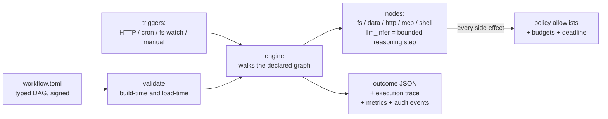
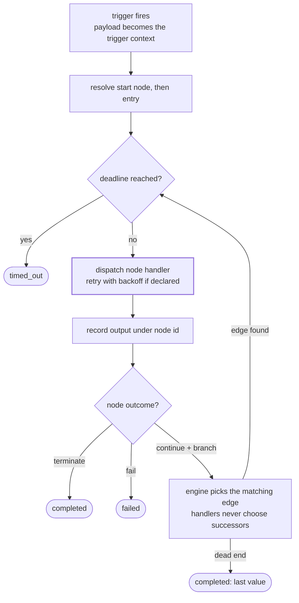

<div align="center">

# agentd

### Spin up an AI agent that works on its own.

**Give it a task, a goal, or a whole workflow — agentd runs as a daemon (or a one-shot), calls tools, and self-corrects until the job is done. Every step is governed, observable, and audited.**

[](https://github.com/agentd-dev/source-code/actions/workflows/ci.yml)
[](LICENSE)
[](crates/agentd/Cargo.toml)

[Install](#install) · [Quick start](#quick-start) · [Three modes](#three-execution-modes) · [The loop](#the-agent-loop) · [Capabilities](#capabilities) · [Security model](#the-security-model) · [When not to use it](#when-not-to-use-agentd) · [Docs](docs/README.md)

</div>

---

`agentd` is a single-binary harness that spins up an AI agent to **work on
its own**. It runs as a daemon handling tasks, tool calls, and workflows
independently — or as a one-shot that completes a goal by planning its own
steps and improving on failure. Three execution modes share one substrate;
every mode is bound by the same validator, capability policy, budgets,
signing, and audit trail.

The thing that makes that safe is an inversion the industry converged on:
the **control flow is structure, not vibes**. Whether you wrote the graph,
or the agent planned it, or a model is looping inside a node — what can
happen is always a validated, enumerable artifact before anything runs. The
graph boundary is the audit boundary, the security boundary, and the cost
ceiling. Autonomy is opt-in per invocation, never ambient.



## Install

**One-liner** (Linux x86_64 · macOS Apple Silicon — detects your platform, installs the latest release):

```bash
curl -fsSL https://agentd.dev/install.sh | sh
```

**Straight from a GitHub release** (static musl build shown — runs on any Linux):

```bash
curl -fsSLO https://github.com/agentd-dev/source-code/releases/latest/download/agentd-v0.7.0-x86_64-unknown-linux-musl.tar.gz
tar -xzf agentd-v0.7.0-x86_64-unknown-linux-musl.tar.gz
sudo install -m 0755 agentd /usr/local/bin/agentd
```

**Native packages** — every release attaches a `.deb` and an `.rpm`
(systemd unit included), plus macOS and Windows binaries.

**From source:**

```bash
cargo build --release -p agentd
```

## Quick start

```bash
# Validate a workflow and exit
agentd --config examples/webhook-receiver.toml --validate-only

# Run one-shot with a payload
agentd --config examples/llm-classifier.toml \
    --intel-unix /run/intel.sock --input doc.json

# Serve mode is inferred: [[http_routes]] in the TOML → HTTP daemon
GITHUB_WEBHOOK_SECRET=s3cret \
agentd --config examples/webhook-receiver.toml --bind 127.0.0.1:8080

# Walk the whole graph, skip every side effect
agentd --config examples/cron-poller.toml --start on_tick --dry-run
```

A complete workflow, 30 seconds of reading:

```toml
name = "review"

[[start_nodes]]
name = "main"
source = "manual"
entry_node = "analyze"

[[nodes]]
id = "analyze"
type = "llm_infer"            # the bounded reasoning step
backend = "default"
prompt = "Summarize: {{body}}. Reply as JSON {\"verdict\": \"ship\"|\"hold\"}"
input_from = "trigger"
output_schema = "schemas/verdict.json"

[[nodes]]
id = "decide"
type = "switch"               # routing is declared, not improvised
expr = "analyze.parsed.verdict"

[[nodes]]
id = "record"
type = "write_file"
path_from = "out.rendered"
content_from = "analyze.content"

[[nodes]]
id = "out"
type = "template_render"
template = "/tmp/review/verdict.json"

[[nodes]]
id = "halt"
type = "terminate"

[[edges]]
from = "analyze"
to = "decide"

[[edges]]
from = "decide"
when = "ship"
to = "out"

[[edges]]
from = "decide"
when = "hold"
to = "halt"

[[edges]]
from = "out"
to = "record"

[[edges]]
from = "record"
to = "halt"
```

## Three execution modes

One substrate (validation · policy · budgets · signing · audit), three ways
to put work on it — pick the least dynamic one that does the job:

| Mode | You provide | The agent does | Use when |
|---|---|---|---|
| **Workflow** | a TOML DAG | executes it | the steps are known and repeatable |
| **`agent_loop` node** | a node with a goal + tool subset + `max_steps` | runs a bounded ReAct loop *inside that node* | one step needs open-ended investigation, the rest is fixed |
| **Goal** | `--goal "…"` + instructions | plans its own workflow → validates it → (on approval) runs it → re-plans on failure | authoring the graph is the hard part |

```bash
# Mode 3 — the agent writes and runs its own workflow
ANTHROPIC_API_KEY=… agentd \
  --goal "Audit access logs under /var/log/app and write a summary" \
  --instructions agent.toml --plan-only        # inspect first
# ...looks right? add --auto-approve to execute (headless refuses without it)
```

Goal mode's plan is a normal workflow file — print it, diff it, sign it,
promote it into Mode 1 once it's proven. The `agent_loop` node's model sees
only the tools you listed and runs every call through the same policy gates
a declared node would; `max_steps` (hard ceiling 64) and a token budget
bound it. **No dynamic pathway escapes the substrate** — they all
materialize into the same validated, policy-bound artifact.

**Models, your choice.** `[[intelligence.backends]]` names backends across
Anthropic, OpenAI, Gemini, any OpenAI-compatible endpoint (vLLM, Ollama,
gateways), or the local vsock/Unix-socket and HTTP JSON-RPC transports.
Keys live in env vars, never the TOML. Nodes pick a backend by name.

## The agent loop

The engine is a sequential interpreter over the graph — whether you wrote
it or the agent planned it. There is exactly one outer loop, and it is
structural:

1. **Trigger** — an HTTP request (bearer / HMAC / mTLS / OIDC verified,
   rate-limited), a cron tick, a filesystem event, or `--input` from the
   CLI. The payload becomes the reserved `trigger` context entry.
2. **Resolve + validate** — start node → entry node; the DAG was already
   checked for duplicate ids, dangling edges, cycles (Kahn), reachability,
   and unknown server refs before any of this.
3. **Walk** — for each node: check the deadline, dispatch to the node's
   handler (with per-node retry/backoff/jitter if declared), record the
   output under the node's id, follow the matching edge. Handlers never
   choose successors — they emit values and optional branch labels; the
   engine resolves edges.
4. **Stop** — `terminate` (success), `fail` (declared failure), deadline
   (`timed_out`), or a dead end (completion with the last value). A
   `MAX_STEPS` cap backstops the validator's acyclicity proof.
5. **Report** — outcome JSON on stdout / HTTP response, plus an execution
   trace: the exact node path with outcomes and branch labels. Metrics
   counters and `agentd::audit` events stream alongside.



`llm_infer` fits inside the dispatch box like any other node: render
prompt → one request through the intelligence client (Unix socket or HTTP
JSON-RPC) → optionally require valid JSON → store `{content, parsed,
usage}`. Whether the workflow continues, branches, or stops is encoded in
edges the model never sees. The loop-back edge above is the only loop in
the system — bounded by the validator's acyclicity proof, the deadline,
and `MAX_STEPS`.

## Capabilities

| Surface | What ships |
|---|---|
| **Execution modes** | declared workflows · `agent_loop` bounded-ReAct nodes · goal mode (agent plans its own workflow, approval-gated, bounded re-planning) |
| **Node kinds** | `read_file` `read_env` `read_mcp_resource` `parse_json` · `template_render` `json_select` `diff_compute` · `llm_infer` `agent_loop` · `write_file` `create_dir` `http_request` `call_mcp_tool` `shell_run` · `condition` `switch` `merge` `fail` `terminate` |
| **Models** | named backends: Anthropic · OpenAI · Gemini · OpenAI-compatible (vLLM/Ollama/gateways) · Unix-socket & HTTP JSON-RPC; keys via env only; hot-reloadable |
| **Triggers** | HTTP/1.1 server (hand-rolled, keep-alive, drain-on-SIGTERM), cron + interval, fs-watch (debounced), manual |
| **Auth** | Bearer (constant-time), HMAC-SHA256 webhooks (GitHub/Stripe pattern), mTLS (fingerprint + CN/SAN principals), OIDC/JWT against a pinned JWKS |
| **Policy** | Fail-closed allowlists per family (fs paths, env keys, HTTP URLs+methods, shell commands, MCP tools/resources) + optional Rego layered as a logical AND |
| **Budgets** | Memory (RLIMIT_AS / Job Objects), CPU time, wall-clock per run (clamps the CLI flag), cumulative fs-write bytes, cumulative LLM tokens |
| **Reliability** | Per-node retry (linear backoff, jitter, transient-only filters), per-run deadlines, graceful drain, SIGHUP / touch-file hot reload of TLS·auth·policy·routes·MCP·intel |
| **Observability** | Structured spans (`workflow.run` → `node.execute`), Prometheus `/metrics` (incl. llm calls + tokens), `/healthz`, dedicated audit JSONL sink with redaction, W3C traceparent propagation in and out, optional OTLP gRPC export |
| **Governance** | plan-approval gate (generated plans refuse to run headless without `--auto-approve`), per-step policy on loop tool calls, audit events for plan/loop lifecycle |
| **Supply chain** | ed25519-signed workflows (verified before parsing trust begins), embedded configs validated at compile time |

Every row above that touches the outside world is a **Cargo feature**.
The default build has no outbound HTTP and no shell. A sealed webhook
appliance compiles like this:

```bash
cargo build --release -p agentd \
  --no-default-features \
  --features "tools-fs,tools-data,trigger-http,auth,server-tls"
```

That binary *cannot* make an outbound request or spawn a process — not
"is configured not to", it does not contain the code. CI builds and tests
each canonical feature set on its own.

## The security model

Prompt injection is the defining attack on tool-using LLM systems, and
prompt-level defenses are brittle by consensus. agentd's answer is
architectural, not prompt-engineered:

- **Control-flow integrity by construction.** The research literature
  calls the strongest design "plan-then-execute": fix the control flow
  before untrusted data is ever read, so a hostile document can corrupt a
  *value* but never the *program*. agentd's plan is the signed TOML —
  there is no code path by which tool output, webhook bodies, or model
  text add nodes, edges, or capabilities at runtime.
- **The graph boundary is the audit boundary.** Everything the process
  can possibly do is enumerable from the workflow file plus the feature
  flags. Reviews, threat models, and diffs operate on one declarative
  artifact.
- **Cut the lethal trifecta at compile time.** Private data + untrusted
  content + external communication is the exfiltration recipe; a build
  without `tools-http`/`tools-shell` removes the third leg in a way no
  runtime misconfiguration can restore.
- **Least privilege is the default.** Empty policy sections deny. A
  server exposing an MCP tool doesn't make it callable; the allowlist
  does. Deny messages name the operation and the path that was blocked,
  and land in the audit stream.

## When NOT to use agentd

Honesty section. A frozen graph is the wrong tool when:

- **You need fully open-ended, unbounded autonomy** — an agent that runs
  for hours redirecting itself with no ceiling. `agent_loop` and goal mode
  are deliberately *bounded* (step caps, token budgets, approval gates);
  if you want an agent with no governor, that's a different tool.
- **You need durable, resumable multi-day executions.** Runs are
  in-memory and bounded; a crash re-runs rather than resuming mid-graph.
  (Checkpoint/resume is on the [roadmap](docs/ROADMAP.md); Temporal-class
  durability is not the near-term target.)
- **You need a coordinated fleet today.** agentd is one excellent process;
  clustering, work distribution, and a coordination layer are designed
  but not built (see the [roadmap](docs/ROADMAP.md)).

What agentd deliberately keeps even in its most dynamic mode: the agent's
plan is always a validated, inspectable artifact before it runs, every tool
call is policy-gated, and autonomy is opt-in per invocation. That's the
trade — bounded dynamism for governance you can actually audit.

## Project layout

```
crates/agentd/     the runtime (lib + bin)
docs/              architecture · capabilities · configuration · operations · maturity
rfcs/              0001 bounded workflow runtime · 0002 signed workflows
examples/          validated, runnable workflow TOMLs
packaging/         systemd unit + debian scripts (deb/rpm via cargo-deb/generate-rpm)
web/               documentation site
```

```bash
cargo test -p agentd                  # default suite
cargo test -p agentd --all-features   # everything
cargo test -p agentd --test cli_smoke # end-to-end binary + sockets
```

Design record: [`rfcs/0001-bounded-workflow-runtime.md`](rfcs/0001-bounded-workflow-runtime.md).
Operator docs: [`docs/`](docs/README.md). Maturity, with named gaps:
[`docs/maturity.md`](docs/maturity.md).

## License

MIT. See [LICENSE](LICENSE).
