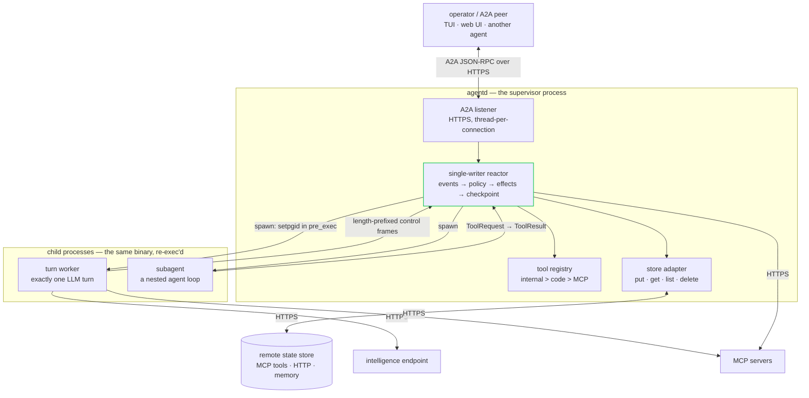
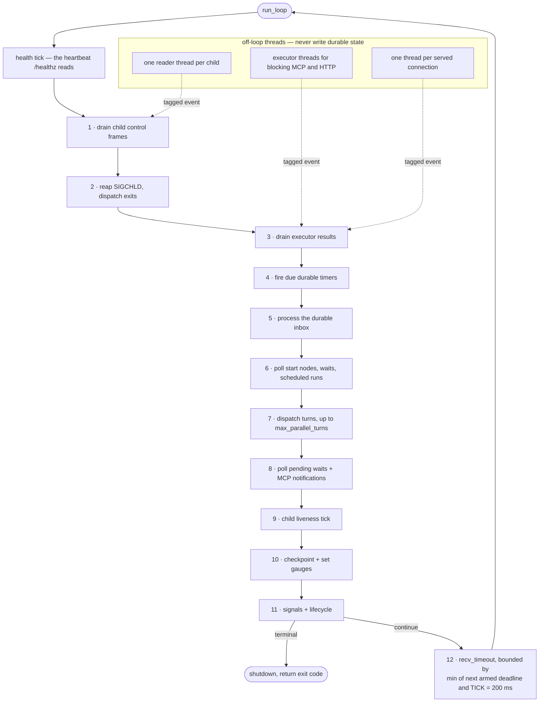

# Architecture: one binary, two loops, two protocols we did not write

You are about to run something that holds your API keys, spawns processes, talks
to a language model, and stays up for weeks. Before you do, you want three
answers without reading the source: what happens when the model wedges mid-turn,
what survives when the process dies, and what third-party code you have just
agreed to trust.

One idea shapes all three: **hand-write the small, stable protocol layers, and
make the unit of concurrency an OS process rather than an async task.** Every
other decision below is downstream of that.

---

## The shape of the system

A running agentd is **one supervisor process** that owns all state, **short-lived
child processes** that do the reasoning, and **four network edges**, all of them
HTTP(S).



The supervisor **runs no agent loop**. It decides *when* things run, executes
effects, and records every transition; reasoning happens inside children it can
kill outright. (Two opt-in watchdogs — the `goal` judge and the `ask_human`
auto-answer — do call the model, but on an executor thread, never on the loop.)
That is the "two loops": a deterministic supervisor loop, and an agentic
think-act-observe loop that lives in a child.

Children are **flat** — every turn worker and subagent is a direct child of the
supervisor, however deep the *logical* agent tree goes. Depth and `agent_path`
are bookkeeping the supervisor mints, never values a child asserts about itself.
A child creates children only by calling back into the supervisor-owned
`subagent` tool, the single chokepoint where depth, breadth and spawn-rate caps
are enforced. A fork bomb comes back as a refused tool result, not a crash; the
limiter is a lazy-refill token bucket, 8 burst and 2 per second.

| Component | Lives in | Owns |
|---|---|---|
| Reactor | `runtime/reactor.rs` | the event loop; the only writer of durable state |
| Workflow engine | `engine/`, `runtime/steps.rs` | the durable DAG: runs, steps, nested bodies |
| Tool registry | `registry/` | tool definitions, grants, precedence `internal > code > MCP` |
| Durable state | `state/mod.rs` | entity kinds, manifest, inbox, timers, checkpoint policy |
| Store adapters | `store/{mcp,http,memory}.rs` | the four-operation contract |
| Supervisor tree | `supervisor/*.rs` | spawn, process groups, reaping, kill ladder, stuck detection |
| Turn worker, subagent | `runtime/worker.rs`, `subagent/` | one LLM turn; the nested agentic loop |
| A2A listener | `runtime/a2a_server.rs` | conversations, durable tasks, the display-client feed |
| MCP client | `crates/mcp/src/client.rs` | tool calls, resource reads, notifications |
| Intelligence client | `intel/` | endpoint list, failover, three in-binary dialects |
| Observability | `obs/*.rs` | NDJSON logs, Prometheus text, OTLP export, probes |

---

## The crate split

Four publishable crates, and a conformance suite that deliberately links none of
them.

| Crate | Library | Size | Owns |
|---|---|---|---|
| `agentd-net` | `net` | 2,093 lines | HTTP/1.1 + SSE client, TLS, SSRF classifier, X.509 extraction |
| `agentd-mcp` | `mcp` | 5,601 lines | MCP wire types, protocol eras, client, Streamable-HTTP server |
| `agentd-core` | `agentd` | 65,170 lines | the engine: loop, supervisor, workflows, registry, config, state |
| `agentd-cli` | bin `agentd` | 586 lines | argv dispatch and exit codes, nothing else |
| `agentd-conformance` | — | — | black-box checks that drive the real binary |

The name mismatch is not aesthetic: `agentd` on crates.io belongs to an unrelated
project, so the package is `agentd-core` with `[lib] name = "agentd"`, and
dependents rename it back so embedders still write `use agentd::…`.

**Third-party surface is quarantined in the leaf.** `net` holds the whole heavy
end of the default build — `rustls`, `webpki-roots` and `rustls-pemfile` behind
its `tls` feature, `vsock` behind `vsock` — and `mcp` adds only serde on top.
Beyond its own three (`serde`, `serde_json`, `libc`), the engine names two
further external crates, both optional and both off by default: `ring` for
`aauth` and `cel-interpreter` for `cel`. `net` and `mcp` also contain
**zero** `unsafe`; every unsafe block in the tree is libc FFI, concentrated in
about nine runtime files plus the CLI's terminal plumbing.

**The CLI is a shell**, and that is enforced by the mechanism that makes
embedding work: subagents are the **same binary re-exec'd** via `current_exe()`,
so an embedder building its own CLI must install the subagent re-exec dispatch as
the *first* thing in `main`. Skip it and a spawn re-runs the embedder's CLI as a
confused supervisor. Code tools register *before* that dispatch, because
registration is how a tool exists in every re-exec'd process.

---

## The single-writer loop

`Runtime::run_loop` is genuinely single-threaded. Each iteration drains every
source, decides, checkpoints, and then blocks on exactly one wait.



"No async runtime" does not mean single-threaded overall — it means the *writer*
is single-threaded. Reader threads, executor threads, the MCP notification pump
and per-connection handlers all exist. The invariant is that none of them mutate
durable state; they post events onto the `std::sync::mpsc` channels the loop
drains.

The wait at phase 12 is `next_wake().min(TICK)`, not `TICK`. A timer due in 3 ms
fires in 3 ms; the 200 ms tick is a ceiling on how long the loop sleeps with
nothing armed, not a scheduling granularity. That ceiling means this is not a
pure blocking park — but it costs nothing measurable. A daemon built with the
shipped feature set, idling on a schedule workflow, reports `Threads: 1`, `VmRSS`
around 3.8 MiB, and **zero** accumulated CPU ticks over ten seconds.

### Why not an async runtime

The argument against tokio is about correctness, not taste. The thing that needs
cancelling when a turn goes wrong is a **child process**, and the only thing that
reliably stops it is `killpg(SIGKILL)`. Future-drop cannot do that. A shared
work-stealing pool also reintroduces the failure mode this design exists to
avoid — one stuck thing starving everything — and costs scores of crates.

The kernel enforces cancellation at three points. Each child gets its own process
group via `setpgid(0, 0)` in `pre_exec`, so the ladder can target a whole
subtree. Each child sets `PR_SET_PDEATHSIG(SIGKILL)` in its own `main` (it is
cleared across `execve`), so a supervisor crash collapses the tree leaf-up. The
supervisor sets `PR_SET_CHILD_SUBREAPER`, so orphaned grandchildren reparent to
agentd rather than host init. The ladder is bounded and deepest-first: graceful
cancel, `killpg(SIGTERM)` after a 5 s grace, `killpg(SIGKILL)` after a further
2 s, then `waitpid`.

### Abandon, don't interrupt

The load-bearing invariant of thread-per-fd is that **the supervisor never blocks
on an untrusted source.** It reaches every pipe only through the channel it
`recv_timeout`s, and it unblocks a parked reader only by making the producer go
away — closing its stdout, killing its process group — never by interrupting the
read. So pipes have no read timeout, and adding one would be a bug: the deadline
lives at the reactor's `recv_timeout`, and a second, racing notion of "stuck" is
what you least want.

The scale envelope is bounded on purpose: roughly 8 MCP readers, up to 50
subagent readers, one intelligence connection and one signal reader — about 60 to
65 threads and 130 file descriptors, three orders of magnitude inside default
Linux limits. You scale by running more instances.

Signals fit the same discipline. Handlers flip an `AtomicBool` and write one byte
to a self-pipe made with raw `libc::pipe`. `SA_RESTART` is off, so blocked
syscalls return `EINTR`; `SIGPIPE` is ignored, so writing to a dead child is an
`EPIPE` you handle rather than a process death.

---

## Where state lives, and why the store is remote

agentd keeps **no durable state on local disk**. Every unit of progress — an
accepted message, a fired trigger, a workflow step, a turn, a subagent result, a
memory write, a timer — goes to a **remote store**. The contract is four
operations:

```
put(key, seq, envelope)  → Ok | Conflict{latest_seq} | Err(io)
get(key[, seq])          → Some(envelope) | None | Err(io)
list(prefix)             → [{key, seq}] | Unsupported | Err(io)
delete(key)              → Ok | Unsupported | Err(io)
```

Keys are `<prefix>/<instance>/<kind>/<id>` across eleven entity kinds —
`manifest`, `inbox`, `context`, `run`, `subagent`, `task`, `memory`, `artifact`,
`timer`, `audit`, `cred`. Values are versioned envelopes carrying `seq`, `ts`,
the writing `instance`, and an optional `hash` binding a run to its definition.

**`put` is a compare-and-set on `seq`, and a conflict is fatal.** If another
writer owns a key, the instance stops accepting work rather than racing. That is
the split-brain guard, and what makes several replicas on one namespace safe.

**Accept means durable.** An inbound message or fired trigger is written to the
inbox *before* it is acted on, and a `SendMessage` is acknowledged only after
that write. On restore, undone inbox records are re-delivered with their original
event id. You get exactly-once *state transitions* and at-least-once *effects* —
the honest pairing, since agentd cannot make a remote tool call idempotent for
you. It carries the key (`_meta["agent/idempotency_key"]`) so a well-behaved
server can collapse the replay.

**agentd links no database client** and defines no schema beyond the envelope.
Three adapters implement the contract: `mcp` maps the operations onto any MCP
server's tools through JSON or CEL templates, `http` onto plain HTTP, `memory`
in-process for tests. A local write-ahead log is a deliberate non-goal — which is
the "why remote". A container's filesystem is not a durability boundary; an
evicted pod takes its disk with it. Making the store an outbound HTTP call to
something that already has an operational story means agentd inherits that story
instead of inventing a worse one.

Restore is explicit: read the manifest, `get` each indexed entity, verify
definition hashes, rebuild registries, re-arm timers from absolute deadlines,
re-open in-flight tasks, re-spawn subagents whose parent step is pending,
re-deliver undone inbox events. Entities newer than the manifest win, because
entities are written first; listed-but-missing entities are marked lost and
audited rather than silently skipped. On a store error, `store.on_error` chooses
`halt` — refuse intake, keep serving status, drain — or `degrade`, which retries
with backoff and reports `durability: degraded`.

---

## The four network edges

| Edge | Direction | Wire |
|---|---|---|
| Intelligence | outbound | HTTPS; OpenAI-compatible `/chat/completions`, plus Anthropic and Bedrock Converse dialects in-binary |
| MCP servers | outbound | HTTPS Streamable HTTP: one POST per request, plus a lazily-opened GET SSE stream |
| State store | outbound | HTTPS, via the `mcp` or `http` adapter |
| A2A / operator | inbound | HTTPS JSON-RPC — peers, TUI, web UI and operator admin all arrive here |

There is no database protocol, no message-bus client, no local socket. The
operator edge is the *same* listener as the peer edge: the TUI and web UI are
thin display clients holding no truth of their own, subscribing to a feed and
forwarding your intent back. Auth is the listener's — on a plaintext loopback
listener with no principals a local client is the operator with zero setup; a
remote client presents a bearer token or an mTLS identity and sees only what its
role allows. The probe surface (`/metrics`, `/healthz`, `/readyz`, on a separate
port when you set `--metrics-addr`) is read-only and off by default. A workflow
with a `webhook` start node serves that same inbound edge on a port of its own —
signed request in, durable run out.

Because every edge is the same wire, there is one transport abstraction:

```rust
pub trait Stream: Read + Write {}
```

`rustls::StreamOwned` is `Read + Write`, so TLS is not a branch in the HTTP code
— it is a different value flowing through the same path. Client roots are the
bundled `webpki-roots`, so a `scratch` container has trust anchors with no system
CA bundle; extra anchors are process-wide and must be installed before the first
outbound dial, because the default client config is built once and cached.

The inbound acceptor re-stats its PEM files at most once per second on accept and
hot-swaps the config, so a cert rotation is picked up with no restart and no
dropped listener; a failed reload keeps serving the last-good identity. Under
mTLS a hand-rolled DER walk lifts subject CN and SANs from the verified leaf, so
a SPIFFE `spiffe://` URI SAN reaches principal matching.

---

## What is hand-rolled, and why

Everything in this table is small, frozen, and only partly needed — which is the
whole rule. A protocol with a living specification is none of those, which is why
MCP and A2A are not in it.

| Layer | Where | Instead of |
|---|---|---|
| HTTP/1.1 client + SSE reader | `net/http.rs`, 644 lines | `ureq` + `url` → IDNA → ICU |
| YAML subset reader | `config/yaml.rs`, 1,307 lines | `serde_yaml`, itself unmaintained |
| JSON Schema subset | `jsonschema.rs`, 803 lines | a schema crate and a regex engine |
| Cron | `triggers/timer.rs` | `croner` |
| Prometheus text | `obs/metrics.rs` | `prometheus` / `metrics` |
| OTLP export | `obs/otel.rs` | `opentelemetry` + protobuf + gRPC |
| inotify config watch | `config/watch.rs` | `notify` / `inotify` |
| NDJSON logging | `obs/log.rs`, 518 lines | `tracing` |
| SHA-256, HMAC, ULID, base64, SigV4, DER walk, token bucket, FNV-1a | various | six or seven crates |

The reasoning is per-row but rhymes. Cron is five UTC fields as `u64` bitsets,
whose `next_after` steps one minute at a time bounded at four years so Feb-29
expressions terminate. OTLP goes over HTTP/JSON rather than gRPC because tonic
would drag tokio into the default build. `tracing` is declined because implicit
async span context is moot in a processes-plus-threads design and the process
tree already supplies correlation.

Two are worth more than a table row.

**Prometheus exposition has structurally bounded cardinality.** Label-bearing
series are fixed-domain atomic arrays whose label set is known at compile time.
An unbounded label — `run_id`, `agent_id`, `agent_path` — is impossible by
construction, not by code review.

**The ConfigMap watch watches the parent directory, not the file.** A kubelet
update writes a new timestamped directory and atomically renames the `..data`
symlink; the file inode is never written, so a watch on the file sees nothing.
The watcher re-arms on `IN_IGNORED` — the subtle bit that makes a *second* update
fire — and sets the same latch SIGHUP sets, so there is one reload code path.

### The dependency ledger, stated honestly

Two things in agentd are emphatically *not* hand-rolled, and they are the two
that talk to other people's software:

| | Implementation | Why not ours |
|---|---|---|
| MCP | [`rmcp`](https://github.com/modelcontextprotocol/rust-sdk) — the official Rust SDK | a live specification, and a misreading fails in the *peer* |
| A2A | [`a2a-rs`](https://github.com/emillindfors/a2a-rs) — generated from the spec's protobufs | same, and proven: an independent reading found four faults in ours |

Both plug into agentd's own HTTP transport, so the credentials only agentd knows
about — AAuth signatures, SigV4, mTLS identities, refreshed OAuth tokens — and
the SSRF guard all still apply. The SDKs own the protocol; agentd owns the socket.

The resolved graph is what it is:

| Build | External crates |
|---|---|
| `--no-default-features` | 78 |
| default (`tls` + MCP) | 91 |
| the full shipped feature set (adds A2A) | 187 |

An earlier version of this document said "exactly three direct external
dependencies" and pointed at a CI job that enforced it. That job is gone. The
claim it protected — *you can hold the whole trust boundary in your head* — is no
longer one agentd can make, and pretending otherwise would be worse than
retiring it. What replaced it is a gate on the thing a user actually receives:
the release binary must still be a statically linked musl artifact that runs on
`scratch`, 6.5 MiB with no shell, no libc and no package manager.

The build now needs a C toolchain — `cmake` and a C++ compiler, for the
`aws-lc-sys` that arrives underneath the SDKs. That is a builder-image cost, not
a shipping one.

Two gates remain: the feature matrix compiles, clippies and tests 17 combinations
including every shipped feature solo, because `--all-features` unification hides
broken solo builds; and `deny.toml` bans wildcard versions, denies yanked crates,
and carries a hand-maintained permissive-only licence allow-list.

---

## Feature flags are the capability surface

Capability is decided at compile time. Of the fourteen features besides
`default`, nine are literally empty arrays — they gate hand-rolled code, not
dependencies.

| Feature | Adds crates | Gates |
|---|---|---|
| `tls` *(default)* | rustls, ring, webpki-roots, … | HTTPS in and out |
| `a2a` | `a2a-rs`, axum, tokio, … | the inbound A2A / interface listener |
| `cron` | none | the five-field UTC parser |
| `oauth` | none | OAuth 2.1 device, PKCE and client-credentials tokens |
| `metrics` | none | the atomic registry and Prometheus text |
| `otel` | none | OTLP-over-HTTP/JSON export |
| `hot-reload` | none | SIGHUP validate-first quiesce-and-reapply |
| `config-watch` | none — chains `hot-reload` | the inotify directory watch |
| `workflow` | none | nothing live — the durable DAG engine is unconditional |
| `cluster` | none | `--shard K/N`, claim/lease, capacity signal |
| `exec` | none | the guarded local command runner |
| `aauth` | none new — reuses `ring` | Ed25519 identity + RFC 9421 signing |
| `cel` | **+28** | CEL predicates and expressions |
| `internal-mocks` | none | the mock LLM and MCP servers the tests drive |

Read that table twice, because the naive model — "features control dependency
cost" — mispredicts two rows.

`aauth` adds Ed25519 signing with **zero new crates**, reusing the `ring` that
rustls already resolved. That is why it ships in the release artifact while `cel`
cannot: `cel` costs 28 extra crates, more than the entire rest of the tree.

`exec` costs **nothing** in dependencies and is still absent from every shipped
binary. It is gated on *posture*: agentd's default position is that it runs no
local code. Turning it on takes both the cargo feature and
`security.exec.enabled` at run time, and even then the runner never uses a shell,
enforces an argv[0] allow-list, confines the working directory, caps output and
wall-clock, and passes a minimal environment.

Two mechanics follow from treating features as capability rather than cost.
**Call sites stay unconditional** — there are no `#[cfg]` gates around `record_*`
or span calls; the feature empties the function body, so the loop wires
observability once. And **CEL is fail-closed**: the module is always compiled,
only its internals gated, so a build without the feature rejects a graph using
CEL at define time with a named error rather than mis-evaluating later.

---

## The deployment shapes that fall out

Nothing above chooses a deployment shape. The daemon and the one-shot job are the
same engine differing only in exit predicate: a workflow's **start node** decides
when a run begins, `lifecycle.run_until` decides when the process stops.

```console
$ agentd \
    --instruction "Summarize the open TODOs under /work and write SUMMARY.md" \
    --intelligence https://gw.example/v1 \
    --mcp fs=https://mcp-fs.internal/mcp \
    --max-steps 40 --deadline 600s
```

The same binary, woken by an MCP resource and keeping state across restarts:

```yaml
config_version: "2"

agent:
  name: triage
  instruction: You triage incoming issues and write a one-paragraph summary.

intelligence:
  endpoints: https://api.openai.com/v1
  model: gpt-5.1
  token: "{{secret:OPENAI_API_KEY}}"

mcp:
  servers:
    - name: issues
      endpoint: https://mcp-issues.internal/mcp
    - name: state
      endpoint: https://mcp-state.internal/mcp

store:
  kind: mcp
  mcp:
    server: state

workflows:
  - name: triage
    steps:
      start:
        kind: subscribe
        server: issues
        uri: issues://open
        debounce_ms: 2000
      summarize:
        kind: agent
        depends_on: [start]
        instruction: Read the open issues and summarize what changed.
        servers: [issues]
      done:
        kind: finish
        depends_on: [summarize]
        output: "{{steps.summarize.output}}"

lifecycle:
  run_until: drained
```

`agentd --validate-config -c triage.yaml` loads, substitutes, types and validates
the whole document and exits 0 or 2 — before any side effect. Precedence is
built-in default, then files, then environment, then flags.

The exit-code table is a public API, meant to be read by a `podFailurePolicy`:

| Code | Meaning |
|---|---|
| 0 | success — one-shot completed, or a clean SIGTERM drain |
| 1 | generic failure (retriable) |
| 2 | config or usage error (non-retriable) |
| 3 | partial result |
| 4 | intelligence unreachable or auth failure after retries (retriable) |
| 5 | semantic refusal — the task cannot be done (non-retriable) |
| 6 | a required MCP server failed to connect or handshake (retriable) |
| 7 | budget exceeded — steps, tokens, deadline, tree |
| 124 | hard wall-clock deadline |
| 137 / 143 | killed by SIGKILL / SIGTERM, set by the OS |

Note 0 for a clean drain, not 143 — visible in the log as `drain.start`,
`drain.done`, `proc.exit` with `code: 0`. The drain budget must be **less** than
the pod's `terminationGracePeriodSeconds` — a number agentd cannot see, so
nothing validates it for you, and it is the most common way to get this wrong.
Liveness is the reactor heartbeat, deliberately: a wedged reactor reads
unhealthy, while a healthy tree with one stuck subagent keeps reading healthy —
the reactor is the thing detecting and killing that child, so it is still
ticking.

The resulting footprint, on a stripped x86_64 glibc release build (`opt-level =
"z"`, LTO, `panic = "abort"`, one codegen unit): 2.88 MiB with
`--no-default-features`, 3.83 MiB with default `tls`, 4.43 MiB with the shipped
set `a2a,metrics,cron,otel,hot-reload,config-watch,aauth,oauth`. Release
artifacts are cross-compiled static-musl for `x86_64` and `aarch64`, plus a
multi-arch, cosign-signed OCI image with an SPDX SBOM.

`panic = "abort"` is a design statement, not a size optimisation: a panicking
supervisor should die loudly and let `PR_SET_PDEATHSIG` collapse its tree rather
than limp on with corrupt state. The consequence is worth saying plainly — every
`unwrap` on the supervisor path is a tree-wide availability decision, which is
why mutex locks there recover from poisoning rather than aborting on it.

---

## What this design will not do

- **Scale one instance to thousands of connections.** The model targets roughly
  60 threads. You scale out, not up.
- **Give you exactly-once effects.** It gives exactly-once state transitions and
  carries an idempotency key; collapsing the replay is the remote server's job.
- **Survive a restart without a store.** `memory` is for tests; there is no local
  write-ahead log.
- **Sandbox anything.** The container, VM or enclave around agentd is the
  sandbox. Capability scoping is the granted tool subset, narrowing monotonically
  down the agent tree.
- **Evaluate CEL or run a local command in a shipped binary.** Both require
  building from source.

---

## Where to go next

- [`rfcs/0002-supervisor-reactor-and-concurrency.md`](../rfcs/0002-supervisor-reactor-and-concurrency.md) — the reactor and concurrency model
- [`rfcs/0003-process-supervision-and-recovery.md`](../rfcs/0003-process-supervision-and-recovery.md) — supervision, stuck detection, recovery
- [`rfcs/0025-durable-state-and-store-adapters.md`](../rfcs/0025-durable-state-and-store-adapters.md) — durable state and store adapters
- [`workflows.md`](workflows.md) · [`deployment.md`](deployment.md) · [`security.md`](security.md) · [`embedding.md`](embedding.md)
