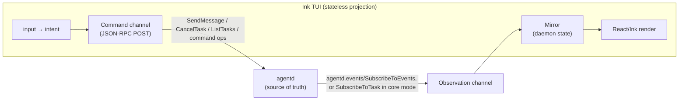

# 03 — Thin-Client TUI/UI over A2A (Ink)

Status: **IMPLEMENTED.** The clients live under `interface/` (one package, `@agentd-dev/cli`); the
operator guide is `docs/interface.md`. They are ordinary A2A 1.0 clients: the boundary they speak —
the core methods, the three declared extensions, the device and launch grants, the thin launcher — is
**RFC 0043**, and the observation plane's design is **RFC 0032**. This document is the design
rationale: why the clients are thin, why observing and commanding are separate channels, and the Ink
rules that bite. Where it and the RFCs or the code differ, those win.

> **Thesis.** `agentd` is the single source of truth. The TUI (Ink/React) and any web UI are
> **stateless projections** of daemon state — they hold no agent logic, no tools, no secrets, no
> conversation state of their own. They forward *intent* up and render *state* down. Because no
> client owns any truth, multiple clients (a terminal + a browser + a CI script) can attach and
> detach from the same daemon and each render independently, in sync, for free.

This document (a) states the thin-client architecture, (b) maps it onto the surface agentd serves
its clients, (c) explains the observation plane and its fallback, and (d) specifies the Ink client —
component tree, transport, state model, and the performance rules that actually bite.

---

## Contents

1. [The thin-client principle](#1-the-thin-client-principle)
2. [Reference architectures (why this shape)](#2-reference-architectures)
3. [The surface the clients speak](#3-the-surface-the-clients-speak)
4. [The observation plane](#4-the-observation-plane)
5. [What the daemon serves for them](#5-what-the-daemon-serves-for-them)
6. [The Ink client](#6-the-ink-client)
7. [Ink best practices that actually bite](#7-ink-best-practices-that-actually-bite)
8. [Multi-surface: TUI + web from one daemon](#8-multi-surface-tui--web-from-one-daemon)
9. [Decisions](#9-decisions)

---

## 1. The thin-client principle

Three invariants, in priority order:

1. **The daemon owns all state and all capability.** LLM calls, tools, workflows, subagents,
   secrets, durable store — every one stays in `agentd`. The UI never sees a secret, never calls a
   model, never runs a tool. This is a *security* property (a compromised or screen-shared UI leaks
   nothing) as much as an architectural one.
2. **Clients are disposable and interchangeable.** A client is `pure(daemon_state) -> pixels` plus
   `input -> intent`. Kill it, restart it, open a second one — the daemon doesn't notice and nothing
   is lost. The TUI and the web UI are two renderers of the same contract.
3. **Sync is a consequence, not a feature.** If every client is a projection of one authoritative
   event log, "keep the TUI and the web UI in sync" requires *zero* client-to-client logic. They
   converge because they subscribe to the same feed.

The failure mode to avoid: letting "send a prompt" also be "receive the reply" on the same
request/response. That couples the act of steering to the act of observing, and it means a *second*
client never sees the first client's prompt. Keep them separate (next section).

---

## 2. Reference architectures

The pattern is well-trodden. Two proof points shaped this design:

- **OpenCode** runs a headless HTTP server (`opencode serve`) behind an OpenAPI contract. The TUI is
  "simply one implementation of a client"; IDE extensions and web apps speak the *same* API. Prompts
  are `POST /session/:id/message`; **all** live updates arrive on a separate **SSE** event stream
  that the server broadcasts to every attached client. Command channel and observation channel are
  distinct.
- **Zellij's web client** keeps session state server-side; clients are thin ("client passes input to
  the server, server passes render instructions to the client"). Multiple clients attach to identical
  channels and all receive identical updates. Notably it **splits the stream by volume** — a
  high-frequency data channel and a low-frequency control channel — so a burst of output can't block a
  resize or a cancel.

Distilled into two rules we adopt:

- **Two channels.** A *command* channel (unary request/response: send, cancel, list, drain) and an
  *observation* channel (one long-lived server→client stream carrying every state change). The reply
  to a prompt arrives on the observation channel, exactly like it arrives for every other client.
- **Resumable, replayable stream.** Events carry a monotonic sequence number; a reconnecting *or
  newly-attaching* client replays from a cursor rather than losing history. This is the backbone of
  attach/detach and of a late-joining second client catching up.

---

## 3. The surface the clients speak

agentd has exactly one inbound surface a client talks to: the **A2A listener** (`a2a.listen`). The
webhook listener is ingress for workflows and the metrics probe serves health; neither is for a
display client. So "the UI talks to agentd" means **"the UI speaks A2A"** — and nothing it speaks is
served to it alone.

- **The card.** `GET /.well-known/agent-card.json` is public. It names the JSON-RPC interface, the
  security schemes the listener enforces, and the extensions it declares. `GetExtendedAgentCard`
  answers an authenticated caller with what *it* may do.
- **Core A2A 1.0.** JSON-RPC over HTTP POST, `A2A-Version: 1.0` on every request: `SendMessage`,
  `SendStreamingMessage`, `GetTask`, `ListTasks`, `CancelTask`, `SubscribeToTask` (SSE), and the push
  configuration methods. Tasks are durable, so `GetTask` works across daemon lives and attach/detach
  is real, not cosmetic.
- **Three declared extensions**, each used only when the card declares its exact URI and activated
  per request with `A2A-Extensions`:
  - **events** (`https://agentd.dev/a2a/ext/events`) adds one method,
    `agentd.events/SubscribeToEvents` — the observation channel (§4);
  - **command** (`https://agentd.dev/a2a/ext/command`) carries operations as one DataPart on
    `SendMessage` — `status`, `config`, the steering and admin ops, the auth ops, the introspection
    reads — each listed on the card for the caller who may run it;
  - **task-annotations** (`https://agentd.dev/a2a/ext/task-annotations`) puts agentd's own facts
    about a task (its link, principal, status history, a gate's answer schema) under `metadata`.
- **Sign-in.** The listener origin is an OAuth 2.0 authorization server for the device grant; the
  `agentd tui` / `agentd ui` launcher signs its own client in with a single-use launch code. A local
  non-browser process on a no-auth loopback listener is the implicit operator; a browser never is.

One shape asymmetry the client handles once, at the transport boundary: `SendMessage` answers with a
`Task` or a `Message`, while `GetTask`/`CancelTask` return the `Task` directly. Every task is otherwise
the same object, so `status.state` is the only place a state is ever read.

---

## 4. The observation plane

The vision needs a live view of *all* the state a caller may see, not one task's. A2A streams one
task at a time (`SubscribeToTask`); a display client needs the instance. That is what the events
extension adds:

- **One feed, principal-scoped.** Every state transition — tasks, runs and their steps,
  conversations, subagents, children, activity, lifecycle — is an event with a monotonic `seq`, kept
  in a bounded ring (1024). A subscriber sees only what it may see, by the same visibility rule the
  `status` op applies to its snapshot, so what a principal can poll and what it can watch cannot drift
  apart.
- **Resumable.** `hello` → `event`* → `goodbye`. The goodbye carries the cursor the client resumes
  from; `hello.resync` says the cursor could not be honoured (evicted, or a daemon restart), and the
  client re-bootstraps from `status` and `ListTasks` instead of applying a replay on top.
- **Revocable.** A session revoked mid-stream gets `goodbye{reason: "revoked"}` within one tick.

**Core mode is first-class, not a degradation path to apologise for.** When the card declares no
events extension — or the person asked for core A2A, or the agent does not serve the feed it
declared — the same state model is fed by core methods alone: `ListTasks` polled for what changed and
`SubscribeToTask` on the tasks that are moving, with the transcript from each task's `history`. The UI
code does not change; only the source does. That is also what lets the same client drive any A2A 1.0
agent.

---

## 5. What the daemon serves for them

Each of these exists because a client needed it, and each is a declared, specified part of the
listener rather than a private channel:

1. **The feed** (§4), declared while `a2a.events.enabled` is on. This single method delivers
   multi-client convergence, live debug and attach/detach.
2. **The read model as command ops.** `status` is the snapshot the feed is folded onto. The reads
   that expose content and internals — `conversation.get` (message bodies), `run.get` (per-step
   detail), `subagent.get`, `debug.events` (the log ring) — are served only while
   `a2a.introspection.enabled` is on, and the card lists them only then, so the client knows without
   asking.
3. **Human-in-the-loop over core A2A.** A gate is a task in `input-required` with the question as its
   status message; a reply is `SendMessage` naming that `taskId`. Every client already renders tasks,
   so each renders an answerable row with no special channel.
4. **Steering as ops.** `workflow.signal`, `admin.pause` / `admin.resume`, `subagent.send`,
   `plan.get`, `admin.drain` — direct control instead of hoping the model calls a tool.
5. **Live activity instead of a token stream.** The daemon reports phase, tool, round and tokens on
   *change*; elapsed time ticks in the client. One small event per phase change keeps every attached
   surface in sync for a fixed cost (§9.1).
6. **Browsers.** The listener answers a page only from an origin listed in `a2a.cors.origins`, and a
   browser always signs in — the device grant, or the tab `agentd ui` opens. Streams are read with
   `fetch`, never `EventSource`, which cannot set headers (§7).

---

## 6. The Ink client

### 6.1 Architecture



The client is three thin modules around a React tree, all in the shared core (`src/client`):

- **Discovery + `AgentdClient`** — reads the card, picks the interface, reads the extended card when
  it may, and builds a client that can call only what the card offers (`send`, `cancelTask`,
  `listTasks`, the command ops). It owns the HTTP/SSE plumbing and nothing else.
- **`Mirror`** — folds bootstrap snapshots and feed events into a plain in-memory projection
  (`tasks`, `runs`, `conversations`, `subagents`, counters, the transcript). The UI reads *only*
  this; it never derives truth locally.
- **`Observation`** — keeps the mirror converged: discovery, then events mode or core mode, with
  backoff, `Retry-After`, and a terminal stop for failures retrying cannot fix (unauthenticated,
  forbidden, incompatible).

Everything the user does becomes a command; everything the user sees comes from the mirror. That is
the whole design.

### 6.2 Component tree

```
<App>                         render(); useInput global keymap; owns the Observation + Mirror
├─ <Edge top>                 the header, from the client's layout
├─ <Screen: Chat>             the default working surface
│  ├─ <Transcript/>           every client's prompts, command results, replies, answerable gates
│  ├─ <GatePrompt/>           a form-shaped gate: number keys pick an option
│  ├─ working row             what the agent is doing right now (phase · elapsed · tokens · round)
│  └─ composer                multiline input; `/` `@` `#` `$` suggestions
├─ <Screen: Tasks>            the tasks this principal may see; cancel
├─ <Screen: Subagents>        live list → detail (m message · k stop, confirmed)
├─ <Screen: Debug>            only while introspection is offered: feed tail, runs with steps,
│                             subagents/children, the log ring
└─ <StatusBar>                the bottom edge: conn · endpoint · DRAINING/PAUSED · counters · keys
```

Only **one** screen is mounted at a time. The chrome (both edges) is the client's own layout — half
its items are client state no daemon can know — shaped with `--top`/`--bottom` and `/layout`.

### 6.3 State model

- **One mirror, event-sourced.** Bootstrap (`status` when offered, paged `ListTasks`), then feed
  events. On reconnect, resume from the goodbye's cursor; on `resync`, re-bootstrap.
- **One optimistic write.** The local echo of a just-sent prompt, reconciled by `messageId` when the
  task's history carries it — which works the same in core mode, because history is an A2A field.
- **Handle the shape asymmetries in the client, once.** Normalize envelopes at the transport
  boundary so the mirror sees one canonical `Task` shape.

### 6.4 Layout

The frames in `docs/interface.md` are captured from the shipped TUI (`interface/tools/frames.mjs`),
so they are the layout reference; this note does not keep a drawing that could drift from them.
Short lines, tool and command results as `▸` blocks, one dynamic region (the working row and the
composer) — it reads well in a small window and maps 1:1 onto the event stream.

### 6.5 Keyboard model

- `useInput` global keymap at `<App>`.
- Enter = send · Alt/Option-Enter, Ctrl-J or a trailing `\` = newline (Shift-Enter is not
  distinguishable from Enter in a terminal) · Tab = accept a suggestion, else cycle screens ·
  `↑`/`↓` = select · Esc = back from a detail, else cancel the newest working task · PgUp/PgDn =
  scroll the fullscreen transcript · Ctrl-C = quit.
- Slash commands compile to A2A: `/drain` → `admin.drain`; `/workflow triage` → `workflow.run`;
  `/config` → the `config` op. A command whose op the card does not list for this caller is not
  offered.

---

## 7. Ink best practices that actually bite

| Concern | Rule | Why |
|---|---|---|
| **Flicker / perf** | Fullscreen (the default) takes the alternate screen and owns its scrolling; `--inline` commits settled lines to `<Static>` and keeps the dynamic region shorter than the terminal. | Ink redraws the *entire* dynamic tree on every state change; exceeding terminal height triggers a full-screen clear-and-redraw. `<Static>` writes to scrollback once and is never re-rendered. |
| **SSE in Node** | Do **not** use `EventSource` — it can't set headers, so neither `Authorization` nor `A2A-Version` can be sent. Read the stream with `fetch` and a WHATWG-conformant parser (the client's own, in `wire.ts`). | One code path for the feed, task streams and every credential. |
| **Logging** | Never `console.log` while Ink runs — it corrupts layout. The daemon's own log goes to a file under the launcher, and to the Debug screen through `debug.events`. | Keep stdout for the render tree only. |
| **Layout** | Everything is flexbox `<Box>`. Use `useWindowSize` for responsive panes. | Terminal resizes are first-class. |
| **Testing** | `ink-testing-library` for render tests; a fake A2A agent (`test/fake-a2a.mjs`) that serves a card and replays daemon-shaped events. | The module split makes the UI testable without a live daemon. |
| **Dependencies** | `ink` and `react` only; the composer is a small multiline editor of its own. | Nothing to audit that the client does not need. |

---

## 8. Multi-surface: TUI + web from one daemon

Because state lives in agentd and both clients are projections:

- **The client core is shared code** — one package, `@agentd-dev/cli`, whose library entry point
  is the discovery, wire, mirror and observation modules. The Ink TUI and the React web UI import the
  *same* core; only the render layer differs (Ink `<Box>` vs DOM). This is the OpenCode "TUI is just
  one client" property, made literal.
- **Convergence is automatic**: both clients watch the same feed, both resume from a cursor, both see
  the same turns/tasks/runs. No client-to-client channel. A prompt typed in the TUI appears in the
  browser because both are watching the daemon.
- **Each sees what its principal may see.** A TUI on a no-auth loopback daemon is the operator; a
  browser always signs in and is served only from a listed origin.
- **Attach/detach is free.** Durable tasks + a replayable feed mean a client can close and reopen (or
  a second one can join) and reconstruct the current state from the cursor.

---

## 9. Decisions

1. **Token-level streaming? No.** A live-typing UX needs a token stream to every watcher, which
   multiplies the daemon's outbound traffic by the number of attached surfaces and floods the replay
   ring. The clients show live *activity* instead — phase, tool, round, tokens, with elapsed time
   ticking locally — which keeps every surface in sync at a fixed cost.
2. **Read model: resources or commands? Commands.** Discrete ops on the command extension, each
   listed on the card for the caller who may run it, rather than a resource surface agentd would have
   to serve alongside A2A.
3. **Web transport: SSE or WebSocket? SSE + POST.** SSE is unidirectional-perfect for the
   observation channel and is what A2A streams already are; commands stay POST.
4. **Where does the client core live? In the repository**, as one package, so the TS client and the
   Rust protocol evolve together and are tested against each other.
5. **Auth for a remote daemon? The listener's own OAuth device grant.** A person signs in under a
   name an operator approves; no credential the daemon was configured with is ever copied into a
   client, and the launcher's clients sign in with a single-use code instead.

---

### Appendix — sources (Ink & reference architectures)

Ink (`github.com/vadimdemedes/ink`, Ink 3 perf notes), the `<Static>`/flicker analysis, OpenCode's
server/REST+SSE architecture (headless `serve`, event bus, "TUI is one client"), and Zellij's web
client (server holds state, thin client, split channels, multi-client attach) informed §2 and §7.
