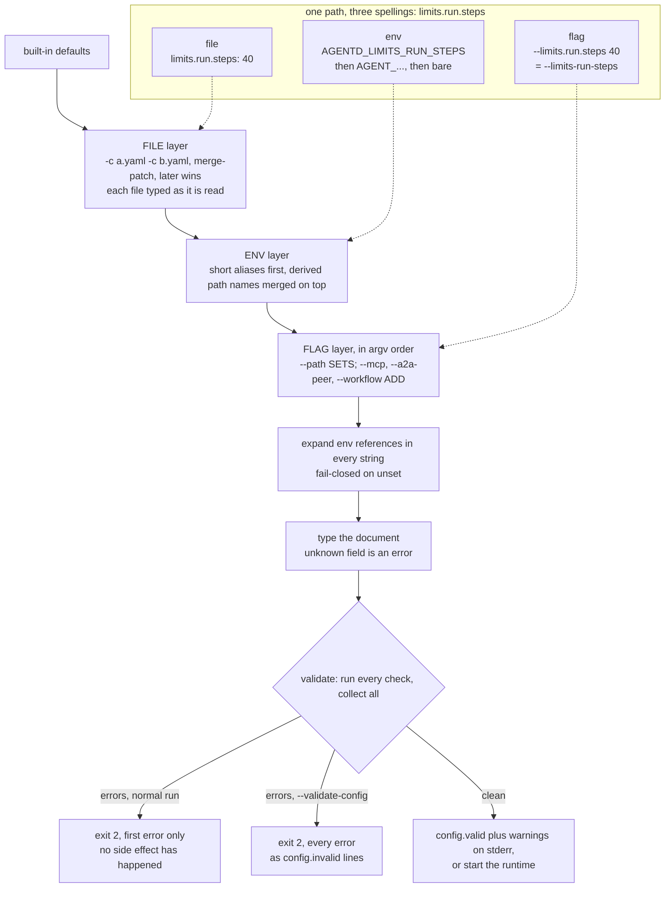
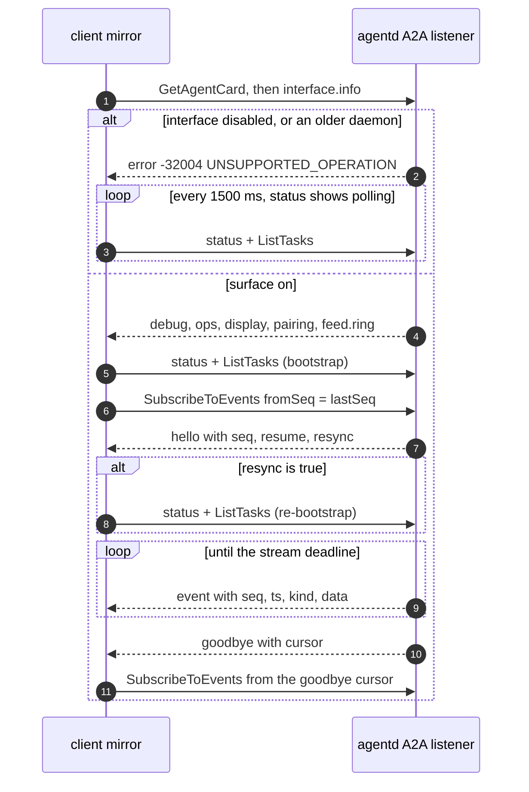
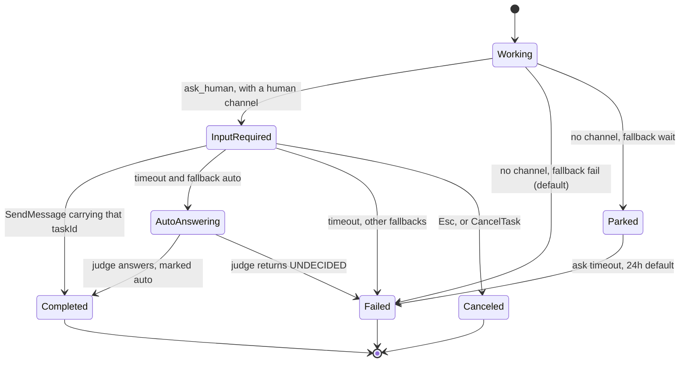

# Working with agentd: the developer and operator experience

You are about to hand an autonomous process a model endpoint, a set of tools, a
budget, and permission to act — then walk away. Two questions decide whether you
can: *will it break before it does anything*, and *can you see what it is doing
while it runs*. agentd answers both the same way. It fails in the cheapest place
it can — at validation, before a socket is opened or a token spent — and while
it runs it publishes its state as a feed that any number of thin clients mirror.

## One document, three spellings

There is exactly one document of truth: the configuration. Everything you can
type is a *path* into it, and every path has three spellings — a file key, an
environment variable, and a flag. They are derived from the schema rather than
plumbed field by field, so a new path gets all three. For `limits.run.steps`:

| Spelling | Form |
|---|---|
| file | `limits: {run: {steps: 40}}` |
| env | `AGENTD_LIMITS_RUN_STEPS` > `AGENT_LIMITS_RUN_STEPS` > `LIMITS_RUN_STEPS` |
| flag | `--limits.run.steps 40`; `.`, `_` and `-` are interchangeable, so `--limits-run-steps` binds the same |

The precedence rule is one line, printed by `agentd --help`:

```
Precedence: built-in < files < env < flags.
```

Files compose rather than replace: `-c base.yaml -c overlay.yaml` merges them
with JSON-Merge-Patch semantics, later wins. Flags apply in argument order, and
one distinction matters: a generic `--<path>` **sets** a value, replacing a
whole list or map, while the three repeatable aliases — `--mcp`, `--a2a-peer`
and `--workflow` — **add** one entry.



The environment layer has a second precedence inside it: the derived path names
are built *after* the short aliases and merged on top, so
`AGENTD_INTELLIGENCE_MODEL` beats `AGENT_MODEL` for the same field. With the
prefix ladder, a stale variable can look ignored, or a bare `MODEL` can quietly
win over a config file. Look there first when a value surprises you.

A flag reaches wherever the schema says it can and nowhere else. It reaches into
a free-form map with the key's exact spelling preserved
(`--intelligence.headers.x-team ops`), but reaching into a scalar or an array
element is a *named* error, not a guess. Values are coerced by their declared
kind — a bare `--interface.enabled` means `true`, and an enum names its set:

```
$ agentd -c app.yaml --mcp.servers.0.name fs --validate-config
agentd: --mcp.servers.0.name: array elements cannot be addressed by path
(set the whole list `--mcp-servers '[…]'`, or use the named repeatable flag)

$ agentd -c app.yaml --lifecycle.run_until forever --validate-config
agentd: invalid --lifecycle.run_until: "forever" is not one of auto|idle|drained
```

Two substitution mechanisms share the document and must not be confused.
`${VAR}` and `${VAR:-default}` expand from the process environment across
*every* string, inline workflows included; braces are required, `$${` is a
literal `${`, and an unset variable with no default is a hard error rather than
an empty string. Credentials are the other: from a *file* they must be a
`{{secret:NAME}}` or `{{secret-file:PATH}}` reference, and they never print.

## Nothing happens until the document is valid

Loading is side-effect-free by design: the configuration is probed, merged,
substituted, typed and validated before the runtime opens a store connection,
dials an MCP server, or spends a token. A wrong document gets you exit 2 and an
untouched world.

Validation runs *every* check and collects the results — it never stops at the
first problem. What differs is who asks. A normal run reports only the first
error, because it is on its way to doing work; `--validate-config` reports all
of them:

```
$ agentd -c app.yaml --validate-config
{"event":"config.invalid","msg":"store.kind is none but the instance is long-lived (serves A2A / webhooks / a goal watchdog / has a loop|schedule|subscribe|signal|event|a2a|webhook start node) — configure a durable store (store.kind: file | mcp | http), or drop store.kind to get the local file store by default"}
{"event":"config.invalid","msg":"a2a.listen is https:// but a2a.tls.cert / a2a.tls.key are not set"}
{"event":"config.invalid","msg":"a2a.listen on a non-loopback address needs client auth: a2a.tls.client_ca, a2a.bearer, and/or interface.pairing"}
{"event":"config.invalid","msg":"interface.origins: \"https://ops.example.com/\" is not an origin (want scheme://host[:port], no path)"}
{"event":"config.invalid","msg":"config file: intelligence.token carries an inline credential; use {{secret:NAME}} / {{secret-file:PATH}} (or set it from env/flag)"}
$ echo $?
2
```

Started normally, the same configuration prints only the first of those five —
fixing errors one restart at a time is the slow path. Note where the output
goes: the verdict lines are on **stderr**, and so is the success line, so a CI
script capturing stdout to assert validity gets nothing. The machine-readable
dumps (`--config-schema`, `--workflow-schema`, `--capabilities`) go to stdout.

Every object rejects unknown fields, and each file is typed as it is read, so a
typo names *its own file* rather than the merged blob:

```
$ agentd -c app.yaml -c prod.yaml --validate-config
agentd: config file prod.yaml parse error: unknown field `url`,
expected one of `name`, `endpoint`, `ns`, `headers`, `tags`, `aauth`, `oauth`, `auth`, `timeout`
```

Workflows get the same treatment. Each node kind has a closed field list, and an
unknown field is an error with the allowed set attached — which is how you learn
that an `agent` step takes `instruction` (a `prompt` belongs to `think`) and a
`subscribe` start node paces with `debounce_ms`:

```
$ agentd -c release.yaml --validate-config      # two guessed field names
{"event":"config.invalid","msg":"workflow \"release\" step \"draft\": unknown field \"prompt\" for kind \"agent\" (allowed: instruction, output_contract, output_schema, tools, servers, limits, context, skills, system)"}
{"event":"config.invalid","msg":"workflow \"release\" step \"draft\": kind \"agent\" requires field \"instruction\""}
{"event":"config.invalid","msg":"workflow \"release\" step \"start\": unknown field \"debounce\" for kind \"subscribe\" (allowed: server, uri, debounce_ms, coalesce, filter, deliver, on_no_listener, inputs)"}
```

Structure is checked too: a workflow needs a start node and a `finish` step,
every non-start step needs `depends_on`, and the graph must be acyclic and
reachable from a start. A document that validates clean:

```yaml
config_version: "1"
agent:
  name: releaser
  instruction: Keep the release queue moving.
  ask_human_fallback: fail
intelligence:
  endpoints: https://api.example.com/v1
  model: gpt-5.1
  token: "{{secret:INTEL_TOKEN}}"
mcp:
  servers:
    - name: state
      endpoint: https://mcp-state.internal/mcp
    - name: queue
      endpoint: https://mcp-queue.internal/mcp
store:
  kind: mcp
  mcp:
    server: state
a2a:
  listen: http://127.0.0.1:8420
interface:
  enabled: true
workflows:
  - name: release
    version: 3
    steps:
      start:
        kind: subscribe
        server: queue
        uri: queue://releases/pending
        debounce_ms: 2000
      draft:
        kind: agent
        depends_on: [start]
        instruction: Prepare the release notes for {{steps.start.output.tag}}.
        servers: [queue]
      approve:
        kind: human
        depends_on: [draft]
        question: "Ship {{steps.start.output.tag}}? Notes: {{steps.draft.output}}"
        timeout: 30m
      done:
        kind: finish
        depends_on: [approve]
        status: completed
        output: "{{steps.approve.output}}"
```

Not everything is gated, on purpose: the asks (`--help`, `--version`, the schema
dumps, `--login`, `--logout`) short-circuit validation, so `agentd --help` works
with a broken or absent configuration.

The same gate protects reconfiguration. SIGHUP (or `lifecycle.watch_config`)
re-merges and re-validates before applying anything, and a change under any
restart-only path — `a2a.listen`, `a2a.tls`, `a2a.bearer`, `store.kind`,
`security`, `lifecycle.run_until` — is refused wholesale as
`restart_required`, leaving the running configuration in place. Reload is
all-or-nothing.

## The exit code is an API

The process exit code is a frozen, versioned contract (`EXIT_CODES = "1.0"`,
surfaced at `surfaces.exit_codes`) meant to be read by a scheduler without
parsing a log. Each code carries an intent a control plane compiles into a
`podFailurePolicy`.

| Code | Meaning | Intent |
|---|---|---|
| 0 | success: one-shot completed, or a clean SIGTERM drain | complete |
| 1 | generic failure | retriable |
| 2 | config or usage error | terminal |
| 3 | partial result | policy |
| 4 | intelligence unreachable, or auth failed after retries | retriable |
| 5 | semantic: the task cannot be done, or was refused | terminal |
| 6 | a required MCP server failed to connect, handshake, or died | retriable |
| 7 | budget exceeded (steps, tokens, deadline, tree) | policy |
| 124 | hard wall-clock deadline (mnemonic to `timeout(1)`) | policy |
| 137 | SIGKILL (128+9, OS-set) — often OOM | infra |
| 143 | SIGTERM (128+15, OS-set) — ungraceful | infra |

A **clean drain exits 0, not 143.** agentd never returns 137 or 143 itself; the
kernel sets them, and the contract only *classifies* them. A rule keyed on 143
to mean "terminated" never fires on a graceful shutdown.

An **unrecognised code defaults to `retriable`** — never a silent `FailJob`. A
reader meeting a future code backs off rather than giving up.

The **remap is narrow.** `--budget-exit-code` / `lifecycle.exit_code_map` only
touches 3 and 7; every other code passes through unchanged, including the
`policy`-intent 124. The durable run report keeps the canonical 3/7 projection
regardless, so the record stays truthful even when the process code is remapped.

Startup is ordered so environment failures land on distinct codes: bad TLS
material, a bad tool registry, unparseable workflows or a bad listener are
exit 2; a store that will not connect, and an instruction URI no server serves,
are exit 6:

```
$ agentd -c app.yaml 2> telemetry.ndjson ; echo "exit=$?"
exit=4
$ jq -rc 'select(.event=="run.done" and .err != null) | .err' telemetry.ndjson
step "work" failed: turn failed: intel: all intelligence endpoints down (last error: intelligence transport error: Connection refused (os error 111))
```

## Telemetry you can actually filter

The stream split is absolute: **stdout is the agent's result, stderr is all
telemetry**, one JSON object per line, so you can redirect them apart without a
parser. Every line carries the same canonical block — `ts`, `level`, `event`,
`run_id`, `agent_id`, `agent_path`, `comp`, `pid` — and then whatever the event
itself carries:

```json
{"agent_id":"sup","agent_path":"0","comp":"supervisor","event":"run.start","level":"info","node":"start","pid":902303,"run":"main-01M06SX36VG78D6PDM6B0P7CDE","run_id":"01M06SX36SKG6WVV202GPV24RA","ts":"2026-08-17T02:48:09.691Z","workflow":"main"}
{"agent_id":"run/main-01M06SX36VG78D6PDM6B0P7CDE/work","agent_path":"run/main-01M06SX36VG78D6PDM6B0P7CDE/work","comp":"agent","event":"turn.done","level":"info","pid":902304,"rounds":1,"run_id":"01M06SX36SKG6WVV202GPV24RA","status":"completed","tokens_in":11,"tokens_out":5,"tool_calls":0,"ts":"2026-08-17T02:48:09.699Z"}
```

`run_id` is constant for the whole invocation, so it joins the tree. `comp`
separates the two schemas sharing the line format: `supervisor` telemetry is
lifecycle and control, `agent` telemetry is reasoning. And `agent_path` is a
*namespace* — the supervisor is `0`, work is filed under `run/<run>/<step>`,
`turn/<ctx>`, `sub/<handle>` — so a prefix selects a subtree with no join:

```sh
jq -c 'select(.event=="proc.exit") | {code, uptime_ms, tokens_in, tokens_out}' telemetry.ndjson
# {"code":0,"uptime_ms":205,"tokens_in":11,"tokens_out":5}

jq -rc 'select(.agent_path|startswith("run/")) | [.ts,.event,.agent_path]|@tsv' telemetry.ndjson
```

`event` is a small closed dotted vocabulary — `proc.start`, `proc.ready`,
`workflow.loaded`, `run.start`, `step.done`, `turn.done`, `run.done`,
`lifecycle.idle_exit`, `proc.exit` — which is what makes dashboards stable.
Adding an event is cheap; renaming one is breaking. Verbosity is
`observability.log_level` (`trace|debug|info|warn|error`), filtered by an
integer compare before any allocation.

## The observation plane

The daemon's live state has the same shape as its configuration: one source of
truth, projected. That source is a bounded ring of observation events (1024,
reported as `feed.ring`) served over `SubscribeToEvents` as SSE. Every event
carries a visibility tag — `all` for lifecycle, `op` for operator concerns like
global state, audit and logs, or the owning principal — and a subscriber sees
only what its tag allows; the cursor advances past the rest.



Two details make this usable rather than merely live. Resume is cursor-based
with a re-bootstrap signal: if your cursor predates the replay window,
`hello.resync` is true and the client re-reads `status` and `ListTasks` instead
of silently missing state. And the fallback is invisible: an answer of -32004
switches the driver to polling every 1.5 s, and renderers never learn the
difference — only the indicator changes from `● live` to `◐ polling`. A `◐`
means this daemon serves no feed, not that the network is bad.

Because the feed is the truth, clients are projections. The only client-side
write to the mirror is an optimistic echo of the prompt you type, reconciled by
`messageId` when the daemon's `message` event arrives. That one rule is why N
clients converge on a single transcript: each renders every other client's
prompts, labelled by principal.

## Attaching a terminal or a browser

The display surface is off by default and, when on, rides the existing A2A
listener — there is no second socket. With `interface.enabled: false` those
methods answer `UNSUPPORTED_OPERATION` and the core A2A surface is
byte-identical to one that never had them. Enabling it without `a2a.listen`
is a hard error. One command runs the daemon and a client together:

```
$ agentd tui -c release.yaml
agentd tui: endpoint http://127.0.0.1:8420 · daemon logs → /tmp/agentd-tui-903989.log
```

That banner is the important part. An interactive TUI and a JSON-lines daemon
cannot share a terminal, so the passthrough keeps the real stdio for the child
and points the daemon's output at a log file — named *before* the switch. Miss
that line and the daemon looks silent. The subcommand turns the interface on by
appending real argv flags rather than mutating settings in memory, so the choice
survives a SIGHUP reload (which re-reads argv). Quitting the client SIGTERMs the
daemon so it drains to 0; the daemon exiting SIGTERMs the client, waits 3 s,
then kills it.

You can also attach to a running daemon — `agentd-tui --endpoint …`,
`agentd-ui --endpoint … --open` — and several at once. On a plaintext loopback
listener with no client CA and no bearer, a local client *is* the operator with
no setup at all. Otherwise `interface.pairing` avoids pasting a token: `/pair`
prints a six-digit code that rotates every 60 seconds (the previous window is
still accepted), verification is constant-time and limited to five misses per
window, and success mints a `pat-` session token with a 12-hour default TTL.
Pairing counts as client authentication on a non-loopback listener, so TLS plus
pairing needs no static bearer — but sessions live in memory, so a restart
revokes them all.

The daemon also owns the client chrome: `interface.display.top` and `.bottom`
come from `interface.info`, and every attached surface lays out the same items.
`config.set` changes exactly three paths at runtime — `interface.debug`,
`interface.display.top`, `interface.display.bottom`. Anything else is refused
with the whitelist and a pointer to the config file plus SIGHUP; the daemon
never writes configuration, so provenance stays with your documents.

`interface.debug` is the single gate on the four reads that expose content and
internals — `conversation.get` (message bodies), `run.get`, `subagent.get`, and
`debug.events` (the live log ring) — and any operator can toggle it over the
wire. Treat it as operator-grade exposure.

## Approvals and steering

A human gate is not a special channel. `ask_human` — and a workflow `human` step
— flips an A2A task to `input-required` with the question as its status message.
That is all. Every client already renders tasks, so each renders an answerable
row, and a plain reply resolves it via `SendMessage` carrying the `taskId`.



`agent.ask_human_fallback` decides what happens when nobody *can* answer, and
the default is `fail`: with the interface off, an agent that asks a question
errors immediately rather than blocking forever. `wait` parks until the ask
timeout (24 h by default). `auto` hands the decision to an LLM judge — and it
also fires when a *rendered* gate times out unanswered, so an unattended
terminal can delegate with nobody watching. Auto answers are marked as such in
the task, log and audit stream.

Gates on workflow **runs** survive a daemon restart, rebuilt from the durable
task and the suspended step — including their `schema` and their addressee, so
a restart never rebuilds a weaker gate than the one that was declared. A gate
inside a **turn** does not: the asking child died with the process, so a late
answer continues the conversation as a fresh turn rather than resuming the
suspended tool call.

### Who may answer

By default, whoever holds the task. `to` narrows it to a named decider — a
principal-id glob like `*@finance.example`, or `{role, labels}` — and a reply
from anyone else is refused with an explanation while the gate stays open. That
is what makes a gate's record worth keeping: "the finance lead approved this"
means something only if someone else could not have satisfied it.

Two consequences follow. An addressed gate is **never auto-answered**, whatever
`agent.ask_human_fallback` or `agent.approval` say — a judge standing in for
the named decider makes the record a lie. And an operator *can* still answer,
because refusing them would be theatre when they can already rewrite the config
or the store; instead the override is marked `operator_override` in the task,
the log and the audit stream, and the audit line names the person who actually
replied.

Steering is a small closed verb set over the same surface: `/signal <name> [run]`
fires a workflow signal, `/send <handle> <text>` messages a warm subagent,
`/pause [run]` and `/resume [run]` are a reversible hold where intake continues
and execution parks, `/plan` reads a conversation's plan, `/drain` and `/cancel`
end things. A paused instance refuses to idle-exit underneath you.

One sharp edge: a plain reply targets the *newest* `input-required` gate, so
with several open, a leading `#task-…` is the only precise form — and `#` routes
only when it leads the message; inline `#…` is plain text.

## What a debugging session looks like

A run misbehaves. The sequence is short because each step is cheaper than the
next.

1. `agentd -c app.yaml --validate-config`. Every error at once, exit 2. Shape
   problems, incoherent auth, bad origins, inline credentials and unknown
   workflow fields all die here, before anything is dialled.
2. Start it and read the exit code. 2 means you skipped step 1. 6 means the
   store or a required MCP server is unreachable — an environment problem, not
   a configuration one. 4 is the model endpoint. 7 or 124 is a budget you set.
3. Filter the telemetry: `select(.level=="error")` for the failure,
   `select(.agent_path|startswith("run/"))` for one run's subtree,
   `select(.event=="proc.exit")` for the token and timing totals.
4. Attach — `agentd tui -c app.yaml`, or `agentd-tui --endpoint …` — and watch
   the working row (`thinking · 12s · 1.2k tok · round 2`).
5. `/set interface.debug true` opens the feed tail, per-step run detail,
   conversation transcripts and the live log ring, on every attached client at
   once. Turn it back off when you are done.
6. Answer whatever the agent is waiting on, then quit — under `agentd tui` that
   drains the daemon to exit 0.

## What this does not do

These limits are consequences of the design above, not gaps in it.

- **No token streaming.** The working row moves only when the phase, tool or
  round changes; elapsed time ticks locally. A long think shows a ticking clock
  and nothing else, which keeps the 1024-event replay ring meaningful.
- **Validation checks the document, not the world.** It cannot tell you an MCP
  server is down; that is startup's job, and it is exit 6.
- **Runtime reconfiguration is three keys.** Everything else is the config file
  plus SIGHUP, and a diff under a restart-only path refuses the whole reload.
- **Paired sessions are in memory**, and **a turn's human gate does not survive
  a restart** — only run-linked gates are re-armed.
- **`--validate-config` reports on stderr.** Capture the right stream.
