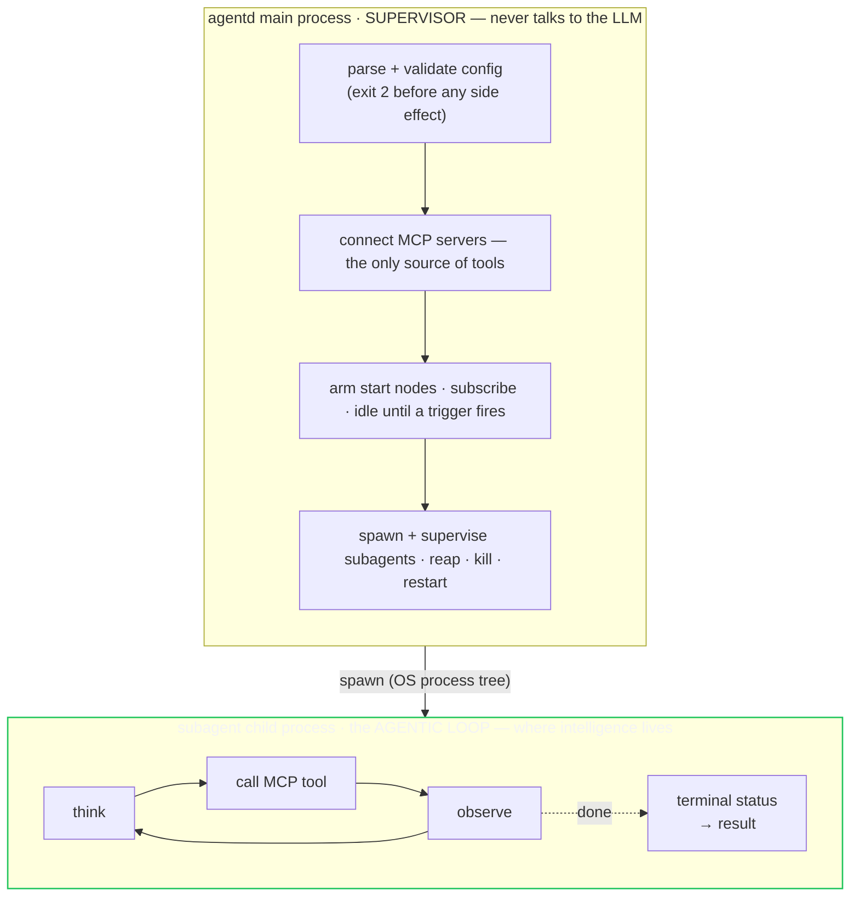

# Getting started with agentd

`agentd` is a small, dependency-light Rust binary that runs **one agent**. You
give it an instruction and a way to reach an LLM, and it runs an agentic loop —
think, call tools, observe, repeat — until the job is done or a new event wakes
it. Every task tool it can call comes from an **MCP server**; agentd ships none of its
own and runs no local code. It reaches exactly **one** LLM endpoint, the
*intelligence*. And it reacts to the world through **MCP resource
subscriptions** — a resource changing upstream is what triggers a run.

This page gets you from a checkout to a first end-to-end run, then shows the same
instruction as a recurring **loop** and a **reactive** daemon. For the full knob list see
[configuration.md](configuration.md); for how triggers and modes work in depth
see [modes-and-triggers.md](modes-and-triggers.md). The architecture is in
[architecture.md](architecture.md).

## Install / build

The fastest path is the installer — it picks the right architecture, verifies
the release `SHA256SUMS`, and installs to `/usr/local/bin` (or `~/.local/bin`
when that is not writable). It never invokes sudo for you:

```console
$ curl -fsSL https://agentd.dev/install.sh | sh
$ agentd --version
```

`install.sh --help` covers pinning a version (`--version v2.0.0`) and choosing
the directory (`--dir ~/bin`). Release binaries are Linux/musl, amd64 and arm64;
**`exec` is not compiled into them** — it needs the source build below.
Everything else, including the `cel` expression guards, ships.

Building from source: agentd is a single Cargo crate in a workspace. The build
is pure Rust — no C toolchain, no `cmake` — and needs Rust 1.96 or newer. What
it produces is one static binary.

```console
$ git clone <repo> agent && cd agent
$ cargo build -p agentd-cli --release
    Finished `release` profile [optimized] target(s)
$ ./target/release/agentd --version
agentd.0
```

The result is **one static binary** that starts fast, idles cheaply, and drops
into a container or a VM. The same binary is also the subagent: when a parent
spawns a child, it re-execs `argv[0]` in subagent mode — there is no second
artifact to ship.

### Optional features

The default build links `tls` (the `https://` transport with bundled roots) — the
only transport agentd uses. Turn on the rest only when you need them (each is gated
so it never weighs down a minimal build):

```console
$ cargo build -p agentd-cli --release                                  # default: tls (https)
$ cargo build -p agentd-cli --release --features a2a                   # + the A2A listener
$ cargo build -p agentd-cli --release --features a2a,cron,metrics,otel  # + scheduling, metrics, OTLP traces
```

To keep TLS out of the binary entirely, terminate it at a same-host sidecar and
point agentd at it over a **loopback `http://`** endpoint (`--no-default-features`).

### Minimal container

The binary needs nothing but libc (or build fully static for `FROM scratch`).
A minimal image is just the binary — MCP servers are **remote HTTP endpoints**, so
they are not bundled into the agentd image:

```dockerfile
FROM rust:1-bookworm AS build
WORKDIR /src
COPY . .
RUN cargo build -p agentd-cli --release

FROM debian:bookworm-slim
COPY --from=build /src/target/release/agentd /usr/local/bin/agentd
ENTRYPOINT ["agentd"]
```

All configuration is env-settable (12-factor), so the container takes its
instruction, intelligence endpoint, and MCP servers entirely from the
environment — see [configuration.md](configuration.md).

---

## The 60-second mental model

Two loops, deliberately separated:



Three facts are the whole design:

1. **The supervisor never reasons.** It owns lifecycle, triggers, the process
   tree, and limits. It has no LLM dependency, so it stays tiny and robust; a
   runaway or crashing model is always isolated in a child the supervisor can
   `SIGKILL`.
2. **MCP is the only tool source.** agentd ships no `fs`/`http`/`shell` tool
   library and runs no local code. Want a capability? Connect an MCP server with
   `--mcp`. Its only built-in tools are its self/control primitives (spawn a
   subagent, subscribe, run a graph).
3. **One intelligence endpoint.** A single LLM endpoint named by a URI in
   `--intelligence` — `https://` (or a loopback `http://` for a same-host dev
   gateway). This is the LLM wire, not MCP; the two are different channels.

Output discipline: **stdout carries the agent's result; stderr carries
JSON-lines telemetry.** This holds for a one-shot run and is the convention every
example below relies on.

---

## A first one-shot run, end to end

The default mode is `once`: run the instruction to a terminal status, print the
result on stdout, exit. Here we give the agent a filesystem MCP server and ask it
to do something with a file.

```console
$ agentd \
    --instruction "Read /data/report.md and write a 3-bullet summary to /data/summary.md" \
    --intelligence https://gw.example/v1 \
    --mcp fs=https://mcp-fs.internal/mcp
```

Three things are wired here:

- **`--instruction`** — the task. (Use `--instruction-file <path>` to read it
  from a file, or set the `INSTRUCTION` env var.)
- **`--intelligence https://gw.example/v1`** — the LLM endpoint. A direct provider
  is `--intelligence https://api.openai.com/v1/...` with `--intelligence-token`; a
  same-host gateway sidecar is `--intelligence http://127.0.0.1:4000/v1` (loopback
  `http://` is the only plaintext allowed). Any other scheme — or a non-loopback
  `http://` — is rejected at startup with exit 2.
- **`--mcp fs=https://mcp-fs.internal/mcp`** — declare an MCP server named `fs`. The
  value is `name=<endpoint>`; agentd connects to that **remote Streamable-HTTP MCP
  endpoint** (it spawns no process) and discovers its tools via `tools/list`. Repeat
  `--mcp` for more servers; declare per-server auth headers in the config file.

### Read the telemetry (stderr) and the result (stdout)

On stderr you get one JSON object per line. The run threads a
`proc.start`, the loop's tool calls, and a terminal `proc.exit` — all stamped
with the same `run_id`, `agent_id`, `agent_path`, and `comp` correlation tuple:

```jsonc
{"ts":"2026-06-25T11:18:02.796Z","level":"info","event":"proc.start","run_id":"19efe80512c1a9184","agent_id":"sup","agent_path":"0","comp":"supervisor","pid":1741188,"version":"1.0.0","mode":"once","mcp_servers":1,"subscribe":0}
{"ts":"...","level":"info","event":"mcp.connect","run_id":"19efe80512c1a9184","agent_id":"sup","agent_path":"0","comp":"mcp","server":"fs"}
{"ts":"...","level":"info","event":"tool.call","run_id":"19efe80512c1a9184","agent_id":"a1","agent_path":"0.1","comp":"agent","server":"fs","tool":"read_file"}
{"ts":"...","level":"info","event":"tool.call","run_id":"19efe80512c1a9184","agent_id":"a1","agent_path":"0.1","comp":"agent","server":"fs","tool":"write_file"}
{"ts":"...","level":"info","event":"proc.exit","run_id":"19efe80512c1a9184","agent_id":"sup","agent_path":"0","comp":"supervisor","status":"completed","code":0}
```

`agent_path` is the cheap subtree-query trick: it is the agent's position in the
process tree (`0` = supervisor, `0.1` = first child), so filtering logs by an
`agent_path` prefix selects a whole subtree with no backend join. Secrets never
appear — the intelligence token prints as `***` and is kept out of every log line
and the model transcript.

On **stdout** you get just the distilled result:

```console
Wrote /data/summary.md (3 bullets). Source: /data/report.md (1,840 words).
```

The exit code is the agent's terminal status mapped to a number, so a script or
an external scheduler can branch on it:

| Terminal status | Exit code |
|---|---|
| `completed` | 0 |
| partial result usable | 3 |
| intelligence unreachable / auth failed | 4 |
| `refused` | 5 |
| a required MCP server is down | 6 |
| budget hit (`exhausted_steps`/`exhausted_tokens`/`deadline`) | 7 |
| supervisor hard-kill backstop (a child that won't self-terminate) | 124 |
| bad config (validation) | 2 |

Every run is bounded by limits you can tune — `--max-steps` (default 50),
`--max-tokens` (default 200000), and `--deadline` (default 600s) — so a confused
or runaway loop can never burn unbounded cost. See
[configuration.md](configuration.md) for the full list.

### Status: what runs today

The runtime is fully implemented and runs the command above end to end:
`--help` and `--version` exit 0; invalid config exits **2** in milliseconds with
an `agentd: …` message on stderr; valid config parses, logs `proc.start`, runs
the agentic loop, and exits on the agent's terminal status (see the exit-code
table above).

---

## The same instruction as a `loop`

A **loop** re-runs the agent on a timer — the shape for a polling or
continuously-working agent. It is a workflow with a **`loop` start node**; the
run is durable, and the loop's iteration state survives a restart:

```yaml
# poll.yaml
config_version: "1"
intelligence: { endpoints: https://gw.example/v1, model: my-model }
store: { kind: mcp, mcp: { server: state } }
mcp:
  servers:
    - { name: fs,    endpoint: https://mcp-fs.internal/mcp }
    - { name: state, endpoint: https://mcp-state.internal/mcp }
workflows:
  - name: poll
    steps:
      s: { kind: loop, interval: 5m, max_iterations: 288 }   # every 5m; stop after a day
      w: { kind: agent, depends_on: [s], instruction: "Check /data/inbox; process each file into /data/done." }
      f: { kind: finish, depends_on: [w] }
lifecycle: { run_until: drained }
```
```console
$ agentd --config poll.yaml
```

- **`every: 5m`** is the cadence; `every: 0` re-runs immediately on completion
  (work-until-done). `max_iterations`, `until` (a CEL condition), and `backoff`
  bound it; a `SIGTERM` drains it. A healthy idle loop backs off rather than
  spinning hot — a `Deployment`-shaped workload.

---

## The same instruction, reactive — a `subscribe` start node

Instead of polling, an agent can **idle at near-zero CPU and wake when an MCP
resource it subscribed to changes**. That is a **`subscribe` start node**:

```yaml
workflows:
  - name: react
    steps:
      s: { kind: subscribe, server: fs, uri: "file:///data/inbox" }
      w: { kind: agent, depends_on: [s], instruction: "Process the new inbox item into /data/done." }
      f: { kind: finish, depends_on: [w] }
```

- The runtime issues MCP `resources/subscribe` for the URI (gated on the server
  advertising `resources.subscribe`), then idles. On
  `notifications/resources/updated{uri}` it **re-reads** the resource
  (notify-then-read — the notification carries only the `{uri}`) and fires a run;
  bursts are **debounced and coalesced** (newest-wins).
- Subscribe to **concrete URIs**, not templates — enumerate via `resources/list`
  and add one `subscribe` node per URI.

> **Scope notes.** The external channel is **A2A** (`a2a.listen`) — an HTTPS
> listener with mTLS/bearer **principals** and a role matrix. agentd is an MCP
> *client* only; it serves no MCP surface of its own, so nothing reaches in over
> MCP. Subagents are flat-tree leaves: the process tree is one generation of
> children under the supervisor, with no hierarchy to walk.
> The workflow engine is always compiled in. MCP tasks, sampling and roots are
> not implemented, and agentd declares no client capability for them — a server
> request for one is dropped rather than answered.

---

## Talk to it instead of driving it

Everything above is agentd as a *job*: config in, result out. To work *with*
the agent — a conversation, approvals, watching what it does — attach a client:

```console
$ agentd tui --config agent.yaml       # daemon + terminal UI, one command
$ agentd ui  --config agent.yaml       # …or the browser
```

The subcommand turns the display surface on for you (it is off by default) and
ties the two lifetimes together. Keep them separate — `agentd --config …` in
one shell, `agentd-tui --endpoint http://127.0.0.1:8420` in another — and
quitting the client leaves the agent working, because the **daemon** owns the
session, not the client. Attach a second surface any time; they all render the
same live state.

The clients live in [`interface/`](../interface) and are not part of the Rust
build: `npm install -g @agentd-dev/cli` (one package, both binaries), or build
from source with `cd interface && npm install && npm run build`.

## Where to go next

- **[interface.md](interface.md)** — the TUI and web UI: screens, the composer
  (`/` commands, `@skill`, `#target`, `$value`), approvals, pairing-code login,
  debug mode.
- **[coding-agent.md](coding-agent.md)** — the full recipe for a
  pair-programming agent on a repository: giving it hands (`exec` vs MCP),
  approvals, budgets, and the practices that keep it safe.
- **[configuration.md](configuration.md)** — every flag and env var, precedence
  (`default < config file < env < flag`), limits, secrets, exit codes.
- **[modes-and-triggers.md](modes-and-triggers.md)** — the lifecycle
  (`lifecycle.run_until`) and workflow start-node triggers as exit predicates,
  reactive routing (exactly-one-owner, spawn-vs-continue, debounce/coalesce),
  self-subscribe, and `schedule`/cron.
- **[architecture.md](architecture.md)** — how the supervisor, the reactor, the
  child loop and the durable store fit together.
