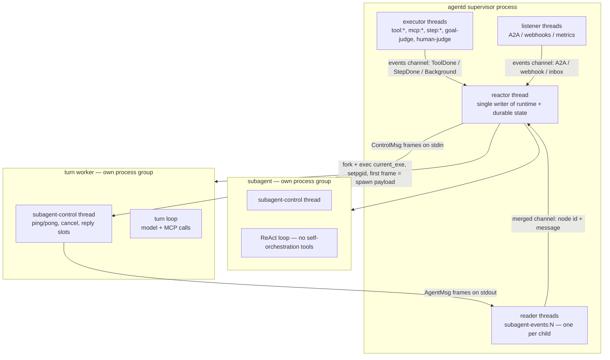
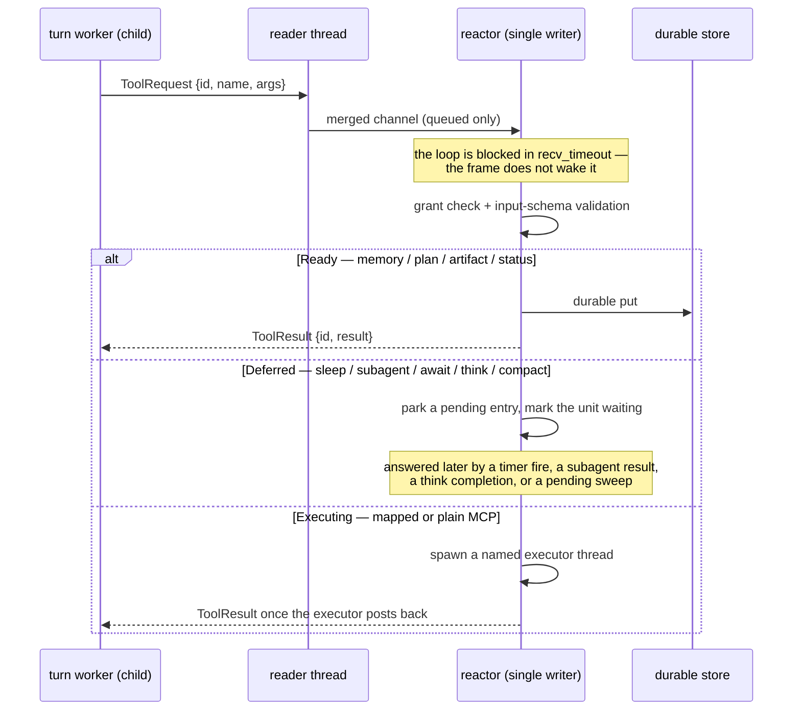
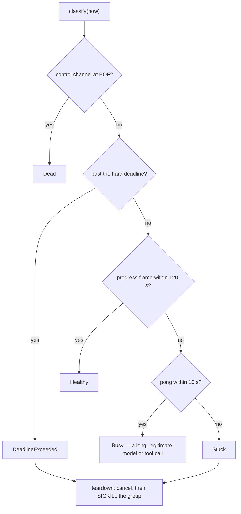
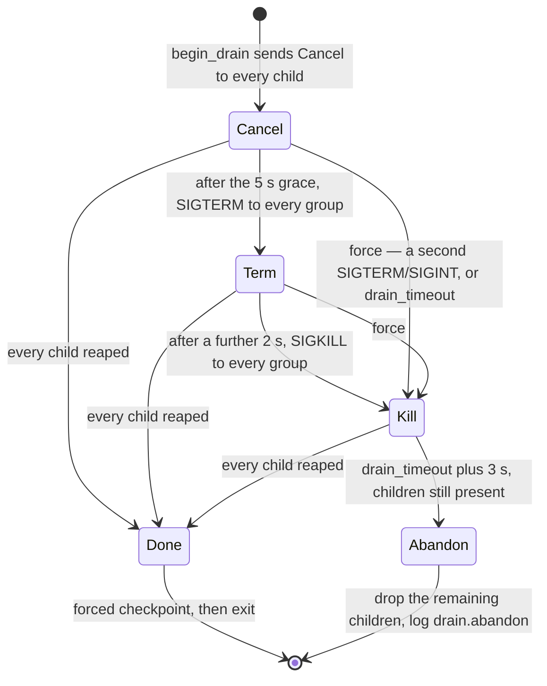
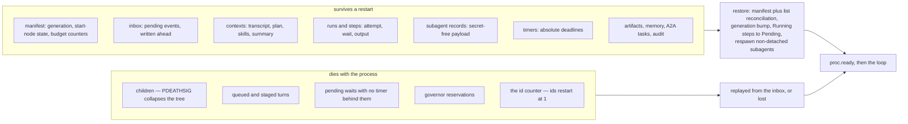

# The harness: a supervisor that cannot be prompted

An agent is a loop that reads text and decides what to do next. That makes every limit
you express *to* the model negotiable: a budget in the system prompt is a suggestion,
"do not spawn more than three helpers" is a sentence someone else's web page can argue
with, and a loop wedged inside a 40-minute model call cannot be talked out of it at
all. The only limits that hold are enforced by code that never reads the model's
output as instruction.

agentd splits the agent into a **harness** and a **mind**. The harness is a
single-threaded reactor process owning every piece of mutable and durable state —
lifecycle, admission, budgets, the inbox, checkpoints, the process tree. The mind runs
in short-lived child processes the harness forks, watches, starves, and kills. They
talk over a private length-framed pipe, and nothing the model produces reaches the
harness as anything but data.

## The containment problem

Four things go wrong in an agentic loop, and only one is a bug you can fix in a
prompt.

- **Spend.** A loop that keeps calling a model bills you until something stops it.
- **Non-termination.** A model re-issuing the same tool call is not crashed; it is
  working, forever.
- **Wedging.** A worker blocked in a TLS read on a dead socket has no future to cancel
  and no callback to run. Cooperative cancellation requires cooperation.
- **Persuasion.** Tool output is untrusted input. Anything the agent reads can try to
  talk it into ignoring its own instructions.

Each has the same shape: the component that must be stopped is the one you would be
asking to stop itself. So enforcement lives where the agent cannot reach it — another
process, holding different capabilities, that never calls a model on its behalf.

## Two loops, one binary

| | Supervisor loop | Agentic loop |
|---|---|---|
| Lives in | the main process, one thread | each child process |
| Talks to the model | never, for agent work | always — it *is* the reasoning |
| Owns | lifecycle, config, triggers, the inbox, durable state, budgets, the process tree, liveness, reaping | think → call a tool → observe → repeat |
| Shape | a reactor blocking on a merged channel | a straight-line state machine |
| Stopped by | a signal | `killpg` |

The supervisor is deliberately stupid. It decides *when* work runs and *that* it
stays inside its limits; it never decides what the work should be.

One caveat for the threat model: the supervisor *process* does dial the model in two
places — the goal watchdog judge and the human auto-judge, each on a detached thread
folding a verdict back as a background event. Neither can call a tool or mutate state.
"The supervisor never talks to the LLM" is true of agent work and tool calling, not of
every thread in the process.

## The process tree

Every turn worker and every subagent is a **direct child of the supervisor**. The tree
is flat: one map keyed by node id, no in-child spawning. A subagent gets an empty
self-tool handler, and the registry grants `subagent.*` to the root and to workflow
steps only — so it cannot delegate at all, in-child or by round trip. Delegation stays
the reactor's job. Node ids come from a per-process counter and are never persisted;
they name a live child, not a durable entity.



### Why re-exec, not threads

A child is the *same binary* re-executed with `AGENT_SUBAGENT=1`. `main` checks that
variable and jumps to the subagent entry point before parsing any CLI configuration;
the child receives its whole configuration from the first frame on its stdin. One
artifact ships, with no second code path to keep in sync.

Threads would have been cheaper. Three reasons, in priority order:

1. **Cancellation is `SIGKILL`.** A process group can be killed unconditionally from
   outside; a thread cannot. This is the decisive argument — the only mechanism that
   works against a worker wedged in a syscall — and it is why agentd runs no async
   runtime. Cooperative cancellation does not solve agentd's cancel problem.
2. **Crash isolation.** The reasoning is the volatile part: it can panic, OOM, or run
   away. In a child, none of that reaches the supervisor, which stays small because it
   has no model dependency.
3. **The OS does the work.** Isolation, resource accounting, and observability (`ps`,
   `pstree`, cgroups) come from the kernel, not from machinery agentd would have to
   audit. The process tree *is* the agent tree.

### The spawn sequence

Spawning is one atomic block, held under a process-global routes mutex so the reaper
can never `waitpid` a child that is not yet registered:

1. `Command::new(current_exe())` with `AGENT_SUBAGENT=1`, stdin and stdout piped,
   stderr **inherited** — the child's JSON telemetry flows into the parent's stream,
   leaving stdout for binary frames.
2. `pre_exec` → `setpgid(0, 0)`, making the child its own process-group leader. The
   recorded pgid is the child's pid; that is what lets `killpg` take out a subtree.
3. `spawn()`, retrying `EAGAIN` up to 10 times with a 20 ms × attempt backoff (about
   1.1 s total). A kernel refusing a fork under pressure is transient — a wide fan-out
   hits it routinely — so it is retried, not surfaced.
4. If cgroups are armed, create the leaf and write the pid into `cgroup.procs`.
5. Write the spawn payload as the first framed message on the child's stdin.
6. Start a reader thread named `subagent-events:<node>`.
7. Register pid → the owner's reap channel.

The child installs `PR_SET_PDEATHSIG(SIGKILL)` as the very first thing in its `main`
— it cannot be inherited, because `execve` clears it — and exits immediately if it
finds `getppid() == 1`, meaning the supervisor died during the fork/exec window.

### The wire

The supervisor↔child protocol is a private JSON-RPC sibling — no MCP handshake — with
a 4-byte big-endian length prefix so payloads containing newlines survive intact.
Frames cap at 16 MiB. Control messages go down (`Spawn`, `Ping`, `Cancel`,
`Pause`/`Resume`, `Inject`, `ToolResult`, `BudgetGrant`); agent messages come up
(`Ready`, `Pong`, progress events, `Usage`, `ToolRequest`, `BudgetRequest`,
`TurnDone`).

Inside the child the control reader runs on its own thread, which keeps `Ping` →
`Pong` and `Cancel` flowing while the agentic loop is blocked in a 30-minute model
call. The supervisor can tell "busy" from "wedged" precisely because answering it does
not require the loop to be free.

## What the supervisor owns, and what it refuses to

The rule: **all mutable state lives in the reactor, and the reactor is the only
writer.** Executor threads, listeners, judges, and child readers can only *send* on an
mpsc channel.

That divides a turn cleanly. A worker calls **MCP tools itself**, with its own
connections and per-call idempotency key — those are outbound effects, not state. Every
**internal** tool (memory, plan, artifacts, status, `subagent.run`, `sleep`, `think`,
compaction) round-trips to the supervisor, which checks the registry grant for that
caller class, validates arguments against the tool's input schema, and mutates.



## Reaping: one `waitpid`, no reaper thread

There is exactly one `waitpid(-1, WNOHANG)` loop in the process, scoped so no stray
caller can invoke it. Each reaped pid is dispatched to the channel of whichever
component owns it; an unowned pid — an adopted orphan, an MCP server's child, an
`exec` child — is silently discarded.

There is deliberately **no reaper thread**. A continuous `waitpid(-1)` would steal exit
statuses from components that spawn and wait for their own children. Reaping runs only
while the reactor ticks, bounding detection latency to one tick.

`SIGCHLD` is not load-bearing: the reactor takes the flag, discards it, and runs the
reap loop unconditionally every tick. Signals do not queue, so a design depending on
delivery would lose children under load.

At startup the supervisor sets `PR_SET_CHILD_SUBREAPER` (best-effort, Linux only) so
grandchildren orphaned by a dying child reparent into agentd's reaping domain rather
than escaping to init.

## Liveness: telling busy from wedged

Each child carries a liveness tracker with an absolute deadline of `spawn + launch
deadline + 60 s`. Every ping interval the supervisor broadcasts `Ping { seq }` to every
child on a shared, increasing sequence; the returned `Pong` is never correlated against
it, because only its arrival time matters. Any non-`Pong` frame counts as *progress*
and refreshes both clocks.



| Knob | Default | Override |
|---|---|---|
| progress timeout | 120 s | `AGENTD_PROGRESS_TIMEOUT_MS` |
| pong timeout | 10 s | `AGENTD_PONG_TIMEOUT_MS` |
| ping interval | pong ÷ 3, clamped to 50 ms…5 s (≈3.33 s) | derived, not configured |
| per-child hard deadline | spawn + launch deadline + 60 s | from the turn/step deadline |

`Dead` never comes from this classifier in practice: EOF is recorded only after the
child has been reaped, so process death is detected by the reaper, not by the tick.

## The kill ladder

Teardown escalates on a fixed, clock-injected state machine. The timing logic is pure
and unit-tested; the signalling is a thin `killpg` guarded to `pgid > 1`, so the
supervisor can never signal its own group or init.



| Stage | When | Action |
|---|---|---|
| Cancel | t = 0 | `Cancel` frame to every child; new spawns blocked |
| Term | t + 5 s | `killpg(SIGTERM)` on every remaining child |
| Kill | t + 7 s | `killpg(SIGKILL)` on every remaining child |
| Force | second signal, or `lifecycle.drain_timeout` (default 25 s) | collapse straight to SIGKILL, issued once |
| Abandon | drain timeout + 3 s | drop the remaining children, force-checkpoint, exit |

Worst case is **28 s** with the default drain timeout. That must stay below your
orchestrator's `terminationGracePeriodSeconds`, or the kubelet's SIGKILL lands first
and you lose the final checkpoint.

Two things about the ladder are commonly assumed wrong. **It is for drain only** — one
ladder covers the whole child set. And **an individually unhealthy child gets no
graceful wind-down**: on a `Stuck` or `DeadlineExceeded` verdict the reactor sends
`Cancel` and SIGKILLs the process group *in the same tick*, since the guard that would
delay the kill requires a child younger than a second — which a teardown verdict can
never be.

The exit-code contract is stable and machine-actionable:

| Code | Meaning |
|---|---|
| 0 | success — completed one-shot, or a clean SIGTERM drain |
| 1 | generic failure |
| 2 | config or usage error |
| 3 | partial result |
| 4 | intelligence unreachable or auth-failed after retries |
| 5 | refused — the task cannot be done |
| 6 | a required MCP server failed to connect or died |
| 7 | budget exceeded |
| 124 | hard wall-clock deadline |
| 137 / 143 | SIGKILL / SIGTERM — set by the kernel, never by agentd |

A clean drain exits **0, not 143**.

## Admission: spawn rate, breadth, depth, memory

A `subagent.run` request passes an ordered gauntlet before any fork happens: non-empty
instruction → a valid `mode` (`sync`|`async`|`detached`|`warm`) → live breadth →
lifetime total → delegation depth → spawn rate → memory pressure → the lethal-trifecta
tag check over the narrowed server set. Depth is derived from the *requester's stored*
record, never read from the request — a child cannot claim to be shallower than it is.

```yaml
config_version: "1"

limits:
  subagents:
    depth: 3            # delegation depth
    breadth: 8          # live at once
    total: 64           # for the instance's lifetime (the registry is durable)
    rate: "8/2s"        # burst 8, refilling 8 ÷ 2 = 4 tokens per second
  run:  { steps: 500, tokens: 2000000, deadline: 1h }
  step_timeout: 10m

agent:
  max_parallel_turns: 4
```

The rate string is `"<burst>/<period>"`, parsed into a token bucket refilling at
`burst ÷ period` — lazily on each attempt, against an injectable clock, so it is
deterministic under test.

Turn dispatch is governed separately: a context is *busy* if any root turn or think
child names it, which serialises turns per conversation, and only root turns count
toward `agent.max_parallel_turns`. One asymmetry: cgroup memory backpressure — at
≥95 % of `memory.high` — refuses new subagents as a tool result, but does **not** gate
turn dispatch.

## cgroup limits

cgroup containment is opt-in and best-effort at every layer. At startup
`security.cgroup` resolves a parent (`auto` — the process's own cgroup plus `/agentd` —
or an absolute path validated component-by-component to sit under `/sys/fs/cgroup` with
no `..`), probes writability, sweeps stale `run-<pid>-*` leaves from crashed prior lives
(only where the owning pid is dead, so a live sibling's survive), and delegates the
controllers the limits need — each with its own `cgroup.subtree_control` write, so a
partially-capable parent still gets what is achievable.

```yaml
security:
  cgroup:
    spec: auto
    memory_max: 2G     # needs the memory controller delegated
    pids_max: "512"    # a string, like memory_max — and it counts THREADS
```

Every spawn creates a leaf named `run-<supervisor pid>-<counter>`, applies the limits,
and writes the child's pid into `cgroup.procs`. Membership inherits across every fork
the child makes, so it cannot escape its leaf by forking.

Teardown is the guard's `Drop`: write `cgroup.kill`, an atomic SIGKILL of the whole
subtree, then rmdir with 5 retries at 10 ms. `cgroup.kill` is the backstop for
processes that escape the *process group* via `setsid()`; a live test forks a child,
`setsid()`s it, places it in the leaf, and asserts it dies of SIGKILL.

Be clear-eyed about the failure mode: no `security.cgroup` means no leaf; an unwritable
tree silently disarms the feature; undelegated controllers make the `memory.max` /
`pids.max` writes no-ops while `cgroup.kill` teardown still works. The
`limits_unavailable` field in the `cgroup.armed` log line is the only signal that a
requested limit is not in force.

## Budgets: reserve, then settle

Budgets are enforced at dispatch, not inside the model client, and against *durable*
counters. The reactor estimates the turn — the context's estimated tokens, plus an
estimate of the system prompt, plus a fixed 4096-token completion allowance — and
calls the governor, which rolls every window to the current index, checks sub-scopes
before the instance, and returns one of four verdicts:

| Verdict | Meaning | Effect |
|---|---|---|
| `Ok` | admitted, possibly on a degraded model | reserve the estimate in every window, return a reservation id |
| `Wait` | come back later (`wait` / `slow`) | re-queue the job and record it as waiting |
| `Refuse` | declined (`refuse`) | drop the turn, note it in the context, ack the inbox event; a step finishes `failed` |
| `Fail` | fail the unit (`fail`, or the lifetime ceiling) | handled identically to `Refuse` at every call site — only the tactic behind it differs |

```yaml
intelligence:
  endpoints: [https://llm.internal/v1]
  model: my-model
  token: "{{secret:LLM_KEY}}"     # a reference, never the value
  budget:
    windows:
      - { per: hour, tokens: 2000000 }
      - { per: day,  tokens: 20000000, reset: "06:00Z" }
    lifetime_tokens: 500000000
    on_exhausted: degrade
    degrade: { model: my-small-model }
```

When `TurnDone` arrives the reservation is **settled**: the estimate is subtracted from
`reserved` and the child's *reported* usage added to `tokens` — replaced, never
accumulated. On failure or a spawn error it is **released** untouched. Subagent usage is
charged directly, with no reservation, because there is no estimate to correct. Per-call
`BudgetRequest`s from inside a turn are admitted and immediately released, so they gate
without double-counting; a wait carries a delay clamped to 100 ms…60 s.

Windows are fixed and unit-aligned, with a calendar reset offset (`HH:MMZ`, default
`00:00Z`) and a Monday epoch shift for weeks. The counters live in the durable manifest
and are re-adopted at startup, so **a restart cannot re-open a spent daily window**.

Reservations, by contrast, are process-local and deliberately not serialised. A leaked
one is invisible in the durable counters: it inflates `reserved` until the window rolls.
If you see "budget exhausted" alongside low reported usage, look at reservations, not
at the manifest.

## The single-writer loop

Everything above meets in one loop, in one strict order, every 200 ms or sooner:

1. Stamp the health heartbeat.
2. Drain child frames.
3. Take and discard the SIGCHLD flag, reap, dispatch the results.
4. Drain executor and listener events.
5. Fire due durable timers.
6. Process the inbox.
7. Poll start nodes, suspended waits, and runnable steps.
8. Dispatch turns.
9. Poll pending tool waits and MCP notifications.
10. Ping children and classify liveness; tear down the unhealthy.
11. Checkpoint dirty state; publish gauges and the interface feed diff.
12. Check signals; run the lifecycle step, which may exit.
13. Block on the event channel until the nearest deadline, capped at the tick.

The ordering is the contract. Reaping precedes inbox processing, so a child's exit is
visible before its work is reconsidered. Timers fire before start nodes, so a durable
sleep resolves in the same pass that could re-arm it. Checkpointing precedes the
lifecycle step, so nothing exits with unflushed state. The blocking wait is bounded by
the nearest imminent deadline, clamped to the 200 ms tick, with a 5 ms floor and a
50 ms ceiling while anything is pending.

**Inbox events are write-ahead durable before they are queued in memory**, so nothing
enters the runtime that has not already survived a crash. While draining, the reactor
pushes the event it popped back onto the front of the queue and stops intake. An
A2A message is acknowledged only when its turn finishes; signal and unknown kinds are
acknowledged immediately, and a start event as soon as its run is admitted — one held
off by a concurrency overflow stays queued.

Two costs follow. **Child frames do not wake the loop** — they queue on a channel the
blocking wait does not select on, so an internal-tool round trip costs up to one tick
of added latency. And **store I/O is synchronous on the reactor thread**, retrying with
a blocking 50 ms × attempt backoff up to 3 times, so a degraded store stalls timers,
liveness, drains, and reaping alike. The `/healthz` heartbeat age is the sole input to
the liveness verdict; a large age means the reactor is wedged.

## Checkpoints and crash recovery

A checkpoint runs every tick and writes only dirty runs, contexts, and subagent
records. The manifest write is debounced (250 ms by default) and forced at drain and
idle exit.

Every durable write is a compare-and-swap by sequence number: `put` allocates
`last_seq + 1`. A conflict on a key this instance already owns is **fatal** — a second
writer exists, and the harness would rather die than interleave. A conflict on a
first-touch key adopts the stored sequence once and retries; that is the normal restore
gap. A checkpoint failure is itself a halting condition: unless the store is configured
to degrade, it sets the exit code and the next lifecycle step drains.



Restore reads the manifest, fetches every indexed entity, then reconciles against a
`list` to pick up entities written after the last flush and drop entities that
vanished — which is what makes entity-first write ordering safe. It then bumps the
generation and force-flushes.

The runtime then adopts what it read. Any step left `Running` is reset to `Pending`
with its worker cleared, and the run forced back to `Running`. Subagents are re-spawned
from their stored payload with `attempt + 1` and a freshly resolved credential — the
payload is scrubbed of the intelligence token, so the durable record alone cannot
reproduce a run offline. Detached and terminal subagents are not re-spawned. **Turn
workers are never re-spawned**; their durable inbox event replays instead.

Debug builds compile in test kill points: `AGENTD_TEST_KILL_AT=<seam>` SIGKILLs the
process at `state.before_put`, `state.after_put`, `inbox.after_put`, `step.running` or
`wait.armed`, exercising recovery *between* two durable writes.

## Failure modes

Accepted by design:

- **Latency at the round trip.** Up to one tick per internal tool call, and one before
  a SIGTERM is noticed.
- **A stalled store stalls everything.** No second thread ticks while it retries.
- **Ids are process-local.** The counter resets at startup, so after a restart `sub-1`
  is minted again and can overwrite a restored record, and a conversation-turn
  idempotency key can be reused. Workflow steps are unaffected — ULID run ids and a
  durable attempt counter.
- **A replayed step is not deduplicable server-side.** Replay bumps `attempt`, part of
  the MCP `_meta` idempotency key, so the retry presents a *new* key. Make workflow
  steps idempotent on their own terms.
- **A schedule can double-fire across a crash.** The firing's inbox event is written
  synchronously; the start-node bookkeeping goes into the debounced manifest.
- **cgroup limits may silently not apply**, and **memory backpressure gates delegation
  only** — both covered above.

Known gaps, stated here rather than discovered later:

- **A hard-crashed turn worker does not fail its unit.** The "died without a terminal
  frame" path removes the child from the registry before its handlers look it up, and
  each early-returns on a missing child. A SIGKILLed, OOM-killed, or panicking worker
  leaves no context note, no inbox acknowledgement (the event replays next restart), a
  leaked reservation, and a `Running` step that unwinds only at the run deadline.
- **Killing a stuck child leaves a phantom entry.** The kill path reaps the child
  itself after deregistering its route, so no reap event is dispatched and the map
  entry is never removed. Idle-exit never fires again, every drain runs the full
  timeout, `child.unhealthy` re-fires every tick, and the cgroup leaf is not reclaimed.
- **A `context.compact` call parks a pending entry that nothing removes.** After one
  compaction the instance cannot idle-exit and the wake interval is pinned at 50 ms.
- **There is no crash-on-spawn fast-fail.** `Ready` only refreshes liveness; a child
  that dies during setup is caught by the reap path, which — per the first item — does
  not fail its unit.

## What it costs, and what it buys

The costs are real. Every turn is a fork and an exec of the full binary, plus a reader
thread, plus (when armed) a cgroup leaf; under pressure a fork can take about 1.1 s of
retries. This is not the design to pick if your unit of work is 50 ms long. The two
sides share no memory, so every internal tool call is a serialized JSON round trip
through a length-framed pipe, paced by the tick, with the transcript crossing as a
delta each turn. And state-mutation throughput is bounded by one thread that also does
its own store I/O.

What you get in return is the only property that matters when an agent misbehaves:
**the limits are outside the thing being limited.**

A runaway loop is stopped by `killpg`, not by asking it to stop. A process escaping its
group with `setsid()` is stopped by `cgroup.kill`. A wedged worker is caught by a
control thread that answers pings while the loop is blocked. A budget is enforced
against durable counters at a dispatch chokepoint, so a restart cannot re-open a spent
window. Memory and pid limits are kernel-enforced. Every event is durable before it is
acted on, and every crash recovers from a log, not from memory.

And the enforcement code has no model in it. There is no prompt you can write that
changes what the supervisor does, because the supervisor never reads one.

## See also

- [subagents.md](subagents.md) — the spawn payload, narrowed tool seeds, delegation.
- [configuration.md](configuration.md) — every knob named here, with precedence.
- [deployment.md](deployment.md) — drain choreography in an orchestrator.
