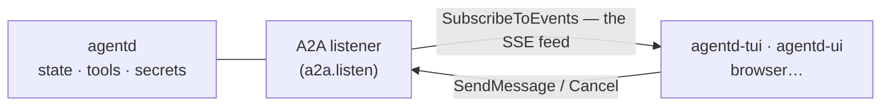

# The interface — TUI & web UI

agentd ships two **display clients** — a terminal UI and a web UI — built as
separate Node projects under [`interface/`](../interface). They are *thin* by
design: **agentd hosts all state, tools and secrets; the clients
only render daemon state and forward your intent.** Open both at once — plus a
colleague's browser — and every surface shows the same conversation, tasks and
runs, live, because each one watches the same daemon feed. None of them holds
any truth of its own.



## 1. Enable it

The interface is **off by default**. Turn it on in the config:

```yaml
a2a:
  listen: http://127.0.0.1:8420     # the interface rides the A2A listener
interface:
  enabled: true                     # serve the display-client surface
  debug: false                      # extra information (see §5)
```

With `enabled: false` the daemon serves no interface surface at all — the event
feed and the interface reads answer with a clear "the interface surface is
disabled" error, and nothing is buffered for them.

Auth is the A2A listener's: on a plaintext loopback listener with no
principals a local client is the **operator** with zero setup; a remote client
presents `a2a.bearer` / an mTLS identity and sees only what its role and
ownership allow.

## 2. One command: `agentd tui` / `agentd ui`

The passthrough runs the daemon **and** its display client together:

```sh
agentd tui --config code.yaml            # daemon + terminal UI
agentd ui  --config code.yaml            # daemon + web UI (opens the browser)
agentd tui --config code.yaml --debug    # …with the debug surface on
```

The subcommand forces `interface.enabled` on, redirects the daemon's log lines
to a file (the path is printed first; `AGENTD_INTERFACE_LOG` overrides), hands
the terminal to the client, and ties the lifetimes: quitting the client drains
the daemon gracefully; the daemon exiting closes the client. The client binary
is found on PATH (`npm install -g @agentd-dev/cli`, which ships both;
`AGENTD_TUI_BIN` / `AGENTD_UI_BIN` override).

## 3. Detached: connect to any running agentd

Run the daemon on its own and attach displays whenever you like:

```sh
agentd --config code.yaml                       # the daemon
agentd-tui --endpoint http://127.0.0.1:8420     # a terminal, any time
agentd-ui  --endpoint http://127.0.0.1:8420 --open   # a local web UI
```

- `agentd-tui` flags: `--endpoint` (or `AGENTD_ENDPOINT`), `--bearer` (or
  `AGENTD_BEARER`), `--code` (pairing login, §4.3), `--debug` (open on the
  debug screen), `--inline` (§3.1), `--insecure` (self-signed dev TLS).
- `agentd-ui` serves the built web app on `127.0.0.1:4173` (`--port`) with the
  endpoint pre-filled; `--open` launches the browser. The page also takes
  `?endpoint=…` and remembers your last connection.
- **Hosted web UI:** `interface/dist/web/` is a static site — deploy it
  anywhere, then allow its origin on each daemon it should reach:

  ```yaml
  interface:
    enabled: true
    origins: ["https://ui.example.com"]
  ```

  Loopback origins (an `agentd-ui` on the same machine) never need listing.
  Any other cross-site origin remains rejected (the DNS-rebinding guard).
- Connecting to a **remote** daemon is the same `--endpoint https://…` plus its
  bearer; everything a client can see or do is decided by the daemon's
  principal rules, not by the client.

### 3.1 Fullscreen (default) vs `--inline`

The TUI takes over the terminal — the **alternate screen**, like `vim` or
`htop` — so the layout is stable and your shell is restored untouched when you
quit. Since the alternate screen has no scrollback of its own, the client
owns it: **PgUp / PgDn** scroll the conversation, and a hint shows how many
messages are above the fold. New messages follow the live end unless you have
scrolled up, in which case your position holds until you PgDn back to the
bottom.

`agentd-tui --inline` (or `AGENTD_TUI_INLINE=1`) renders into the normal
buffer instead: settled messages go into your terminal's **real scrollback**
and stay there after you quit — handy for copying a session, piping, or
keeping the transcript in your shell history. A non-interactive run (a pipe,
CI) degrades to inline automatically.

## 4. The screens

Four screens, cycled with `Tab` (or jumped to with `/chat`, `/tasks`,
`/subagents`, `/debug`). The web UI has the same four as tabs.

Every frame below is **the real program** — rendered by the shipped TUI against
a mirror driven with daemon-shaped events, captured by
`interface/tools/frames.mjs`. They regenerate from the code, so they cannot
describe a screen the shipped client does not draw.

### Chat — talking to the agent

```tui
# agentd tui — chat
agentd 1.5.0 triage-1 debug
▌  Triage the newest issue
⠋ working
╭──────────────────────────────────────────────────────────────────────────────────────────────────╮
│ ›                                                                                                │
╰──────────────────────────────────────────────────────────────────────────────────────────────────╯
● live http://127.0.0.1:8420 1 active [chat] tab:screens esc:cancel /:cmd ^c:quit
```

The transcript shows every attached client's prompts (labelled by principal when
they are not yours), command invocations and replies, so two people watching one
agent see the same conversation. The line under it is the live activity: what
the daemon is doing *right now*, ticking its own clock. `Esc` cancels the newest
working task.

### Subagents — the tree, and control over it

A subagent is a real child process the supervisor owns. The list is live:

```tui
# agentd tui — subagents
agentd 1.5.0 triage-1 debug
  handle               mode        status      tokens   updated
▸ sa-review            supervised  running     4120     0s
  sa-lint              detached    failed      260      0s
↑/↓ select · enter details · tab next screen
● live http://127.0.0.1:8420 [subagents] tab:screens esc:cancel /:cmd ^c:quit
```

`↑`/`↓` selects, `Enter` opens it. The detail view is where the verbs are:

```tui
# agentd tui — subagent detail
agentd 1.5.0 triage-1 debug
subagent sa-review
status        running
mode          supervised
attempt       1
tokens        4120
instruction   Review the diff for correctness regressions and report findings.
requested_by  operator
m message · k stop · esc/backspace back · tab next screen
● live http://127.0.0.1:8420 [subagents] tab:screens esc:cancel /:cmd ^c:quit
```

- **`m` — message it.** Opens the composer pre-addressed to this subagent, so
  talking to a running child is one keystroke rather than a `/send <handle> …`
  you have to retype the handle into. Only a *warm* subagent can be messaged;
  the view says so when it cannot.
- **`k` — stop it.** The supervisor owns the process group, so this is a real
  kill rather than a request the child can decline. It asks first, because
  stopping is not undoable:

```tui
# agentd tui — confirming a stop
agentd 1.5.0 triage-1 debug
subagent sa-review
status        running
mode          supervised
attempt       1
tokens        4120
instruction   Review the diff for correctness regressions and report findings.
requested_by  operator
stop sa-review? y to confirm, any other key to cancel
● live http://127.0.0.1:8420 [subagents] tab:screens esc:cancel /:cmd ^c:quit
```

`instruction` and `result` need `interface.debug`; without it the view shows the
summary the feed carries and says which fields are missing and why.

### Debug — what the daemon is doing

```tui
# agentd tui — debug
agentd 1.5.0 triage-1 debug
feed
    1 run           {"id":"pipeline-01M0C0","workflow":"pipeline","status":"running","steps":"3/7"}
    2 step          {"run":"pipeline-01M0C0","step":"fetch","kind":"mcp.tool","phase":"start"}
    4 step          {"run":"pipeline-01M0C0","step":"triage","kind":"extract","phase":"start","atte…
    6 step          {"run":"pipeline-01M0C0","step":"notify","kind":"a2a.send","phase":"start"}
    3 step          {"run":"pipeline-01M0C0","step":"fetch","phase":"done","status":"done","tokens"…
    5 step          {"run":"pipeline-01M0C0","step":"triage","phase":"done","status":"done","tokens…
    7 subagent      {"handle":"sa-review","mode":"supervised","status":"running","tokens":4120,"upd…
    8 subagent      {"handle":"sa-lint","mode":"detached","status":"failed","tokens":260,"updated":…
runs
pipeline-01M0C0        running    3/7
  ◐ notify            a2a.send      running
  ● triage            extract       done      1.0s
  ● fetch             mcp.tool      done      140ms
subagents / children
sub sa-review          running    4120 tok
sub sa-lint            failed     260 tok
log (debug.events)
—
● live http://127.0.0.1:8420 [debug] tab:screens esc:cancel /:cmd ^c:quit
```

The feed is the raw observation stream, sequence-numbered. Under `runs`, each
run carries its **steps**: `◐` running, `●` done, `○` pruned (a branch nobody
took), `◌` waiting, `✗` failed — so a run that is stuck shows the step it is
stuck on, rather than a count that says three of seven and leaves you guessing
which three.

The web UI renders the same information with a severity stripe per row and a
master–detail split for subagents, so the list stays on screen while you read
one child — a tree is watched while it moves, and losing sight of the siblings
is exactly the wrong thing when a second one starts misbehaving.

## 5. Everything the clients can do


Both clients speak the same surface:

- **Chat** — natural-language turns with the agent. The transcript shows every
  attached client's prompts (labelled by principal when not you), command
  invocations, and the agent's replies; an `input-required` task renders as an
  answerable row, and a plain reply answers it. `Esc` cancels the newest
  working task.
- **The composer speaks four prefixes** (suggestions appear as you type; Tab
  accepts):
  - `/` — commands: `/help /new /chat /tasks /subagents /debug /status
    /config [path] /set <path> <value> /workflow <name> /signal <name> [run]
    /send <handle> <text> /pause [run] /resume [run] /plan /cancel [task]
    /conversations /pair /drain /quit` — **plus every workflow as a shortcut**
    (`/deploy` runs the `deploy` workflow; system names win).
  - `@` — **skills**: `@skill:release-notes` autocompletes from the daemon's
    catalogue and stays in the text (agentd preloads referenced skills). The
    completion inserts the full `@skill:` form because that is what the daemon
    matches on — `skills.reference_prefix`, default `@skill:`. A bare `@name`
    is ordinary prose and means whatever your deployment decides.
  - `#` — **targets**: start a message with `#task-…` to answer/continue that
    task (the way to answer a specific input-required question), or `#<ctx>`
    to address that conversation. Inline `#…` is plain text.
  - `$` — **live values**: `$model $instance $version $turns $tokens $tasks`
    interpolate daemon state into your message; `$$` escapes a dollar.
- **The working row** — while the agent is busy you see *what it is doing*,
  live: `⣾ thinking · 12s · 1.2k tok · round 2`, `⣾ read_file · 3s · 1.2k tok`,
  `⣾ waiting · subagent · 40s`. The daemon reports phase/tool/round/tokens on
  change; elapsed ticks in the client, so a long think costs no traffic. (This
  is deliberately not token-by-token streaming: one small event per phase
  change keeps every attached surface in sync for a fixed cost, where a token
  stream would multiply the daemon's outbound traffic by the number of
  watchers.)
- **Tasks** — every task your principal may see, live states, cancel.
- **Approvals & questions (human-in-the-loop)** — when the agent (or a
  workflow's `human` step) needs you, the transcript shows the question as an
  answerable row (`[reply to continue]`); just type your answer (it targets
  the newest gate; `#task-…` targets a specific one). Gates on workflow runs
  survive daemon restarts, addressee and answer schema included. A gate
  declaring `to:` is for a named decider: a reply from anyone else is refused
  with an explanation and the gate stays open, and an operator answering one
  is recorded as an override rather than as the addressee deciding. Configure
  what happens when NOBODY can answer with
  `agent.ask_human_fallback`: `fail` (default), `wait` (park until the ask
  timeout), or `auto` — an LLM judge answers on the operator's behalf,
  conservatively, always marked as auto (it also fires when a rendered gate
  times out unanswered).
- **Steering** — `/signal <name> [run]` fires a workflow signal;
  `/send <handle> <text>` messages a warm subagent; `/pause [run]` /
  `/resume [run]` hold one run or the whole instance (reversible — intake
  continues, execution parks; the status bar shows PAUSED); `/plan` reads a
  conversation's working plan.
- **Subagents** — the live list (handle · mode · status · tokens); select/click
  one for the detail view (instruction, result, attempts, errors — needs
  debug) and step back to the list. TUI: `↑/↓` + Enter, `Esc` back.
- The status bar shows the connection (`● live` = feed; `◐ polling` = a daemon
  without the feed — the clients degrade to polling automatically), counters,
  and a prominent DRAINING notice.

### 5.1 Configure the chrome (`interface.display`)

The **daemon** decides what its clients render in the top (header) and bottom
(status bar) edges — every attached surface lays out the same:

```yaml
interface:
  display:
    top: [name, model, instance, debug]
    bottom: [conn, tokens, turns, runs, subagents, clock]
```

Items: `name` `version` `instance` `model` `endpoint` `conn` `debug`
`draining` (the lifecycle notice — shows **DRAINING** or **PAUSED**) `active`
`turns` `tokens` `tool_calls` `runs` `subagents` `conversations` `screen`
`keys` `clock`. Unknown items are skipped (a warning
at config validation); `screen`/`keys` are TUI-only. Omit `display` for the
defaults. The layout is also **runtime-shapeable**:
`/set interface.display.bottom ["conn","model","tokens"]` re-shapes every
connected client at once.

### 5.2 Status values a workflow maintains (`memory:<key>`)

The chrome's vocabulary is fixed, because a client has to know how to render
each item. But a `memory:<key>` item renders whatever a **workflow** wrote to
that key — which makes the status line extensible without the daemon learning to
compute anything.

That distinction matters. agentd executes nothing locally, so it cannot shell
out to `git` to find your branch. It does not have to: a workflow reads the
value from wherever it actually lives — an MCP server, an HTTP endpoint, a
webhook — and writes it to a key the chrome names.

```yaml
interface:
  display:
    top: [name, model, "memory:git.branch", "memory:git.pr"]
    bottom: [conn, tokens, "memory:deploy.state"]

workflows:
  - name: repo-status
    steps:
      tick:   { kind: schedule, every: 30s }
      read:   { kind: mcp.tool, depends_on: [tick], server: git, tool: status }
      branch: { kind: memory.set, depends_on: [read], key: "git.branch",
                value: "{{ steps.read.output.branch }}", ttl: 2m }
      fin:    { kind: finish, depends_on: [branch], status: completed }
```

Two behaviours are deliberate:

- **An unset key renders nothing**, not an empty slot — a blank status reads as
  broken, an absent one reads as not-yet-filled.
- **TTL is honoured.** Give the key a TTL slightly longer than the schedule
  that refreshes it, and the slot empties when the workflow stops running. A
  branch name still sitting there after its producer died is worse than no
  branch name, because it looks current.

The same mechanism carries anything worth watching: a PR number, a deploy
state, a queue depth, an on-call name. The client renders the value without
knowing what it means.

### 5.3 Runtime settings (`/set`) — and their deliberate limit

`config.set` (operator) updates a whitelisted set of knobs in the running
daemon, no restart:

- `/set interface.debug true` — open up the debug surface live (and back off);
- `/set interface.display.top …` / `…bottom …` — reshape the chrome (§4.1).

Everything else answers with the whitelist and stays where it belongs: the
config file + SIGHUP hot reload (see configuration.md §11) — the daemon never
mutates config it doesn't own. `/config` prints the full effective document,
`/config a2a.listen` one value.

### 5.4 Pairing-code login (`interface.pairing`)

The no-copy way to connect a browser or a remote TUI:

```yaml
a2a:
  listen: http://127.0.0.1:8420   # the interface is served on this listener
interface:
  enabled: true
  pairing:
    enabled: true      # default off
    role: operator     # what a paired client becomes (operator | user)
    ttl: 12h           # session lifetime
```

Flow: the **operator** runs `/pair` in their TUI (or web UI) — it prints a
**6-digit code that rotates every minute** plus a ready-made connect command.
The joiner enters the code — `agentd-tui --endpoint … --code 483921`, or the
code field on the web connect form — and receives a **session token** used
automatically from then on. The code is only a bootstrap: verification is
constant-time and rate-limited (5 misses per minute lock it out), the minted
token is 32 bytes of OS randomness, and sessions live in memory — restarting
the daemon revokes everything. On a non-loopback listener, pairing counts as
client auth (you can run TLS + pairing with no static bearer at all).

## 6. Debug mode — the extra information

```yaml
interface:
  enabled: true
  debug: true        # or: agentd tui -c … --debug
```

`debug` is a **daemon-side** switch: clients learn it from `interface.info`
and only then render their debug screens. It unlocks:

- the **feed tail** — every observation event as it happens (tasks, messages,
  runs, subagents, audit records);
- **runs** with per-step detail (`run.get`: status, attempts, timings, errors,
  waits, outputs);
- **conversation transcripts** with message bodies (`conversation.get`) —
  the one read that exposes content, which is why it rides this gate;
- the **live log ring** (`debug.events`) — the daemon's own JSON-lines
  telemetry, tailed in the client.

Treat `debug: true` as operator-grade exposure; leave it off in production
unless you need it.

## 7. The protocol (for other clients)

Everything above is plain A2A JSON-RPC plus the interface additions below —
any program can be a display client:

- `SubscribeToEvents {fromSeq}` — the SSE feed: `hello` → `event`* → `goodbye`;
  reconnect with the goodbye cursor; `hello.resync` means re-bootstrap via the
  `status` command. Events are principal-scoped.
- Taskless reads (command DataParts): `interface.info`, and under debug
  `conversation.get`, `run.get`, `debug.events`.
- The reply to any prompt arrives as its task's terminal artifact on the feed —
  the same event every other client folds in.

The reference implementation is the shared TypeScript core in
[`@agentd-dev/cli`](../interface) (wire + state mirror + observation driver
with poll fallback, exported as the package's library entry point); both
shipped UIs are ~thin renderers over it.

## 8. Building the clients

```sh
cd interface
npm install
npm run build          # the client core + the TUI, then the web bundle
npm test               # unit + render tests
```

Node ≥ 20. One package, `@agentd-dev/cli`, provides both binaries
(`agentd-tui`, `agentd-ui`) and the client library. The clients are **not**
part of the Rust workspace or its release artifact, so the daemon keeps its
3-dependency default build.
