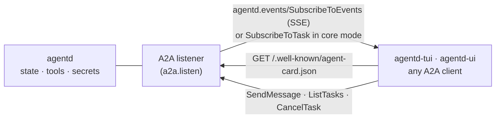

# The interface — TUI & web UI

agentd ships two **display clients** — a terminal UI and a web UI — in one Node
package under [`interface/`](../interface). They are *thin* by design: **agentd
hosts all state, tools and secrets; the clients only render what the daemon
says and forward your intent.** Open both at once — plus a colleague's browser —
and every surface shows the same conversation, tasks and runs, live, because
each one watches the same daemon. None of them holds any truth of its own.

Nothing about them is privileged. Each is an ordinary **A2A 1.0 client** of the
daemon's listener: it reads the Agent Card, sends `A2A-Version: 1.0`, speaks an
agentd extension only when the card declares it, signs in the way the card
says, and falls back to the core protocol when an extension is absent — so the
same client drives any A2A 1.0 agent, and any A2A client can do what these do
([a2a.md](a2a.md) is the listener's side of that contract).


```mermaid
flowchart LR
    D["agentd\nstate · tools · secrets"] --- L["A2A listener\n(a2a.listen)"]
    C["agentd-tui · agentd-ui\nany A2A client"] -- "GET /.well-known/agent-card.json" --> L
    C -- "SendMessage · ListTasks · CancelTask" --> L
    L -- "agentd.events/SubscribeToEvents (SSE)\nor SubscribeToTask in core mode" --> C
```

## What the daemon needs

A listener, and the two switches that decide how much the clients can show:

```yaml
a2a:
  listen: http://127.0.0.1:8420
  events:
    enabled: true          # the live feed the clients watch (restart-only)
  introspection:
    enabled: false         # transcripts, per-step run detail, the log ring (reloadable)
```

- **`a2a.events.enabled`** declares the events extension and serves its
  observation feed. Without it the clients still work, in [core
  mode](#events-mode-and-core-mode).
- **`a2a.introspection.enabled`** serves the reads that expose content and
  internals (see [Debug](#debug)). It is reloadable, and an operator can set
  it at runtime with `/set a2a.introspection.enabled true`.

Who may connect is the listener's business, not the clients': on a loopback
listener (http or https) with no credential configured, a local non-browser
process is the operator; everything else signs in (see [Signing in](#signing-in)). The
listener answers a web page only from an origin listed in `a2a.cors.origins`
([hosting-the-ui.md](hosting-the-ui.md)).

## Launcher

`agentd tui` and `agentd ui` run the daemon **and** one display client as one
command:

```sh
agentd tui -c code.yaml                       # the daemon + the terminal UI
agentd ui  -c code.yaml                       # the daemon + the web UI, opened in your browser
agentd ui  -c code.yaml --port 4180 --no-open # …on another port, sign-in URL printed instead
```

**The daemon runs exactly as `agentd <args>` would.** The launcher adds no
configuration key, flag or environment variable, and forces nothing on: the
feed needs `a2a.events.enabled` and the debug surface
`a2a.introspection.enabled` in your own configuration, as they would without
the launcher. Every argument that is not one of the launcher's own goes to the
daemon, which refuses one it does not know the way it always does —
`unknown argument: <flag>`, exit 2.

The launcher's own flags:

| Flag | Subcommand | Meaning |
|---|---|---|
| `--daemon-log PATH` | both | where the daemon's output goes (below) |
| `--port N` | `ui` | the loopback port the web UI is served on; default 4173, `0` picks a free one |
| `--no-open` | `ui` | print the sign-in URL on the terminal instead of opening a browser |

**The client.** `agentd tui` starts `agentd-tui` from `PATH`, or the binary
`AGENTD_TUI_BIN` names; `agentd ui` starts `agentd-ui`, or `AGENTD_UI_BIN`
(`npm install -g @agentd-dev/cli` provides both). It gets exactly this argv and
nothing else — never a credential:

| Subcommand | Client argv |
|---|---|
| `tui` | `--endpoint <url> --launch-fd 3` — fd 3 is a pipe holding the TUI's launch code |
| `ui` | `--endpoint <url> --listen-fd 3` — fd 3 is the socket the launcher bound on `127.0.0.1:<port>` |

A client that cannot be started is named with its override variable and a
link to this section.

**The endpoint** is `a2a.url`, else the concrete bind — the URL the card
advertises, so an https certificate matches the name the client dials. The
launcher refuses, with exit 2 and before anything is spawned, a listener its
clients could not use, and each refusal names its cause and suggests running
the daemon with `agentd -c …` and the client with `agentd-<sub> --endpoint
<url>` against it:

- **no `a2a.listen`**, or a **unix socket** — the display clients dial http(s);
- **port `0`** — the endpoint has to name a fixed port (the configuration
  loader already refuses `:0` in `a2a.listen`, before the launcher looks);
- **`a2a.tls.client_ca`** — the display clients present no certificate, so the
  TLS handshake would fail before a launch code could ever be redeemed;
- **a wildcard bind without `a2a.url`** — it names no host a client can dial;
- **an endpoint whose host is not loopback** (127.0.0.0/8, `::1`,
  `localhost`) — the launch code is redeemed only from a loopback peer. A
  remote daemon's console signs in with `agentd-tui --endpoint … --login`.

**The terminal and the log.** An interactive client and a JSON-lines daemon
cannot share a terminal, so the daemon's output goes to `--daemon-log`, by
default `$XDG_RUNTIME_DIR/agentd-<sub>-<pid>.log`, else the same name in the
temp directory. The file is created new, mode 0600, without following a
symlink: a file or link already at that path is refused rather than written
through. The path is printed before anything else:

```
$ agentd tui -c release.yaml
agentd tui: endpoint http://127.0.0.1:8420 · daemon logs → /run/user/1000/agentd-tui-903989.log
```

`agentd-tui` gets the terminal on stdin, stdout and stderr. `agentd-ui` gets
stdout and stderr; its stdin is `/dev/null`, because the launcher keeps the
terminal's input for [signing browser tabs in](#a-tab-that-asks-the-terminal).

**Lifetimes are tied.** Quitting the client drains the daemon; the daemon
exiting sends the client SIGTERM, then SIGKILL after 3 seconds.

**The environment** is the launcher's own, minus every variable the
configuration loader reads (every path's variable under every prefix and alias
— including the ones that set `a2a.bearer`), minus every `NAME` a
`{{secret:NAME}}` reference in the loaded settings names, minus `AGENTD_BEARER`
(the TUI reads it as a credential and refuses it beside `--launch-fd`). Nothing
is added. The promise is narrow on purpose: the client never receives
`a2a.bearer` or a resolved configuration secret. Credentials read by code other
than the loader — the `AWS_*` chain an endpoint's SigV4 signing uses — and
secrets referenced only from separately loaded documents pass through, and a
process running as the same user can read the launcher's environment through
`/proc` anyway.

**File descriptors.** Everything the launcher opens is close-on-exec, so
nothing the daemon spawns — the exec tool, instances, subagents — inherits the
terminal, the pipe or the UI's socket; the one descriptor a client is meant to
have reaches fd 3 in that client only.

### How the launched client signs in

The client gets a **single-use launch code**, minted in the daemon's own
process — there is no op, route or configuration key that mints one — and
redeems it at `/oauth2/token` with the extension grant type
`https://agentd.dev/oauth/grant-type/launch` (RFC 6749 §4.5) for an
**operator session**: it acts for the person who ran the command, on a daemon
they started from their own configuration. A code lives 60 seconds, is spent by
its first presentation, is bound to its client (`client_id` `agentd-tui` or
`agentd-ui`) and — for the web UI — to the launched page's origin, and is
redeemed only from a loopback peer. The grant is not declared on the card and
changes nothing the listener's posture decides.

- **`agentd tui`** always hands its client a code, whatever the listener's
  posture, on the pipe at fd 3. The TUI reads it, closes the descriptor and
  exchanges it once; the session lives only in the TUI's memory and has no
  expiry, so a reload that later adds principals does not strand the console.
  It ends when it is revoked or the launcher exits. A refused code stops the
  TUI with *"the launch code was refused (already used or expired): restart
  `agentd tui`"*; a session that ends later says *"session ended — restart
  `agentd tui`, or sign in with --login"*.
- **`agentd ui`** binds `127.0.0.1:<port>` itself and hands the socket to
  `agentd-ui`, so no other local process can hold the port the browser is sent
  to. That page's origin, `http://127.0.0.1:<port>`, is the one origin the
  daemon admits without listing it in `a2a.cors.origins`, for that process
  only. The code travels only in a URL fragment — `#launch=<code>`, which a
  browser never sends over HTTP — inside a 0600 launch file in a fresh 0700
  directory under `$HOME` (`agentd-launch-XXXXXX`, readable by a
  snap-confined browser; `$XDG_RUNTIME_DIR` when `$HOME` is unset), which the
  launcher opens with `xdg-open` (`open` on macOS), passing the file's path,
  never the URL. The file is deleted the moment the code is spent, after 60
  seconds, and at exit. The page strips the fragment before its first
  request, exchanges the code only with the endpoint its own server names, and
  keeps the session — eight hours — in the tab's `sessionStorage`.
- **With `--no-open`**, or when the opener fails, the full URL is printed on
  the launcher's terminal (never in the daemon log):

  ```
  agentd ui: sign in by opening http://127.0.0.1:4173/#launch=agentd_lc_…
    (it works once, within 60s; over SSH forward the same port: ssh -L 4173:127.0.0.1:4173 …)
    after that, a tab that asks is signed in here: type the code it shows
  ```

### A tab that asks the terminal

Every later browser tab of `agentd ui` signs in through the launcher's
terminal: a sandboxed (snap or flatpak) browser that cannot read the launch
file, an SSH forward, a `--no-open` URL opened after its 60 seconds, a second
tab, and a tab whose eight hours ran out — all without restarting anything.

The page asks the daemon for a sign-in (`POST /oauth2/launch_authorization`)
and shows:

```
Type this code in the terminal that runs `agentd ui`: BCDF-GHJK
```

and the launcher's terminal says:

```
A browser tab asks to sign in to agentd: type the code it shows (Enter to skip)
```

Typing the code there (case and the dash do not matter) signs in exactly that
tab — `agentd ui: signed in`; anything else approves nothing — `agentd ui: no
tab is showing that code`. A request lives two minutes and the page asks for a
fresh code on its own when one lapses; at most 16 wait at once. The terminal is
the trust anchor: another web origin cannot start a request, and another local
process can start one but cannot make you type its code. The prompt stops when
the terminal's input ends.

**Over SSH**, forward the same port on both ends — `ssh -L 4173:127.0.0.1:4173
host` — because the code is bound to the page's origin, port included; the
forwarded connection arrives from the remote host's loopback, where it may be
redeemed.

**No device grant here.** A daemon with no operator credential (no
`a2a.bearer` and no operator `bearer_ref` rule) cannot offer the device grant —
there would be nobody to approve with — so on such a daemon a browser signs in
only through `agentd ui`.

## Connect by hand

Run the daemon on its own and attach displays whenever you like, several at
once:

```sh
agentd -c code.yaml                                  # the daemon
agentd-tui --endpoint http://127.0.0.1:8420          # a terminal, any time
agentd-ui  --endpoint http://127.0.0.1:8420 --open   # a local web UI
```

`agentd-tui`:

| Flag | Environment | Meaning |
|---|---|---|
| `--endpoint`, `-e URL` | `AGENTD_ENDPOINT` | the agent: its base URL or its card's URL |
| `--bearer-file PATH` | `AGENTD_BEARER` | a bearer token, read from a file (the variable is read, then deleted from the process's environment) |
| `--login [--scope user\|operator]` | | sign in with the device grant the card offers |
| `--launch-fd N` | | the launcher's sign-in; not for hand use |
| `--no-extensions` | | speak core A2A only ([core mode](#events-mode-and-core-mode)) |
| `--top`, `--bottom items` | `AGENTD_TUI_TOP`, `AGENTD_TUI_BOTTOM` | the chrome ([Layout](#layout)) |
| `--debug` | | open on the debug screen (shown only while the daemon offers introspection) |
| `--inline` | `AGENTD_TUI_INLINE=1` | render into the scrollback instead of fullscreen |
| `--insecure` | `AGENTD_INSECURE=1` | skip TLS verification (a self-signed development daemon only) |

One credential at a time: two sources given together are refused rather than
ranked, and `--launch-fd` combines with none. A token is never a command-line
argument, since every local user can read argv through `ps`. An unknown option
exits 2 with `unknown option "<flag>" — see --help`, echoing only what comes
before an `=`, so a value typed by mistake is not printed back.

`agentd-ui` serves the built web app on `127.0.0.1:4173` (`--port N`, or
`--listen-fd N` for an inherited socket), names the endpoint to the page
(`--endpoint`, or `AGENTD_ENDPOINT`), and `--open` opens the page. It holds no
credential and reads none from its environment or a URL: the tab signs itself
in. Its origin — `http://127.0.0.1:4173` here — must be listed in
`a2a.cors.origins`; only the page `agentd ui` launches is admitted without
that. The page also takes `?endpoint=…`, which pre-fills the form and waits
for you to connect, and remembers the last endpoint.

A **remote** daemon is the same `--endpoint https://…` plus a sign-in; what a
client can see or do is decided by the daemon's principal rules, never by the
client.

### Fullscreen (default) vs `--inline`

The TUI takes over the terminal — the **alternate screen**, like `vim` or
`htop` — so the layout is stable and your shell is restored untouched when you
quit. Since the alternate screen has no scrollback of its own, the client
owns it: **PgUp / PgDn** scroll the conversation, and a hint shows how many
messages are above the fold. New messages follow the live end unless you have
scrolled up, in which case your position holds until you PgDn back to the
bottom.

`agentd-tui --inline` (or `AGENTD_TUI_INLINE=1`) renders into the normal
buffer instead: settled messages go into your terminal's **real scrollback**
and stay there after you quit — handy for copying a session, piping, or
keeping the transcript in your shell history. A non-interactive run (a pipe,
CI) degrades to inline automatically.

## Finding the agent

`--endpoint` (the web UI's Connect field) names where the **card** is, not
where JSON-RPC goes: a base URL finds it at its origin's
`/.well-known/agent-card.json`, and a URL already ending in that path is used
as it is.

- **The card is public.** It is fetched with no credential and no custom
  header, refused if a redirect answers or it exceeds 1 MiB, and kept in memory
  for as long as its `Cache-Control: max-age` allows (agentd sends 60 seconds);
  after that it is revalidated with its ETag, and a `304` keeps it for another
  `max-age`. `no-store` keeps nothing. A browser reading a card from another
  origin cannot see its ETag and simply fetches it again.
- **The interface** is the first `supportedInterfaces` entry that is JSON-RPC
  at A2A 1.0 with an http(s) URL. A unix-socket interface (the binding
  `https://agentd.dev/a2a/binding/jsonrpc-unix`), a `unix:` URL, a wildcard
  host and a URL carrying credentials are passed over by name; when nothing is
  left, the agent is refused with the list of what it offered. An interface on
  another origin than the card is followed only when no credential of yours is
  in play, the hop is https (or http on loopback), and it does not lead closer
  to your machine than the card came from.
- **The extended card.** When the card sets `extendedAgentCard` and the client
  holds a credential, it reads `GetExtendedAgentCard`: what *this* caller may
  do — the ops it may run, the workflows it may start, the paths it may set.
  Otherwise the client works from the public card, whose command vocabulary is
  the same for every caller, and learns whether introspection is on from the
  feed.

A card the client can never use — no interface it speaks, an extension it does
not know marked `required`, only sign-in methods it cannot perform — stops it
with the reason, instead of probing until something answers.

## Events mode and core mode

The agentd extensions the clients speak, each used only when the card declares
that exact URI and activated per request with the `A2A-Extensions` header
([a2a-extensions.md](a2a-extensions.md)):

| URI | What the clients use it for |
|---|---|
| `https://agentd.dev/a2a/ext/events` | the live feed, `agentd.events/SubscribeToEvents` |
| `https://agentd.dev/a2a/ext/command` | the slash commands that are ops: `status`, `admin.set`, `workflow.run`, `auth.device.approve`, … |
| `https://agentd.dev/a2a/ext/task-annotations` | a task's link, principal and a gate's answer schema |

**Events mode** — the card declares the events extension. The client
bootstraps (`status` when the card offers it, plus paged `ListTasks`), then
holds the feed: a `hello`, the events past its cursor, live events, and a
`goodbye` carrying the cursor it resumes from. When `hello.resync` says its
cursor could not be honoured (after a daemon restart, or when it fell further
behind than the feed's 1024 events), it re-bootstraps instead of applying the
replay on top. The status bar reads `● live`.

**Core mode** — the card declares no events extension, you asked for core A2A
(`agentd-tui --no-extensions`; `?extensions=off` on the web UI's URL), or the
agent does not serve the feed it declared. The client uses A2A core methods
only: `ListTasks` polled every 1.5 seconds for what changed, and
`SubscribeToTask` on the tasks that are moving; the transcript comes from each
task's `history`. The status bar reads `◐ polling` — this daemon serves no
feed, not a bad network. With `--no-extensions` the client also sends no
command, so only the slash commands that are its own remain, and a card that
*requires* one of agentd's extensions is refused.

Both modes fold into the same state, so renderers never learn the difference.
The one client-side write is an optimistic echo of the prompt you type,
reconciled by `messageId` when the task's history carries it — which is why N
clients converge on one transcript, each rendering every other client's
prompts, labelled by principal.

## Signing in

The card's security declarations say how, and the client follows them:

- **Nothing declared** (a loopback listener, http or https, with no
  credential configured): `agentd-tui` connects with no credential and is the implicit
  operator — it never sends an `Origin` header. A browser is **never** the
  implicit operator: a request carrying `Origin` always authenticates, so the
  web UI signs in on every daemon.
- **The device grant** (`a2a.device_grant`): `agentd-tui --login` — or plain
  `agentd-tui` on a terminal, when the card offers no anonymous way in —
  prints `To sign in, open <uri> and enter <code>, or ask an operator to run:
  /approve <code> <name>` and waits. `/login [user|operator]` does the same
  from inside the TUI. The web UI's Connect screen offers a **sign in**
  button, and the scope to ask for when the grant offers more than one.
- **A bearer token**: `agentd-tui --bearer-file PATH`, or `AGENTD_BEARER`. The
  web UI takes no bearer.
- **Launched** by `agentd tui` / `agentd ui`: the [launch code](#launcher).

**Approving a device.** An operator runs `/devices` to see what waits,
`/approve <code> <name>` (append `operator` for an operator session, which
`a2a.device_grant.scopes` must allow) and confirms it (`y` in the TUI), or
`/deny <code>` (`/deny all`). The **name** — lowercase letters, digits, `.`, `_`, `-` — is
who the device signs in as: the session acts as `user:<name>`, and every
session approved under one name is **one principal**. They share its tasks,
runs, subagents and conversations, its status scope and its rate limit, so a
person keeps their work across signing in again and token expiry. The flip
side: reusing a name for a different person hands them that name's history.
The approval says so — its `existing` flag is set, and the client adds
`<name> signed in before: this device shares every task, run and conversation
that name owns`. Reserved names (`operator`, …) and configured principal ids
are refused.

**Sessions and revocation.** `/sessions` lists the signed-in sessions by sid
(`ds_…` for a device, `ls_…` for a launch); `/revoke <sid>` ends one,
`/revoke name <name>` every session of a name, `/revoke all` all of them.
Revoking one sid leaves the name's other sessions working, and never deletes
what the principal owns. The revoked client's streams close within a tenth of
a second.

**Where a credential lives, and for how long.**

- **The TUI** keeps it in memory only. A device session lasts
  `a2a.device_grant.token_ttl` (8 hours by default); there are no refresh
  tokens, so the TUI warns a minute before expiry and then asks you to `/login`
  again. `/logout` revokes the session at the daemon (RFC 7009) and forgets it.
- **The browser** keeps it in `sessionStorage` only (`agentd-ui.cred`), bound
  to the endpoint it was issued for: one tab, one visit, gone when the tab
  closes. `localStorage` holds only the last endpoint (`agentd-ui`) and your
  layout (`agentd.layout`), never a credential, and no credential is ever read
  from or written to a URL's query string. An expired or revoked session sends
  the tab back to sign in; `/disconnect` revokes the session and clears it.

## When something is wrong

The `conn` item of the status bar says what state the connection is in, and a
stop says what would fix it:

| `conn` | Meaning | The client… |
|---|---|---|
| `○ connecting` | discovery or a reconnect in progress | waits |
| `● live` | holding the events feed | — |
| `◐ polling` | core mode | polls |
| `✗ unauthenticated` | the credential is missing, refused, expired or revoked | stops; names the fix (`/login`, `--bearer-file`, restart `agentd tui`) |
| `✗ forbidden` | this principal may not observe this agent | stops; an operator can grant it |
| `✗ incompatible` | the agent speaks nothing this client can use (not A2A 1.0, no usable interface, a required extension it does not know) | stops; check `--endpoint` |
| `✗ <error>` | a network failure, a 5xx, a rate limit, a draining daemon | retries — after `Retry-After` when the agent sends one, else with backoff |
| `○ closed` | the client stopped observing (you signed out) | — |

The three stops are drawn as an inverse block and never retried: signing in
again, or pointing the client at another agent, is what fixes them. A slash
command the card does not list for you is not sent — the client says the
agent does not offer it — and a command the agent refuses shows the agent's
words and code in the transcript. A browser cannot tell a CORS refusal from a
dead network, so the web UI names the likelier fix: list its origin in
`a2a.cors.origins`.

## The screens

Four screens, cycled with `Tab` (or jumped to with `/chat`, `/tasks`,
`/subagents`, `/debug`); the debug screen is there only while the daemon offers
introspection. The web UI has the same four as tabs.

Every frame below is **the real program** — rendered by the shipped TUI against
a mirror driven with daemon-shaped events, captured by
`interface/tools/frames.mjs`. They regenerate from the code, so they cannot
describe a screen the shipped client does not draw.

### Chat — talking to the agent

```tui
# agentd tui — chat
agentd 1.17.0 triage-1 debug
▌  Triage the newest issue
⠋ working
╭──────────────────────────────────────────────────────────────────────────────────────────────────╮
│ ›                                                                                                │
╰──────────────────────────────────────────────────────────────────────────────────────────────────╯
● live http://127.0.0.1:8420 1 active [chat] tab:screens esc:cancel /:cmd ^c:quit
```

The transcript shows every attached client's prompts (labelled by principal when
they are not yours), command invocations and replies, so two people watching one
agent see the same conversation. The line under it is the live activity: what
the daemon is doing *right now*, ticking its own clock. `Esc` cancels the newest
working task.

### Subagents — the tree, and control over it

A subagent is a real child process the supervisor owns. The list is live:

```tui
# agentd tui — subagents
agentd 1.17.0 triage-1 debug
  handle               mode        status      tokens   updated
▸ sa-review            supervised  running     4120     0s
  sa-lint              detached    failed      260      0s
↑/↓ select · enter details · tab next screen
● live http://127.0.0.1:8420 [subagents] tab:screens esc:cancel /:cmd ^c:quit
```

`↑`/`↓` selects, `Enter` opens it. The detail view is where the verbs are:

```tui
# agentd tui — subagent detail
agentd 1.17.0 triage-1 debug
subagent sa-review
status        running
mode          supervised
attempt       1
tokens        4120
instruction   Review the diff for correctness regressions and report findings.
requested_by  operator
m message · k stop · esc/backspace back · tab next screen
● live http://127.0.0.1:8420 [subagents] tab:screens esc:cancel /:cmd ^c:quit
```

- **`m` — message it.** Opens the composer pre-addressed to this subagent, so
  talking to a running child is one keystroke rather than a `/send <handle> …`
  you have to retype the handle into. Only a *warm* subagent can be messaged;
  the view says so when it cannot.
- **`k` — stop it.** The supervisor owns the process group, so this is a real
  kill rather than a request the child can decline. It asks first, because
  stopping is not undoable:

```tui
# agentd tui — confirming a stop
agentd 1.17.0 triage-1 debug
subagent sa-review
status        running
mode          supervised
attempt       1
tokens        4120
instruction   Review the diff for correctness regressions and report findings.
requested_by  operator
stop sa-review? y to confirm, any other key to cancel
● live http://127.0.0.1:8420 [subagents] tab:screens esc:cancel /:cmd ^c:quit
```

`instruction` and `result` need introspection (`a2a.introspection.enabled`);
without it the view shows the summary the feed carries and says which fields
are missing and why.

### Debug — what the daemon is doing

```tui
# agentd tui — debug
agentd 1.17.0 triage-1 debug
feed
    1 run           {"id":"pipeline-01M0C0","workflow":"pipeline","status":"running","steps":"3/7"}
    2 step          {"run":"pipeline-01M0C0","step":"fetch","kind":"mcp.tool","phase":"start"}
    3 step          {"run":"pipeline-01M0C0","step":"triage","kind":"extract","phase":"start","atte…
    4 step          {"run":"pipeline-01M0C0","step":"notify","kind":"a2a.send","phase":"start"}
    5 step          {"run":"pipeline-01M0C0","step":"fetch","phase":"done","status":"done","tokens"…
    6 step          {"run":"pipeline-01M0C0","step":"triage","phase":"done","status":"done","tokens…
    7 subagent      {"handle":"sa-review","mode":"supervised","status":"running","tokens":4120,"upd…
    8 subagent      {"handle":"sa-lint","mode":"detached","status":"failed","tokens":260,"updated":…
runs
pipeline-01M0C0        running    3/7
  ◐ notify            a2a.send      running
  ● triage            extract       done      1.0s
  ● fetch             mcp.tool      done      140ms
subagents / children
sub sa-review          running    4120 tok
sub sa-lint            failed     260 tok
log (debug.events)
—
● live http://127.0.0.1:8420 [debug] tab:screens esc:cancel /:cmd ^c:quit
```

The feed is the raw observation stream, sequence-numbered. Under `runs`, each
run carries its **steps**: `◐` running, `●` done, `○` pruned (a branch nobody
took), `◌` waiting, `✗` failed — so a run that is stuck shows the step it is
stuck on, rather than a count that says three of seven and leaves you guessing
which three.

The web UI renders the same information with a severity stripe per row and a
master–detail split for subagents, so the list stays on screen while you read
one child — a tree is watched while it moves, and losing sight of the siblings
is exactly the wrong thing when a second one starts misbehaving.

## Everything the clients can do

Both clients speak the same surface:

- **Chat** — natural-language turns with the agent. The transcript shows every
  attached client's prompts (labelled by principal when not you), command
  invocations, and the agent's replies; an `input-required` task renders as an
  answerable row, and a plain reply answers it. `Esc` cancels the newest
  working task.
- **The composer speaks four prefixes** (suggestions appear as you type; Tab
  accepts):
  - `/` — commands: `/help /new /tasks /subagents /debug /chat /status
    /config [path] /set <path> <value> /workflow <name> /cancel [task]
    /signal <name> [run] /send <handle> <text> /pause [run] /resume [run] /plan
    /conversations /devices /approve /deny /sessions /revoke /drain /layout
    /login /logout /quit` — **plus every workflow as a shortcut** (`/deploy`
    runs the `deploy` workflow; system names win). A command that sends an op
    is offered only while the card lists that op for you, so `/help` and the
    suggestions show what this agent lets *you* do. The web UI adds
    `/disconnect`.
  - `@` — **skills**: `@skill:release-notes` autocompletes from the daemon's
    catalogue and stays in the text (agentd preloads referenced skills). The
    completion inserts the full form because that is what the daemon matches
    on — `skills.reference_prefix`, default `@skill:`, which the `status`
    document publishes. A bare `@name` is ordinary prose.
  - `#` — **targets**: start a message with `#task-…` to answer/continue that
    task (the way to answer a specific input-required question), or `#<ctx>`
    to address that conversation. Inline `#…` is plain text.
  - `$` — **live values**: `$model $instance $version $turns $tokens $tasks`
    interpolate daemon state into your message; `$$` escapes a dollar.
- **The working row** — while the agent is busy you see *what it is doing*,
  live: `⣾ thinking · 12s · 1.2k tok · round 2`, `⣾ read_file · 3s · 1.2k tok`,
  `⣾ waiting · subagent · 40s`. The daemon reports phase/tool/round/tokens on
  change; elapsed ticks in the client, so a long think costs no traffic. (This
  is deliberately not token-by-token streaming: one small event per phase
  change keeps every attached surface in sync for a fixed cost, where a token
  stream would multiply the daemon's outbound traffic by the number of
  watchers.)
- **Tasks** — every task your principal may see, live states, cancel.
- **Approvals & questions (human-in-the-loop)** — when the agent (or a
  workflow's `human` step) needs you, the transcript shows the question as an
  answerable row (`[reply to continue]`); just type your answer (it targets
  the newest gate; `#task-…` targets a specific one). Gates on workflow runs
  survive daemon restarts, addressee and answer schema included. A gate
  declaring `to:` is for a named decider: a reply from anyone else is refused
  with an explanation and the gate stays open, and an operator answering one
  is recorded as an override rather than as the addressee deciding. Configure
  what happens when NOBODY can answer with `agent.ask_human_fallback`: `fail`
  (default), `wait` (park until the ask timeout), or `auto` — an LLM judge
  answers on the operator's behalf, conservatively, always marked as auto.
- **Steering** — `/signal <name> [run]` fires a workflow signal;
  `/send <handle> <text>` messages a warm subagent; `/pause [run]` /
  `/resume [run]` hold one run or the whole instance (reversible — intake
  continues, execution parks; the status bar shows PAUSED); `/plan` reads a
  conversation's working plan; `/drain` drains the daemon gracefully.
- **Subagents** — the live list (handle · mode · status · tokens); select/click
  one for the detail view (instruction, result, attempts, errors — those need
  introspection) and step back to the list. TUI: `↑/↓` + Enter, `Esc` back.

### Layout

The chrome — the header and the status bar — is **the client's own**: half of
what it shows (the connection, the endpoint, the screen, the keys, the clock)
is client state no daemon knows. Each client has a default, and you reshape it
locally:

- **TUI:** `--top` / `--bottom` (or `AGENTD_TUI_TOP` / `AGENTD_TUI_BOTTOM`),
  comma-separated — `agentd-tui --bottom conn,model,tokens,clock`. An unknown
  item is refused with the list of known ones.
- **Both:** `/layout` shows the current edges and every item;
  `/layout top|bottom <items,…>` reshapes one edge, `/layout reset` restores
  the default. The TUI's change lasts for the session; the web UI remembers
  its layout in `localStorage` (`agentd.layout`).

Items: `name` `version` `instance` `model` `endpoint` `conn` `debug`
`draining` (shows **DRAINING** or **PAUSED**) `active` `turns` `tokens`
`tool_calls` `runs` `subagents` `conversations` `clock`, and on the TUI only
`screen` and `keys`. The counters (`turns`, `tokens`, `tool_calls`) are in the
operator's status only; for anyone else they take no slot rather than claiming
zero.

### Status values a workflow maintains (`memory:<key>`)

The chrome's vocabulary is fixed, because a client has to know how to render
each item. But a `memory:<key>` item renders whatever a **workflow** wrote to
that key — which makes the status line extensible without the daemon learning to
compute anything. The operator chooses which keys the daemon publishes, and the
`status` document carries them as `status.values`:

```yaml
observability:
  status_values: [git.branch, git.pr, deploy.state]

workflows:
  - name: repo-status
    steps:
      tick:   { kind: schedule, every: 30s }
      read:   { kind: mcp.tool, depends_on: [tick], server: git, tool: status }
      branch: { kind: memory.set, depends_on: [read], key: "git.branch",
                value: "{{ steps.read.output.branch }}", ttl: 2m }
      fin:    { kind: finish, depends_on: [branch], status: completed }
```

```sh
agentd-tui --endpoint http://127.0.0.1:8420 --top name,model,memory:git.branch,memory:git.pr
```

agentd executes nothing locally, so it cannot shell out to `git` to find your
branch. It does not have to: a workflow reads the value from wherever it
actually lives — an MCP server, an HTTP endpoint, a webhook — and writes it to
a key the operator publishes. Two behaviours are deliberate:

- **An unset key renders nothing**, not an empty slot — a blank status reads as
  broken, an absent one reads as not-yet-filled.
- **TTL is honoured.** Give the key a TTL slightly longer than the schedule
  that refreshes it, and the slot empties when the workflow stops running. A
  branch name still sitting there after its producer died is worse than no
  branch name, because it looks current.

### Runtime settings (`/set`) — and their deliberate limit

`/set` sends `admin.set`, an operator op, and is offered only when the card
lists it for you. It changes exactly the paths the card lists as settable, in
the running daemon, until the next reload:

- `/set a2a.introspection.enabled true` — open the debug surface (and back off);
- `/set agent.approval ask|auto|accept` — how closely you want to be asked.

Everything else answers with the list and stays where it belongs: the config
file plus a SIGHUP reload ([configuration.md](configuration.md)) — the daemon
never writes configuration. `/config` prints the effective document,
`/config a2a.listen` one value.

## Debug

```yaml
a2a:
  introspection:
    enabled: true        # or, live: /set a2a.introspection.enabled true
```

Introspection is a **daemon-side** switch. The clients learn it from the card
(the extended card lists the introspection ops) or from the feed's
`hello.introspection`, and only then show the debug screen and the `debug`
badge. It serves:

- the **feed tail** with `audit` records among the events;
- **runs** with per-step detail (`run.get`: status, attempts, timings, errors,
  waits, outputs);
- **conversation transcripts** with message bodies (`conversation.get`) —
  the read that exposes content, which is why it rides this switch;
- **subagent detail** (`subagent.get`: the instruction and the result);
- the **live log ring** (`debug.events`) — the daemon's own JSON-lines
  telemetry, tailed in the client.

A caller reads the conversations, runs and subagents it owns (an operator,
all of them); the log ring and the audit records are the operator's. Treat
introspection as operator-grade exposure; leave it off in production unless
you need it.

## For other clients

Everything above is A2A 1.0 plus the extensions the card declares — any
program can be a display client:

- **Discover**: `GET /.well-known/agent-card.json`, then the extended card
  with a credential when `extendedAgentCard` is set.
- **Converse**: `SendMessage` / `SendStreamingMessage`, `GetTask`, `ListTasks`,
  `CancelTask`, `SubscribeToTask` — with `A2A-Version: 1.0` on every request.
- **Observe**: `agentd.events/SubscribeToEvents {fromSeq}` under the events
  extension — `hello` → `event`* → `goodbye`; reconnect from the goodbye's
  `seq`; `hello.resync` means re-bootstrap from `status` and `ListTasks`.
  Events are scoped to what the caller may see.
- **Command**: one DataPart `{"agentd": {"op": …}}` on `SendMessage` under the
  command extension, for `status`, `config`, the steering and auth ops, and
  the introspection reads.
- **Sign in**: the device grant at the listener origin's `/oauth2/*`.

The normative pages are [a2a.md](a2a.md) and the extension specifications
linked from [a2a-extensions.md](a2a-extensions.md). The reference
implementation is the shared TypeScript core in
[`@agentd-dev/cli`](../interface) — discovery, the wire, the state mirror and
the observation driver with its core-mode fallback, exported as the package's
library entry point; both shipped UIs are thin renderers over it.

## Building the clients

```sh
cd interface
npm install
npm run build          # the client core + the TUI, then the web bundle
npm test               # unit + render tests
npm run frames         # re-capture the frames on this page from the shipped TUI
```

Node ≥ 20. One package, `@agentd-dev/cli`, provides both binaries
(`agentd-tui`, `agentd-ui`) and the client library. The clients are **not**
part of the Rust workspace or its release artifact, so the daemon keeps its
3-dependency default build.
