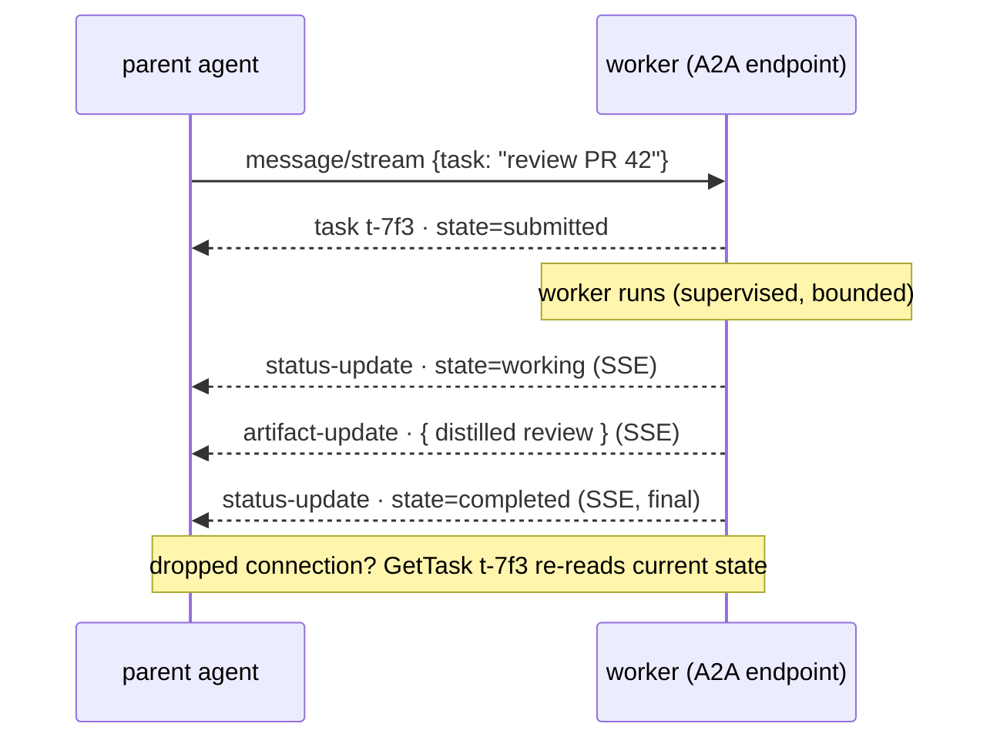

# MCP: the universal interface

agentd has no opinions about *what* it can do — it ships almost no tools of its
own. Everything an agent can touch arrives over the **Model Context Protocol**
(MCP, target spec **2025-11-25**). agentd plays both halves of that protocol:

- as a **client**, it connects to external MCP servers and the tools/resources
  they expose become the agent's entire action space;
- as a **server**, it speaks its own MCP (the "self-MCP") so another agent —
  or any MCP-aware harness — can spawn, steer, read, and subscribe to it.

That symmetry is the whole composition story: an agent is just an MCP server
that happens to also be an MCP client, so agents nest and drive each other with
no special-case protocol.

> **Status.** The MCP client and the self-MCP server / subagent tools are
> implemented and tested. This page documents shipped behavior per RFCs
> [0004](../rfcs/0004-mcp-client-subset-and-codec.md) and
> [0005](../rfcs/0005-self-mcp-server-and-control-protocol.md). Items marked
> **(roadmap)** are explicitly deferred past v1.

---

## 1. agentd as MCP client

### 1.1 There are no built-in tools

agentd ships **no** task tools of its own and runs no local code. Every
capability — read a file, query an API, run a search — is a tool on some MCP
server you declare. agentd discovers them with `tools/list` and invokes them with
`tools/call`. If you declare zero servers, agentd's task toolbox is empty (its only
built-in tools are its self/control primitives — spawn a subagent, subscribe, run
a graph).

This is deliberate: the action space is configuration, not code. Swapping what
an agent can do never means rebuilding agentd.

### 1.2 Declaring servers — `--mcp name=<endpoint>`

You declare each MCP server with `--mcp name=<endpoint>`, repeatable. Each names a
**remote MCP endpoint** reached over **Streamable HTTP** — agentd connects to it
and speaks JSON-RPC over HTTP(S); it spawns no subprocess and runs no local code.

```bash
agentd \
  --instruction "Summarize the open TODOs under /work and write a digest" \
  --intelligence https://gw.example/v1 \
  --mcp fs=https://mcp-fs.internal/mcp \
  --mcp http=https://mcp-http.internal/mcp
```

The part after `=` is the endpoint — `https://host[:port][/path]`, or a loopback
`http://` for a same-host dev sidecar. Per-server auth/framing headers (e.g.
`Authorization: Bearer {{secret:…}}`) are declared secret-free in the config file's
`mcp_servers[].headers` and resolved at connect time (never inlined or logged).

> The endpoint is **trusted config** — it is never built from model- or
> server-controlled strings. Declare servers from your deployment config, not from
> agentd output.

Multiple servers coexist; tool names are **server-qualified** internally so two
servers can both expose a `search` tool without colliding. A `--mcp` with an empty
name or a non-`https`/non-loopback-`http` endpoint is rejected at startup (exit
`2`) before any side effect.

The exact flag surface (from `agentd --help`):

```
TOOLS / MCP:
  --mcp name=<endpoint>       declare a remote MCP server (repeatable; Streamable HTTP)
  # the external channel is A2A, not a served MCP surface:
  a2a.listen: https://host:port   the A2A v2 HTTPS listener (RFC 0029, `--features a2a`)
```

There is no `--mcp` env var; servers are a structural list. (A config-file layer
that carries argv arrays verbatim is a later milestone; the flag is the stable
surface.)

### 1.3 The handshake and capability negotiation

On connect, before anything else, agentd runs the MCP lifecycle. It pins
`protocolVersion: "2025-11-25"` and declares **no client capabilities at all**:

```jsonc
// agentd → server
{ "jsonrpc":"2.0","id":1,"method":"initialize","params":{
    "protocolVersion":"2025-11-25",
    "capabilities":{},                                   // empty, deliberately
    "clientInfo":{"name":"agentd","version":"1.0.0"}             // title omitted
}}
// server → agentd
{ "jsonrpc":"2.0","id":1,"result":{
    "protocolVersion":"2025-11-25",
    "capabilities":{
      "resources":{"subscribe":true,"listChanged":true},
      "tools":{"listChanged":true}
    },
    "serverInfo":{"name":"mcp-server-fs","version":"…"},
    "instructions":"…"                                   // optional; folded into the prompt
}}
// agentd → server
{ "jsonrpc":"2.0","method":"notifications/initialized" }
```

Why `capabilities:{}`? You only declare a *client* capability when you intend to
*service* it, and agentd services none. It does not offer `roots`, `sampling`,
`elicitation`, or `tasks`. This is the minimal interop posture and the smallest
injection surface. If a server nonetheless asks:

- `ping` → answered with `{}` (always; it's a liveness probe both ways);
- `roots/list` → answered with `{"roots":[]}` (we expose no filesystem scope);
- `sampling/createMessage`, `elicitation/create`, anything else → rejected with
  `-32601` *method not found*.

**Version negotiation.** agentd offers `2025-11-25` and accepts a downgrade to
`2025-06-18`, `2025-03-26`, or `2024-11-05` where the feature use overlaps
(e.g. structured tool output requires ≥ `2025-06-18`). A version it cannot speak,
or a handshake that doesn't complete within the init timeout (default **10s**),
is a connect failure. The negotiated capability set is then **frozen** and gates
every subsequent call: agentd never sends `resources/subscribe` to a server that
didn't advertise `resources.subscribe`; it degrades instead.

A **required** server that fails its handshake aborts the run with exit `6`. An
optional one is logged and simply omitted from the catalogue.

### 1.4 Tools: list and call

`tools/list` is drained across all pages — agentd follows `nextCursor` to
exhaustion (cursors are opaque; the page loop is capped at 1024 iterations to
defend against a broken server that returns the same cursor forever).

```jsonc
// agentd → server
{ "jsonrpc":"2.0","id":2,"method":"tools/call",
  "params":{ "name":"get_weather", "arguments":{"location":"NYC"},
             "_meta":{ "io.modelcontextprotocol/run-id":"<run_id>" } } }
// server → agentd  (success — note isError lives INSIDE result)
{ "jsonrpc":"2.0","id":2,"result":{
    "content":[ { "type":"text","text":"22.5°C" } ],
    "isError":false,
    "structuredContent":{ "temperature":22.5 }     // iff the tool declared an outputSchema
}}
```

The run id flows into every call's `_meta` for end-to-end correlation.

**The load-bearing distinction — `isError` vs JSON-RPC `error`:**

| Wire shape | Meaning | What agentd does |
|---|---|---|
| `result.isError == true` | tool *ran* and reported a failure (a **successful** JSON-RPC response) | feed `content[]` back to the model as an observation; it self-corrects; **consumes a step** |
| top-level JSON-RPC `error` | protocol/transport fault (unknown tool, bad params, server crash) | classify per the retry/abort policy — not handed to the model as a normal observation |

A tool saying "file not found" is an observation the model reasons about. A
server saying "I have no such tool" is a protocol error. Conflating them is a
classic agent bug; agentd keeps them strictly separate.

> **Tool descriptions and annotations are untrusted.** They are
> server-controlled text (the "tool poisoning" surface). agentd surfaces and
> logs them for operator audit but never auto-trusts them. See the security
> notes in [RFC 0012](../rfcs/0012-security-posture.md).

On `notifications/tools/list_changed` (only if the server advertised
`tools.listChanged`) agentd re-issues `tools/list` and refreshes the catalogue.

### 1.5 Resources: list vs read

Resources are agent's *context* surface, split into two deliberately distinct
operations:

- **`resources/list` = awareness.** A compact catalogue of URIs with their
  descriptions, sizes, and mime types — never bodies. This is injected into the
  agent's prompt so it knows what exists.
- **`resources/read` = attention.** The actual body, fetched on demand.

`resources/read` always returns a `contents` **array** (one URI may yield several
items, e.g. a directory listing), text in `text`, binary base64 in `blob`:

```jsonc
{ "jsonrpc":"2.0","id":3,"method":"resources/read","params":{"uri":"file:///work/todo.md"} }
{ "jsonrpc":"2.0","id":3,"result":{ "contents":[
    { "uri":"file:///work/todo.md","mimeType":"text/markdown","text":"- ship M2\n- …" }
]}}
```

A missing resource returns `-32002` with `data.uri` — surfaced as an observation,
not a transport abort. `resources/templates/list` is read but **informational
only**: templates are not subscribable; agentd reacts to concrete URIs only.

### 1.6 Reactivity: the notify-then-read subscription model

This is how agentd *wakes* on external change. The model has one non-obvious but
load-bearing property: **the update notification carries no payload.**

```jsonc
// agentd → server  (only if caps.resources.subscribe; one CONCRETE uri, never a template)
{ "jsonrpc":"2.0","id":4,"method":"resources/subscribe","params":{"uri":"file:///work/inbox"} }
{ "jsonrpc":"2.0","id":4,"result":{} }

// later — server → agentd
{ "jsonrpc":"2.0","method":"notifications/resources/updated","params":{"uri":"file:///work/inbox"} }
```

The notification says only *"`file:///work/inbox` changed"* — no diff, no new
content. So agentd does **notify-then-read**: on wake it issues a fresh
`resources/read` to learn the current state. Two consequences fall out of this:

1. It's two round-trips, and the read can race a subsequent update. agent's
   contract is **at-least-once delivery + convergence by re-reading current
   state** — redelivery is harmless because you always act on what the resource
   *is now*, not on a stale diff. (Debounce/coalesce/routing of these wakes is
   the reactive router's job;
   [RFC 0008](../rfcs/0008-execution-modes-and-reactive-routing.md).)
2. On reconnect, agentd re-issues every subscription and then synthesizes one
   coalesced "updated" per watched URI, so a change missed while disconnected is
   not lost (edge-triggered events promoted to level across the restart).

**Two distinct mechanisms — never conflated:**

| Trigger | Capability needed | Subscribe call | Notification | Payload |
|---|---|---|---|---|
| a specific item changed | `resources.subscribe` | `resources/subscribe{uri}` per URI | `notifications/resources/updated` | `{uri}` (+ optional `title`) |
| the *set* of resources changed | `resources.listChanged` | none (capability-implied) | `notifications/resources/list_changed` | none |
| the *set* of tools changed | `tools.listChanged` | none | `notifications/tools/list_changed` | none |

You wire a subscription to a run with a **`subscribe` start node** in a workflow
(agentd 2.0):

```yaml
config_version: "2"
intelligence: { endpoints: https://gw.example/v1, model: my-model }
store: { kind: mcp, mcp: { server: state } }
mcp: { servers: [ { name: fs, endpoint: https://mcp-fs.internal/mcp }, { name: state, endpoint: https://mcp-state.internal/mcp } ] }
workflows:
  - name: triage
    steps:
      s: { kind: subscribe, server: fs, uri: "file:///work/inbox" }
      w: { kind: agent, depends_on: [s], instruction: "Triage new items in the inbox." }
      f: { kind: finish, depends_on: [w] }
lifecycle: { run_until: drained }
```

The runtime issues `resources/subscribe` for the URI, then idles and fires a run
on each update (notify-then-read).

> **Reactivity rides Streamable HTTP.** Subscriptions are `resources/subscribe`
> against the owning MCP server; the client holds the SSE stream open and processes
> pushed `notifications/resources/updated` (notify-then-read). No stdio transport
> is involved.

### 1.7 Liveness and lifecycle

agentd pings idle connections outbound (default every **30s**, **10s** per-ping
timeout); three consecutive missed pongs marks the server stale and runs the
shutdown ladder. It answers inbound `ping` unconditionally. When it abandons an
in-flight call (deadline trip, step-budget exhaustion, cancel) it sends
`notifications/cancelled{requestId,reason}` so it doesn't leak work on a server
it keeps using — but it **never** cancels `initialize`.

stderr from each server is free-form per spec, so agentd **never** treats stderr
as an error signal; a dedicated thread drains it into the structured log stream
(event `mcp.stderr`, tagged by server). The shutdown ladder is ordered and
bounded: close stdin (EOF) → wait → `SIGTERM` → wait → `SIGKILL` → reap. The
whole drain counts inside `--drain-timeout` (default `25s`).

---

## 2. agentd as an A2A endpoint (the external channel)

agentd 2.0's external channel is **A2A** (RFC 0029), not a served MCP surface —
the v1 self-MCP server (the `subagent.*`/`status` tools + `agent://` resources
over Streamable HTTP) was removed in the mode cut-over. Set `a2a.listen` and a
parent agent, a peer, or an operator drives it over A2A JSON-RPC: `SendMessage`
(natural language → a conversation turn, or a command DataPart → a registry
action such as `status` / `workflow.run` / `config`), `GetTask` / `ListTasks` /
`CancelTask`, and `SendStreamingMessage` (SSE) — each resolved to a **principal**
(mTLS / bearer → `operator` / `user` / `agent` / `anonymous`) and authorized
against a role matrix.

```yaml
a2a:
  listen: https://0.0.0.0:8443
  tls: { cert: /etc/agentd/tls/server.crt, key: /etc/agentd/tls/server.key, client_ca: /etc/agentd/tls/clients-ca.crt }
```

> **Trust is per request, never the transport.** A non-loopback bind **must**
> configure mTLS and/or a bearer; an unauthenticated non-loopback listener is a
> startup error. A loopback `http://` bind with no auth is allowed only for local
> dev. See [RFC 0029](../rfcs/0029-a2a-v2.md).

The subsections below (§2.1+) describe the **retired 1.x self-MCP** surface, kept
only as a migration reference.

### 2.1 Declared capabilities

The self-MCP answers `initialize` and declares exactly two capabilities — and
nothing else. Note `tools` is an **empty object** (no `listChanged`) and
`resources` advertises **only** `subscribe` (no `listChanged`):

```jsonc
{ "jsonrpc":"2.0","id":1,"result":{
    "protocolVersion":"2025-11-25",
    "capabilities":{
      "tools":     { },
      "resources": { "subscribe": true }
    },
    "serverInfo":{ "name":"agentd","version":"1.0.0" }   // version = the binary's CARGO_PKG_VERSION
}}
```

No `prompts`, `logging`, `completions`, or `tasks`, and no `listChanged` on either
capability (the listed resource set is the single, stable `agent://status`). It
answers `ping`, and does **not** emit `notifications/message` or
`notifications/progress` in v1. It also does **not** accept an inbound
`notifications/cancelled` — a peer cancels an in-flight or async run with the
**`subagent.cancel`** tool (by handle), which walks the kill ladder over that
run's subtree (§2.2). That tool, not a per-request cancel, is the served
self-MCP's cancellation path.

### 2.2 The `agent://` tools

`tools/list` returns exactly these five tools — the **same fixed set for every
peer** on the socket. The self-MCP advertises no `tools.listChanged` and never
re-lists. Each `inputSchema` is JSON Schema 2020-12.

| Tool | Purpose | Mode |
|---|---|---|
| `status` | read this agent's run id, mode, version, pid, uptime | sync |
| `subagent.spawn` | delegate a task to a fresh agent; return its distilled result | sync \| async \| warm |
| `subagent.send` | send another message into a **warm** session (multi-turn) | sync ack |
| `subagent.status` | read a handle's status (and result once terminal) | sync |
| `subagent.cancel` | request graceful cancel of a run/subtree (→ kill ladder) | sync ack |

The in-agent `subscribe`/`unsubscribe`/`await_resource`/`graph.*` self-tools are
**not** part of this served list — they belong to a running agent's *own* loop,
not to peers on the transport (the reactive self-tools are covered in §2.4). To
read an `agent://` resource a peer uses the JSON-RPC `resources/read` /
`resources/subscribe` methods (§2.3), which are likewise not `tools/call` entries.

`subagent.spawn` — the served `inputSchema` (the supervisor expands this compact
surface into the rich internal spawn payload, [RFC 0009](../rfcs/0009-subagent-process-model.md)):

```jsonc
{ "name":"subagent.spawn",
  "inputSchema":{ "type":"object",
    "properties":{
      "instruction":    {"type":"string"},                          // the task (required)
      "output_contract":{"type":"string"},                          // exactly what to return
      "tool_scope":     {"type":"array","items":{"type":"string"}},  // subset of this agent's MCP server names
      "async":          {"type":"boolean","default":false},         // return a handle immediately
      "warm":           {"type":"boolean","default":false}          // keep alive as a session driven by subagent.send
    },
    "required":["instruction"] }}
```

A **sync** spawn blocks and returns the distilled result and terminal status. The
`structuredContent` shape is unified with the async ack (`{handle,status,done,…}`)
so a peer parses one schema; there is no `usage` field:

```jsonc
{ "jsonrpc":"2.0","id":7,"result":{
    "content":[{"type":"text","text":"{…distillate…}"}],
    "structuredContent":{
      "handle":"served.2",
      "status":"completed",
      "done":true,
      "partial":false,
      "result":{ /* distilled structured value, ~1–2k tokens */ }
}}}
```

**Critical invariants enforced at the spawn chokepoint:** the child's depth is
*minted by the supervisor* from the caller's handle (never read from the
request); `tool_scope` must be a **subset** of the caller's scope (monotonic
narrowing); and a spawn that would breach `--max-depth`, a per-node child cap, the
total-subagent cap, or the tree token ceiling is **refused as a tool result**, not
a crash:

```jsonc
{ "result":{ "isError":true,
  "content":[{"type":"text","text":"spawn refused: max_depth=4 reached at handle 0.2.1.3"}] }}
```

Note the pattern: a cap/scope **refusal** is `isError:true` (so the calling
model adapts), while a malformed `tools/call` (unknown tool, bad params) is a
JSON-RPC `error` (`-32601`/`-32602`) — the same distinction agentd honors as a
client (§1.4).

> **Async & warm spawn ship.** `subagent.spawn` defaults to sync. An `{async}`
> spawn returns immediately with a `handle` (the ack carries `{handle,status:"running",done:false}`,
> no separate `result_resource`); the caller then polls `subagent.status` or
> `resources/read`/subscribes `agent://subagent/<handle>` — that handle's own
> resource **is** the completion resource. A `{warm}` spawn keeps the agent alive
> as a session you drive with `subagent.send`. (`detach` is an *in-loop*
> orchestrator disposition, not offered on the served socket.)

agentd has **no `exec`/shell tool** — it runs no local code (see
[security §6](security.md)). The only process it launches is a re-exec of its own
trusted binary (a subagent); everything else is a tool from a declared MCP server.

### 2.3 Subscribable `agent://` state resources

The self-MCP exposes its own run state and each served async run as resources
under the custom `agent://` scheme. The scheme has exactly **two** forms — there
is no `agent://run/{id}`, `agent://session/{id}`, or `.../result` sub-resource:

| URI | Listed? | Body on `resources/read` |
|---|---|---|
| `agent://status` | yes | this agent's run id, mode, version, pid, uptime, and spawn counts |
| `agent://subagent/{handle}` | no | a served async run's state — `{handle,status,done,age_ms}` while running, `{handle,status,done,partial,result}` once terminal |

`agent://subagent/{handle}` is **read**able and (while still running)
**subscribable** — the peer learns the `handle` from its `subagent.spawn async`
reply. It is deliberately **not listed**: a run's resource appears then vanishes
(eviction), and this reply-only transport has no `resources/list_changed` to
announce that, so listing only the stable `agent://status` avoids advertising a
URI that could 404 on read. A served async handle is `served.{n}`.

`resources/read` returns the standard `contents[]` array with one JSON text item:

```jsonc
{ "result":{ "contents":[
    {"uri":"agent://subagent/served.2","mimeType":"application/json",
     "text":"{\"handle\":\"served.2\",\"status\":\"running\",\"done\":false,\"age_ms\":812}"}
]}}
```

**The emission rule — the reactive substrate.** When a served async run reaches a
terminal status, agentd emits `notifications/resources/updated{uri}` for its
`agent://subagent/{handle}` to every peer subscribed to that URI — **URI only, no
payload, no diff**, exactly like the client side (§1.6) — then consumes the
subscription. The peer `resources/read`s to learn the result. Same notify-then-read,
same re-read-current-state convergence.

That terminal transition is the **only** `updated` emission: there is no
per-intermediate-status push, no `session`/`run` resource, and no `.../result`
URI. The self-MCP advertises no `resources.listChanged` and never emits
`notifications/resources/list_changed` (the single listed resource,
`agent://status`, is stable). agent never emits `updated` for a URI a peer
didn't subscribe to.

### 2.4 Two `subscribe` surfaces — don't confuse them

The word "subscribe" appears in two different roles here:

- **MCP `resources/subscribe`** — a *method a peer calls on agentd's server* to
  get an `updated` notification for one of agent's own `agent://subagent/<handle>`
  URIs (§2.3).
- **The `subscribe` *self-tool*** — a *running agentd calls this on its own loop*
  (via `tools/call`) to subscribe **itself** to an *external* MCP resource
  reachable through agentd's client side. Self-subscribe = **self-scheduling**,
  the signature reactive capability. (It is a self-tool of the agent's loop, not
  part of the served peer-facing `tools/list`.)

```jsonc
{ "name":"subscribe",
  "inputSchema":{ "type":"object",
    "properties":{
      "uri":{"type":"string"}   // the external MCP resource URI to subscribe this agent to
    },
    "required":["uri"] }}
```

The request is **queued** (bounded per run) and applied by the daemon after the
run finishes; it returns `isError:true` only on an empty `uri` or when the per-run
subscription cap is exceeded — it does not validate the target server's
capabilities or template-ness at call time.

### 2.5 The private control protocol is *not* exposed

When agent spawns a subagent, it re-execs itself and drives the child over a
**private, length-prefixed JSON-RPC control protocol** (no MCP handshake, no
capability negotiation) on the child's stdio pipes. That wire is internal and
deliberately never leaked outward. A peer that wants to spawn or steer a subagent
uses the `subagent.*` **MCP tools** above — it never sees the control frames.
This keeps the public surface a single, clean MCP dialect.
(Details in [RFC 0005 §4](../rfcs/0005-self-mcp-server-and-control-protocol.md).)

---

## 3. Composition: one agent driving another

Because agentd is symmetric, composition needs no new protocol. A **worker** agentd
is deployed as its own service, exposing the A2A v2 channel (RFC 0029) over HTTPS:

```yaml
# reviewer.yaml — the worker, an A2A endpoint (build with --features a2a).
# The listener makes it a daemon: it needs a durable store (RFC 0025) and TLS.
agent: { instruction: "Be a reusable code-review worker" }
intelligence: { endpoints: https://gw.example/v1 }
store: { kind: mcp, mcp: { server: state } }
mcp:   { servers: [ { name: state, endpoint: https://mcp-state.internal/mcp } ] }
a2a:
  listen: https://0.0.0.0:8443
  tls:    { cert: /tls/cert.pem, key: /tls/key.pem }
  bearer: "{{secret:REVIEWER_TOKEN}}"
```
```bash
agentd --config reviewer.yaml
```

A **parent** agentd (a job) declares that worker as an `--a2a-peer` it delegates
to (over A2A, emitting `a2a.delegate`):

```bash
agentd \
  --instruction "Orchestrate the nightly review across the repo" \
  --intelligence https://gw.example/v1 \
  --a2a-peer reviewer=https://reviewer.internal:8443
```

The parent drives the worker over A2A JSON-RPC, resolved to a **principal**
(mTLS/bearer) and authorized against the worker's role matrix. Two patterns fall
out:

**Ask** — the parent `SendMessage`s the worker a task (a natural-language turn, or
a `workflow.run` command DataPart) and gets back a durable A2A **task**; it reads
the returned artifact (or polls `GetTask`) for a clean, bounded result — never
reasoning about the worker's internal steps.

**Stream** — the parent `SendStreamingMessage`s and the worker streams incremental
task status + artifacts over SSE, closing the loop as the run progresses. The
durable task **survives a worker restart** (RFC 0025), so a parent that reconnects
resumes with `GetTask`.

A worked picture of the streaming close-the-loop:



Because every task is durable and re-readable with `GetTask`, a dropped connection
is recovered by re-reading current task state — no exactly-once gymnastics, no diff
bookkeeping, the same converge-on-current-state discipline agentd applies to every
resource, applied to agents themselves.

---

## See also

- [RFC 0004 — MCP client subset & wire codec](../rfcs/0004-mcp-client-subset-and-codec.md)
- [RFC 0029 — A2A conversations, principals & commands](../rfcs/0029-a2a-conversations-principals-commands.md) — the external channel (replaces the retired self-MCP of RFC 0005)
- [RFC 0026 — Agent loop & lifecycle](../rfcs/0026-agent-loop-and-lifecycle.md) · [RFC 0027 — Workflow dialect v3](../rfcs/0027-workflow-dialect-3.md)
- [RFC 0009 — Subagent process model](../rfcs/0009-subagent-process-model.md)
- [RFC 0025 — Durable state & store adapters](../rfcs/0025-durable-state-and-store-adapters.md)
- [RFC 0012 — Security posture](../rfcs/0012-security-posture.md)
- [2.0 build plan & progress](design/01-durable-agent-plan.md)
