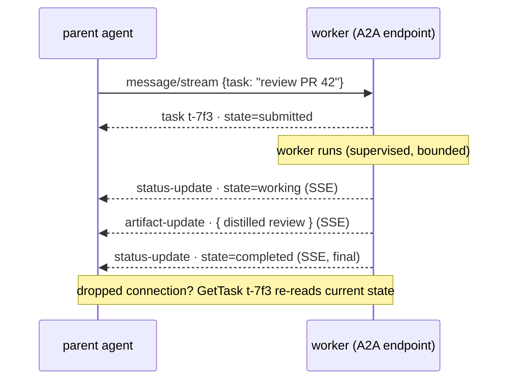

# MCP: the universal interface

agentd has no opinions about *what* it can do — it ships almost no task tools of
its own. Everything an agent can touch arrives over the **Model Context Protocol**
(MCP, target spec **2025-11-25**): agentd is an MCP **client**, and the tools and
resources of the servers you declare become the agent's entire action space
([RFC 0004](../rfcs/0004-mcp-client-subset-and-codec.md)).

The other direction — a parent agent, a peer, or an operator driving *this*
agent — is **A2A** over HTTPS
([RFC 0029](../rfcs/0029-a2a-conversations-principals-commands.md), §2). One
protocol out, one protocol in: agents nest and drive each other with no
special-case wire.

---

## 1. agentd as MCP client

### 1.1 There are no built-in tools

agentd ships **no** task tools of its own and runs no local code. Every
capability — read a file, query an API, run a search — is a tool on some MCP
server you declare. agentd discovers them with `tools/list` and invokes them with
`tools/call`. If you declare zero servers, agentd's task toolbox is empty (its only
built-in tools are its own control primitives — `subagent.*`, `workflow.*`,
`memory.*`, `plan.*`, `skills.*`, `instruction.*` — which act on the agent itself,
never on the world; [RFC 0028](../rfcs/0028-tools-registry-and-internal-tools.md)).

This is deliberate: the action space is configuration, not code. Swapping what
an agent can do never means rebuilding agentd.

### 1.2 Declaring servers — `--mcp name=<endpoint>`

You declare each MCP server with `--mcp name=<endpoint>`, repeatable. Each names a
**remote MCP endpoint** reached over **Streamable HTTP** — agentd connects to it
and speaks JSON-RPC over HTTP(S); it spawns no subprocess and runs no local code.

```bash
agentd \
  --instruction "Summarize the open TODOs under /work and write a digest" \
  --intelligence https://gw.example/v1 \
  --mcp fs=https://mcp-fs.internal/mcp \
  --mcp http=https://mcp-http.internal/mcp
```

The part after `=` is the endpoint — `https://host[:port][/path]`, or a loopback
`http://` for a same-host dev sidecar. Per-server auth/framing headers (e.g.
`Authorization: Bearer {{secret:…}}`) are declared secret-free in the config file's
`mcp.servers[].headers` and resolved at connect time (never inlined or logged).

> The endpoint is **trusted config** — it is never built from model- or
> server-controlled strings. Declare servers from your deployment config, not from
> agentd output.

Multiple servers coexist; tool names are **server-qualified** internally so two
servers can both expose a `search` tool without colliding. A `--mcp` with an empty
name or a non-`https`/non-loopback-`http` endpoint is rejected at startup (exit
`2`) before any side effect.

`--mcp` is sugar for one entry of the `mcp.servers` config path, so the same list
is equally a config-file block, a `--mcp-servers` flag, or `AGENTD_MCP_SERVERS`.
The file form is the richer one — it carries per-server `headers`, `auth`, `tags`,
a `timeout`, and `ns` (a tool-namespace prefix, so tools arrive as `ns.tool`):

```yaml
mcp:
  default_timeout: 60s
  servers:
    - { name: fs,   endpoint: https://mcp-fs.internal/mcp }
    - { name: http, endpoint: https://mcp-http.internal/mcp, ns: web, timeout: 30s }
```

### 1.3 The handshake and capability negotiation

On connect, before anything else, agentd runs the MCP lifecycle. It pins
`protocolVersion: "2025-11-25"` and declares **no client capabilities at all**:

```jsonc
// agentd → server
{ "jsonrpc":"2.0","id":1,"method":"initialize","params":{
    "protocolVersion":"2025-11-25",
    "capabilities":{},                                   // empty, deliberately
    "clientInfo":{"name":"agentd","version":"2.0.0"}     // the binary's version; title omitted
}}
// server → agentd
{ "jsonrpc":"2.0","id":1,"result":{
    "protocolVersion":"2025-11-25",
    "capabilities":{
      "resources":{"subscribe":true,"listChanged":true},
      "tools":{"listChanged":true}
    },
    "serverInfo":{"name":"mcp-server-fs","version":"…"},
    "instructions":"…"                                   // optional; folded into the prompt
}}
// agentd → server
{ "jsonrpc":"2.0","method":"notifications/initialized" }
```

Why `capabilities:{}`? You only declare a *client* capability when you intend to
*service* it, and agentd services none. It does not offer `roots`, `sampling`,
`elicitation`, or `tasks`. This is the minimal interop posture and the smallest
injection surface, and it is self-enforcing on the wire: agentd reads
**notifications** off the server→client stream and nothing else. A server→client
*request* has no declared capability behind it, so it is dropped rather than
answered — there is no `roots/list` to leak a filesystem scope and no
`sampling/createMessage` to turn the agent's model into someone else's.

**Version negotiation.** agentd offers `2025-11-25` and accepts a downgrade to
`2025-06-18`, `2025-03-26`, or `2024-11-05` where the feature use overlaps
(e.g. structured tool output requires ≥ `2025-06-18`). A version it cannot speak,
or a handshake that doesn't finish inside that server's request timeout
(`mcp.servers[].timeout`, else `mcp.default_timeout`, default **60s**), is a
connect failure. The negotiated capability set is then **frozen** and gates
every subsequent call: agentd never sends `resources/subscribe` to a server that
didn't advertise `resources.subscribe`; it degrades instead.

A server that fails its handshake is logged (`mcp.connect.fail`) and simply
omitted from the catalogue — its tools are unavailable, the rest of the run goes
on. The exception is the server backing the durable store (`store.mcp.server`):
agentd will not run without its state, so that one failing exits `6`.

### 1.4 Tools: list and call

`tools/list` is drained across all pages — agentd follows `nextCursor` to
exhaustion, and each page is bounded by the server's request timeout (cursors are
opaque; agentd never interprets one).

```jsonc
// agentd → server
{ "jsonrpc":"2.0","id":2,"method":"tools/call",
  "params":{ "name":"get_weather", "arguments":{"location":"NYC"},
             "_meta":{ "agent/run_id":"<run_id>", "agent/instance":"<instance>",
                       "traceparent":"<w3c-traceparent>" } } }
// server → agentd  (success — note isError lives INSIDE result)
{ "jsonrpc":"2.0","id":2,"result":{
    "content":[ { "type":"text","text":"22.5°C" } ],
    "isError":false,
    "structuredContent":{ "temperature":22.5 }     // iff the tool declared an outputSchema
}}
```

The run id, the instance and the trace context flow into every call's `_meta`, so
a backing service can correlate — and dedupe a retry — end to end.

**The load-bearing distinction — `isError` vs JSON-RPC `error`:**

| Wire shape | Meaning | What agentd does |
|---|---|---|
| `result.isError == true` | tool *ran* and reported a failure (a **successful** JSON-RPC response) | feed `content[]` back to the model as an observation; it self-corrects; **consumes a step** |
| top-level JSON-RPC `error` | protocol/transport fault (unknown tool, bad params, server crash) | classify per the retry/abort policy — not handed to the model as a normal observation |

A tool saying "file not found" is an observation the model reasons about. A
server saying "I have no such tool" is a protocol error. Conflating them is a
classic agent bug; agentd keeps them strictly separate.

> **Tool descriptions and annotations are untrusted.** They are
> server-controlled text (the "tool poisoning" surface). agentd surfaces and
> logs them for operator audit but never auto-trusts them. See the security
> notes in [RFC 0012](../rfcs/0012-security-posture.md).

On `notifications/tools/list_changed` (only if the server advertised
`tools.listChanged`) agentd records the change as `mcp.tools_changed`. The tool
catalogue itself is rebuilt from a fresh `tools/list` per server on the next
config reload — SIGHUP or `lifecycle.watch_config`
([configuration.md §11](configuration.md)) — which is also where a re-handshake
picks up an endpoint or header change.

### 1.5 Resources: list vs read

Resources are the agent's *context* surface, split into two deliberately distinct
operations:

- **`resources/list` = awareness.** A compact catalogue — each resource's URI and
  a short label, never bodies — collected from every connected server (first
  owner wins a duplicate URI, and the list is capped) and injected into the
  agent's prompt so it knows what exists.
- **`resources/read` = attention.** The actual body, pulled on demand through the
  built-in `resource.read` tool.

`resources/read` always returns a `contents` **array** (one URI may yield several
items, e.g. a directory listing), text in `text`, binary base64 in `blob`:

```jsonc
{ "jsonrpc":"2.0","id":3,"method":"resources/read","params":{"uri":"file:///work/todo.md"} }
{ "jsonrpc":"2.0","id":3,"result":{ "contents":[
    { "uri":"file:///work/todo.md","mimeType":"text/markdown","text":"- ship M2\n- …" }
]}}
```

A missing resource returns `-32002` with `data.uri` — surfaced as an observation,
not a transport abort. `resources/templates/list` is available on the client but
**informational only**: templates are not subscribable; agentd reacts to concrete
URIs only.

### 1.6 Reactivity: the notify-then-read subscription model

This is how agentd *wakes* on external change. The model has one non-obvious but
load-bearing property: **the update notification carries no payload.**

```jsonc
// agentd → server  (only if caps.resources.subscribe; one CONCRETE uri, never a template)
{ "jsonrpc":"2.0","id":4,"method":"resources/subscribe","params":{"uri":"file:///work/inbox"} }
{ "jsonrpc":"2.0","id":4,"result":{} }

// later — server → agentd
{ "jsonrpc":"2.0","method":"notifications/resources/updated","params":{"uri":"file:///work/inbox"} }
```

The notification says only *"`file:///work/inbox` changed"* — no diff, no new
content. So agentd does **notify-then-read**: on wake it issues a fresh
`resources/read` to learn the current state. Two consequences fall out of this:

1. It's two round-trips, and the read can race a subsequent update. agentd's
   contract is **at-least-once delivery + convergence by re-reading current
   state** — redelivery is harmless because you always act on what the resource
   *is now*, not on a stale diff. (Debounce, coalescing and filtering of these
   wakes are options on the `subscribe` start node — `debounce_ms`, `coalesce`,
   `filter`; [RFC 0027](../rfcs/0027-workflow-dialect-3.md).)
2. Subscriptions are (re-)armed whenever the workflow that owns them is armed —
   at startup, and again after a config reload — so a restart restores every
   watched URI. Underneath, the notification stream reconnects on its own after
   a transient drop; a server with no push channel at all leaves the client
   pull-only rather than failing.

**Two distinct mechanisms — never conflated:**

| Trigger | Capability needed | Subscribe call | Notification | Payload |
|---|---|---|---|---|
| a specific item changed | `resources.subscribe` | `resources/subscribe{uri}` per URI | `notifications/resources/updated` | `{uri}` (+ optional `title`) |
| the *set* of resources changed | `resources.listChanged` | none (capability-implied) | `notifications/resources/list_changed` | none |
| the *set* of tools changed | `tools.listChanged` | none | `notifications/tools/list_changed` | none |

You wire a subscription to a run with a **`subscribe` start node** in a workflow:

```yaml
config_version: "2"
intelligence: { endpoints: https://gw.example/v1, model: my-model }
store: { kind: mcp, mcp: { server: state } }
mcp: { servers: [ { name: fs, endpoint: https://mcp-fs.internal/mcp }, { name: state, endpoint: https://mcp-state.internal/mcp } ] }
workflows:
  - name: triage
    steps:
      s: { kind: subscribe, server: fs, uri: "file:///work/inbox" }
      w: { kind: agent, depends_on: [s], instruction: "Triage new items in the inbox." }
      f: { kind: finish, depends_on: [w] }
lifecycle: { run_until: drained }
```

The runtime issues `resources/subscribe` for the URI, then idles and fires a run
on each update (notify-then-read).

> **Reactivity rides Streamable HTTP.** Subscriptions are `resources/subscribe`
> against the owning MCP server; the client holds the SSE stream open and processes
> pushed `notifications/resources/updated` (notify-then-read).

### 1.7 Liveness and lifecycle

Every request is bounded by that server's timeout (`mcp.servers[].timeout`, else
`mcp.default_timeout`, default **60s**), so a wedged server cannot hang the loop:
the call fails, the failure becomes an observation, and the run carries on. Its
`ping` method is available as an explicit liveness round-trip.

Because agentd spawns no process for an MCP server, there is no child to signal
or reap — closing the HTTP connection *is* the shutdown. The notification thread
stops with it, and the whole drain counts inside `lifecycle.drain_timeout`
(default `25s`).

---

## 2. agentd as an A2A endpoint (the external channel)

agentd's external channel is **A2A** (RFC 0029). Set `a2a.listen` and a parent
agent, a peer, or an operator drives it over A2A JSON-RPC: `SendMessage`
(natural language → a conversation turn, or a command DataPart → a registry
action such as `status` / `workflow.run` / `config`), `GetTask` / `ListTasks` /
`CancelTask`, and `SendStreamingMessage` (SSE) — each resolved to a **principal**
(mTLS / bearer → `operator` / `user` / `agent` / `anonymous`) and authorized
against a role matrix.

```yaml
a2a:
  listen: https://0.0.0.0:8443
  tls: { cert: /etc/agentd/tls/server.crt, key: /etc/agentd/tls/server.key, client_ca: /etc/agentd/tls/clients-ca.crt }
```

> **Trust is per request, never the transport.** A non-loopback bind **must**
> configure mTLS and/or a bearer; an unauthenticated non-loopback listener is a
> startup error. A loopback `http://` bind with no auth is allowed only for local
> dev. See [RFC 0029](../rfcs/0029-a2a-conversations-principals-commands.md).

---

## 3. Composition: one agent driving another

Composition needs no new protocol: the channel a parent dials is the channel a
worker serves. A **worker** agentd is deployed as its own service, exposing the
A2A v2 channel (RFC 0029) over HTTPS:

```yaml
# reviewer.yaml — the worker, an A2A endpoint (build with --features a2a).
# The listener makes it a daemon: it needs a durable store (RFC 0025) and TLS.
agent: { instruction: "Be a reusable code-review worker" }
intelligence: { endpoints: https://gw.example/v1 }
store: { kind: mcp, mcp: { server: state } }
mcp:   { servers: [ { name: state, endpoint: https://mcp-state.internal/mcp } ] }
a2a:
  listen: https://0.0.0.0:8443
  tls:    { cert: /tls/cert.pem, key: /tls/key.pem }
  bearer: "{{secret:REVIEWER_TOKEN}}"
```
```bash
agentd --config reviewer.yaml
```

A **parent** agentd (a job) declares that worker as an `--a2a-peer` it delegates
to (over A2A, emitting `a2a.delegate`):

```bash
agentd \
  --instruction "Orchestrate the nightly review across the repo" \
  --intelligence https://gw.example/v1 \
  --a2a-peer reviewer=https://reviewer.internal:8443
```

The parent drives the worker over A2A JSON-RPC, resolved to a **principal**
(mTLS/bearer) and authorized against the worker's role matrix. Two patterns fall
out:

**Ask** — the parent `SendMessage`s the worker a task (a natural-language turn, or
a `workflow.run` command DataPart) and gets back a durable A2A **task**; it reads
the returned artifact (or polls `GetTask`) for a clean, bounded result — never
reasoning about the worker's internal steps.

**Stream** — the parent `SendStreamingMessage`s and the worker streams incremental
task status + artifacts over SSE, closing the loop as the run progresses. The
durable task **survives a worker restart** (RFC 0025), so a parent that reconnects
resumes with `GetTask`.

A worked picture of the streaming close-the-loop:



Because every task is durable and re-readable with `GetTask`, a dropped connection
is recovered by re-reading current task state — no exactly-once gymnastics, no diff
bookkeeping, the same converge-on-current-state discipline agentd applies to every
resource, applied to agents themselves.

---

## See also

- [RFC 0004 — MCP client subset & wire codec](../rfcs/0004-mcp-client-subset-and-codec.md)
- [RFC 0029 — A2A conversations, principals & commands](../rfcs/0029-a2a-conversations-principals-commands.md) — the external channel
- [RFC 0026 — Agent loop & lifecycle](../rfcs/0026-agent-loop-and-lifecycle.md) · [RFC 0027 — Workflow dialect v3](../rfcs/0027-workflow-dialect-3.md)
- [RFC 0028 — Tools registry & internal tools](../rfcs/0028-tools-registry-and-internal-tools.md)
- [RFC 0009 — Subagent process model](../rfcs/0009-subagent-process-model.md)
- [RFC 0025 — Durable state & store adapters](../rfcs/0025-durable-state-and-store-adapters.md)
- [RFC 0012 — Security posture](../rfcs/0012-security-posture.md)
