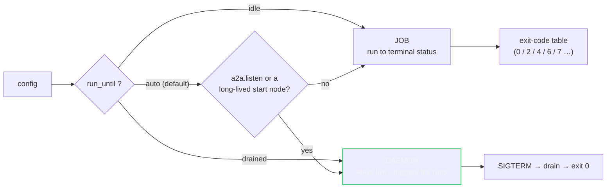

# Lifecycle & triggers

agentd has **one durable runtime** — a single-writer event loop over durable
state (RFC 0026). There are **no modes** to choose between. When a run happens is
decided by two independent things:

- the process **lifecycle shape** — whether the instance is a one-shot *job* or a
  long-lived *daemon* (`lifecycle.run_until`); or
- a workflow **start node** — a *trigger* that fires runs (`once`, `loop`,
  `schedule`, `subscribe`, `signal`, `event`, `manual`, `a2a`).

A one-shot job and a long-lived daemon share the same inner loop, the same
durable state model, the same turn workers, and the same tool registry — they
differ only in *what wakes the agent* and *when the process exits*.

---

## Lifecycle shape — `lifecycle.run_until`

```yaml
lifecycle:
  run_until: auto      # auto | idle | drained
  idle_grace: 5s       # how long `idle`/`auto` waits with no work before exiting
  drain_timeout: 25s   # SIGTERM → finish in-flight, then exit
```

| `run_until` | shape | exits when |
|---|---|---|
| `idle`    | **job**   | no runs, turns, or pending inbox — after `idle_grace` |
| `drained` | **daemon** | never on its own; a SIGTERM drains in-flight work then exits 0 |
| `auto` (default) | job **unless** it has an A2A listener (`a2a.listen`) or a long-lived start node (`loop`/`schedule`/`subscribe`/`signal`/`event`/`a2a`) — then a daemon | as above, per the shape it resolves to |



A job maps its outcome to the exit-code table (RFC 0011 §5): `0` completed, `2`
config/usage, `4` intelligence unavailable, `6` a required MCP server down, `7`
budget/step exhaustion, etc. A daemon exits `0` on a graceful SIGTERM drain.

The **quickstart** — `agentd --instruction "…" --intelligence https://…` — is a
job: the `--instruction` sugar expands to a `once → agent → finish` workflow
(RFC 0030 §5), runs one turn, and exits.

---

## Triggers — workflow start nodes

A workflow is a DAG (RFC 0027). Its entry point is a **start node** whose `kind`
decides *when* a run fires. One workflow may have several.

```yaml
workflows:
  - name: nightly-report
    steps:
      s:  { kind: schedule, at: "02:00Z" }        # ← the trigger
      gen: { kind: agent, depends_on: [s], instruction: "Summarise yesterday." }
      f:  { kind: finish, depends_on: [gen] }
```

| start `kind` | fires a run… | key fields |
|---|---|---|
| `once`      | once, at startup (unless a live run was restored) | — |
| `manual`    | only when explicitly triggered (`workflow.run`, or an A2A `workflow.run` command) | — |
| `loop`      | repeatedly, on an interval, until a condition | `every`, `until`, `max_iterations`, `backoff` |
| `schedule`  | on a clock | `cron: "0 2 * * *"`, or `every: 1h`, or `at: "02:00Z"` |
| `subscribe` | when an MCP **resource** updates | `server`, `uri`, `debounce`, `coalesce`, `filter` |
| `signal`    | when a named signal arrives | `name` |
| `event`     | on a runtime event | `on: workflow.finished` \| `workflow.failed` \| `lifecycle.shutdown` |
| `a2a`       | when an A2A message/command arrives for it | — |

Start-node state (last fired, iteration, next deadline, debounce window) is
**durable** in the manifest, so a restart resumes schedules and loops where they
left off; the reactor's tick adapts to the nearest deadline so time-based work
fires promptly.

### Concurrency

Each workflow bounds its own live runs:

```yaml
    concurrency: { max_runs: 1, on_overflow: queue }   # queue | drop | replace
```

---

## The A2A channel — the daemon's inbox

A daemon's external channel is **A2A** (RFC 0029), not a mode. Set `a2a.listen`
and the runtime binds an HTTPS listener that turns A2A requests into runtime
work (this alone makes `run_until: auto` a daemon):

```yaml
a2a:
  listen: https://0.0.0.0:8443
  tls:   { cert: /tls/cert.pem, key: /tls/key.pem, client_ca: /tls/ca.pem }
  principals:
    - match: { san: "spiffe://team/*" }
      role:  user
      grants: [knowledge.*]
```

- A **natural-language** message becomes a durable conversation turn; the answer
  comes back as the A2A task's artifact.
- A **command** DataPart (`{"data":{"agentd":{"op":"workflow.run","name":"…"}}}`)
  runs a registry action — the modern equivalent of poking a v1 daemon.
- Every call is resolved to a **principal** (mTLS / bearer → `operator | user |
  agent | anonymous`), authorized against a role matrix, and (optionally)
  **audited** (`observability.audit`).

See [`docs/configuration.md`](configuration.md) for the full `a2a` schema and
[RFC 0029](../rfcs/0029-a2a-conversations-principals-commands.md) for the wire contract.


## Init and deinit — workflows that bracket the process

Two idioms make a daemon's lifecycle itself programmable:

- **Initialization** — a `once {policy: always}` start fires on every boot
  (before `ensure`-style dedup, it is the "run this when I come up" hook).
  The canonical use: self-registration — POST your own webhook URL to a
  third-party service the moment the process is alive to receive calls.
- **Deinitialization** — an `event {on: lifecycle.shutdown}` start fires when
  the drain begins (SIGTERM/SIGINT, or a `finish {exit: true}`), and the
  drain **waits** for that run — bounded by `drain_timeout` like everything
  else — before the process exits. The mirror of the above: DELETE the
  webhook registration so the third party stops calling a corpse.

```yaml
workflows:
  - name: init
    steps:
      boot:     { kind: once, policy: always }
      register: { kind: http, depends_on: [boot], method: POST,
                  url: "{{config.service}}/webhooks", json: { url: "{{config.my_hook}}" } }
      f:        { kind: finish, depends_on: [register] }
  - name: deinit
    steps:
      bye:        { kind: event, on: lifecycle.shutdown }
      deregister: { kind: http, depends_on: [bye], method: DELETE,
                    url: "{{config.service}}/webhooks?url={{config.my_hook}}" }
      f:          { kind: finish, depends_on: [deregister] }
```

Keep deinit workflows to fast, model-free steps (`http`, `mcp.tool`, data):
the drain is simultaneously winding subagent children down, so an `agent`
step here competes with the shutdown it is part of. Every OTHER queued start
stays durably in the inbox for the next life — only `lifecycle.shutdown`
runs are admitted during a drain. The event payload carries the reason:
`{event: "lifecycle.shutdown", payload: {reason: "signal" | "exit"}}`.
