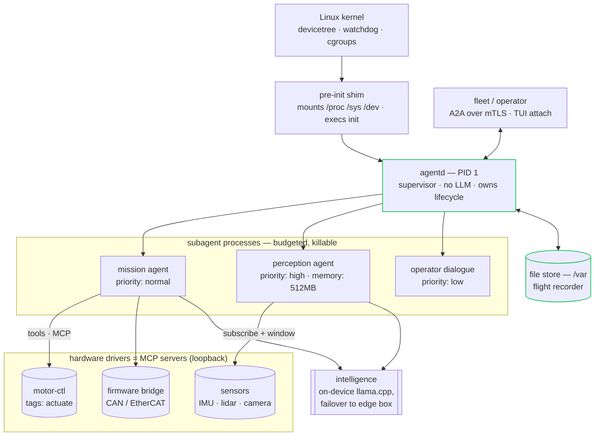

# PID 1 — agentd as init

> **Status.** This is a concept document. Everything described in §1–§3 is
> shipped behavior you can verify today; §4 onward is a design exploration —
> boot recipes, robotics architecture, and a brainstorm — clearly marked as
> such. Nothing here requires a fork of agentd, but some of it deserves one
> small upstream feature (§4.3), and we say so where it does.

A running Linux system has exactly one process the kernel starts itself: PID 1,
the init process. (PID 0 is the kernel's own scheduler — the first thing *you*
get to run is 1.) Everything else on the machine is its descendant; every
orphan becomes its child; when it exits, the kernel panics. Init is the one
program that must supervise, reap, restart, and shut down — forever.

That job description should sound familiar. It is the agentd supervisor's job
description, minus three mounts and a `reboot(2)`.

This page takes the idea seriously: a custom Linux image — a robot controller,
an appliance, a kiosk, an edge box — whose init **is** the agent runtime.
No systemd, no service manager, no shell. The kernel boots, agentd starts,
and the machine's entire userland is one supervised, bounded, durable agent
tree. For an intelligent machine, the operating system's first process is the
thing that thinks.

---

## 1. Why this is less crazy than it sounds

Init has five duties. agentd already performs four of them as its day job, not
as an adaptation:

| init duty | what agentd already does |
|---|---|
| **Reap orphans.** PID 1 must `waitpid` every child the kernel reparents to it, or the process table fills with zombies. | The supervisor's reaper is process-global by construction: one thread owns `waitpid(-1, WNOHANG)` behind a lock and routes every reaped pid to its owner — an *unowned* pid (exactly what a reparented orphan is) is reaped and logged rather than leaked. This is the hard init duty, and it is not an add-on: it is how agentd's own subagent tree works. |
| **Supervise and restart.** Services crash; init's descendants must be restarted with backoff, not in a hot loop. | The restart governor (exponential backoff + a circuit breaker), the dead/stuck detectors, and the SIGTERM→SIGKILL ladder are the supervisor's core (RFC 0003). A wedged child is killed by its process group; `PR_SET_PDEATHSIG` means nothing outlives its parent silently. |
| **Handle signals.** PID 1 is special: signals it has no handler for are *ignored*, not defaulted — an init that installs no handlers cannot even be shut down. | agentd installs real handlers on day one: SIGTERM drains (finish in-flight work, refuse new), SIGHUP hot-reloads config, SIGCHLD wakes the reaper. The drain semantics — stop admitting, let running work finish, exit cleanly — are precisely what a power-button press should mean on a robot. |
| **Own system state.** Init decides what runs, in what order, with what limits. | The workflow engine is a dependency graph with durable state; `lifecycle.run_until` is a boot target; per-child rlimits (`limits: {memory, cpu}`), niceness by `priority`, and cgroup confinement are resource control; the pressure system (shed under low disk/memory, drain in-flight) is graceful degradation a service manager would envy. |
| **Bring up the world.** Mount `/proc`, `/sys`, `/dev`; set the hostname; raise loopback; then start userland. | The one duty agentd does **not** do — deliberately. It is ~20 lines of pre-init shim (§4.2), or one small upstream flag (§4.3). |

Two properties make the fit unusually clean:

- **The binary is a static musl ELF.** No dynamic linker, no libc on disk, no
  `/usr`. The shipped container already runs it on `scratch` as a non-root
  user; an initramfs containing *only* `/agentd`, a config file, and CA roots
  is a bootable userland in single-digit megabytes.
- **The supervisor never reasons.** The process that holds PID 1 — the one
  that must not crash, must not block, must not be talked into anything — is
  the loop with **no model in it**. The LLM lives in killable child processes
  with budgets. A jailbroken model on this machine can be SIGKILLed by its
  parent; the parent cannot be prompted. That is the correct trust topology
  for a machine that can move.

### What PID 1 changes, honestly

- **You cannot be killed.** SIGKILL and SIGSTOP do not apply to PID 1, and a
  crash is a kernel panic (`panic: Attempted to kill init!`). The restart
  governor that supervises everyone else does not supervise *you*. The honest
  mitigations are the kernel's: a hardware **watchdog** (§5.4) and
  `panic=<seconds>` + a known-good A/B rootfs (§5.6), so a dead brain becomes
  a reboot into the previous image rather than a frozen robot.
- **Exit means reboot.** When init exits the kernel panics, so agentd's exit
  codes — its API on a server — become reboot policy on an appliance: the
  shim (§4.2) catches the exit status and calls `reboot(2)` or powers off.
  `lifecycle.exit_code_map` already lets you shape which outcome is which.
- **You inherit everyone.** Every daemon your MCP driver servers spawn, every
  orphan, reparents to you. agentd's global reaper handles this today; what
  it does not do (and should not silently) is *restart* things it never
  started. Anything that must be supervised should be a declared child —
  which on this architecture means: a workflow step, a subagent, or a driver
  the shim started before exec'ing agentd.

---

## 2. The shape: a robot's userland as one config file

The frame for the rest of this page — a mobile manipulator, one board, one
config. Every capability is something wired on, which is exactly the property
you want on a machine with motors:



Read it as three trust rings. The **kernel and PID 1** never reason. The
**agents** reason but are budgeted, rlimited, and killable. The **drivers**
touch hardware but expose only the tools they declare — an agent can call
`motor.move`, it cannot open `/dev/ttyCAN0`, because there is no filesystem
tool and no shell. The lethal-trifecta gate (RFC 0012) applies verbatim with
one word changed: on a robot, *actuation is egress*. An agent that holds
untrusted input (a voice command, a QR code in the camera frame) + sensitive
context + actuator access is the configuration agentd refuses at startup
unless you explicitly say otherwise.

Everything in that diagram maps to shipped features:

- **Sensor streams** — a driver publishes an MCP resource; a workflow
  `subscribe` start with `window: {samples: 64}` delivers the last N readings
  (the trend, not the instant) with debounce collapsing bursts. This exists
  precisely because hardware streams were the motivating case.
- **Subsystem isolation** — perception, planning, and dialogue as separate
  agents with per-child OS caps: `limits: {memory: 512MB, cpu: 5m}` become
  `RLIMIT_AS`/`RLIMIT_CPU` between fork and exec; `priority: low` maps to
  niceness *and* sheds first under resource pressure.
- **Co-located composition** — multiple agentd instances (one per major
  subsystem, or one per compute module) connect over **unix-socket A2A**:
  `a2a.listen: unix:///run/agentd/percept.sock`, kernel-authenticated by
  peer-uid, no TCP, no TLS handshake per exchange.
- **Graceful degradation** — the pressure system watches disk headroom and
  cgroup memory: below the threshold, new work sheds (`priority: low` first)
  while in-flight work drains. On a robot this is the difference between
  "stops accepting chit-chat, keeps balancing" and "OOM-killed mid-step".
- **Standing orders that cannot drift** — `security.workflows.immutable: true`
  makes the loaded workflow set read-only to the model. The robot's safety
  behaviors are what the operator flashed, not what the agent talked itself
  into overnight.
- **The flight recorder** — the durable file store plus the append-only audit
  stream. After an incident you replay what the machine believed, what it was
  asked, which principal asked, and what it did — the black box regulators
  will eventually demand from autonomous machines, as a side effect of
  crash-resume.

---

## 3. What the deliberative layer is not

Being honest about the boundary makes the rest credible:

- **agentd is the cortex, not the spinal cord.** Motor control loops, balance,
  current limiting, e-stop — anything with a deadline measured in
  microseconds-to-milliseconds — belongs in firmware or an RTOS/microcontroller
  below the Linux board, exactly as it does on every serious robot today. The
  reactor is a blocking single-writer loop with a 200 ms park ceiling and
  event-driven wakeups; it is *fast* for a deliberative layer (a delegation
  round trip measures ~18 ms) and it is not, and will never claim to be,
  hard-real-time. The driver MCP server for the motor controller should
  expose *goals* ("walk to the dock"), not torque values.
- **ROS 2 is a colleague, not a competitor.** If the platform already runs
  ROS, agentd sits above it as the mission layer: one small MCP server
  bridging topics/actions into tools and resources. ROS moves the joints;
  agentd decides, supervises, remembers, and answers to the fleet.
- **A model needs somewhere to run.** On-device (llama.cpp / a vendor NPU
  runtime speaking the OpenAI dialect), an edge box over the local network,
  or a cloud endpoint — agentd's `intelligence.endpoints` failover chain
  handles the handoff, and budgets keep an offline-degraded robot from
  burning its token allowance retrying. A robot with no reachable endpoint
  still runs: workflows whose steps are data and tool calls (`subscribe` →
  `switch` → `mcp.tool`) execute with no model at all — your reflex and
  housekeeping layer keeps working when the cortex is unreachable.

---

## 4. Boot: from power button to first turn (design exploration)

### 4.1 The minimal image

An initramfs (or a squashfs rootfs) containing:

```
/init                     ← the shim, ~20 lines (§4.2)
/agentd                   ← the static binary, ~8.5 MiB
/etc/agentd/robot.yaml    ← the machine's entire userland, declared
/etc/agentd/workflows/    ← standing orders (immutable at runtime)
/etc/ssl/certs/           ← CA roots, if any endpoint leaves the machine
/drivers/*                ← the MCP driver servers (static binaries too)
/var                      ← writable: the file store, logs   (tmpfs or a real partition)
```

Kernel config essentials: `DEVTMPFS`, `CGROUPS` (+v2), `UNIX`, `INET` (for
loopback even if the machine is offline), the watchdog driver for your board,
and `PANIC_TIMEOUT=5`. No modules is simplest: build the drivers you need in.

Two gotchas that cost real debugging time on embedded boards:

- **Time.** TLS certificate validation needs a plausible clock. A board with
  no RTC boots in 1970 and every HTTPS dial fails until NTP runs. Either give
  the shim a `hwclock`/NTP step, run offline-first, or pin trust in a way
  that does not depend on wall-clock validity.
- **Entropy.** Early-boot TLS on a quiet board can block on the RNG; modern
  kernels with `RANDOM_TRUST_CPU` (or a hardware RNG) make this a non-issue,
  but decide it at kernel config time, not in the field.

### 4.2 The shim

PID 1 must mount the API filesystems before anything else can work. Keep the
part that runs before agentd small enough to review at a glance:

```sh
#!/bin/sh
# /init — runs as PID 1, then hands the pid to agentd.
mount -t proc  proc  /proc
mount -t sysfs sysfs /sys
mount -t devtmpfs dev /dev
mount -t cgroup2 cgroup2 /sys/fs/cgroup
hostname robot-07
ip link set lo up
/drivers/motor-ctl  --listen 127.0.0.1:7001 &
/drivers/sensors    --listen 127.0.0.1:7002 &
exec /agentd -c /etc/agentd/robot.yaml --env /etc/agentd/fleet.env
```

`exec` is the important word: agentd *becomes* PID 1 rather than being its
child, so the global reaper, the signal handlers, and the drain semantics are
init's. The drivers started before the exec are inherited children — reaped
if they die (and, because they are also declared MCP servers, their death is
*visible*: the connection drops and the telemetry says which capability just
left the machine).

If you would rather not trust even a shell: the shim is fifty lines of Rust
with `nix`, statically linked, and `/bin/sh` never ships.

### 4.3 The one feature this deserves upstream (proposed, not shipped)

Everything above works with agentd as it ships. The ergonomic gap is that the
shim owns mounts and reboot while agentd owns everything else. A small
`--init` mode — mount the API filesystems if absent, translate the final exit
code through `reboot(2)` (`RB_AUTOBOOT` on failure-mapped codes,
`RB_POWER_OFF` on clean completion), and optionally pet `/dev/watchdog` from
the existing health tick — would collapse the shim to `exec /agentd --init`.
It is deliberately *not* a service manager: anything that needs supervision
should already be a workflow step, a subagent, or an MCP server the config
declares.

---

## 5. Brainstorm: what an init-native agent unlocks (ideas)

Ideas worth prototyping, none of which are promises:

1. **Reflex/deliberation split as priority tiers.** `priority: high` for the
   collision-monitor workflow (subscribe → CEL condition → `motor.stop`),
   `low` for conversation. Under pressure the robot literally stops making
   small talk before it stops watching where it is going — degradation order
   as configuration.
2. **The watchdog pet as a health *judgment*.** Petting `/dev/watchdog` from
   the health tick means "the reactor is alive". A stricter robot pets only
   when the safety workflow's last N runs succeeded — turning the hardware
   watchdog into a dead-man switch for the *behavior*, not just the process.
3. **A/B roots + `--fresh` generations as OTA.** Flash B, reboot into it;
   the file store's generation counter and `store.config_changed` warning
   already distinguish "same brain, new body" from "start over". A failed
   boot panics into the watchdog, which reboots A. Fleet OTA becomes an A2A
   command a fleet agent sends.
4. **Per-limb subagents.** One subagent per manipulator with
   `limits: {memory, cpu}` sized to its planner, spawned `warm` so context
   survives between grasps, killed by the supervisor the moment its budget or
   its deadline trips. The kill ladder as a safety feature: no planner death
   spiral can hold a joint.
5. **Interlocks as principals.** The e-stop chain publishes an MCP resource;
   safety workflows `subscribe` to it; the A2A principal model gives the
   teach pendant `operator` and the cloud dashboard `observer` — a read-only
   fleet by construction, because roles are enforced at the listener, not by
   politeness.
6. **The kiosk/appliance degenerate case.** Nothing here is robot-specific:
   a point-of-sale box, a lab instrument, a set-top device — any machine
   whose entire job is "run this one supervised thing forever" — gets the
   same deal: a userland with no shell to compromise, one auditable config,
   and an agent as the only interface.
7. **Voice-only field debugging.** The TUI attaches over the A2A listener; on
   a robot the same surface is reachable over the maintenance port — or the
   dialogue agent *is* the debug interface, with the operator's role gating
   what it may do. `agentd tui --endpoint http://robot-07:8420` on a laptop
   in the field is the whole story.
8. **Simulation parity.** The same config boots as PID 1 on the robot and as
   an ordinary process against simulated driver servers in CI — because the
   userland *is* the config, "test what you ship" is one file diff:
   the drivers' endpoints.

---

## 6. Where to start

Prototype the architecture without touching a bootloader: run the §2 config
as an ordinary process against mock driver servers (the `subscribe window`,
priorities, rlimits, unix-socket A2A, and immutable workflows all behave
identically). Then move it into a container with `--init`-style pid 1
semantics (`docker run --init` inverted: run agentd *as* the container's
PID 1 — the shipped image already does). The initramfs is the last step, not
the first, and by then it is a packaging exercise.

The premise of agentd is that an agent is something you *run*, with the same
discipline as any other long-lived process. PID 1 is that premise taken to
its logical end: the machine does not have an agent — the machine, from the
first userland instruction, **is** one.

## See also

- [Architecture](architecture.md) — the two-loop split this page leans on.
- [The harness](harness.md) — reaper, kill ladder, restart governor, budgets.
- [Scaling & operations](scaling.md), [Deployment](deployment.md) — the
  server-side siblings of these patterns.
- [Security](security.md) — the trifecta rule; read "actuation as egress"
  against it.
- [RFC 0014](../rfcs/0014-control-plane-contract.md) — the fleet control-plane
  direction.
