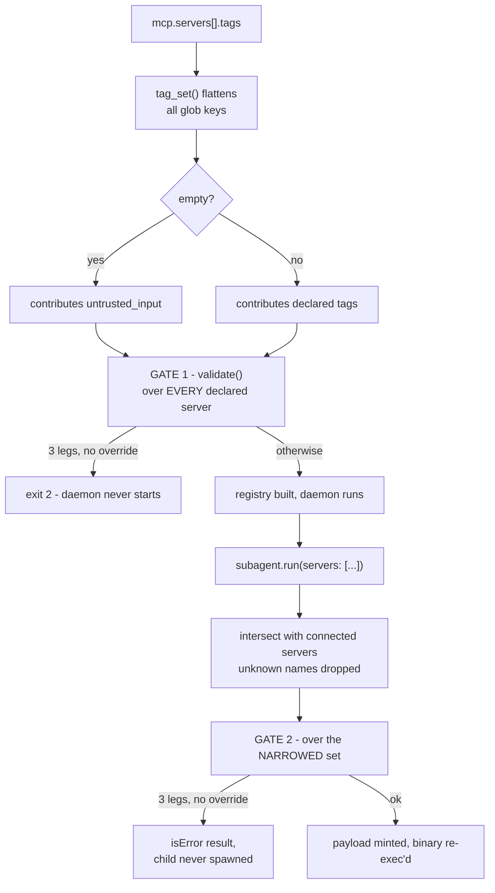
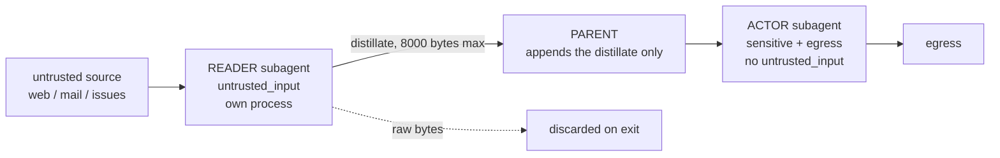
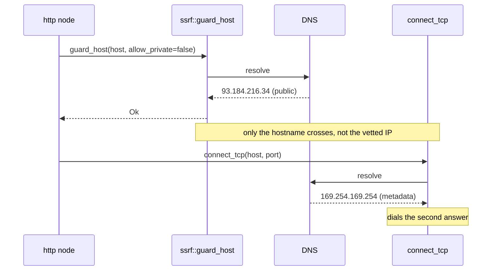

# Security: the fence is the configuration

agentd wires a language model to real credentials and real side effects. That is the whole
product and also the whole problem: everything the model reads may be adversarial, and
everything it can call is authority it holds. There is no reliable way to tell an injected
instruction from a legitimate one, so agentd does not try. It ships no policy engine, no
classifier, and no RBAC DSL. An agent's authority *is* the set of tools its operator
declared, bounded by one structural rule about which kinds of tool may sit together in one
process. This page says what is enforced, where in the code, and — in a final section that
is not an afterthought — what agentd does not defend against at all.

Specification: [RFC 0012 — Security posture](../rfcs/0012-security-posture.md).

## The threat model

**The model is untrusted input holding credentials.** Under a successful prompt injection,
the agent loop emits attacker-chosen tool calls with the operator's authority. Treat the
agentd process as potentially compromised and size the surrounding sandbox accordingly.

**Everything an MCP server returns is untrusted** — not only tool *results* but the parts
the protocol presents as metadata: a tool's name, description, input schema, annotations.
A malicious server can ship an injection in a description, or mutate one after the first
connection. agentd passes that metadata to the model as the tool catalogue but never lets
it make a security decision: capability tags come from operator config only, and
`readOnlyHint` / `destructiveHint` are hints, never gates.

**Prompt injection is not patchable.** A guardrail that works 95% of the time is a failure
in security terms. The defenses here are structural — they bound what a compromised loop
*can reach*, not what it *intends*.

agentd trusts its own binary, the OS, and the operator's configuration. Nothing that
carries authority arrives from the network — an A2A caller's `config.set` reaches three
display/debug paths and nothing else (`a2a_server.rs:1613`) — and the model can never
register an MCP server, edit an endpoint, or name a binary to run.

## Capability scoping

agentd has 48 internal tool contracts (memory, artifacts, plans, subagents, workflows).
Every *task* capability — reading a repository, sending mail, querying a database —
arrives from an operator-declared MCP server. Declaring a server is a trust decision
equivalent to adding a dependency you call at your own privilege.

Narrowing is set membership, not a policy language, and it lands at exactly two surfaces —
which behave differently, and the difference matters:

- A workflow `agent` step honours its `tools:` list — the plan is filtered by pattern
  (`*`, an exact name, or `prefix*`) before the child sees the definitions
  (`runtime/steps.rs:1309`, `registry/mod.rs:631`).
- `subagent.run`'s `tools:` argument **does not confine the child**. It is written into the
  durable record as `allowed_tools` and never read back (`runtime/subagents.rs:556`). The
  only enforced narrowing for a spawned subagent is `servers:` — the payload is built from
  just those server specs, so the child cannot dial the rest (`subagents.rs:249`).

An unknown name in `servers:` is filtered out silently, not rejected
(`subagents.rs:178`) — a typo yields a less capable child and no diagnostic.

`sec/scope.rs` also defines a `Scope` / `ToolScope` intersection type — `parent ∩
requested` over a server whitelist and a tool-name whitelist, both dimensions checked
independently. It has **no call site outside its own tests**; the live exports of that
module are `TrifectaTag` and `check_trifecta`. The two bullets above are the whole of the
narrowing.

Separately, `agent.tools.internal | mcp | code` controls what the model *sees*. That is a
catalogue filter, not the authorization check; the check is `Registry::allowed`.

## Tool tags and the Rule of Two

The trust budget is three operator-declared tags:

| Tag | Meaning |
|-----|---------|
| `untrusted_input` | the tool returns content from an uncontrolled source — web pages, inbound mail, issue text |
| `sensitive` | the tool reaches private data or privileged systems — secret store, internal database, prod control plane |
| `egress` | the tool can move data out or change external state — HTTP POST, send mail, open a pull request |

Tags are parsed as snake-case strings from config only; an unrecognized tag is a hard
config error (`config/v2/mod.rs:483`). Nothing the model or a server says feeds the gate.

```yaml
config_version: "1"
mcp:
  servers:
    - { name: web,   endpoint: https://mcp-fetch.internal/mcp, tags: { "*": [untrusted_input] } }
    - { name: vault, endpoint: https://mcp-vault.internal/mcp, tags: { "*": [sensitive] } }
security:
  allow_trifecta: false   # default; adding an `egress` server here refuses startup
```

The budget is an OR-fold across legs, never a count (`scope.rs:111`) — repeating one leg
across twenty tools stays one leg. The Rule of Two is literally `legs() < 3`
(`scope.rs:133`), so **every pair is allowed**, including `sensitive` + `egress`. A tool
that reads secrets and can POST is fine as long as nothing in the same grant reads
untrusted input.

Tags are **per server, not per tool.** The config shape is a map keyed by glob, but
`McpServer::tag_set()` iterates `self.tags.values()` and discards the keys
(`config/v2/mod.rs:479`); `Registry::build` stamps that union onto every tool of the server
(`registry/mod.rs:320`). So `tags: {"send_*": ["egress"], "read_*": ["untrusted_input"]}`
does not split the server into two risk classes — both tools end up
`untrusted_input | egress`. The only real split is one MCP server per tag profile. An
**untagged server counts as `untrusted_input`** (`config/v2/mod.rs:3042`), the
conservative default.

### Where the gate runs

Two enforcement points, both consulting the same `security.allow_trifecta` setting.



Gate 1 lives inside config `validate()` (`config/v2/mod.rs:3061`), the single validation
authority that both startup and `--validate-config` run, so the two can never disagree. A
refusal is a config error — exit `2`, before any side effect:

```text
lethal-trifecta refused: the root grant wires untrusted_input + sensitive + egress
into one agent; narrow the tags or set security.allow_trifecta (audited)
```

Gate 2 is at the `subagent.run` chokepoint (`runtime/subagents.rs:189`), over the tags of
the *requested* server subset. It returns an `isError` tool result the parent's model must
adapt to, not a crash.

Because gate 1 folds over **every declared server**, it is a whole-instance budget. An
instance declaring an untrusted-input reader, a secrets server, and an egress server will
not start, even if you intend to hand each leg to a different subagent. To run that shape
you either set `security.allow_trifecta: true` — which relaxes gate 2 as well — or run
separate agentd instances per risk profile. `security` is a restart-only config path
(`config/v2/mod.rs:3228`), so a hot reload can never widen the override; a reload touching
it is refused as `restart_required` and the running config is kept.

Not every leg comes from `mcp.servers`: a binary built with the `exec` feature and
running with `security.exec.enabled` contributes `sensitive` + `egress` to this same fold
(`config/v2/mod.rs:3055`), so enabling the local runner beside an untrusted-input server
refuses startup like any other trifecta.

**Two gaps to know.** The `scope.trifecta_grant` warn event described in RFC 0012 does not
exist in the code — an override-allowed trifecta proceeds silently, and the only trace is
the config value. And code-registered (embedder) tools sit outside the accounting: they are
inserted with `Grant::all()` and an empty tag vector (`registry/mod.rs:244`), so an
embedder whose native tool does egress or reads secrets defeats the budget silently.

### The tag floor and closed egress (RFC 0037)

Tags being config-only leaves one hole: the *author* of a config (or of an RFC
0036 template) could point a server at the billing system and simply not write
`sensitive` — the gate then reasons soundly from a false premise. The
`services:` catalog closes it: an entry binds an endpoint to authoritative
tags, and any MCP declaration whose endpoint matches the entry gets those tags
**unioned in before the gate runs** — referencing or inline, unconditionally.
Under-tagging a catalogued endpoint is now impossible rather than undetected.
`security.egress: closed` extends the catalog from authority to allow-list
across **every outbound surface**: MCP dials, intelligence endpoints, A2A
peers, the `http` step (with per-entry `methods:` ceilings), the HTTP store,
workflow-reference URLs, and caller-registered A2A push targets — refused at
boot for configured surfaces, at execution for templated ones. Entries carry
a `kind:` and matching is kind-filtered. There is deliberately no in-config
exception list: the way to allow an endpoint is to catalog it, which is
exactly the reviewable event it should be. What the catalog does **not**
bind: where a *compromised MCP server* can reach (network egress policy stays
complementary — the entry list is what makes those rules derivable), and
`observability.otel.endpoint` (telemetry export is operator plumbing;
validation says so rather than implying coverage).

## The injection firewall

The defense that does the real work is process isolation plus a distilled return. A
subagent runs in its own process with its own context, and the parent appends only the
child's distillate — never its transcript. A string result over `DISTILL_CAP` (8000
bytes) is truncated back to a UTF-8 boundary (`subagents.rs:22`, `:562`).



Poisoned bytes live only in the reader's context and are gone when that process exits. The
reader holds no sensitive tool, so it has no secret to encode into its summary. This is a
trusted-planner / untrusted-data split realized as OS process isolation rather than taint
tracking. The tree is flat by construction: a subagent is handed no in-child orchestration
tools (`subagent/control.rs:52`), so it cannot spawn children in-process.

## Caller scopes

Internally there are four caller kinds: `Root`, `Workflow`, `Subagent`, `Principal`.
Grants only ever gate **internal** contracts — for MCP and code tools the check
short-circuits to allowed for root, workflow, and subagent callers
(`registry/mod.rs:453`). MCP restriction happens through `agent.tools.mcp` selection and
the per-spawn server subset, never through grants.

| Tier | Callers | Examples |
|------|---------|----------|
| `ALL` | root, workflows, subagents | `memory.*`, `artifact.*`, `plan.*`, `skills.*`, `knowledge.*`, `search.*`, `ask_human`, `think`, `exec` |
| `ROOT_WF` | root, workflows | `subagent.*`, `code.run`, `workflow.run` / `cancel` / `wait` |
| `ROOT_ONLY` | root | `instruction.subscribe`, `workflow.create` / `update` / `delete` / `pause` / `resume` |

`finish` is granted to root and subagents but not to workflows — a workflow terminates
with the `finish` step kind instead.

External callers arrive over A2A. The transport supplies a `CallerIdentity` — verified
mTLS SANs and subject, a bearer reference, an AAuth agent id, a loopback flag — and
`Resolver::resolve` walks the `a2a.principals` rules first-match, then falls back to
operator on verified management, then operator on loopback with no principals configured,
then anonymous (`a2a/principals.rs:217`).

```yaml
a2a:
  listen: https://0.0.0.0:8443
  tls: { cert: /tls/cert.pem, key: /tls/key.pem, client_ca: /tls/clients.pem }
  principals:
    - { match: { san: "spiffe://ops/*" },  role: operator }
    - { match: { san: "spiffe://team/*" }, role: user, grants: [workflow.*] }
```

Authorization for the served surface is a hand-written matrix, `Principal::may` for the
RPC method and `Principal::may_command` for a command DataPart:

| Role | May call |
|------|----------|
| `operator` | everything, unconditionally |
| `user` | `workflow.run` / `status` / `cancel`, `subagent.send` / `status`, `plan.get`, `ask_human`, `conversation.get`, `run.get` |
| `agent` | `workflow.run`, `workflow.status` |
| `anonymous` | nothing — denied at every layer, and an explicit `grants: ["*"]` does not rescue it |

`status` and `interface.info` are always granted to any non-anonymous role
(`principals.rs:86`). Of the 48 internal contracts, exactly one — `status` — carries a
default grant for `user`/`agent`. The admin family (`drain`, `lameduck`, `pause`, `resume`,
`cancel`) is refused by name for every non-operator role, independent of grants. Bearer
tokens and pairing codes are compared in constant time (`principals.rs:256`,
`a2a_server.rs:582`, `:308`).

Two honest limits. **A2A role limits bound command DataParts, not conversation:** a
natural-language message from a `user` principal drives a turn handed the *root* tool plan
(`runtime/turns.rs:283`), so a caller who cannot invoke `workflow.delete` as a command may
still be able to ask for it in prose. And **the registry's `Grant.roles` table is not the
live one** — `Principal::as_caller()` has no production call site, so editing a contract's
`user`/`agent` grant changes nothing for A2A.

## The exec runner

agentd runs no local code by default. The `exec` tool exists as a contract, but a local
runner materializes only when the `exec` cargo feature and `security.exec.enabled` are
both true (`registry/mod.rs:184`); otherwise `exec` is `Impl::MappingOnly`, which fails
`is_available()` and routes nowhere — unavailable for every caller including operator.
The dispatch arm itself is `#[cfg(feature = "exec")]`, so a default binary answers "no
built-in implementation". Map the contract onto an MCP server with `tools.overrides` and
the command runs in that server's sandbox instead.

Watch the tag weight when you do. `Registry::build` stamps `exec` `sensitive` + `egress`,
but those per-tool tags feed nothing — `Registry::tags_of`, their only reader, has no call
site — and an override replaces them wholesale with the serving server's tags
(`registry/mod.rs:420`). What actually reaches the trifecta budget is the config-side
contribution above: two legs when the local runner is built *and* enabled, and otherwise
whatever the MCP server you mapped it onto declares. Mapping `exec` onto an untagged
server moves the blast radius off-box and files it as `untrusted_input`.

```yaml
security:
  exec:
    enabled: true
    allow: [git, ls, cat]     # argv[0] allow-list; EMPTY = deny everything
    workdir: /workspace       # mandatory; a requested cwd must resolve inside it
    timeout: 30s              # a longer requested timeout is clamped down
    max_output: 1048576       # 1 MiB cap on captured stdout+stderr
    env: [PATH, HOME]         # the ONLY variables the child receives
```

| Guard | Behaviour | Why |
|-------|-----------|-----|
| argv, never a shell | `Command::new(cmd).args(argv)` — execve directly (`exec.rs:70`) | no metacharacters, globs, `$(…)` or pipes, so no command injection |
| allow-list | exact equality on `argv[0]`; empty list denies all (`tools.rs:668`) | `enabled: true` alone runs nothing |
| workdir confinement | mandatory; a requested `cwd` is canonicalized then checked with `starts_with(base)` (`exec.rs:45`) | defeats `..` traversal and symlink escape together |
| timeout | `min(requested, max)`, default 30s; the child is killed and reaped (`exec.rs:106`) | a request can shorten but never extend the ceiling |
| output cap | default 1 MiB; the reader drains past the cap and discards the excess (`exec.rs:131`) | bounded capture, and no deadlock on a full pipe |
| minimal env | `env_clear()` then rebuild from the named list (`exec.rs:78`) | the agent's environment, and its secrets, are never inherited |
| off the reactor | a named `tool:exec` thread; stdin fed from a further thread | a child that writes before reading cannot stall the daemon |
| audit | `exec.run{cmd, argc, cwd, timeout_ms, caller}` (`tools.rs:707`) | the confinement is logged, never the output |

Every guard is re-checked at call time even though `Registry::build` already gated the
route (`tools.rs:652`). Output is `{stdout, stderr, exit_code, timed_out}`.

Two things before you enable it. A misconfiguration surfaces as an `isError` result at
first call, not as a startup failure — the feature, `enabled`, a non-empty `allow`, and a
`workdir` must all line up. And the guard is *argv-not-shell*, not *no-shell*:
allow-listing `bash` reinstates the entire injection surface by construction.

## Secrets

Secrets have exactly two reference forms, `{{secret:NAME}}` (process environment) and
`{{secret-file:PATH}}` (a mounted file). Both resolve at the instant of use
(`sec/secret.rs:73`), so a rotated file is picked up without a restart. Exactly one
trailing newline — or CRLF — is stripped from a file read, because kubelet projects a
Secret verbatim while editors append one; interior whitespace stays part of the credential.

An unknown `{{…}}` token is an **error**, not a pass-through, so a typo cannot smuggle
braces onto the wire. Errors name the reference, never the value: a missing variable
yields `{{secret:NAME}} is not set in the environment`. The `Secret` newtype's `Debug`
prints `***` (`config/v2/mod.rs:69`), so a credential cannot reach a log line, a payload
dump, or a panic message through formatting. The durable subagent record is written with
the intelligence token nulled out, re-supplied from live settings on restore
(`subagents.rs:552`).

Two checks catch an inline credential in the config **file**. Four paths must be references
outright — `/intelligence/token`, `/a2a/bearer`, `/security/aauth/enroll_token`, and each
MCP server's `oauth.client_secret` (`config/v2/mod.rs:3168`). Separately, any header whose
*key* looks credential-shaped — `authorization`, `api-key`, `x-api-key`, `token`,
`password`, `secret`, or anything ending `-token` / `_token` / `-key` / `_key`
(`config/mod.rs:2553`) — is refused with an inline value, across `intelligence.headers`,
`mcp.servers[].headers` and `a2a.peers[].headers`.

The limit is the key name, not the value: a bearer pasted into `headers.X-Session` passes
validation. Use references everywhere; outside those two shapes nothing will catch you.
Outbound credential providers — OAuth2, AWS SigV4, SPIFFE, `agentd login` — are covered in
[authentication.md](authentication.md).

## Transport and identity

MCP endpoints are HTTPS-only, with plaintext `http://` permitted for loopback hosts alone;
anything else exits `2` before any side effect (`config/mod.rs:671`). The same rule holds
for the intelligence endpoint. A non-loopback `a2a.listen` **must** configure client auth —
`a2a.tls.client_ca`, `a2a.bearer`, or `interface.pairing` — or startup fails validation,
and plaintext `http://` on a non-loopback bind is likewise a startup error
(`config/v2/mod.rs:2786`).

One default deserves emphasis: **a loopback caller with no `a2a.principals` configured
resolves to operator** with `grants: ["*"]` (`principals.rs:210`, `:228`). Anything that
can reach the loopback port — a sidecar, a co-tenant process, an SSRF from another service
in the same network namespace — is a full operator. Configure principals on any host you
do not fully own.

The only process agentd launches is a re-exec of its own binary via `current_exe()`
(`runtime/mod.rs:308`), marked with the `AGENT_SUBAGENT` environment variable. The child's
work arrives as a serialized control frame on its stdin — data to a model loop, never argv
to a shell. Each child gets its own process group so the kill ladder can target the
subtree, an optional cgroup leaf whose `Drop` writes `cgroup.kill`, and `PR_SET_PDEATHSIG`
so a supervisor death collapses it.

## SSRF defenses

The SSRF classifier has exactly **one call site in the workspace**: the workflow `http`
node (`runtime/http_node.rs:228`) — the one outbound surface where a URL can be model- or
graph-derived. Intelligence, MCP, A2A, and OAuth traffic goes out unguarded by design,
because those endpoints come from operator config; a model that can influence any of those
URLs is outside the guard.

Blocked as non-global: `0.0.0.0/8`, `127/8`, `10/8`, `172.16/12`, `192.168/16`,
`169.254/16` (the cloud-metadata range), `100.64/10` CGNAT, `240/4` reserved, `224/4`
multicast, and the broadcast address; for IPv6, `::`, `::1`, `fe80::/10`, `fc00::/7`,
`ff00::/8`, `2001:db8::/32` (`net/ssrf.rs:101`, `:138`). IPv6 is classified by first
peeling `::ffff:a.b.c.d` and `::a.b.c.d` forms back to v4 and re-running the v4 rules —
the classic bypass, closed. `guard_host` rejects if **any** resolved address is non-global,
so a hostname answering with both a public and a private address is refused outright.
Header names and values containing `\r` or `\n` are rejected at request construction in
both send paths, before any bytes are written (`net/http.rs:174`, `:393`).

Two limits of the guard:



**There is no DNS pinning.** `guard_host` resolves and vets, then `connect_tcp` resolves
the host a second time and dials that answer (`net/http.rs:143`). A hostile DNS server can
answer public on the first query and a metadata address on the second. Treat the guard as a
filter against careless URLs, not as a defense against an attacker who controls DNS —
network policy is the control that closes this.

**`allow_private: true` is an off switch, not a "permit RFC-1918" switch.** It returns Ok
without even resolving (`ssrf.rs:191`), and the workflow `http` node exposes it as a plain
per-node boolean in the graph spec. Review it in graph diffs the way you review a credential.

The client also follows **no redirects at all** — there is no `3xx`/`Location` handling. A
redirect comes back as a response, so the redirect-chain SSRF pivot does not exist here,
and neither does transparent redirect following.

## What agentd does not protect against

Stated plainly so you size the surrounding environment correctly.

- **No in-binary sandboxing.** No seccomp, no namespaces, no chroot. The only OS-level
  hardening is process-group isolation, an optional cgroup leaf, and `PR_SET_PDEATHSIG`.
  Confinement, filesystem scope, and aggregate resource limits are the deployment's job.
- **No egress network policy.** Which hosts the process may reach is a NetworkPolicy or
  firewall concern; the SSRF guard covers one node kind.
- **No content-based injection detection.** No classifier, no "is this injection?" model
  call. The defense is containment, and containment is not a guarantee.
- **No per-tool tagging.** Tags apply per server; glob keys are parsed and discarded.
- **No rug-pull detection.** A server that mutates a tool description after first connect
  is not detected; the only connect-time log is `mcp.connect{server, tools}` with a count.
- **No audit event for a trifecta override** — it proceeds silently.
- **No artifact redaction.** Artifacts carry a `sensitive` flag, but `artifact.get` returns
  the content regardless (`runtime/artifacts.rs:133`).
- **No confinement from `subagent.run`'s `tools:` argument** — only `servers:` narrows a
  spawned child.
- **No policy engine, request signing, or RBAC beyond the principal roles above.**

## Operator checklist

1. Run agentd inside a real sandbox with an egress policy and cgroup limits. That is the
   security boundary; agentd is not.
2. Treat every declared MCP server as code you execute at agentd's privilege. Vet it.
3. Tag every server, one server per tag profile — glob keys do not split a server.
4. Configure `a2a.principals` on any host where loopback is not exclusively yours.
5. Reference every secret; validation covers four config paths plus credential-shaped
   header keys — a credential under any other key name sails through.
6. Leave `exec` off. If you enable it, keep `allow` minimal, never allow-list a shell, and
   never co-locate it with an untrusted-content reader.
7. Run `agentd --validate-config -c agentd.yaml` in CI — the same authority startup runs,
   exiting `2` on any diagnostic.
