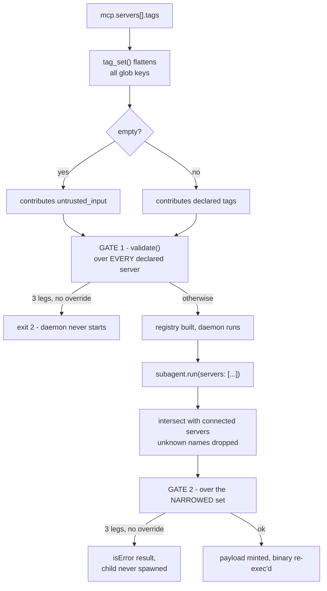
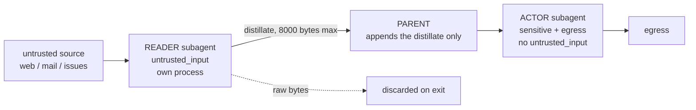

# Security: the fence is the configuration

agentd wires a language model to real credentials and real side effects. That is the whole
product and also the whole problem: everything the model reads may be adversarial, and
everything it can call is authority it holds. There is no reliable way to tell an injected
instruction from a legitimate one, so agentd does not try. It ships no policy engine, no
classifier, and no RBAC DSL. An agent's authority *is* the set of tools its operator
declared, bounded by one structural rule about which kinds of tool may sit together in one
process. This page says what is enforced, where in the code, and — in a final section that
is not an afterthought — what agentd does not defend against at all.

## The threat model

**The model is untrusted input holding credentials.** Under a successful prompt injection,
the agent loop emits attacker-chosen tool calls with the operator's authority. Treat the
agentd process as potentially compromised and size the surrounding sandbox accordingly.

**Everything an MCP server returns is untrusted** — not only tool *results* but the parts
the protocol presents as metadata: a tool's name, description, input schema, annotations.
A malicious server can ship an injection in a description, or mutate one after the first
connection. agentd passes that metadata to the model as the tool catalogue but never lets
it make a security decision: capability tags come from operator config only, and
`readOnlyHint` / `destructiveHint` are hints, never gates.

**Prompt injection is not patchable.** A guardrail that works 95% of the time is a failure
in security terms. The defenses here are structural — they bound what a compromised loop
*can reach*, not what it *intends*.

agentd trusts its own binary, the OS, and the operator's configuration. What arrives from
the network is bounded to a whitelist: the one command op that changes the running
configuration, `admin.set`, is the operator's alone and reaches two paths
(`runtime/surface/ops.rs::RUNTIME_SETTABLE`) — `agent.approval`, the human-approval mode,
deliberately settable mid-session because how closely you want to be asked changes with
what the agent is doing, and `a2a.introspection.enabled`. Every other path is refused with
the list of what *is* settable (`runtime/a2a_server/admin.rs`), nothing is written to disk,
and the next reload puts the file's value back. The model can never register an MCP
server, edit an endpoint, or name a binary to run.

## Capability scoping

agentd has 53 internal tool contracts (memory, artifacts, plans, subagents, workflows).
Every *task* capability — reading a repository, sending mail, querying a database —
arrives from an operator-declared MCP server. Declaring a server is a trust decision
equivalent to adding a dependency you call at your own privilege.

Narrowing is set membership, not a policy language, and it lands at exactly two surfaces —
which enforce it at different points, and the difference matters:

- A workflow `agent` step honours its `tools:` list — the plan is filtered by pattern
  (`*`, an exact name, or `prefix*`) before the child sees the definitions
  (`runtime/steps.rs::step_turn`, `registry/mod.rs::defs_for`, `::pattern_matches`).
- `subagent.run`'s `tools:` argument **does** confine the child. The supervisor mints it
  into the spawn payload as a grant (`runtime/subagents.rs::subagent_run`, through
  `subagent/protocol.rs::narrow_tools`), and the child filters both its tool catalogue and
  its dispatch routing map against it (`agentloop/runner.rs::narrow_catalogue`), so an
  excluded tool is unreachable rather than merely unadvertised. A caller-supplied `context`
  entry cannot forge or widen that grant — any allow-list already on the seed is dropped
  before the mint, because `subagent_run` discards every seed message whose role is
  `subagent/protocol.rs::ALLOWED_TOOLS_ROLE`. `servers:` narrows independently: the payload
  is built from just those server specs, so the child cannot dial the rest (the same
  function's read of `args["servers"]`).

An unknown name in `servers:` is filtered out silently, not rejected — that read filters
on `self.mcp_specs.contains_key`, so a typo yields a less capable child and no diagnostic.

`sec/scope.rs` also defines an intersection type (`scope.rs::Scope`, over
`scope.rs::ToolScope`) — `parent ∩ requested` over a server whitelist and a tool-name
whitelist, both dimensions checked independently. It has **no call site outside its own
tests**; the live exports of that module are `scope.rs::TrifectaTag` and `check_trifecta`.
The two bullets above are the whole of the narrowing.

Separately, `agent.tools.internal | mcp | code` controls what the model *sees*. That is a
catalogue filter, not the authorization check; the check is `Registry::allowed`.

## Tool tags and the Rule of Two

The trust budget is three operator-declared tags:

| Tag | Meaning |
|-----|---------|
| `untrusted_input` | the tool returns content from an uncontrolled source — web pages, inbound mail, issue text |
| `sensitive` | the tool reaches private data or privileged systems — secret store, internal database, prod control plane |
| `egress` | the tool can move data out or change external state — HTTP POST, send mail, open a pull request |

Tags are parsed as snake-case strings from config only; an unrecognized tag is a hard
config error (`config/settings/mod.rs::McpServer::tag_set`). Nothing the model or a server says
feeds the gate.

```yaml
mcp:
  servers:
    - { name: web,   endpoint: https://mcp-fetch.internal/mcp, tags: { "*": [untrusted_input] } }
    - { name: vault, endpoint: https://mcp-vault.internal/mcp, tags: { "*": [sensitive] } }
security:
  allow_trifecta: false   # default; adding an `egress` server here refuses startup
```

The budget is an OR-fold across legs, never a count (`scope.rs::Trifecta::merge`) —
repeating one leg across twenty tools stays one leg. The Rule of Two is literally
`legs() < 3` (`scope.rs::evaluate`), so **every pair is allowed**, including `sensitive` +
`egress`. A tool that reads secrets and can POST is fine as long as nothing in the same
grant reads untrusted input.

Tags are **per server, not per tool.** The config shape is a map keyed by glob, but
`McpServer::tag_set()` iterates `self.tags.values()` and discards the keys
(`config/settings/mod.rs::McpServer::tag_set`); `Registry::build` stamps that union onto every
tool of the server (`registry/mod.rs::Registry::build`). So
`tags: {"send_*": ["egress"], "read_*": ["untrusted_input"]}` does not split the server
into two risk classes — both tools end up `untrusted_input | egress`. The only real split
is one MCP server per tag profile. An **untagged server counts as `untrusted_input`**
(`config/settings/mod.rs::validate`, in the fold headed `// trifecta over the root grant`), the
conservative default.

### Where the gate runs

Two enforcement points, both consulting the same `security.allow_trifecta` setting.


```mermaid
flowchart TB
  A["mcp.servers[].tags"] --> B["tag_set() flattens<br/>all glob keys"]
  B --> C{"empty?"}
  C -- yes --> D["contributes untrusted_input"]
  C -- no --> E["contributes declared tags"]
  D --> F["GATE 1 - validate()<br/>over EVERY declared server"]
  E --> F
  F -- "3 legs, no override" --> G["exit 2 - daemon never starts"]
  F -- "otherwise" --> H["registry built, daemon runs"]
  H --> I["subagent.run(servers: [...])"]
  I --> J["intersect with connected servers<br/>unknown names dropped"]
  J --> K["GATE 2 - over the NARROWED set"]
  K -- "3 legs, no override" --> L["isError result,<br/>child never spawned"]
  K -- ok --> M["payload minted, binary re-exec'd"]
```

Gate 1 lives inside config `validate()` (`config/settings/mod.rs::validate`, where the
root-grant fold ends in a `check_trifecta` call), the single validation authority that
both startup and
`--validate-config` run, so the two can never disagree. A refusal is a config error —
exit `2`, before any side effect:

```text
lethal-trifecta refused: the root grant wires untrusted_input + sensitive + egress
into one agent; narrow the tags or set security.allow_trifecta (audited)
```

Gate 2 is at the `subagent.run` chokepoint (`runtime/subagents.rs::subagent_run`, which
calls `check_trifecta` itself), over the tags of the *requested* server subset. It returns
an `isError` tool result the parent's model must adapt to, not a crash.

Because gate 1 folds over **every declared server**, it is a whole-instance budget. An
instance declaring an untrusted-input reader, a secrets server, and an egress server will
not start, even if you intend to hand each leg to a different subagent. To run that shape
you either set `security.allow_trifecta: true` — which relaxes gate 2 as well — or run
separate agentd instances per risk profile. `security` is a restart-only config path
(`config/settings/mod.rs::RESTART_ONLY_PATHS`), so a hot reload can never widen the override; a
reload touching it is refused as `restart_required` and the running config is kept.

Not every leg comes from `mcp.servers`: a binary built with the `exec` feature and
running with `security.exec.enabled` contributes `sensitive` + `egress` to this same fold,
pushed by its `#[cfg(feature = "exec")]` arm, so enabling the local runner beside an
untrusted-input server refuses startup like any other trifecta.

**Two gaps to know.** No warn event is emitted when the override is exercised: a
`scope.trifecta_grant` event name is reserved but never written, so an allowed trifecta
proceeds silently and the only trace is the config value. And code-registered (embedder)
tools sit outside the accounting: they are inserted with `Grant::all()` and an empty tag
vector — the tool literal that `registry/mod.rs::Registry::build` writes for a code
tool — so an embedder whose native tool does egress or reads secrets defeats the budget
silently.

### The tag floor and closed egress

Tags being config-only leaves one hole: the *author* of a config (or of a
subagent template) could point a server at the billing system and simply not write
`sensitive` — the gate then reasons soundly from a false premise. The
`services:` catalog closes it: an entry binds an endpoint to authoritative
tags, and any MCP declaration whose endpoint matches the entry gets those tags
**unioned in before the gate runs** — referencing or inline, unconditionally.
Under-tagging a catalogued endpoint is therefore impossible rather than undetected.
`security.egress: closed` extends the catalog from authority to allow-list
across the outbound surfaces it knows about: MCP dials, intelligence
endpoints, A2A peers, the `http` step (with per-entry `methods:` ceilings),
stream `forward:` targets, the HTTP store, workflow-reference URLs, and
caller-registered A2A push targets — refused at boot for configured surfaces,
at execution for templated ones. Entries carry a `kind:` and matching is
kind-filtered. There is deliberately no in-config exception list: the way to
allow an endpoint is to catalog it, which is exactly the reviewable event it
should be. What the catalog does **not** bind: where a *compromised MCP
server* can reach (network egress policy stays complementary — the entry list
is what makes those rules derivable), `observability.otel.endpoint`
(telemetry export is operator plumbing; validation says so rather than
implying coverage), and the instruction fetch itself — an `agent.instruction`
or subagent-template `url:` / `oci:` source is dialled while the
configuration is still being assembled, before there is an egress policy to
consult, so pin it by digest and treat the document host as operator plumbing
too.

## Policies: a verdict on the call

Grants answer *may this caller reach this tool at all*, and they are name
patterns. They cannot express "delete anything outside `/tmp`", or "a person
signs off before any egress-tagged call" — and `agent.approval` only decides
whether to honour a gate the *model* asked for. `security.policies` is the
layer in between: an ordered list matched against the call itself, first match
wins, no match is allow.

```yaml
security:
  policies:
    - match: {tool: "fs.delete*", args: "CEL: !args.path.startsWith('/tmp/')"}
      action: deny
    - match: {tags: [egress], caller: [subagent]}
      action: ask
      question: "{{caller}} wants {{tool}} with {{args}} — allow?"
      on_timeout: deny
    - match: {tool: "billing.*", principal: {role: user}}
      action: deny
```

It hooks `execute_tool` — one chokepoint every call passes — deliberately
*after* argument validation, so a guard judges arguments that already conform
to the tool's schema rather than whatever the model emitted. It composes with
the machinery either side rather than duplicating it: `tools.overrides` says
**where** a call goes, this says **whether**, and `action: ask` suspends on the
same deferred-human path `ask_human` and the `human` node already use. This is
also where the trifecta tags finally do work at runtime rather than only
folding at startup.

**A policy gate holds the call.** `action: ask` does not run the call and
then ask; it parks the call and puts the question on the asking task, which
turns `input-required`. The answer is a decision: `approve` runs the held call
— its grant and its arguments checked again, the policy not re-applied — and
the asker gets the call's real result (`runtime/tools.rs::policy_settle`);
`deny` is an error result naming the rule; anything else is refused as an
answer and the question stays open. A timeout runs the
call only when the rule's `on_timeout` is `allow`, and refuses it otherwise
(the default). A workflow step's gate is recorded durably with its question,
its addressee and the held call, so a restart rebuilds it unweakened.

**A policy gate is addressed**, to the rule's `to:`, and to `{role: operator}`
when the rule names nobody (`runtime/tools.rs::policy_gate`). The gate usually
lands on the task of the very caller whose call is being judged, and whoever
holds a task may answer an unaddressed question on it — so an unaddressed
policy gate would be approved by the party it exists to check. A policy is the
operator wanting a say. Who else a `to:` may name is the
[gate addressee rule](#human-gates-who-may-answer).

An empty list costs one `is_empty` check.

### Every caller, or it is worse than nothing

A policy table that held for root turns but not subagent turns would be worse
than none, because the operator would believe they were covered. Two different
bypasses exist and both are closed:

- a **turn worker** dials its MCP tools from its own route map, so any tool a
  rule might touch is left out of that map and served by the runtime instead;
- a **subagent** is a separate process that connects to MCP servers itself, so
  the supervisor names its gated tools in the spawn payload and the child
  routes exactly those back up the existing tool-request channel.

Gated tools pay one round-trip; everything else keeps the fast path. It is a
routing decision, not a trust boundary — the parent re-evaluates the policy
when the request arrives, so a child that ignored the list is still refused.

### Three deliberate refusals

**`shadow` never fabricates a result.** It says plainly that the call was held
and no result exists. A schema-conformant fake would be reasoned over as real,
and every later decision built on an observation that never happened — a
strange thing for a fail-closed runtime to ship, and worse than refusing.

**An `ask` nobody can be asked takes its `on_timeout`, and that defaults to
deny.** A gate nobody could answer has not been approved, and running the call
because no client happens to be connected would make the policy a suggestion.
Nobody can be asked when no A2A listener serves, or when the call belongs to
work no caller owns — a schedule, a webhook, a subagent (a subagent's gate is
unowned even under a caller's turn) — and `agent.ask_human_unowned` is not
`gate`. The question is logged (`tool.policy.unanswerable`) so the operator
learns what they were not asked. A rule that says `on_timeout: allow` runs the
call and returns its real result; it never returns a success for a call that
did not run. A policy `ask` also does *not* route through `agent.approval`,
whose `auto` mode answers with a model judge — letting the agent approve the
operator's own security gate: an addressed gate is never judged.

**An argument guard that will not compile is exit 2.** Silently treating it as
no-match turns a `deny` into an allow at exactly the moment it was meant to
bite, so a build without the `cel` feature refuses the config rather than
evaluating the guard to nothing.

## The injection firewall

The defense that does the real work is process isolation plus a distilled return. A
subagent runs in its own process with its own context, and the parent appends only the
child's distillate — never its transcript. A string result over `DISTILL_CAP` (8000
bytes) is truncated back to a UTF-8 boundary (`subagents.rs::DISTILL_CAP`, `::distill`).


```mermaid
flowchart LR
  U["untrusted source<br/>web / mail / issues"] --> R["READER subagent<br/>untrusted_input<br/>own process"]
  R -- "distillate, 8000 bytes max" --> P["PARENT<br/>appends the distillate only"]
  P --> A["ACTOR subagent<br/>sensitive + egress<br/>no untrusted_input"]
  A --> E["egress"]
  R -.->|"raw bytes"| X["discarded on exit"]
```

Poisoned bytes live only in the reader's context and are gone when that process exits. The
reader holds no sensitive tool, so it has no secret to encode into its summary. This is a
trusted-planner / untrusted-data split realized as OS process isolation rather than taint
tracking. The tree is flat by construction: a subagent is handed no in-child orchestration
tools (`subagent/control.rs::NoSelfTools`), so it cannot spawn children in-process.

## Caller scopes

Internally there are four caller kinds (`registry::Caller`): root, workflow, subagent and
principal.
Grants only ever gate **internal** contracts — for MCP and code tools the check
short-circuits to allowed for root and workflow callers, and for a subagent spawned without
a `tools:` grant; a subagent that carries one is held to it for every tool class, MCP and
code included (`registry/mod.rs::allowed`). MCP restriction otherwise happens through
`agent.tools.mcp` selection and the per-spawn server subset, never through grants.

| Tier | Callers | Examples |
|------|---------|----------|
| `ALL` | root, workflows, subagents | `memory.*`, `artifact.*`, `plan.*`, `skills.*`, `knowledge.*`, `search.*`, `ask_human`, `think`, `exec` |
| `ROOT_WF` | root, workflows | `subagent.*`, `code.run`, `workflow.run` / `cancel` / `wait` |
| `ROOT_ONLY` | root | `instruction.subscribe`, `workflow.create` / `update` / `delete` / `pause` / `resume` |

`finish` is granted to root and subagents but not to workflows — a workflow terminates
with the `finish` step kind instead.

A root turn is offered its tiers whoever drives it, so a turn that an A2A `user` or
`agent` principal started — and a workflow step in a run one owns — is held to what that
principal could do itself (`runtime/tools.rs::execute_tool_as`, `runtime/steps.rs`):

- a `ROOT_ONLY` tool is the instance's own control and is refused ("acts on the whole
  instance and is not permitted for …"); only `workflow.pause` / `resume` naming a `run`
  goes on, to the owner check below;
- a tool that names a run or a subagent acts only on that principal's own, and anything
  else is "no such run" / "no such subagent"; `workflow.list` and `workflow.status`
  show only its own runs, and `subagent.list` only its own subagents;
- `workflow.run` runs only what its grants and the default start's `roles:` allow, and
  only from that default start.

The model acts with the principal as the rules name it now. The runtime knows the
operator and every rule with a declared `id` from startup, and rebuilds that from the new
rules on every reload of `a2a.principals`, so narrowing or removing a rule narrows work
already in flight at once. A caller named only by its evidence (a certificate's CN, a
device session) is known once it has made a request; until then, work it owns acts with
no role and reaches only what it owns.

Callers from outside arrive over A2A, and what they are and may do is the
[next section](#the-a2a-boundary). Two honest limits sit at the seam between the two.
**A2A command-op limits bound command DataParts, not conversation:** a natural-language
message from a `user` principal drives a root turn, and a root turn's tool plan is the
root plan (`runtime/turns.rs::tool_plan`) — every MCP tool and every internal tool that is
not instance-wide. What holds that turn to its caller is the instance-wide refusal and
the ownership checks above, not the principal's `grants`: a caller whose grants reach no
command op may still, in prose, have the model call any MCP tool the root plan holds.
`security.policies` is the tool for that — a rule can match `principal: {role: user}` and
deny or ask. And **the
registry's per-contract role table is not the live one** — `registry/mod.rs::Grant`'s
`roles` are read only by the `Caller::Principal` arm of `Registry::allowed`, which no
production path constructs — so editing a contract's `user`/`agent` grant changes nothing
for A2A.

## The A2A boundary

The A2A listener is the one door into a running agentd, and [a2a.md](a2a.md) is the full
account of what it serves. This section is the model it enforces, and the threat each piece
answers.

### Who is calling: the evidence, in order

Every request resolves to a **principal** — an id, a role and grants — from its headers
and its connection, before a byte of its body is read
(`a2a/principals/resolve.rs::Resolver::resolve`). Each kind of evidence decides only for
itself, in this order:

0. **A unix-socket peer** is the operator: the kernel admits only the daemon's own uid,
   checked at accept.
1. **A presented bearer** decides. A session token (`agentd_at_…`) is checked against the
   listener's sessions and nothing else. Any other bearer, on a listener with a bearer
   mechanism (`a2a.bearer`, a `bearer_ref` rule, or the device grant), names the operator
   when it is `a2a.bearer`, and a rule's principal when it is that rule's `bearer_ref`. A
   bearer that matches nothing is a `401`, never a fallback to what else the request
   carried: otherwise "present any junk" would be as good as presenting nothing. A bearer
   sent to a listener with no bearer mechanism at all is ignored.
2. **A verified client certificate** takes the first `san`/`sub`/`any` rule it matches,
   in the order written; it is the operator only while no rule exists at all, and nobody
   (`403`) once one does.
3. **An `any` rule** names whoever is left.
4. **The implicit operator** ([below](#the-implicit-operator)).
5. Anybody else is `401`.

A rule with `role: anonymous` names nobody. Bearer secrets are compared in constant time
(`sha.rs::ct_eq`). Session tokens, device codes and launch codes are 256 random bits, held
only as their SHA-256 digest, in memory.

**Principal ids are what work is owned by.** Every operator is `operator`. A `user` or
`agent` is `<role>:<id>` when its rule declares `id` — required on `bearer_ref` and `any`
rules, unique across rules — and otherwise, from its certificate, `<role>:cn=<CN>` or
`<role>:san=<first SAN>`. The `=` is in neither the declared-id charset nor the approval-name
charset, so a certificate whose CN equals a declared id or a device name can never inherit
that principal's work. A device session is `user:<name>` ([below](#named-identities)).

### The implicit operator

On a TCP listener **bound to loopback** (`127.0.0.0/8`, `::1`, `localhost`) with no
`a2a.bearer`, no principals, no `client_ca` and no device grant, a request from a local peer
that presents nothing **and carries no `Origin`** is the operator
(`runtime/surface/auth.rs::listener_auth_of` decides the posture; step 4 of the resolver
applies it). Being on the machine *is* the authorization there, and the load says so with a
warning. What that means, and where it stops:

- **Every local account is the operator**, not only yours: plain `curl` from any uid on the
  host. On a multi-user host use a unix listener, where the kernel checks the uid, or set
  `a2a.bearer`.
- **It needs the bind, not merely the peer.** On a wildcard or any other bind, a connection
  from `127.0.0.1` grants nothing: a same-host reverse proxy relays every remote caller from
  there.
- **A browser is never the implicit operator.** A request carrying `Origin` — any value,
  `Origin: null` included, which is what a `file://` page, a sandboxed iframe or a `data:`
  URL sends — is refused `401`, with a body saying browser requests must authenticate. Any
  page on any site can make the operator's browser POST to `127.0.0.1`, so a browser always
  authenticates: with a session, a bearer or a certificate, even on a no-auth loopback
  daemon.
- **An `any` rule applies to browsers too, and can never carry the operator role** — the
  load refuses `any` with `role: operator` (`config/settings/mod.rs::validate`). A page
  that reaches an `any`-rule listener is that rule's principal and no more.

One caveat follows from the design. **A same-host reverse proxy or sidecar that relays to a
loopback-bound listener, and strips `Origin`, makes every request it relays the operator**:
the relayed request is local and presents nothing. Do not front a no-credential loopback
listener with a proxy. Bind a routable address with credentials instead — the load demands
them there — or configure a credential on the loopback listener.

### The posture follows a reload

The rules and the posture they imply are **one value**: `Resolver::build` computes the posture
from the same `a2a` section and keeps it, and a reload that changes `a2a.principals`
rebuilds the resolver and swaps it whole (`runtime/reload.rs`). Every request takes one
snapshot that answers both *who is this* and *what does this listener require*, so a reload
can never pair new rules with an old posture; the card is built from the current settings on
every read. A SIGHUP that adds the first rule to a no-auth loopback daemon ends the implicit
operator, and puts the scheme on the card, at once. A reload whose rebuild fails keeps the old
rules *and* the old posture. The runtime's view of who the model acts for moves in the same
step, so narrowing or removing a rule narrows work already in flight. `a2a.bearer`,
`a2a.listen`, `a2a.tls.*` and `a2a.device_grant` are restart-only.

### What a principal may do: the operator floor

Every named role may call every core A2A method, on its own tasks; `anonymous` may call
nothing. What a role reaches beyond that is a command op, and the op table — who may call
each op, and which switch serves it — is the command extension's specification, published
at [`https://agentd.dev/a2a/ext/command`](https://agentd.dev/a2a/ext/command) from
`docs/ext/command.md`, which a test holds to the very table the listener enforces. Its
**floor** is the part that matters here: an `operator` op — `admin.*`, `auth.*`, `config`, `debug.events`
and the reserved ops — answers to the operator role alone, before any grant is read. A `user`
holding `grants: ["*"]` reaches none of them, and a rule whose `grants` name an operator-only
op on a non-operator role is refused at load rather than left looking like a control it
cannot reach. A name no row serves, and no loaded workflow declares, is `UNKNOWN_OP`.

### Ownership, by principal id

What a non-operator starts is its own, and ownership is recorded and compared **by principal
id** — never by the credential or the session that presented it, so a person who signs in
again under the same name finds what that name started:

- **Tasks.** A task is visible to its owner and to operators
  (`a2a/tasks.rs::Task::is_visible_to`). Anyone else's is `-32001` "task not found", the same answer as a task that does not exist,
  so ids cannot be probed.
- **Runs, subagents and conversations on the A2A path.** `workflow.status {run}`,
  `workflow.cancel`, `workflow.signal {run}`, `subagent.send`, `subagent.kill`,
  `subagent.status {handle}`, `subagent.get` and `plan.get` act only on the caller's own
  (`-32001` otherwise). An object nobody owns is the operator's.
- **The same on the model path.** When a turn runs for a non-operator, the model's own
  `workflow.cancel`, `workflow.signal` and `subagent.*` tools meet the same checks, and a
  principal the runtime cannot place fails closed. A caller cannot reach through the model
  what it cannot reach through the listener.
- **`contextId` is the caller's own name.** A non-operator's `contextId` is never a key into
  the runtime: it is bound, per principal, to a fresh key of the runtime's (`ctx-<32 hex>`),
  so two callers who pick the same id — `root` included — hold two conversations, and neither
  can join, read or charge the other's. A task always shows its owner the `contextId` the
  owner used. An operator addresses conversations by the runtime's keys.
- **Signals are scoped to their sender.** A signal a non-operator sends, over A2A or through
  the model, wakes only runs that principal owns, starts only workflows it may run (and those
  runs are its own), and never ends an instance's `lifecycle.until_signal` wait — that
  attempt is logged `lifecycle.until_signal.refused` instead.

**A finished task is kept by one bound across every caller.**
`store.retention.tasks.keep_last` counts all principals' terminal tasks together, so on a listener several callers share, one
caller's finished tasks can push out another's, the operator's included. A task that settled
less than 30 seconds ago and that nobody has read back yet is spared past `keep_last` and
`ttl`, so a blocking `SendMessage` always gets its own answer; after that, or once it has been
read, it goes. On a multi-tenant listener bound retention with `ttl` — each task's own age —
rather than `keep_last` alone.

### A child instance must be able to sign in to its parent

An instance-tier subagent reports home over a `parent` peer. When the parent's listener is TCP,
is not in the implicit-operator posture (read from the current settings at spawn, so a
principals reload counts), and the `parent` peer entry would carry no authorization header, the
spawn is refused before anything is created — "the child cannot authenticate to its parent:
make a2a.bearer a {{secret:…}} reference or use a unix listener" — and logged
`instance.spawn.refused` (`runtime/instances.rs`). The alternative is a child that runs its
work and then has every report refused.

### Browsers

**CORS admits exact origins.** A request carrying `Origin` — to `POST /` or any `/oauth2/*`
endpoint — is served only when that origin is listed in `a2a.cors.origins`, compared as a
parsed origin (scheme, host, port with its default). `Origin: null` and an unparsable value
never match; `*` is refused at load; a UI served from loopback must be listed like any other.
A refused origin is `403` with no CORS headers, before the body is read, and never counts
against the [source limiter](#failed-credentials-the-source-limiter). The one origin admitted
unlisted is the UI `agentd ui` launched — `http://127.0.0.1:<port>` of the socket the
launcher bound — for that process only: it is not configuration, and no settings dump shows
it. **Admission is not trust**: an admitted page still authenticates.

**The Agent Card is public.** `GET /.well-known/agent-card.json` answers every origin with
`Access-Control-Allow-Origin: *` and never with credentials; it holds nothing a stranger may
not read. The private-network preflight grant goes only to listed origins.

**Web credentials live in the tab.** The web UI keeps its session token in `sessionStorage`
only — this tab, this visit — bound to the endpoint it was issued for, so a page opened
against another endpoint finds nothing to send; `localStorage` remembers the endpoint and the
layout and nothing else. The TUI keeps its token in memory. The `agentd-ui` server holds no
credential and reads none from its environment or a URL; the page takes one thing from its own
URL, a single-use [launch code](#the-launch-grant-threat-model) in the fragment, and removes it
before its first request.

### Failed credentials: the source limiter

A presented credential that fails — a bearer or session token that names nobody, a
certificate no rule gives a role — counts against its **source**: an IPv4 address, or an IPv6
/64, because one host is routinely handed a whole /64 (`a2a/serve/limits.rs`). A source may
fail 20 times, forgiven one every 3 seconds; 4096 sources are tracked, the least recently seen
dropped. **The limiter throttles guesses, not callers:**

- **Only failures count.** An origin refusal is never counted — it costs nothing and guesses
  nothing, and counting it would let any web page lock the local console out — and neither is
  a request that presents nothing, or the refusal of a caller who did authenticate.
- **Past the limit, a source's bearers are refused `429` before they are checked.** A limiter
  that still checked each guess would slow nobody down; it would only turn a wrong guess's
  `401` into a `429` while a right one sailed through at full speed. That refusal is not
  itself counted.
- **What presents nothing is never refused by it** — the implicit operator, an `any` rule —
  and neither is a client certificate, proven in the handshake and not guessable. A unix peer
  has no source.
- **A live session token is checked, and served.** The launched console and every signed-in
  device present one, from `127.0.0.1` for a local console, so refusing it unchecked would let
  any local process — or a page on an admitted origin — keep the operator's console at `429`
  with a trickle of junk bearers. A session token is 256 bits agentd minted, not a secret
  someone chose, so answering it "valid, or `429`" gives a guesser nothing to use; a session
  token that names nobody is still refused `429` unchecked.

The residual is stated plainly. A client presenting a *configured* bearer (`a2a.bearer`, a
`bearer_ref` rule) that shares a source with a failing one — behind one NAT, on the same host,
or behind the same reverse proxy, where every caller is the proxy's address — is refused until
the source drains, at one failure per 3 seconds. And a
browser sends a bearer only from a page on an origin the listener admits, so only an
allow-listed origin's page can make a browser spend the local console's budget.

Refusals a caller can provoke for free — no credential, a bad one, a throttled source, a
rate refusal, and any refusal of a principal only an `any` rule named — are bounded in the
log too (`limits.rs::DenialLog`): one `a2a.denied` line per source and reason per minute,
carrying a `suppressed` count of what the previous window left out, under a global budget of
20 lines plus one a second. Any other refusal of a principal a credential named — a method or
an op its role does not reach — is logged every time.

### The device grant: threat model

With `a2a.device_grant.enabled`, the listener origin is an OAuth 2.0 authorization server for
the RFC 8628 device flow, and a person signs a terminal or a browser in without any credential
of the daemon's being copied into it ([a2a.md](a2a.md#the-device-authorization-grant) has the
endpoints and the flow). The grant needs an operator credential to approve with — `a2a.bearer`,
or an operator rule matched by `bearer_ref` — and the load refuses it otherwise; it is refused
beside `client_ca` and on a unix listener.

**Brute force.** Nothing a client presents is small enough to guess. The device code a client
polls with and the session token it gets are each 256 random bits. The user code (eight letters
from a twenty-consonant alphabet) names a request to the approver and is never presented by the
client, so guessing one buys nothing. Token polls are bounded per source (30, then one a second),
a client polling faster than its interval is told `slow_down`, and a guessed session token is a
bearer, which the source limiter throttles.

**Remote phishing** — an attacker starts a sign-in on its own machine and talks an operator into
approving its code — is the device flow's known weakness, and approval is built to make it hard:

- approving is an operator act over the command extension (`auth.device.approve`), never a page
  a link can take someone to — `GET /oauth2/device` is fixed text that approves nothing;
- `auth.device.pending` shows each waiting request's peer address, `client_id`, scope and when
  it was asked, so an operator approves only a code they watched a client they recognise
  display;
- a session is a `user` unless the operator explicitly approves `scope: operator` *and*
  `a2a.device_grant.scopes` lists it; an approver may narrow a request, never widen it, and
  `agent` is never grantable;
- a mistaken approval is ended by its sid, and revoking never deletes what the principal owns.

**Per-source limits.** Per source, a client may ask for 5 codes and then one every 12 seconds,
and may hold 4 waiting; one network (an IPv6 /48; for IPv4, the address itself) may hold 16, and
the whole table 64. At the global bound a newcomer is still admitted by retiring the oldest code
of the network holding the most, as long as that network holds at least two more than the
newcomer's. So 16 IPv4 addresses fill the table without keeping anybody out; a party holding one
waiting code in each of 64 separate networks does keep newcomers out (`429`) until its codes
expire at `code_ttl`. Users behind one NAT are one source and share its buckets and caps, and
**behind a reverse proxy everything is one source**: every caller shares 5 codes, 4 waiting and
one failure budget.

**Stream revocation.** A session is checked on every request and while its requests are in
flight: revoked — by `auth.sessions.revoke`, `POST /oauth2/revoke` or expiry — its open streams
end, and its blocking waits answer `401` `invalid_token`, within a tenth of a second, and the
observation feed says goodbye with reason `revoked`. The check is by **sid**, so a sibling
session of the same name keeps working.

**Session rate, and the reserved prefix.** `a2a.device_grant.rate` admits one token per request
from a session principal, one bucket per principal id, so every session of one name shares it;
operators, including operator sessions, are exempt. Session tokens start with `agentd_at_`, and
a bearer carrying that prefix is checked against the sessions and nothing else, so no configured
secret may use it: an `a2a.bearer` or `bearer_ref` secret that starts with it — or that equals
`a2a.bearer` or another rule's secret — is refused when the listener builds its rules, at start
and at a principals reload. There are no refresh tokens, and a restart revokes every session.

#### Named identities

**The operator vouches for the name.** `auth.device.approve` requires `as`, a lowercase name
(`^[a-z0-9][a-z0-9._-]{0,63}$`), and the session's principal is `user:<name>`; nothing checks the
name against the person but the operator approving it. **Sessions sharing a name are one
principal**, by design: they share its tasks, runs, subagents and conversations, one rate bucket
and one status scope, so a person's history survives signing in again and token expiry. The
flip side: approving a new person under an old name hands them its history, and the approval
says so — its answer carries `existing: true` when the name was approved before. Revoking one
sid ends only that session; `{name}` ends every session of the name. The names `operator`,
`anonymous`, `unknown`, `launcher`, `runtime` and `system` are refused, because each already
spells another party in the audit trail.

**One namespace across time.** A `user`-role rule id and a device name both spell `user:<x>`,
and ownership is persisted by principal id, so the durable store keeps an identity registry
(`runtime/identities.rs`): every declared `user`- or `agent`-role rule id is recorded at listener
spawn and at every principals reload, and every approved name at approval. An approval of a name
any rule declares now, or one a `user`-role rule ever declared, is refused; a start (exit `2`) or a reload
(the old rules stay) that declares a `user`-role id already approved as a device name is refused
and logged `identity.collision`. So a device name and a rule id never share a principal across
restarts, token expiry and rule removal — for as long as the store persists; a memory store
persists no ownership either. There is no command that releases a recorded name.

### The launch grant: threat model

`agentd tui` and `agentd ui` run the daemon and one display client as one command, and sign the
client in without handing it any credential the daemon was configured with
([interface.md](interface.md#launcher) is the user's view; [a2a.md](a2a.md#the-launch-grant) the
wire).

**What the launcher never passes.** Not `a2a.bearer`, and not a resolved config secret — by argv,
environment, file or HTTP. The client's environment is the launcher's own minus every variable
the config loader reads (every spelling of every path it binds), every `{{secret:NAME}}` the
loaded settings reference, and `AGENTD_BEARER` (`agentd-cli/src/launcher.rs::client_env`).

**The code.** The only credential the launcher hands out is a launch code, minted in the daemon's
own process — there is no op, route or configuration key that mints one or approves a request.
It is 256 random bits (`agentd_lc_…`), single-use, valid 60 seconds, bound to its client and to
the launched UI's origin (`agentd ui`) or to the absence of any `Origin` (`agentd tui`), and
redeemed at `/oauth2/token` with the grant type
`https://agentd.dev/oauth/grant-type/launch`, only from a loopback peer. The order at the wire
matters: the origin gate runs first, so a presentation whose `Origin` is not admitted —
`Origin: null` included — is `403` and spends nothing. A presentation that reaches the grant
spends the code whatever its answer: an unknown, spent or expired code, a bind that does not
match (an admitted origin other than the code's, or any `Origin` on a TUI's code) and a wrong
`client_id` all get the same `400` `invalid_grant`, so a stolen code can at most be burned.

**Delivery.**

- **`agentd tui`**, always, whatever the listener's posture: over a pipe the TUI inherits as fd 3.
- **`agentd ui`**: in a 0600 launch file in a fresh 0700 directory under `$HOME`
  (`agentd-launch-XXXXXX`; `$XDG_RUNTIME_DIR` when `$HOME` is unset), opened with the desktop's
  opener, which is given the file's path and never the URL — a process's argv is readable by
  every user. The file is deleted the moment the code is spent, after 60 seconds, and at exit.
  With `--no-open`, or when the opener fails, the URL is printed on the launcher's terminal
  instead, never in the daemon log. Either way the code travels **only in the URL fragment**
  (`#launch=…`), which a browser never sends over HTTP, and the page strips it before it makes
  any request.
- **Every later browser sign-in is approved at the launcher's terminal.** A tab asks
  `POST /oauth2/launch_authorization` — only from the launched origin and a loopback peer — and
  shows a short code; the person types it at the launcher's terminal, which approves exactly
  that request. Another web origin cannot start one, and another local process can start one
  but cannot make the person type its code.

**Descriptor hygiene.** Every descriptor the launcher creates — the pipe, the UI's socket, the
saved terminal, the daemon log — is close-on-exec, and the one a client is meant to have reaches
fd 3 only in that client, between fork and exec. So no process the daemon spawns — the `exec`
tool, an instance, a subagent — inherits the operator's terminal, the pipe or the UI socket.
A descriptor agentd's own parent left open reaches none of its children either, by two rules.
At start, before it opens anything, every process of the agentd binary — the launcher, the
daemon, a subagent or instance re-exec — marks close-on-exec each descriptor it inherited beyond
its stdio. And every child the daemon spawns — the `exec` tool's command, a subagent, an instance —
has every descriptor from 3 up marked close-on-exec in the child, between fork and exec, so it
keeps only its stdio whether agentd runs as its own binary or embedded in another's; the host's
own descriptors are left as they are. The marking is one `close_range` call on Linux 5.11+.
Where an older kernel or a seccomp profile refuses it, and off Linux, a process marks what
`/proc/self/fd` (`/dev/fd` off Linux) lists, and without `/proc` (agentd as PID 1 in a bare
container) tries each number below its descriptor limit, capped at 65536. A child between fork
and exec may not read a directory, so it always tries each number below a bound its parent chose
before the fork: the limit, capped at 65536, or — when the limit is higher — just past the highest
descriptor `/proc/self/fd` lists. With neither `close_range` nor `/proc` and a limit above the
cap, higher numbers stay unmarked, and one `process.inherited_fds_unmarked` warning on stderr
says so: at start in the agentd binary, and at the first such spawn in any process, embedded or
not.

**The session is the operator's.** It acts for the person who ran the launcher, who started
this daemon in-process from their own configuration and credentials — and, on a no-auth
loopback daemon, is already the implicit operator from any non-browser process. A lower role
would protect nothing from that person and would break the console's operator functions. A
`ui` session lives 8 hours at most; a `tui` session as long as the launcher. Both end with the
launcher's process and are revocable like any session: `auth.sessions.revoke {sid}`, or the
page's `/disconnect`, which revokes its own token.

**Failure limiting throttles failures, not callers.** A launch exchange never draws from the
device grant's buckets. Only `invalid_grant` answers count, per source (20, forgiven one every 3
seconds); past the limit only a *failing* presentation is refused `429`, and a live code or an
approved request is always honoured — so a flood of junk from `127.0.0.1` cannot keep the real
client out, and the session it buys is served through the listener's own limiter
([above](#failed-credentials-the-source-limiter)) however far over it the source is.

**Availability against same-host processes.** Any process on the host can ask
`/oauth2/launch_authorization` from the launched UI's origin; at 16 waiting requests the oldest
is retired, so a local flood can make the real tab start its request again. It cannot get any
request approved: approval is the person at the launcher's terminal typing the code the tab
shows. There is no rate bucket on it, deliberately — every presenter, the real tab included, is
`127.0.0.1`, so a bucket would lock the tab out exactly as the flood does.

**Why it opens none of the obvious holes.** No credential is served over HTTP: `agentd-ui`
holds none, and the code reaches the browser only through a 0600 file or the owner's terminal.
No credential is ever in a query string: the page takes the code from the fragment, exchanges it
only with the endpoint its own server names, and the session token never appears in a URL. And
the browser is not an implicit operator: the tab authenticates with a session no other origin
can obtain — origin binding and CORS, and for a later tab the terminal's approval — while CORS
admission of the launched origin grants nothing by itself.

**Residual risk, stated plainly.**

- **Other local users** cannot read the launch file, the pipe, the terminal or the pre-bound UI
  port. But on a no-auth loopback TCP daemon every local uid is already the implicit operator
  through plain `curl`, so these protections matter on a protected daemon; on a multi-user host
  use a unix listener or `a2a.bearer`.
- **Same-uid processes are equivalent to the user** — agentd's own model-driven `exec` and
  instance children included. Within the 60-second window one could read the launch file, or
  `/proc/<tui>/fd/3`. Descriptor hygiene, deletion on consumption and loopback-only redemption
  shrink that window; they do not close it.
- **Browser history**, and history sync, may record the `#launch=` URL before the page strips it.
  That is harmless: the code is single-use and spent within seconds.
- **The environment scrub** covers `a2a.bearer` and resolved config secrets, not credentials
  that code other than the loader reads (the implicit `AWS_*` chain), and a same-uid child can
  read `/proc/<ppid>/environ` anyway.
- **A same-host proxy** that relays to the listener makes remote requests loopback peers, as it
  does for the [implicit operator](#the-implicit-operator); the launcher refuses a non-loopback
  endpoint, but it cannot see a proxy in front of a loopback one.

### Human gates: who may answer

When the agent needs a person — `ask_human`, a workflow `human` step, a `security.policies`
gate — the task turns `input-required`, and whoever may see the task may answer it. An addressee
narrows that: a gate's `to:` names who must answer, and a gate that names one is never answered
by the model judge whatever `agent.approval` says.

**An addressee must be able to see the task**, and a task is visible only to its owner and to
operators. So `to:` may be absent — the question goes to the task's owner, or, for a policy gate,
to `{role: operator}` — or name an operator. A `to:` that names any other principal is refused
at load (exit `2`, and a reload is refused), naming the principal and saying it could never see
the task. The rule holds wherever a question is addressed with `to:`, a workflow's `human` step
included. An instruction document's `@human/<name>` is held to it too: the gate goes to that
`::!human`'s `principal`, or to the operators when it names none, and the human's `channel` is only
announced (`human.asked`, the task's `askChannel`), never consulted, so a channel cannot widen who
answers. A `to:` anywhere else cannot name a channel at all. The channel is bound to the definition
the document loaded: `workflow.create` and `workflow.update` cannot write under the document's
workflow name (a configured name is refused), and a definition they write under any other name
carries none. Work no caller owns — a schedule, a webhook, a subagent — gates on the listener only
with `agent.ask_human_unowned: gate`.

### The remote posture

On a host you do not fully own, or anywhere a listener is reachable off the machine, the posture
is **TLS plus `a2a.device_grant`, approved by an operator credential**: an `https://` bind with a
certificate, `a2a.bearer` held by whoever approves — off loopback the listener needs it (or
`client_ca`), so an operator `bearer_ref` rule alone does not load — and every
person signed in under a name they are accountable for. The load enforces the edges: a
non-loopback bind needs `a2a.bearer` or `a2a.tls.client_ca`, plaintext is loopback-only, a
wildcard bind needs `a2a.url`, and the device grant needs the operator credential. `client_ca`
instead makes a client certificate mandatory for every caller, bearer-only and browser clients
included, which is why the device grant refuses to load beside it.

## The exec runner

agentd runs no local code by default. The `exec` tool exists as a contract, but a local
runner materializes only when the `exec` cargo feature and `security.exec.enabled` are both
true (`registry/mod.rs::Registry::build`); otherwise `exec` is `Impl::MappingOnly`, which
fails `is_available()` and routes nowhere — unavailable for every caller including operator.
The dispatch arm itself is `#[cfg(feature = "exec")]`, so a default binary answers "no
built-in implementation". Map the contract onto an MCP server with `tools.overrides` and the
command runs in that server's sandbox instead.

Watch the tag weight when you do. `Registry::build` stamps `exec` `sensitive` + `egress`,
and those per-tool tags are what the `security.policies` engine matches on —
`Registry::tags_of` is read by `runtime/tools.rs::apply_policy`, by the turn-worker routing
split (`runtime/turns.rs::tool_plan`) and by the subagent `gated_tools` mint
(`runtime/subagents.rs::subagent_run`) — while an override replaces them wholesale with
the serving server's tags (`registry/mod.rs::apply_override`). What actually reaches the
trifecta budget is the config-side contribution above: two legs when the local runner is
built *and* enabled, and otherwise whatever the MCP server you mapped it onto declares.
Mapping `exec` onto an untagged server moves the blast radius off-box and files it as
`untrusted_input`.

```yaml
security:
  exec:
    enabled: true
    allow: [git, ls, cat]     # argv[0] allow-list; EMPTY = deny everything
    workdir: /workspace       # mandatory; a requested cwd must resolve inside it
    timeout: 30s              # a longer requested timeout is clamped down
    max_output: 1048576       # 1 MiB cap on captured stdout+stderr
    env: [PATH, HOME]         # the ONLY variables the child receives
```

| Guard | Behaviour | Why |
|-------|-----------|-----|
| argv, never a shell | `Command::new(cmd).args(argv)` — execve directly (`exec.rs::run_command`) | no metacharacters, globs, `$(…)` or pipes, so no command injection |
| allow-list | exact equality on `argv[0]`; empty list denies all (`runtime/tools.rs::exec_tool`) | `enabled: true` alone runs nothing |
| workdir confinement | mandatory; a requested `cwd` is canonicalized then checked with `starts_with(base)` (`exec.rs::resolve_cwd`) | defeats `..` traversal and symlink escape together |
| timeout | `min(requested, max)`, default 30s; the child is killed and reaped (`exec.rs::run_command`) | a request can shorten but never extend the ceiling |
| output cap | default 1 MiB; the reader drains past the cap and discards the excess (`exec.rs::read_capped`) | bounded capture, and no deadlock on a full pipe |
| minimal env | `env_clear()` then rebuild from the named list (`exec.rs::run_command`) | the agent's environment, and its secrets, are never inherited |
| off the reactor | a named `tool:exec` thread; stdin fed from a further thread | a child that writes before reading cannot stall the daemon. One coupling remains: the spawn holds the reaper's lock until the child's `execve` returns, and the reactor's tick takes that lock, so a command whose `execve` blocks (a binary on a hung network mount) holds the reactor as long — which binaries can run at all is the operator's allow-list |
| its own exit status | the child's pid is routed to the runner's channel from the fork (`supervisor/reaper.rs::spawn_owned`); the runner takes the status from the daemon's reaper or reaps the pid itself, never both | the reactor reaps every exited child in the process, and a workflow step used to lose its command's exit to it |
| audit | `exec.run{cmd, argc, cwd, timeout_ms, caller}` (`runtime/tools.rs::exec_tool`) | the confinement is logged, never the output |

Every guard is re-checked at call time even though `Registry::build` already gated the
route — `runtime/tools.rs::exec_tool` re-derives the allow-list, the workdir and both
clamps from live settings on every call. Output is
`{stdout, stderr, exit_code, timed_out}`.

Two things before you enable it. A misconfiguration surfaces as an `isError` result at
first call, not as a startup failure — the feature, `enabled`, a non-empty `allow`, and a
`workdir` must all line up. And the guard is *argv-not-shell*, not *no-shell*:
allow-listing `bash` reinstates the entire injection surface by construction.

## Secrets

Secrets have exactly two reference forms, `{{secret:NAME}}` (process environment) and
`{{secret-file:PATH}}` (a mounted file). Both resolve at the instant of use
(`sec/secret.rs::resolve`), so a rotated file is picked up without a restart. Exactly one
trailing newline — or CRLF — is stripped from a file read, because kubelet projects a
Secret verbatim while editors append one; interior whitespace stays part of the credential.

An unknown `{{…}}` token is an **error**, not a pass-through, so a typo cannot smuggle
braces onto the wire. Errors name the reference, never the value: a missing variable yields
`{{secret:NAME}} is not set in the environment`. The `Secret` newtype's `Debug` prints
`***` (`config/settings/mod.rs::Secret`), so a credential cannot reach a log line, a payload dump,
or a panic message through formatting. The durable subagent record is written with the
intelligence token nulled out, re-supplied from live settings on restore
(`subagents.rs::secret_free_payload`).

Two checks catch an inline credential in the config **file**. Four paths must be references
outright — `/intelligence/token`, `/a2a/bearer`, `/security/aauth/enroll_token`, and each
MCP server's `oauth.client_secret` (`config/settings/mod.rs::secret_violations`, whose first
three come from `::FILE_SECRET_PATHS`). Separately, any header whose
*key* looks credential-shaped — `authorization`, `api-key`, `x-api-key`, `token`,
`password`, `secret`, or anything ending `-token` / `_token` / `-key` / `_key`
(`config/mod.rs::is_secret_shaped_key`) — is refused with an inline value, across
`intelligence.headers`,
`mcp.servers[].headers` and `a2a.peers[].headers`.

The limit is the key name, not the value: a bearer pasted into `headers.X-Session` passes
validation. Use references everywhere; outside those two shapes nothing will catch you.
Outbound credential providers — OAuth2, AWS SigV4, SPIFFE, `agentd login` — are covered in
[authentication.md](authentication.md).

## Transport and identity

MCP endpoints are HTTPS-only, with plaintext `http://` permitted for loopback hosts alone;
anything else exits `2` before any side effect (`config/mod.rs::mcp_endpoint_scheme_ok`).
The same rule holds for the intelligence endpoint. A non-loopback `a2a.listen` **must**
configure client auth — `a2a.bearer` or `a2a.tls.client_ca` — or startup fails validation,
plaintext `http://` on a non-loopback bind is likewise a startup error, and a wildcard bind
needs `a2a.url` (`config/settings/mod.rs::validate`, the refusals in its `a2a.listen` block).

One default deserves emphasis: **the implicit operator.** On a loopback-bound listener with
no credential mechanism, a local caller that presents nothing and is not a browser resolves
to the operator with `grants: ["*"]` ([the implicit operator](#the-implicit-operator)).
Anything that can reach the loopback port without a browser — a co-tenant process, another
local user, an SSRF from another service in the same network namespace, a same-host proxy
that strips `Origin` — is a full operator, which includes flipping `agent.approval` to
`accept` over `admin.set`: the agent's own `ask_human` gates then answer themselves from
whatever they recommend, and the ones recommending nothing fall to a model judge
(`runtime/human.rs::ask_human_tool`, `::spawn_human_judge`) — until the next reload puts the
file's value back. Two kinds of gate survive that flip: one that names its decider with
`to:`, which is never auto-answered whatever the policy says — the `_ if addressee.is_some()`
arm of `ask_human_tool` short-circuits ahead of every approval mode — and an
operator-declared `security.policies` `ask`, which is addressed and deliberately not routed
through `agent.approval` at all (`runtime/tools.rs::policy_gate`). Configure a credential on
any host you do not fully own.

Apart from the `exec` runner above, and the display client and desktop opener that
`agentd tui` / `agentd ui` start, the processes agentd launches are re-execs of its own
binary via `current_exe()` (`runtime/mod.rs::run`); a subagent is marked with the
`AGENTD_SUBAGENT` environment variable. The child's
work arrives as a serialized control frame on its stdin — data to a model loop, never argv
to a shell. Each child gets its own process group so the kill ladder can target the
subtree, an optional cgroup leaf whose `Drop` writes `cgroup.kill`, and `PR_SET_PDEATHSIG`
so a supervisor death collapses it.

## SSRF defenses

The SSRF classifier guards the outbound surfaces where the URL is not purely operator
config: the workflow `http` node (`runtime/http_node.rs::do_http`), the one place a URL
can be model- or graph-derived; caller-registered A2A push targets, vetted at registration
where the caller is present to be told why and again at delivery because DNS can change its
mind in between (`a2a/push.rs::check_url`, `::deliver`); and the AAuth Person-Server dial,
where it is the URL the PS *returns* that is vetted — the operator's configured `ps_url`
still dials by name, so a loopback PS keeps working in development (`aauth/ps.rs::connect`,
whose `vetted` argument picks between `ssrf::connect_vetted` and a plain `connect_tcp`).
Intelligence, MCP, configured A2A peers, and OAuth traffic goes out unguarded by design,
because those endpoints come from operator config; a model that can influence any of those
URLs is outside the guard. A configured peer dial in particular is a plain `connect_tcp`
with no classification at all (`mcp/a2a_client.rs::HttpConn::connect`) — it is only the
*push targets* a caller registers at runtime that are guarded.

Blocked as non-global: `0.0.0.0/8`, `127/8`, `10/8`, `172.16/12`, `192.168/16`,
`169.254/16` (the cloud-metadata range), `100.64/10` CGNAT, `240/4` reserved, `224/4`
multicast, and the broadcast address; for IPv6, `::`, `::1`, `fe80::/10`, `fc00::/7`,
`ff00::/8`, `2001:db8::/32` (`net/ssrf.rs::is_global_v4` and `::is_global_v6`, which
`::is_global` dispatches between). IPv6 is classified by first peeling `::ffff:a.b.c.d`
and `::a.b.c.d` forms back to v4 and re-running the v4 rules —
the classic bypass, closed. `guard_host` rejects if **any** resolved address is non-global,
so a hostname answering with both a public and a private address is refused outright.
Header names and values containing `\r` or `\n` are rejected at request construction in
both send paths, before any bytes are written (`net/http.rs::send`, `::send_streaming`).

**The guard and the dial are one step.** A check that resolves a name, likes the answer and
then dials the *name* is decorative: the connect resolves a second time, and an attacker
holding the authoritative DNS answers the check public and the connect `169.254.169.254`.
So `ssrf::connect_vetted` resolves once, classifies every address it got back, and connects
to an address it vetted, re-asserting `is_global` immediately before the syscall
(`net/ssrf.rs::connect_vetted`). TLS/SNI and the `Host` header stay on the hostname —
connect by IP, verify by name — so certificate validation is unaffected. All three guarded
dial paths use it (`http_node.rs::do_http`, `push.rs::deliver`, `ps.rs::connect`), which
closes the rebinding pivot on each. `guard_host` survives for the one question asked where
there is no socket yet: may this push target be registered at all (`push.rs::check_url`),
answered while the caller is still there to be told no. Its own doc says it is not
sufficient at delivery time, which is exactly why delivery guards again.

One limit remains. **`allow_private: true` is an off switch, not a "permit RFC-1918"
switch.** It does not permit a narrower range; it removes the classifier. `guard_host`
returns Ok without resolving at all (`net/ssrf.rs::guard_host`), and on the dial path
`resolve_guarded` still resolves — it has to, to have an address to connect to — but skips
every address check (`net/ssrf.rs::resolve_guarded_with`), as does the pre-syscall
re-assertion (`::connect_addrs`). The workflow `http` node exposes it as a plain per-node
boolean in the graph spec. Review it in graph diffs the way you review a credential.

The low-level client follows **no redirects at all** — there is no `3xx`/`Location`
handling, so a redirect comes back as a plain response and the redirect-chain pivot does not
exist for the `http` node. Two document-fetch paths layer redirect following on top of it,
both at config load and both from an operator-named reference: the `url:` instruction
source, up to three hops (`config/mod.rs::http_get`), and the OCI blob fetch, which has to
follow a registry's CDN (`oci.rs::get_blob`).

## Where the instruction came from

The instruction is the agent's standing policy: whoever controls it controls
what the agent will do. agentd can check two independent things about it, and
they answer different questions.

**Who WROTE it — `agent.instruction.trust`.** The Instruction Specification §7
author signature travels inside the document, as a front-matter `signature:`
line. With a publisher pinned, agentd verifies that signature after decryption
and before anything interprets the bytes — the one point a `file:`, `dir:`,
`url:`, `oci:` and registry-served document all converge on. An unsigned
document is refused, as is one signed by another publisher or naming a `doc`
id no pin covers. A folder is verified per file, before the documents combine.
The attested capabilities CAP the grant: effective = grant ∩ ceiling ∩
attested, so a signature can never widen what the operator gave.

**Who PUSHED it — `oci: {ref, cosign_key}`.** For an OCI artifact, the cosign
signature beside it says which publisher pushed these bytes to this registry.
agentd fetches it, verifies it against the configured public key, and checks
that the signed payload names this manifest digest.

Neither substitutes for the other. A registry compromise can serve a genuinely
authored document from the wrong place; a stolen push credential can publish an
artifact nobody authored. Pinning the reference by digest (`@sha256:…`) removes
the mutable-tag question entirely and is the cheapest of the three.

A build without `--features sign` cannot check an author signature at all, so a
configured pin is a startup refusal there rather than a silent pass.

## What agentd does not protect against

Stated plainly so you size the surrounding environment correctly.

- **No in-binary sandboxing.** No seccomp, no namespaces, no chroot. The only OS-level
  hardening is process-group isolation, an optional cgroup leaf, and `PR_SET_PDEATHSIG`.
  Confinement, filesystem scope, and aggregate resource limits are the deployment's job.
- **No egress network policy.** Which hosts the process may reach is a NetworkPolicy or
  firewall concern; the SSRF guard covers only the surfaces named above.
- **No content-based injection detection.** No classifier, no "is this injection?" model
  call. The defense is containment, and containment is not a guarantee.
- **No per-tool tagging in `mcp.servers[].tags`.** Server tags apply per server; the glob
  keys are parsed and discarded. Per-tool tags exist only through
  `tools.narrow.<tool>.tags`, which is append-only — a tag may be added, never removed —
  and reaches the `security.policies` matcher rather than the startup trifecta fold.
- **No rug-pull detection.** A server that mutates a tool description after first connect
  is not detected; the only connect-time log is `mcp.connect{server, tools}` with a count.
- **No audit event for a trifecta override** — it proceeds silently.
- **No artifact redaction.** Artifacts carry a `sensitive` flag, but `artifact.get` returns
  the content regardless (`runtime/artifacts.rs::get_value`).
- **No defence against the host's own users on a no-credential loopback listener.** Every
  local uid is the [implicit operator](#the-implicit-operator) there, and a same-uid process
  is the user in every sense — it can read a launch file or a pipe as easily as the person
  can.
- **No per-caller bound on task retention.** `store.retention.tasks.keep_last` is one bound
  across every principal; use `ttl` on a shared listener.
- **No policy engine, request signing, or RBAC beyond the principal roles above.**

## Operator checklist

1. Run agentd inside a real sandbox with an egress policy and cgroup limits. That is the
   security boundary; agentd is not.
2. Treat every declared MCP server as code you execute at agentd's privilege. Vet it.
3. Tag every server, one server per tag profile — glob keys do not split a server.
4. Configure a credential — `a2a.bearer`, a unix listener, or principals — on any host where
   loopback is not exclusively yours, and never put a proxy in front of a no-credential
   loopback listener. Off the machine, the posture is TLS plus `a2a.device_grant`, approved
   by an operator credential, with every person approved under their own name.
5. Reference every secret; validation covers four config paths plus credential-shaped
   header keys — a credential under any other key name sails through.
6. Leave `exec` off. If you enable it, keep `allow` minimal, never allow-list a shell, and
   never co-locate it with an untrusted-content reader.
7. Run `agentd --validate-config -c agentd.yaml` in CI — the same authority startup runs,
   exiting `2` on any diagnostic.
8. Pin where the instruction comes from: a digest rather than a tag, `trust` for who wrote
   it, `cosign_key` for who pushed it. A document you did not verify is a policy you did
   not write.
