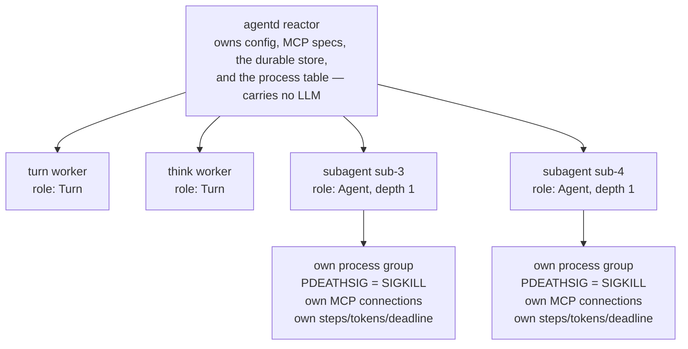
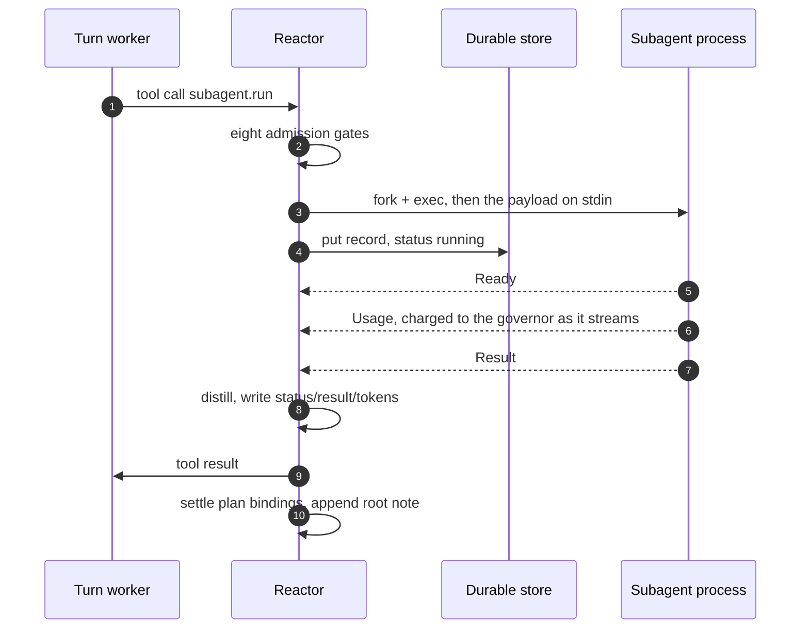
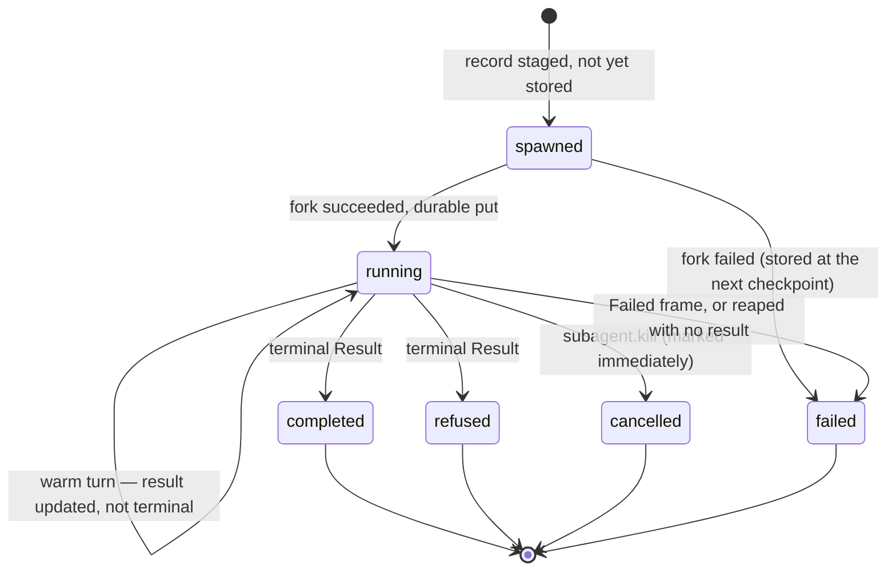

# Subagents: delegation as a process tree

The context window is the scarcest resource an agent has. "Which of these 300
files still call the deprecated auth path?" is answerable, but answering it in
the parent's window means paying for 300 file reads the parent will never need
again — and carrying them for the rest of the run.

A subagent buys the answer without the receipts. It is a separate OS process that
reads the 300 files into its *own* window and hands back a distilled value,
capped at 8,000 bytes for a string result and 400 characters for the note
appended to the root context. The search happened; the transcript of it did not.

That trade — pay for the exploration once, keep the distillate — is the reason to
reach for `subagent.run`. Two more wins come with it.

**An injection firewall.** No protocol path carries a subagent's transcript
upward, and no payload field carries the parent's transcript down. Raw untrusted
bytes never reach a parent holding sensitive or egress-capable tools, and the
child's grant is checked against the lethal trifecta before it is allowed to
exist.

**Blast radius.** A subagent is a process: its own process group, memory, MCP
connections, step/token/deadline budget, and where cgroups exist its own cgroup
leaf. `killpg` on it is instant and total. A wedged child costs you a child, not
the daemon.

## The shape: one flat generation of children

There is one artifact. `agentd` re-execs itself to make a child, setting
`AGENT_SUBAGENT=1`; the re-exec'd process sees that marker and runs the subagent
entry point instead of the daemon.

The runtime tree is **flat**. Every child — a turn worker, a `think` worker, a
subagent — is a direct child of the reactor, keyed by a node id in one map. There
is no nesting between children and no supervision hierarchy to walk.



The reactor never runs a model; all intelligence lives in children. That is why a
subagent carries a full copy of the intelligence config, and why its stdout is a
binary control channel rather than logs — stderr is inherited into the daemon's,
so child telemetry is not captured or re-routed.

So a `subagent.run` issued *by* a turn worker asks the reactor for a **sibling**,
not a descendant: the caller does not own the child. A child orphaned mid-fork
detects it (`getppid() == 1`) and exits, and every child arms
`PR_SET_PDEATHSIG(SIGKILL)` first thing, so a dead daemon collapses its children.

## The spawn

`subagent.run` lands in one chokepoint in the reactor and passes an ordered gate
chain before any process exists. Every gate returns an **error tool result** — a
value the model reads and adapts to — never an exception, never a crash.

| # | Gate | Refused when | Default |
|---|---|---|---|
| 1 | `instruction` | empty or whitespace | — |
| 2 | `mode` | not `sync` / `async` / `detached` / `warm` | `sync` |
| 3 | breadth | live (non-terminal) subagents ≥ `limits.subagents.breadth` | 8 |
| 4 | total | records in the registry ≥ `limits.subagents.total` | 64 |
| 5 | depth | requester depth ≥ `limits.subagents.depth` | 3 |
| 6 | rate | spawn-rate bucket empty (`limits.subagents.rate`) | `8/2s` |
| 7 | memory | cgroup unit at 95% of its `memory.high` | — |
| 8 | trifecta | the narrowed servers carry untrusted-input **and** sensitive **and** egress tags | refuse unless `security.allow_trifecta` |

Only then does the reactor mint a handle (`sub-<n>`), build the payload, stage a
`subagent/<handle>` record at status `spawned`, and fork. The durable write lands
on the far side of the fork: a successful fork flips the record to `running` and
persists it straight away, so a restart finds a live child to re-spawn. A crash
inside the fork window itself leaves nothing behind — there is no record to
restore, and the half-born child collapses on its own.

The fork sets `setpgid(0,0)`, registers the pid with the global reaper
atomically, and retries `EAGAIN` ten times with a rising backoff so a wide
fan-out under process pressure does not fail spuriously. The payload goes down as
the **first control frame on the child's stdin** — not argv, which is
world-readable through `/proc`, and not the environment.

### What the child is handed

The payload is the whole trust boundary. Four fields matter most.

**`context`** is the child's entire transcript seed: `{role, content}` messages
the parent chose to pass, empty by default. No code path hands a subagent the
parent's transcript.

**`servers`** selects which of the parent's MCP servers the child connects to.
This is the narrowing that actually bites — but note the default: **omitting
`servers` inherits every server the parent has.** Narrowing is opt-in. A name
matching no configured server is silently dropped, so a typo yields a quieter
subagent rather than an error. A granted server the child cannot reach within
60 s is fatal for the child.

**`tools`** looks like a per-call allow-list and is not one today. It is stored
on the persisted payload as `allowed_tools` and read by nothing; the registry
gate a subagent is checked against is hardcoded to *no* allow-list, so the
default grants stand and nothing narrows within a granted server. Treat
`servers` as the capability control and `tools` as documentation.

**`output_contract`** is prose appended to the child's brief. Pass
`output_schema` instead and it is folded textually into that contract ("Reply
with ONLY one JSON object matching this JSON Schema: …") — it is *not* validated
for an agent-role subagent. If shape matters, state it in `output_contract` and
check the result yourself.

The child also gets `tls_ca` and a live intelligence bearer token. It does **not**
get A2A peers or the AAuth identity — both are hardcoded empty on spawn — so it
cannot delegate onward over A2A and does not sign under the tree identity. It has
**no internal self-tools at all**: its surface is the tools of its granted MCP
servers, plus `resource.read` when those servers expose resources.

## Depth and breadth in practice

Depth is minted, never claimed. The supervisor reads the requester's depth from
the requester's stored record and checks *that*; the child's payload gets it plus
one. A root caller is depth 0, so its children are depth 1.

In a default build, **depth beyond 1 is unreachable**, for two independent
reasons: `subagent.*` is granted to the root context and to workflows but not to
subagents, and an agent-role child has no self-tools to call it with. The depth
cap is a backstop for operators who deliberately re-grant `subagent.run`.

Breadth counts *live* subagents and is the one you will meet. Total counts
**every record in the registry**, finished and restored included — so a
long-lived daemon eventually refuses on `limits.subagents.total` with nothing
running. Raise it for daemons.

```yaml
config_version: "2"
limits:
  run:                       # inherited by each subagent unless the call overrides
    steps: 500
    tokens: 2000000
    deadline: 1h
  subagents:
    depth: 1
    breadth: 4
    total: 500
    rate: "4/1s"             # burst 4, refilling 4 tokens/sec
```

The bucket refills lazily from wall clock at admission, so a tight churn loop is
refused while the absolute counts are still fine. One caveat: `rate` is read once
at the first spawn of the process lifetime; a config reload does not change it.

## Warm and one-shot

| Mode | Child runs | Caller gets |
|---|---|---|
| `sync` | one bounded turn — a whole ReAct loop, up to `steps` — then exits | the result when it lands (the call is parked, not blocking) |
| `async` | the same single turn | the handle now; `subagent.await` collects |
| `detached` | the same single turn | the handle now; nobody waits |
| `warm` | stays alive, one turn per message | the handle now; `subagent.send` steers it |

A **warm** subagent prepares its session once, runs its instruction as the first
turn, then runs one turn per message injected with `subagent.send`. Messages
arrive on the child's control thread and queue over an in-process channel, so a
message sent mid-turn is not lost — turns consume them in order. Each turn gets a
**fresh** step/token/deadline budget, so one expensive reaction cannot starve the
session. Warm sessions also get the intelligence all-down backoff, riding out a
transient model outage; a one-shot exits with the intelligence-unavailable code
instead.

Two sharp edges:

- **The supervisor's deadline is absolute and armed once**, at spawn, as the
  child's deadline plus 60 seconds; there is no re-arm path. A warm session meant
  to live for hours needs `limits.deadline` covering that whole life.
- **A warm session's terminal result is null.** On close it emits one terminal
  frame with a null body, and that null overwrites the last turn's distilled
  result in the record. Read warm output from the per-turn root notes, or poll
  `subagent.status` while it is alive — never from the record afterwards.

## How a result comes back



The reactor distils before it stores. A string longer than 8,000 bytes is
truncated at a character boundary and marked `… [truncated]`; a string that
parses as JSON is re-parsed so the caller sees an object, not a quoted blob. What
is *not* capped: an object or array passes through untouched into the record, the
store and the caller's tool result. Constrain size in `output_contract` rather
than trusting the cap.

Where it lands depends on who asked. A tool caller gets
`{handle, status, result, error}`. A workflow step completes with that value as
its output. The root context gets a note (`subagent <handle> <status>:` plus a
400-character distillate) only if `agent.wake_on` includes `subagent_result` —
warm per-turn notes are appended unconditionally and skip that policy. Any plan
item bound to the handle advances automatically, in every context.

## Lifecycle, cancellation, and the kill path



The six terminal statuses are `completed`, `failed`, `cancelled`, `refused`,
`killed` and `crashed`; every waiter tests against that set.

**Liveness is probed, not assumed.** The reactor pings each child and classifies
it on two axes: EOF and the hard deadline dominate; then recent events mean
healthy; then recent pongs mean *busy*; silence on both means stuck. Pongs are
answered by the child's control thread, separate from its agentic loop, so a
child inside a 20-minute model call reads as busy and is left alone. Progress
timeout 120 s, pong timeout 10 s.

**`subagent.kill` is graceful only.** It marks the record `cancelled` and sends a
cancel frame; it arms no ladder for that child. A child that ignores cancellation
keeps running — and keeps spending tokens — until liveness declares it unhealthy,
at which point the reactor cancels again and hard-kills its process group once it
is over a second old. So the record reads `cancelled` before the process is gone,
and it keeps its node pointer: `subagent.send` can still target a dying child.

**Drain is where the ladder lives.** On shutdown every child is cancelled at once
and one shared ladder escalates: cancel, SIGTERM at 5 s, SIGKILL at 7 s, bounded
by `lifecycle.drain_timeout` (25 s). A second signal collapses straight to
SIGKILL; the remainder is force-killed and abandoned. Once a pid is reaped,
further signalling of that node is suppressed, so a recycled pid is never hit. A
child that dies without a terminal frame is failed synthetically, so no waiter
hangs on a crash.

## Restart is not resume

At startup the reactor reads back every `subagent/<handle>` record and re-spawns
the non-terminal ones — except `detached` ones, deliberately abandoned. The
re-spawn bumps `attempt` and re-supplies a fresh intelligence config, because the
stored payload is credential-free: the bearer token is stripped before storage.

What does not survive: **the conversation** (a restored warm subagent replays its
original instruction and seed; no transcript is persisted) and **the waiters**
(in-memory pending entries are gone, so a restored `sync` subagent's completion
reaches the parent only through plan bindings and the root note — a durable
workflow step wait does resume). Design delegated work to be idempotent across a
restart. One further hazard: handle sequence numbers reset to zero on every start
while restored records keep their `sub-N` handles, so a fresh handle can collide
with and overwrite a restored record.

## When not to use a subagent

**When the parent needs the raw material.** Delegation is lossy by construction.
If the next reasoning step needs the 300 files, read them in the parent.

**When the work is a pipeline.** A fixed sequence with retries, waits and
branches is a [workflow](workflows.md) — durable and resumable. A subagent is one
bounded ReAct loop.

**When you need a bounded wait.** `subagent.await`'s `timeout` is declared in the
contract and ignored by the implementation; the only real bound is the child's
liveness deadline. A workflow `subagent` step honours its `timeout`, because that
wait is a durable step record:

```yaml
config_version: "2"
workflows:
  - name: triage
    steps:
      start:
        kind: once
      scan:
        kind: subagent
        depends_on: [start]
        mode: sync
        instruction: "List every call site of legacy_verify under src/auth."
        servers: [code]
        output_contract: "A JSON array of {file, line, snippet}. Nothing else."
        limits: { steps: 80, tokens: 400000, deadline: 9m }
        timeout: 10m
      done:
        kind: finish
        depends_on: [scan]
        output: "{{steps.scan.output}}"
```

**For a long `sync` call from a root turn.** It is bounded by the *calling turn
worker's* deadline, not the subagent's; if the worker is torn down first the
reply is dropped. Prefer `async` plus `subagent.await`, or a workflow step.

**When the child must delegate onward or act as the agent's A2A identity.**
Neither is wired: no self-tools, no inherited peers, no inherited AAuth key.

**When per-tool restriction is the requirement.** `servers` narrows to whole
servers. To hide one tool on a server the child otherwise needs, split the server
or run a separate agentd instance.

## Reference

The `subagent.*` tools are granted to the root context and to workflows, not to
subagents. Over A2A only `send`, `kill` and `status` are exposed (plus a taskless
status read), each gated by the calling principal's command grants; mutating
calls are pushed onto the interface feed, so display clients see them.

| Tool | Notes |
|---|---|
| `subagent.run` | `instruction` required; `mode`, `servers`, `limits`, `context`, `output_contract`, `output_schema`, `tools` optional. `workflow` and `skills` are accepted by the schema and ignored. |
| `subagent.send` | Warm only; refuses a non-warm or non-running handle. |
| `subagent.status` | Status, mode, result, error, tokens. Safe to poll. |
| `subagent.await` | Returns immediately if already terminal; `timeout` ignored. |
| `subagent.kill` | Graceful cancel; marks the record `cancelled` at once. |
| `subagent.list` | Handles, modes, statuses; instruction previews cut to 80 chars. |

Per-run defaults inherited by each subagent unless the call overrides them: 500
steps, 2,000,000 tokens, a 1 h deadline (floor 1 s). `--max-depth` is the CLI
alias for `limits.subagents.depth`.

Log events: `subagent.spawn` (`handle`, `mode`, `node`, `depth`, `servers`),
`subagent.turn`, `subagent.result` (`handle`, `status`, `tokens`, `err`),
`subagent.kill`, `subagent.respawn`, `child.unhealthy` (`node`, `health`). One
trap: `agent_subagents_spawned_total` and `_exited_total` count **every** child,
turn and think workers included, because the counters sit in the generic spawn
and reap paths. Measure subagent volume from the log events or `subagent.list`.
