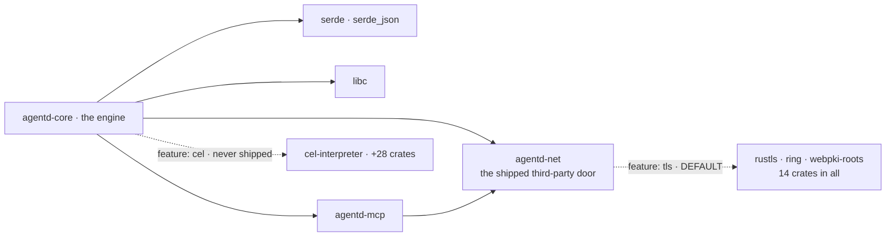

# Why Rust, and why almost nothing else

agentd is a supervisor process that holds an LLM's work in a tree of child
processes it can always kill. It sits idle for days, wakes on a timer or an
event, spawns a child to run a model turn, and holds the credentials for every
endpoint it dials. Long-lived, idle-cheap, spawn-heavy, credential-holding —
those four properties pick the language and the dependency graph before any
argument about syntax.

This is not a claim that Rust is fast: the workload is I/O- and syscall-bound,
and the release profile trades CPU for size (`opt-level = "z"`). It is a claim
that Rust makes a very small dependency graph affordable — and the graph is the
real decision.

## What the runtime has to do

**It must not leak.** A process that wakes five times a second and lives for
weeks turns a small per-iteration leak into an OOM kill.

**It must start instantly.** The same binary is re-exec'd through
`current_exe()` for every subagent and every turn worker, so start-up is paid
per node in the process tree, not once per deployment.

**It must be auditable.** The supervisor holds API keys and brokers whatever a
model asks for; every crate linked into it sits inside that trust boundary. "How
many things do I have to trust?" should have a number for an answer.

**It must be able to stop a model.** The cancel that matters is not dropping a
future. A wedged turn is a child process with an open socket to a provider; the
only thing that reliably ends it is `killpg` on its process group.

Go would satisfy the first three about as well — one static binary, fast start,
no C toolchain, a scheduler comfortable at these thread counts. What Rust adds is
that `std` plus `libc` is enough to write HTTP/1.1, cron, DER parsing and inotify
by hand, without giving up memory safety. That is what makes the next section
affordable.

## The three-dependency moat

The engine's direct external dependencies — the exact check CI runs:

```console
$ cargo tree -p agentd-core --depth 1 --edges normal --prefix none | tail -n +2 | grep -v ' (/'
libc v0.2.186
serde v1.0.228
serde_json v1.0.150
```

Three external crates. The build fails if that count changes
(`.github/workflows/ci.yml`, job `minimalism`).

That pipeline is the definition, so state it plainly: the gate counts **direct**
dependencies, and the `grep` drops the two workspace path crates alongside them —
`agentd-mcp` and `agentd-net`, which are our own code. The default build links
more than three, because TLS is on and `rustls` arrives through `net`.

| Build | Resolved external crates |
|---|---|
| `--no-default-features` | 12 |
| default (`tls`) | 26 |
| shipped release feature set | 26 |
| `--features cel,workflow` | 54 |

The framing survives structurally: every third-party crate a shipped build links
is quarantined in `crates/net`, a 2,093-line `serde`-free leaf that depends on
nothing else in the workspace. Exactly two opt-in edges bypass it, both declared
in the engine's own manifest — `cel-interpreter` behind `cel`, and the `ring`
that `aauth` reuses from `rustls`. The moat is not "we have three dependencies";
it is that third-party code has one door in every shipped build, and CI watches
it. `deny.toml` backs that up: wildcards and yanked crates denied, a
hand-maintained permissive-only license allow-list.



Capability is a compile-time decision with the same shape. Of fourteen named
features, nine are literally empty arrays — they gate hand-rolled code and cost
nothing — and two chain only to other in-tree features. Three touch the
dependency line: `tls`; `aauth`, which adds zero crates because its Ed25519
signing reuses the `ring` that `rustls` already resolved; and `cel`, which takes
the tree from 26 crates to 54. `cel` never ships, and a build without it rejects
a graph that uses CEL at define time rather than mis-evaluating it later.

## What memory safety buys, and what it does not

Hand-writing parsers is the risky half of this design, so be precise about the
risk Rust removes. It removes one bug class: a length error in the DER walk or
the chunked-body decoder is a wrong answer or a panic, not a heap overflow. Under
`panic = "abort"` that panic kills the supervisor loudly and collapses its
children behind it via `PR_SET_PDEATHSIG`, rather than limping on with corrupt
state.

It removes nothing else. Memory safety does not make a subset parser correct,
stop prompt injection, authenticate a peer, or bound what a model asks a tool to
do — [security.md](security.md) covers the machinery that does. A memory-safe
SSRF is still an SSRF, which is why the egress classifier is composed explicitly
at the one call site where a model supplies a URL. The parsers carry their bounds
by hand: bodies cap at 8 MiB, and caller-supplied headers are scanned for CR/LF
at the framing layer, closing header injection once.

## The hand-rolled ledger

| Hand-rolled | Where | What a dependency would have cost |
|---|---|---|
| HTTP/1.1 client + SSE reader | `net/src/http.rs`, 644 lines | `ureq` → `url` → IDNA → ICU |
| X.509 field extraction | `net/src/x509.rs`, 303 lines | `x509-parser` |
| YAML subset reader | `config/yaml.rs`, 1,307 lines | `serde_yaml` (unmaintained) |
| JSON Schema subset (2020-12) | `jsonschema.rs`, 803 lines | a validator **and** a regex engine |
| 5-field UTC cron | `triggers/timer.rs`, 215 lines | `croner` / `cron` |
| Prometheus exposition text | `obs/metrics.rs` | `prometheus` / `metrics` |
| OTLP export over HTTP/JSON | `obs/otel.rs` | `opentelemetry` + protobuf + tonic → tokio |
| NDJSON logger | `obs/log.rs` | `tracing` + a subscriber stack |
| ConfigMap watch | `config/watch.rs`, raw `libc` inotify | `notify` / `inotify` |
| SHA-256, HMAC, AWS SigV4 | `sha.rs`, `auth/aws.rs` | `sha2` + `hmac`, an AWS SDK |
| Token bucket, ULID, base64, FNV-1a | tens of lines each | `governor`, `ulid`, `base64` |

The rule is visible in the table: hand-roll where the specification is small,
frozen, and only partly needed. HTTP/1.1 request framing does not change; a cron
expression is five fields. What you write is a *subset*, and the subset is the
point — the JSON Schema validator carries no regex engine because its schemas do
not need one. And `net::http` is generic over `Read + Write`, so
`rustls::StreamOwned` drops into the same request path with no branch.

TLS is the honest exception: nobody should hand-roll it, so `rustls` is a default
dependency and brings fourteen crates. It also means the default build compiles
C — `ring` carries `cc` as a build dependency and produces 30 object files. What
`ring` avoids is `cmake` and `aws-lc-rs`, not a C compiler — only
`--no-default-features` is C-free.

## No async runtime

The runtime is a single-writer reactor: one thread drains its channels, fires
timers, dispatches turns, checkpoints, then blocks on exactly one
`recv_timeout`. Durable state is mutated there and nowhere else.


"No async runtime" does not mean single-threaded. There is a reader thread per
child, executor threads for blocking MCP and HTTP work, a thread per served
connection, and a background SSE pump. The invariant is narrower and stronger:
none of them mutate state. They post events; one thread decides.

The load-bearing property is **abandon, don't interrupt**. The supervisor reaches
every pipe through an `mpsc` it `recv_timeout`s, and unblocks a parked reader only
by making the producer go away. Pipes therefore carry no read timeout: one would
create a second, racing notion of "stuck".

Cancellation is enforced by the kernel at three points. Each child gets its own
process group (`setpgid` in `pre_exec`), sets `PR_SET_PDEATHSIG(SIGKILL)` after
exec, and the supervisor sets `PR_SET_CHILD_SUBREAPER` so orphaned grandchildren
reparent to agentd rather than host init. Teardown walks the tree deepest-first
through a bounded ladder: cancel → `killpg(SIGTERM)` → `killpg(SIGKILL)` → reap.
This is the argument against an async runtime that is not about taste:
future-drop cannot end a child process, and the child process is the thing that
needs ending.

Blocking I/O buys the mundane: stack traces that mean something, a debugger
showing a call stack instead of an executor frame, no function colouring, no
starvation of a shared pool.

It gives up as much. Thread-per-fd does not scale to thousands of connections:
the envelope is ~60–65 threads and ~130 descriptors, far inside Linux limits and
nowhere near C10K. A slow DNS resolution occupies a thread for its
duration. And the loop is not a pure event-driven park: it waits
`min(next_wake, TICK)`, so a timer due in 3 ms fires in 3 ms, but the floor is a
200 ms poll rather than an `epoll` sleep.

## The numbers, and where they come from

Measured on an x86_64 **glibc, dynamically linked** release build (LTO,
stripped, `opt-level = "z"`):

| Build | Binary | gzip |
|---|---|---|
| `--no-default-features` | 3,017,664 B (2.88 MiB) | 1.25 MiB |
| default (`tls`) | 4,012,008 B (3.83 MiB) | 1.77 MiB |
| shipped feature set | 4,645,808 B (4.43 MiB) | 2.05 MiB |

TLS costs +971 KiB (+33%); the eight further shipped features add +619 KiB
(+16%) and zero dependencies.

An idle daemon running a schedule workflow: `Threads: 1`, `VmRSS` 3.8–3.9 MiB,
and **0 CPU ticks** over 10 seconds at `CLK_TCK=100` — under 0.1% of a core,
despite the 200 ms tick.

Spawn cost is easily misquoted. A loop of 100 `agentd --version` invocations
costs ~2.7 ms each on this build, against a `/bin/true` floor of ~0.93 ms —
roughly 1.8 ms marginal, most of it dynamic linking. Sub-millisecond start-up
figures refer to the shipped static-PIE musl artifact, which has no `ld.so`;
not the same measurement.

## Where the choice hurts

**Compile times.** `lto = true`, `codegen-units = 1` and `opt-level = "z"` are
right for a shipped appliance and wrong for a fast edit loop. CI compounds it:
17 feature rows, two crates each, clippy and tests — because `--all-features`
unification hides a build that is broken on its own.

**You own the hand-rolled code forever.** 84,322 lines across the workspace,
65,170 in the engine. The YAML reader is a subset; the cron parser is 5-field UTC
only and finds the next fire by stepping a minute at a time for up to four years.
Each is a spec revision you will handle yourself, and a bug nobody else reports.

**`unsafe` is quarantined, not absent, and `panic = "abort"` is unforgiving.**
Zero `unsafe` in `net` and `mcp`; 48 blocks in the engine, 20 of them env-var
juggling inside `#[cfg(test)]` (edition 2024 made `set_var` unsafe) and the
remaining 28 libc FFI across eight files. A panic in the supervisor path takes
the whole tree down by design, which makes every `unwrap` an availability
decision.

**The learning curve is real.** Edition 2024, a `rust-version` floor of 1.88, a
transport generic over `Read + Write`, raw signal handling: working here demands
comfort with async-signal-safety rules, not only the borrow checker.

The moat is not a religion, and it has a documented exit hatch: each protocol's
wire types sit behind `serde` in one module — `wire/intel.rs` for intelligence,
`mcp::wire` for MCP — precisely so the codec could be swapped for a lighter
encoder mechanically, if proc-macro compile weight ever has to go. Specified in
[`rfcs/0004`](../rfcs/0004-mcp-client-subset-and-codec.md) and
[`rfcs/0006`](../rfcs/0006-intelligence-transport-and-wire.md); the reactor in
[`rfcs/0002`](../rfcs/0002-supervisor-reactor-and-concurrency.md), mapped module
by module in [architecture.md](architecture.md).
