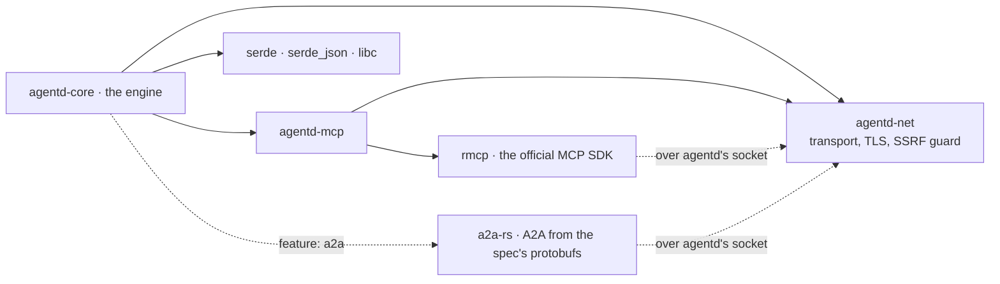
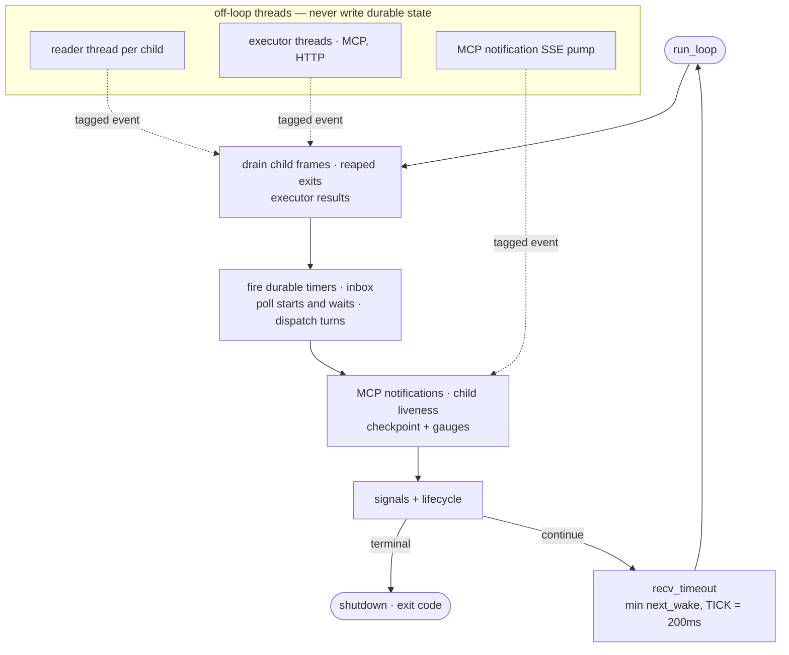

# Why Rust, and why almost nothing else

agentd is a supervisor process that holds an LLM's work in a tree of child
processes it can always kill. It sits idle for days, wakes on a timer or an
event, spawns a child to run a model turn, and holds the credentials for every
endpoint it dials. Long-lived, idle-cheap, spawn-heavy, credential-holding —
those four properties pick the language and the dependency graph before any
argument about syntax.

This is not a claim that Rust is fast: the workload is I/O- and syscall-bound,
and the release profile trades CPU for size (`opt-level = "z"`). It is a claim
about what the language makes affordable — writing the parts that are small and
frozen by hand, on `std` and `libc`, while what ships stays one static binary
with nothing else in the image.

## What the runtime has to do

**It must not leak.** A process that wakes five times a second and lives for
weeks turns a small per-iteration leak into an OOM kill.

**It must start instantly.** The same binary is re-exec'd through
`current_exe()` for every subagent and every turn worker, so start-up is paid
per node in the process tree, not once per deployment.

**It must be auditable.** The supervisor holds API keys and brokers whatever a
model asks for; every crate linked into it sits inside that trust boundary. That
argues for a small graph — and it argued, for a while, against depending on
anyone else for MCP and A2A. The next section is why that was wrong.

**It must be able to stop a model.** The cancel that matters is not dropping a
future. A wedged turn is a child process with an open socket to a provider; the
only thing that reliably ends it is `killpg` on its process group.

Go would satisfy the first three about as well — one static binary, fast start,
a scheduler comfortable at these thread counts. What Rust adds is that `std` plus
`libc` is enough to write HTTP/1.1, cron, DER parsing and inotify by hand,
without giving up memory safety.

## Two protocols we do not implement

agentd used to implement MCP and A2A itself, and for a while that was defensible:
both are small, and a hand-written subset is auditable in a way a dependency
tree is not. It stopped being defensible for a reason worth stating plainly,
because it is the argument against the version of this document that came
before.

A protocol you implement from your own reading of the specification fails in one
particular way: **silently, in the peer**. The tests you write encode the same
reading as the code, so they agree with it. What finally disagrees is somebody
else's client, in production, and what it reports is nothing — a message that
never arrived, a task that never looked finished. We proved this on ourselves:
checking agentd's A2A output against an independent implementation of the same
spec found four such faults in an hour, every one of them valid JSON.
([a2a.md](a2a.md) lists them.)

So MCP is [`rmcp`](https://github.com/modelcontextprotocol/rust-sdk), the
official Rust SDK, and A2A is [`a2a-rs`](https://github.com/emillindfors/a2a-rs),
an implementation generated from the specification's protocol buffers. They own
the handshakes, the typed request and response shapes, capability negotiation,
the streaming rules, the error codes and the version tables. agentd tracks the
specifications by upgrading a dependency rather than by re-reading a document.

What agentd kept is the part a protocol crate has no opinion about: **the
socket**. Both SDKs plug into agentd's own HTTP transport, so adopting them cost
nothing that was already working — an AAuth request signature with its
challenge/re-sign loop, an AWS SigV4 signature per request, an mTLS client
identity, a refreshed OAuth token, the SSRF guard on every dial. rmcp's
`StreamableHttpClient` and a2a-rs's ports are both traits; that seam is the whole
integration.

### What that costs, and what it does not

| Build | External crates |
|---|---|
| `--no-default-features` | 78 |
| default (`tls` + MCP) | 91 |
| shipped release feature set (adds A2A) | 187 |

An earlier version of this page counted three direct dependencies and had CI
fail the build if that number moved. That gate is gone, replaced by one that
guards what actually reaches a user: the release binary is still a **statically
linked musl artifact that runs on `scratch`** — 6.5 MiB, 3.0 MiB gzipped, no
shell, no libc, no package manager. The dependency count moved by two orders of
magnitude; the attack surface of the thing that ships did not.

The build gained a C toolchain, because `aws-lc-sys` arrives underneath the SDKs
and compiles C at build time. That is a builder-image cost (`cmake`, `g++`), not
a runtime one.

Quarantine survives as a habit rather than a rule: third-party code still
reaches the engine through `crates/net` and `crates/mcp`, and `deny.toml` still
denies wildcards and yanked crates against a hand-maintained permissive-only
licence allow-list. What is no longer true is that you can hold the whole
dependency graph in your head. Trading that for protocol implementations two
independent readings agree on was the right trade, and it should be described as
a trade rather than as a win.

## What memory safety buys, and what it does not

Hand-writing parsers is the risky half of this design, so be precise about the
risk Rust removes. It removes one bug class: a length error in the DER walk or
the chunked-body decoder is a wrong answer or a panic, not a heap overflow. Under
`panic = "abort"` that panic kills the supervisor loudly and collapses its
children behind it via `PR_SET_PDEATHSIG`, rather than limping on with corrupt
state.

It removes nothing else. Memory safety does not make a subset parser correct,
stop prompt injection, authenticate a peer, or bound what a model asks a tool to
do — [security.md](security.md) covers the machinery that does. A memory-safe
SSRF is still an SSRF, which is why the egress classifier is composed explicitly
at the one call site where a model supplies a URL. The parsers carry their bounds
by hand: bodies cap at 8 MiB, and caller-supplied headers are scanned for CR/LF
at the framing layer, closing header injection once.

## The hand-rolled ledger

| Hand-rolled | Where | What a dependency would have cost |
|---|---|---|
| HTTP/1.1 client + SSE reader | `net/src/http.rs`, 644 lines | `ureq` → `url` → IDNA → ICU |
| X.509 field extraction | `net/src/x509.rs`, 303 lines | `x509-parser` |
| YAML subset reader | `config/yaml.rs`, 1,307 lines | `serde_yaml` (unmaintained) |
| JSON Schema subset (2020-12) | `jsonschema.rs`, 803 lines | a validator **and** a regex engine |
| 5-field UTC cron | `triggers/timer.rs`, 215 lines | `croner` / `cron` |
| Prometheus exposition text | `obs/metrics.rs` | `prometheus` / `metrics` |
| OTLP export over HTTP/JSON | `obs/otel.rs` | `opentelemetry` + protobuf + tonic → tokio |
| NDJSON logger | `obs/log.rs` | `tracing` + a subscriber stack |
| ConfigMap watch | `config/watch.rs`, raw `libc` inotify | `notify` / `inotify` |
| SHA-256, HMAC, AWS SigV4 | `sha.rs`, `auth/aws.rs` | `sha2` + `hmac`, an AWS SDK |
| Token bucket, ULID, base64, FNV-1a | tens of lines each | `governor`, `ulid`, `base64` |

The rule is visible in the table: hand-roll where the specification is small,
frozen, and only partly needed. HTTP/1.1 request framing does not change; a cron
expression is five fields. What you write is a *subset*, and the subset is the
point — the JSON Schema validator carries no regex engine because its schemas do
not need one. And `net::http` is generic over `Read + Write`, so
`rustls::StreamOwned` drops into the same request path with no branch.

Two things are deliberately *not* in that table, and the reason is the same one:
you hand-roll where the specification is small, frozen, and only partly needed —
and neither TLS nor a wire protocol with a live specification is any of those.
TLS is `rustls`; MCP and A2A are their SDKs. Both compile C at build time
(`ring`'s `cc`, `aws-lc-sys`'s `cmake`), which is a builder cost and not a
shipping one.

## No async runtime

The runtime is a single-writer reactor: one thread drains its channels, fires
timers, dispatches turns, checkpoints, then blocks on exactly one
`recv_timeout`. Durable state is mutated there and nowhere else.

"No async runtime" does not mean single-threaded. There is a reader thread per
child, executor threads for blocking MCP and HTTP work, a thread per served
connection, and a background SSE pump. The invariant is narrower and stronger:
none of them mutate state. They post events; one thread decides.

The load-bearing property is **abandon, don't interrupt**. The supervisor reaches
every pipe through an `mpsc` it `recv_timeout`s, and unblocks a parked reader only
by making the producer go away. Pipes therefore carry no read timeout: one would
create a second, racing notion of "stuck".

Cancellation is enforced by the kernel at three points. Each child gets its own
process group (`setpgid` in `pre_exec`), sets `PR_SET_PDEATHSIG(SIGKILL)` after
exec, and the supervisor sets `PR_SET_CHILD_SUBREAPER` so orphaned grandchildren
reparent to agentd rather than host init. Teardown walks the tree deepest-first
through a bounded ladder: cancel → `killpg(SIGTERM)` → `killpg(SIGKILL)` → reap.
This is the argument against an async runtime that is not about taste:
future-drop cannot end a child process, and the child process is the thing that
needs ending.

Blocking I/O buys the mundane: stack traces that mean something, a debugger
showing a call stack instead of an executor frame, no function colouring, no
starvation of a shared pool.

It gives up as much. Thread-per-fd does not scale to thousands of connections:
the envelope is ~60–65 threads and ~130 descriptors, far inside Linux limits and
nowhere near C10K. A slow DNS resolution occupies a thread for its
duration. And the loop is not a pure event-driven park: it waits
`min(next_wake, TICK)`, so a timer due in 3 ms fires in 3 ms, but the floor is a
200 ms poll rather than an `epoll` sleep.

## The numbers, and where they come from

The artifact that ships is a static-PIE musl build (LTO, stripped,
`opt-level = "z"`) of the release feature set:

| | Size |
|---|---|
| binary | 6,858,216 B (6.54 MiB) |
| gzipped | 2.99 MiB |

That is the whole image: `FROM scratch` plus this file. Adopting two protocol
SDKs roughly doubled it and left everything else about the image unchanged.

An idle daemon running a schedule workflow: `Threads: 1`, `VmRSS` 3.8–3.9 MiB,
and **0 CPU ticks** over 10 seconds at `CLK_TCK=100` — under 0.1% of a core,
despite the 200 ms tick.

Spawn cost is easily misquoted. A loop of 100 `agentd --version` invocations
costs ~2.7 ms each on this build, against a `/bin/true` floor of ~0.93 ms —
roughly 1.8 ms marginal, most of it dynamic linking. Sub-millisecond start-up
figures refer to the shipped static-PIE musl artifact, which has no `ld.so`;
not the same measurement.

## Where the choice hurts

**Compile times.** `lto = true`, `codegen-units = 1` and `opt-level = "z"` are
right for a shipped appliance and wrong for a fast edit loop. CI compounds it:
17 feature rows, two crates each, clippy and tests — because `--all-features`
unification hides a build that is broken on its own.

**You own the hand-rolled code forever.** 84,322 lines across the workspace,
65,170 in the engine. The YAML reader is a subset; the cron parser is 5-field UTC
only and finds the next fire by stepping a minute at a time for up to four years.
Each is a spec revision you will handle yourself, and a bug nobody else reports.

**`unsafe` is quarantined, not absent, and `panic = "abort"` is unforgiving.**
Zero `unsafe` in `net` and `mcp`; 48 blocks in the engine, 20 of them env-var
juggling inside `#[cfg(test)]` (edition 2024 made `set_var` unsafe) and the
remaining 28 libc FFI across eight files. A panic in the supervisor path takes
the whole tree down by design, which makes every `unwrap` an availability
decision.

**The learning curve is real.** Edition 2024, a `rust-version` floor of 1.88, a
transport generic over `Read + Write`, raw signal handling: working here demands
comfort with async-signal-safety rules, not only the borrow checker.

The moat is not a religion, and it has a documented exit hatch: each protocol's
wire types sit behind `serde` in one module — `wire/intel.rs` for intelligence,
`mcp::wire` for MCP — precisely so the codec could be swapped for a lighter
encoder mechanically, if proc-macro compile weight ever has to go. Specified in
[`rfcs/0004`](../rfcs/0004-mcp-client-subset-and-codec.md) and
[`rfcs/0006`](../rfcs/0006-intelligence-transport-and-wire.md); the reactor in
[`rfcs/0002`](../rfcs/0002-supervisor-reactor-and-concurrency.md), mapped module
by module in [architecture.md](architecture.md).
