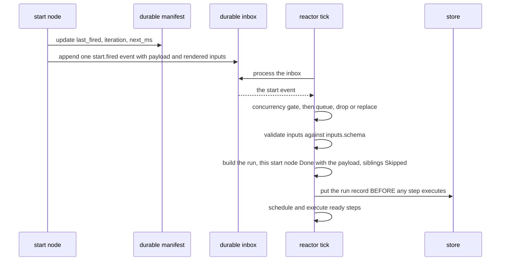
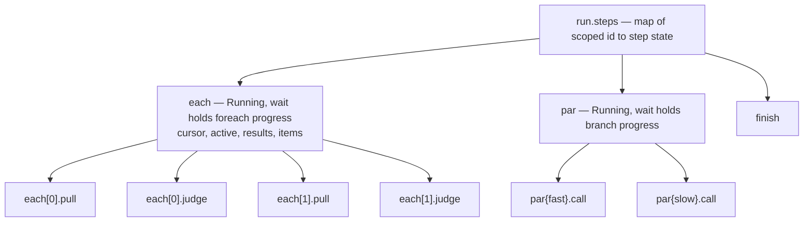
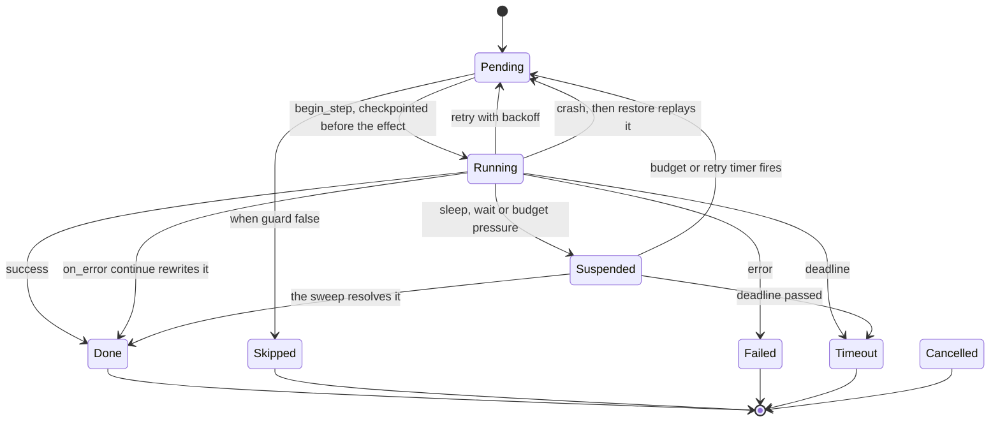
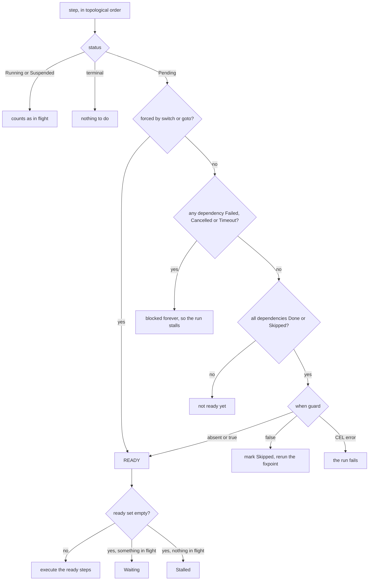

# Workflows: durable graphs of work

An agent turn is a conversation — one context, one thread of reasoning, nothing
on disk between tool calls. That is the right shape for a bounded task and the
wrong shape when the work runs for hours, fans out over four hundred records,
has to survive a restart, or must stop and wait for a person. A **workflow** is
the alternative: a named, strictly validated graph of steps whose entire
execution state lives in one durable record that agentd writes *before* each
step's side effect. Kill the process mid-run and it resumes from that record.

This page is the working guide — how a document is put together, how runs begin,
what each node kind accepts, how data moves, and what durability does and does
not promise. `agentd --workflow-schema` prints the node catalogue your build
compiled, as JSON Schema — that output is the authoritative grammar for the
binary you are running.

## When a graph beats a conversation

Reach for a workflow when at least one of these is true:

- **The work must survive a crash.** A run's state is checkpointed before every
  effect. A conversation is not.
- **Steps are independent.** Two steps that do not `depends_on` each other run
  concurrently, with no orchestration code from you.
- **The shape repeats.** Fan out over a list with bounded parallelism, loop
  until a judge approves, race two sources — declared, and resumable.
- **Something must wait.** A run can suspend on a signal, a child run, an
  inbound webhook or a human answer, and costs nothing while suspended.
- **You need boundaries.** Timeouts, retries, budgets, caches and output schemas
  apply per step, not to one opaque turn.

Stay with a plain agent turn when the task is open-ended and the model should
choose the sequence. A workflow fixes that sequence at authoring time: a step
that turns out to need an unanticipated decision cannot invent one. The trade-off
is rigidity in exchange for resumability.

## Editor autocomplete

A standalone workflow file gets completion from the published schema — every
node `kind`, each kind's fields, and the enums:

```yaml
# yaml-language-server: $schema=https://agentd.dev/schema/workflow.json
name: sync-account
steps:
  s: {kind: schedule, cron: "0 7 * * 1-5"}
```

Workflows written *inline* in a config file are covered by the config schema,
which folds this one in — see
[Editor autocomplete](configuration.md#0-editor-autocomplete). Cross-field
rules still belong to `agentd --validate-config`.

## The anatomy of a workflow document

A workflow is an object under `workflows:` in a `config_version: "1"` settings
file. The top-level keys are a closed set — anything else is a parse error.

| Key | Meaning |
|---|---|
| `name` | required; must match `[a-zA-Z_][a-zA-Z0-9_-]{0,63}` |
| `version` | the document version; defaults to `3`, and `3` is the only value accepted if written |
| `description` | free text |
| `armed` | default `true`; `false` loads the definition without arming its triggers |
| `inputs` | `{schema: <JSON Schema>}` — enforced when a run is created |
| `outputs` | `{schema: …}` — the shape the run promises its caller; a `finish` that would complete the run with an output that does not match it fails the step instead |
| `concurrency` | `{max_runs, on_overflow, scope}` — default 4 runs, `queue`, `scope: workflow`. `scope: key` counts against `key` instead, which is the difference between a queue and a per-entity lock (see §keys). |
| `key` | the logical thing a run is ABOUT, rendered from the trigger payload: `key: "{{ payload.account_id }}"`. Required by `concurrency.scope: key`. |
| `tool` | `{name, mode, grant}` — register this workflow as a callable tool (see §workflow tools). Startup config only. |
| `limits` | `{steps, tokens, deadline, budget}` for the whole run |
| `priority` | `low\|normal\|high` (default `normal`) — contention weight: `low` admissions shed one pressure level early (at *warn*), and each tick schedules ready steps of higher-priority runs first. A tiebreak under scarcity, not a reservation. |
| `unload` | `{policy: drain\|cancel\|detach, timeout}` — what happens to LIVE runs when this definition is retired (removed, replaced, or deleted). Default `drain`: they finish. See §retirement below. |
| `durable` | default `true` (or the `store.durability.work` deployment default) — `false` makes runs memory-only: no run record, no checkpoints, forgotten by a restart. The fast path for recomputable work; see §durability. |
| `state` | declares the run variables: a per-key `schema` that gates every write, and/or a `reducer` saying how concurrent writes combine (see §declared state) |
| `steps` | the graph: an object of step id to step |
| `file` / `uri` | load the document from a path or an MCP resource instead of inline (a config entry can also use `url:` with headers, or a `dir:`+`glob:` scan — see the configuration doc §6.1) |

A complete, runnable example:

```yaml
config_version: "1"
intelligence:
  endpoints: https://api.openai.com/v1
  model: gpt-5.1
  token: "{{secret:OPENAI_KEY}}"
store: { kind: mcp, mcp: { server: state } }
mcp:
  servers:
    - { name: state, endpoint: https://mcp-state.internal/mcp }
workflows:
  - name: digest
    limits: { deadline: 10m }
    steps:
      start: { kind: once }
      fetch:
        kind: http
        depends_on: [start]
        url: https://api.example/incidents?window=24h
        headers: { Authorization: "Bearer {{secret:API_TOKEN}}" }
        expect: [200]
      brief:
        kind: agent
        depends_on: [fetch]
        instruction: |
          Summarise these incidents in five bullets.
          {{steps.fetch.output.json}}
      done:
        kind: finish
        depends_on: [brief]
        output: "{{steps.brief.output}}"
lifecycle: { run_until: idle }
```

```console
$ agentd --validate-config -c digest.yaml
$ agentd -c digest.yaml
```

`run_until: idle` gives a job: the process exits once nothing is in flight, with
an exit code derived from the `once` run's terminal status. `drained` keeps the
process alive for long-lived triggers. `auto` (the default) picks the job shape
when there is no A2A listener and no `loop`, `schedule`, `subscribe`, `signal`
or `event` start node — re-checked against workflows the agent creates at
runtime, so an instance never idles out from under work it was asked to set up.

## How a run starts

A **start node** is a step whose kind is a trigger. It never creates a run
directly. It renders its optional `inputs` mapping, updates its durable trigger
state, and appends one event to the durable inbox. The reactor turns that event
into a run on a later pass. Everything in between is a gate you can reason about.



Two consequences. The firing start node's own output *is* the trigger payload, so
`{{steps.hook.output.body}}` reads the request body. And when a workflow has
several start nodes, a run fires exactly one and marks the rest `Skipped` — which
counts as satisfied, so a step depending on any of them still runs.

| Start kind | Fields (**required** in bold) |
|---|---|
| `once` | `policy`, `inputs` |
| `manual` | `inputs` |
| `loop` | `interval`, `delay`, `until`, `max_iterations`, `backoff`, `inputs` |
| `schedule` | `cron`, `every`, `tz`, `jitter`, `catch_up`, `at`, `inputs` |
| `subscribe` | **`server`**, **`uri`**, `debounce_ms`, `coalesce`, `filter`, `deliver`, `on_no_listener`, `window`, `inputs` |
| `signal` | **`name`**, `filter`, `deliver`, `inputs` |
| `event` | **`on`**, `filter`, `inputs` |
| `stream` | **`stream`**, `subject`, `filter`, `from`, `rate`, `inputs` |
| `webhook` | **`path`**, `methods`, `auth`, `parallelism`, `on_overflow`, `rate`, `idempotency`, `respond`, `filter`, `signal`, `inputs` |

Behaviour the field names do not give away:

- `once` with the default `policy: ensure` will not fire if a run is live, if a
  run ever started at that node, or if its start event is still queued.
  `policy: always` fires unconditionally.
- `loop` fires the moment it is armed (unless a run is live or `delay` is set)
  and re-arms only when the run finishes. `until` is CEL over
  `{outcome: {ok, output}, last}`; a failed run waits `backoff.initial` instead
  of `interval`.
- `schedule` computes the next occurrence from *now*, so missed occurrences are
  skipped, never replayed. `at` is a delay, not a wall-clock time. `cron` needs
  the `cron` build feature. `tz`, `jitter` and `catch_up` parse but nothing
  reads them.
- `subscribe` is notify-then-read: an MCP resource update makes it re-read the
  resource and apply the CEL `filter` over `content`. `debounce_ms` keeps the
  newest payload and fires when the window closes. `window: {samples: N}`
  (N ≤ 256) additionally keeps a durable ring of the last N read values and
  delivers it as `output.window`, oldest→newest — for streams where the signal
  is a trend, not a reading. The ring accrues on every filter-passing update,
  including ones a debounce coalesces away: debouncing drops *firings*, the
  window keeps the *samples*.
- `event` fires on lifecycle events. A terminal run raises `workflow.finished`
  when it completed, `workflow.failed` when it failed, stalled, was cancelled or
  was refused. The start step's output is **wrapped**:
  `{event: "workflow.finished", payload: {run, workflow, status}}` — so
  downstream steps read `{{steps.<id>.output.payload.workflow}}`, while the
  CEL `filter` sees the inner object directly (`payload.workflow == "job"`).
  An `inputs:` mapping that fails to render (a typo'd path) refuses to fire,
  loudly (`start.inputs.invalid`) — never silently with empty inputs.
- `webhook` deduplicates on the `Idempotency-Key` header by default — a replay
  answers `200 duplicate` and fires no second run. `respond: sync` holds the
  response open until the run reaches a terminal state. `rate: "<burst>/<per>s"`
  (e.g. `"20/1s"`, the same spelling as A2A quotas) bounds how fast requests are
  *admitted* — past the burst the route answers `429` with a `Retry-After`,
  before anything is written to the durable inbox. `parallelism` bounds how many
  run at once; `rate` bounds how fast they arrive. Under resource pressure
  (see the operations doc) every route sheds with `429` regardless of `rate` —
  authentication is still checked first, so an unauthenticated probe learns
  nothing about load.

A trigger's `inputs` is a mapping rendered against `{payload, env}` and lands in
the run as the `inputs` namespace, validated against the workflow's
`inputs.schema`. Two exceptions: `once` passes its mapping through unrendered,
and `manual` ignores it in favour of the `inputs` its caller supplies.

```yaml
# A `webhook` node needs a listener to arrive on, or validation refuses the
# config. A loopback `http://` bind is allowed; a public bind must be `https://`
# with `webhooks.tls: {cert, key}`.
webhooks:
  listen: http://127.0.0.1:8088

workflows:
  - name: on-ci
    concurrency: { max_runs: 8, on_overflow: queue }
    inputs:
      schema:
        type: object
        required: [build]
        properties: { build: { type: string } }
    steps:
      hook:
        kind: webhook
        path: /hooks/ci
        methods: [POST]
        auth: { hmac: { secret: "{{secret:HOOK_SECRET}}" } }
        inputs: { build: "{{payload.body.build_id}}" }
      look:
        kind: http
        depends_on: [hook]
        url: "https://ci.example/builds/{{inputs.build}}"
      note:
        kind: summarize
        depends_on: [look]
        input: "{{steps.look.output.json}}"
      done: { kind: finish, depends_on: [note], output: "{{steps.note.output}}" }
```

Invalid inputs are not an error you can catch: the event is logged as
`run.inputs.invalid`, consumed, and no run is created.

## The node catalogue

There are 72 kinds, and all of them are wired. The four A2A ones split by
direction and by whether they block: `a2a` is a START node (an inbound message
whose command matches begins a run), `a2a.send` notifies a peer without waiting,
`a2a.wait` suspends until a message lands on a conversation, and `a2a.delegate`
is the request/response pairing of the two — send an objective, block, take the
result.

Every step also accepts the cross-cutting fields, on any kind:
`kind`, `depends_on`, `when`, `retry`, `timeout`, `on_error`, `idempotent`,
`on_replay`, `output_schema`, `cache`, `budget`, `skills`, `otel`, `description`.
`idempotent` and `otel` parse but no runtime code reads them; `on_replay` is
read at restore, where it decides what happens to a step caught in flight.

### Ask the model something

| Kind | Fields (**required** in bold) |
|---|---|
| `agent` | **`instruction`**, `output_contract`, `output_schema`, `tools`, `servers`, `limits`, `context`, `skills`, `system` |
| `think` | **`prompt`**, `output_schema`, `reads`, `check`, `retries`, `skills`, `system` |
| `subagent` | **`instruction`** *or* **`template`** (never both), `params` (only with `template`), `mode`, `tools`, `servers`, `limits`, `priority`, `context`, `output_contract`, `output_schema`, `skills`, `durable` |
| `classify` | **`input`**, **`classes`**, `prompt`, `skills` |
| `extract` | **`input`**, **`output_schema`**, `prompt`, `skills` |
| `summarize` | **`input`**, `length`, `prompt`, `skills` |
| `judge` | **`input`**, **`rubric`**, `prompt`, `skills` |
| `route` | **`input`**, **`choices`**, `prompt`, `skills` |

`agent` takes a full tool-using turn against the workflow caller's tool plan,
with rounds bounded only by the step's budget and limits. `think` is the
tool-free variant, capped at three rounds. The five presets are sugar: each
synthesises a fixed prompt frame and output schema and runs through the same
`think` machinery. `think` takes `prompt`; `agent` and `subagent` take
`instruction` — the fields are not interchangeable, and using the wrong one is a
validation error.

### Reach outside the process

| Kind | Fields (**required** in bold) |
|---|---|
| `http` | **`url`**, `method`, `headers`, `query`, `body`, `json`, `timeout`, `expect`, `allow_private`, `sign`, `idempotency`, `breaker`, `rate` |
| `mcp.tool` | **`server`**, **`tool`**, `args`, `idempotency`, `breaker`, `rate` |
| `mcp.resource` | **`server`**, **`op`**, `uri`, `name`, `arguments`, `reference`, `argument` |
| `tool` | **`name`**, `args` |
| `a2a.delegate` | **`peer`**, `objective`, `command`, `args`, `output_contract`, `timeout`, `idempotency`, `breaker`, `rate` |
| `memory.get` / `.set` / `.push` / `.shift` / `.pop` / `.list` / `.delete` | `key`, `value`, `ttl`, `prefix`, `limit` |
| `artifact.create` / `.get` / `.delete` | `name`, `mime`, `content`, `from_step`, `sensitive`, `id` |
| `knowledge.search` / `.get`, `search.query` / `.fetch` | `query`, `top_k`, `filters`, `id`, `uri`, `url`, `kind`, `limit`, `freshness`, `max_bytes` |

`http` runs on its own thread through the SSRF-guarded client and outputs
`{status, ok, headers, body, json}`. Success is any status in 200..400 unless
`expect` lists codes; the default timeout is 30 s; private, loopback and
link-local targets are refused unless the step sets `allow_private: true`.
Steps that reach a remote can declare **idempotency** — the retry-safety
handshake with APIs that deduplicate:

```yaml
charge:
  kind: http
  method: POST
  url: https://api.example/charges
  idempotency: { header: Idempotency-Key }   # or {query: idem}, or value: "{{inputs.order_id}}"
  retry: { max: 2, backoff: 2s }
```

The default key is **derived**: `sha256(run_id.step_id)`, 32 hex chars. Stable
across attempts by arithmetic — every retry of this step, including a replay
after a crash, presents the same key — unique per run because run ids are, and
opaque on the wire (a raw `run.step` key would leak ULID timestamps and internal
step names to every API that logs its idempotency keys). `value:` substitutes an
application key (an order id), which is *stronger* when one exists: it also
collides two different runs attempting the same real-world operation. `mcp.tool`
always attaches the key as `agent/idempotency_key` in the call's `_meta`
(`agent/attempt` rides separately, for servers that want to observe retries
without keying on them); `a2a.send`/`a2a.delegate` opt in with
`idempotency: true`, which pins the A2A `messageId` across retries. The attempt
counter is never part of the key — that would defeat the field's own name. The
same derived key is also in every subagent step's environment as
`env.idempotency_key` (with `env.step` and `env.attempt`); anything a template
derives from those is retry-stable, where `env.ts` is deliberately not.

The same kinds can declare a **circuit breaker** — `retry`'s cross-run
sibling. `retry` (exponential, with deterministic ±20 % jitter so a wave of
failures does not retry in lockstep) remembers failures *within one step of
one run*; when the remote is genuinely down, every new run still walks into
it and burns its budget against a dependency that needs the opposite. The
breaker remembers **across runs**:

```yaml
charge:
  kind: http
  method: POST
  url: https://api.example/charges
  retry:   { max: 2, backoff: 2s }
  breaker: { failures: 5, cooldown: 60s }
```

After `failures` **consecutive** failures (any success resets the count) the
circuit opens: further attempts fail *immediately* — no connection, no
timeout wait, and the fast-fail error starts with `breaker open`, so
`on_error: continue` plus a `switch` on the error is a fallback route. Once
`cooldown` has passed, exactly **one** attempt is let through as a probe —
concurrent runs keep failing fast while it is in flight — and its outcome
decides: success closes the circuit (`breaker.closed` in the log), failure
re-opens it for another cooldown (`breaker.reopen`). The state is **durable**
(a breaker that forgets on restart re-learns the outage by re-hammering the
dependency) and keyed by the step's *unscoped* id, so every fan-out iteration
of `each[n].charge` shares the one breaker of the one dependency they share.
It is per instance: two replicas keep independent opinions of the remote,
which is the honest scope for what is really a local observation. Transitions
log once (`breaker.open` / `breaker.probe` / `breaker.closed`); guarded calls
do not.

The third sibling is **`rate`** — outbound throttling, the mirror of a
webhook's inbound `rate` and in the same spelling:

```yaml
call: { kind: http, url: "https://api.example/item/{{item}}",
        rate: "10/1s" }
```

Where the breaker answers "the remote is *down*", `rate` answers "the remote
has a *quota*": past the burst, the step **waits** for a token instead of
failing — it suspends on a durable timer one token-interval out
(`step.rate_wait` in the log) and re-enters when it fires, so a 500-item
fan-out drains at ten calls a second instead of arriving as a wave. The wait
consumes neither an attempt nor a retry (the step has not attempted
anything), and iterations share one bucket the way they share one breaker —
keyed by the unscoped step id, per instance, in memory (a restart refills the
burst; a rate is a statement about live traffic, not durable bookkeeping).

Together the three cover the failure taxonomy of calling out: `retry` for
*transient* faults, `breaker` for *outages*, `rate` for *quotas* — declared
per step, composing with `on_error`, `when`, and each other.

### Shape data

| Kind | Fields (**required** in bold) |
|---|---|
| `assign` / `transform` | **`value`**, `writes`, `mode` |
| `map` / `filter` | **`over`**, **`expr`**, `as` |
| `reduce` | **`over`**, **`expr`**, `initial`, `as`, `acc` |
| `sort` | **`over`**, `by`, `order` |
| `dedupe` | **`over`**, `by` |
| `chunk` | **`value`**, **`size`**, `by`, `overlap` |
| `template` | `text`, `value` |
| `parse` | **`text`**, `format` |
| `validate` | **`value`**, **`schema`** |

`assign` writes its value to the blackboard variable named by `writes`, or to a
variable named after the step id when `writes` is absent. `mode` is
`overwrite` (default), `append`, `merge` or `union`.

### Branch, fan out and repeat

| Kind | Fields (**required** in bold) |
|---|---|
| `switch` | **`on`**, **`cases`**, `default`, `on_no_match` |
| `foreach` | **`over`**, **`body`**, `batch`, `collect`, `on_error`, `as` |
| `batch` | **`over`**, **`body`**, `by`, `size`, `parallel`, `rate`, `collect`, `on_error` |
| `iterate` | **`body`**, `while`, `until`, `max_iterations`, `collect` |
| `parallel` | **`branches`**, `on_error` |
| `race` | **`branches`**, `timeout`, `min_success` |
| `subgraph` | **`body`** |

### Wait, coordinate and end

| Kind | Fields (**required** in bold) |
|---|---|
| `wait` | **`on`**, `server`, `uri`, `condition`, `signal`, `run`, `subagent`, `conversation`, `webhook`, `stream`, `subject`, `match`, `timeout`, `on_timeout` |
| `message` | **`to`**, `text`, `parts`, `wait`, `timeout`, `on_timeout` |
| `sleep` | **`duration`** |
| `join` | **`handles`**, `timeout`, `min`, `partials` |
| `human` | **`question`**, `schema`, `to`, `timeout` |
| `workflow` | **`name`**, `inputs`, `mode`, `start`, `version`, `cascade` |
| `workflow.signal` | **`name`**, `payload`, `run` |
| `workflow.wait` / `.cancel` | **`run`**, `timeout`, `reason` |
| `finish` | `status`, `output`, `reason` |
| `fail` | `message`, `code` |
| `assert` | **`condition`**, `message` |
| `emit` | `stream` + `subject` (together), `data`, `correlation`, `note`, `audit`, `metric`, `value` |
| `noop` (no fields) / `checkpoint` | `name` |

`finish` closes the run: it maps `status` to `completed`, `refused` or
`cancelled` (anything else fails the run), records its own `output` as the run's
output, and force-cancels every step still in flight. `emit.metric` parses but
nothing reads it. Where a row covers a family (`memory.*`, `artifact.*`,
`knowledge.*`, `search.*`), it lists the union of the family's fields;
`--workflow-schema` gives the exact required set for each kind.

## Data flow and templating

Every kind-specific field is rendered against the run's data before the step
executes. The namespaces are:

| Namespace | Contents |
|---|---|
| `inputs` | the validated trigger inputs |
| `run` | `id`, `workflow`, `start`, `principal`, `task`, `attempt`, `status` |
| `steps.<id>` | `status`, `output`, `error`, `attempt` |
| `vars` | the run blackboard |
| `env` | `instance`, `run`, `ts`, `instruction`, `prompt` |
| `memory.<key>` | read through to the durable store |
| inside a body | `item`, `index`, `batch`, `iteration`, `branch`, plus the `as` alias |

Three rules govern the syntax:

1. A string that is **exactly one** `{{path}}` yields the *typed* value — object,
   array, number. Any other string interpolates: strings raw, non-strings as JSON.
2. `{{path | fallback}}` supplies a fallback, parsed as JSON if it parses and as
   a literal string otherwise. A missing path with **no** fallback is a hard
   render error that fails the step — after the attempt counter has already
   incremented, so it consumes a retry.
3. `{{secret:NAME}}` and `{{secret-file:PATH}}` are deliberately *not* expanded.
   They pass through verbatim for the consuming node to resolve through the
   redacting secret resolver, so a credential never lands in step data or logs.

A string beginning with `CEL:` is evaluated as a CEL expression over the same
namespaces (`--features cel`; without it CEL fails closed). Some fields are never
templated, because the step evaluates them itself or they are nested definitions:
`assert.condition`, `map`/`filter`/`reduce.expr`, `iterate.while`/`until`, every
`body` and `branches`, the `filter` on `subscribe`/`signal`/`event`/`stream`,
`wait.condition`, `think.check` and `switch.cases`.

Outputs larger than `limits.inline_max_bytes` (default 65 536) spill into an
artifact and are replaced by `{"$artifact": id, "size": n}`; templates
dereference those transparently, so you read them the same way either way.

## Nested bodies

`foreach`, `batch`, `iterate` and `subgraph` take `body: {steps: {…}}`;
`parallel` and `race` take `branches: {<name>: {steps: {…}}}`. A body is not a
separate engine. Its step instances are ordinary entries in the same flat run
record, under scoped ids that encode the scope.



Inside a body: no start node, no `finish`, `depends_on` and `on_error: goto`
targets must name siblings, and the body is cycle-checked on its own. A body's
result is its **sinks** — the steps nothing else depends on. One sink yields that
step's output directly; several yield an object keyed by sink id. Nesting is
capped at 4 levels.

```yaml
      fan:
        kind: foreach
        depends_on: [list]
        over: "{{steps.list.output.json.items}}"
        as: repo
        batch: { size: 5, parallel: 3 }
        on_error: continue
        collect: { into: reviews, mode: append }
        body:
          steps:
            pull:
              kind: http
              url: "https://api.example/repos/{{repo.name}}"
            check:
              kind: judge
              depends_on: [pull]
              input: "{{steps.pull.output.json}}"
              rubric: "Are the pinned dependencies current?"
```

- `foreach` and `batch` collect results **positionally** into an array as long as
  the input; holes are `null`, and an element that failed under
  `on_error: continue` fills its slot with `{index, error}`. `collect: {into,
  mode}` also writes the aggregate to a blackboard variable.
- Element batching defaults to size 1 for `foreach` and 10 for `batch`;
  `parallel` defaults to 1 and is clamped to 8.
- `batch.by` groups elements by a dotted key, in first-appearance order, and
  each **group** becomes one element — so `item` inside the body is that group's
  whole array, not a record. A body written for `foreach` breaks when moved to a
  grouped `batch`.
- `iterate` evaluates `while` before each iteration and `until` after it. Its
  output is the last iteration's result — unless you add `collect`, which
  silently changes it to the array of every result. `max_iterations` defaults to
  and is capped at 10 000.
- `parallel` fans in an object keyed by branch name and appends `_errors` when a
  branch failed. A branch failure aborts the step only when the parent's
  `on_error` is `fail`. `min_success` is not accepted here — the parser allows
  it on `race` only, so "wait for N of these" is a `race`, not a `parallel`.
- `race` outputs `{winner, output}` for the first branch to finish and cancels
  the rest. `min_success: N` waits for N branches to succeed instead of one, and
  the step fails if fewer do. If every branch fails the step fails; if `timeout`
  elapses first the step ends `Timeout`.

## Waits, signals and human gates

A step that cannot complete now writes a durable
`{kind, since_ms, deadline_ms?, …}` record into its state, goes `Suspended` and
is checkpointed; a per-tick sweep resolves it. Nothing about a wait lives only in
memory. `wait.on` accepts `resource`, `condition`, `signal`, `run`, `subagent`,
`message`, `event`, `webhook` and `deadline` — `webhook` needs the `a2a` build
feature, as does `a2a.delegate`.

`on: event` is the one that parks on the durable log:

```yaml
      await_ship:
        kind: wait
        on: event
        stream: orders
        subject: "order.shipped"
        match: "CEL: event.data.id == inputs.order_id"
        timeout: 24h
        on_timeout: escalate          # absence IS the branch
```

A `stream` START's filter sees only the event, so there was nowhere to say
"the one for the order *this* run is about" — which is why every correlation
pattern needed two workflows plus hand-rolled bookkeeping. `match` sees
`event`, `inputs` and `vars` together. The wait is anchored where the log stood
when it armed, and there is deliberately no `from: earliest`: resolving on an
event that predates the run would let the step succeed on work nobody had asked
for, under an idempotency key covering a different world. Durable offsets
belong to consumers.

```yaml
      approve:
        kind: human
        depends_on: [draft]
        question: "Ship this release note?"
        schema: { type: object, properties: { approved: { type: boolean } } }
        to: "*@release.example"        # who must answer; anyone else is refused
        timeout: 12h
      window:
        kind: wait
        depends_on: [approve]
        on: signal
        signal: deploy-window-open
        timeout: 6h
```

A gate's `schema` is **enforced**, not merely advertised to clients: a reply
that does not match re-asks the person with the reason, so a gate that wants
`{approved: boolean}` never lets the run proceed on "maybe later". `to` narrows
*who* may answer — see [Addressed gates](node-registry.md#addressed-gates) for
the matching forms, the operator-override rule and why an addressed gate is
never auto-answered. Both live in the durable wait record, so a restart
rebuilds the gate exactly as declared rather than a weaker one.

Two sharp edges. `wait on: condition` evaluates its CEL against a much smaller
namespace than the rest of the workflow — only `runs`, `subagents`, `now_ms` and
`signals`. `vars.ready == true` there compiles at parse time and then fails at
evaluation, failing the step. And `join` treats a handle naming no live run or
subagent as already complete, with `{"error": "unknown handle"}` — a typo
satisfies the join instantly instead of blocking it. `join.min` defaults to all
handles; `partials: true` turns a timeout into a `Done` with whatever finished.

A named signal does two things at once: it resolves matching `wait on: signal`
steps in every live run (or only a targeted `run`), then fires matching `signal`
start nodes. The `workflow.signal` *step* delivers immediately; the
`workflow.signal` *tool* only enqueues a durable inbox event and returns
`{"delivered": 0, …}` — a placeholder count, not a delivery report, because
delivery happens on a later reactor tick. Retrying because that number was zero
double-delivers.

## Durability, checkpointing and resume

### The durability class — `durable: false` and the fast path

Everything below assumes a **durable** workflow, which is the default. A
workflow can opt out of the class entirely:

```yaml
workflows:
  - name: enrich-and-post
    durable: false        # runs are memory-only: no run record, no checkpoints
    steps: { ... }
```

A non-durable run writes *nothing* to the store — not at creation, not at any
checkpoint, not at retention — which removes the dominant per-step cost for
work you would simply re-run: enrichment pipelines, fan-out scoring, cache
warms, anything recomputable. The trade is exactly what it says: a restart
forgets the run mid-flight (the consumed start event is not replayed), so
signal parks, human gates and month-long waits do **not** belong in a
non-durable workflow. One sharp edge is warned about at load: a durable
parent's `workflow` step waiting on a non-durable child finds the child gone
after a restart, and the wait fails with "run does not exist".

The deployment-wide default flips with one line — `store.durability.work:
ephemeral` makes every workflow (and subagent record) memory-only unless it
says `durable: true`, the right posture for a pure-throughput instance whose
work is all recomputable. Subagent spawns take the same knob per call or per
template (`subagent.run {durable: false}`): the record is never persisted and
never restore-respawned. The inbox, tasks, memory keys and credentials stay
durable regardless of class.

### The durable path

The run record is written to the store before any of its steps executes. From
then on, every **effectful** step transitions to a durable `Running` and is
checkpointed *before* its side effect runs. Pure data steps (`assign`, `map`,
`filter`, `reduce`, `sort`, `dedupe`, `chunk`, `parse`, `switch`, `noop`,
`assert`) have no effect to guard and ride the reactor tick's checkpoint
instead — a crash replays them deterministically from the last durable state,
and a completed `foreach` batch is still an explicit durability point ("a
restart resumes at the next batch").



That ordering is the whole guarantee, and it is honest about its cost. A crash
between the durable `Running` write and the effect completing means restore finds
the step `Running`, resets it to `Pending` and re-executes it. Semantics are
**at-least-once**, not exactly-once: the effect can land and the crash eat the
acknowledgement, in which case the replay re-sends. What makes that safe is the
idempotency key above — stable across the replay, so a deduplicating callee
treats the re-send as the retry it is. A callee that does not deduplicate sees
the operation at least once, `idempotency` field or not.
`on_replay` chooses what a step caught in flight does when restore finds it:
`retry` (the default) re-executes it, `skip` marks it `Skipped` and lets the run
continue past it (`restore.step.skipped`), and `fail` fails it outright
(`restore.step.failed`) — the setting for an effect that must never run twice
unattended. Suspended steps keep their wait
record and are swept again; pending inbox events are re-queued, so an
unconsumed start event still fires after the crash.

A run is **pinned** to the definition hash it started with, so editing a live
workflow is a resume hazard: if neither the live definition's hash nor a pinned
copy matches, the run is terminated as `Refused` rather than continued against
changed logic. The hash is SHA-256 over the canonical document, so any semantic
edit — one prompt string included — is a new identity.

| Run status | Terminal | Reached by |
|---|---|---|
| `running` | no | the normal state, even when every step is suspended |
| `paused` | no | an operator hold |
| `completed` | yes | a `finish` with the default status |
| `failed` | yes | an unhandled step failure, or a `finish` with another status |
| `refused` | yes | pinning refused the resume, or an explicit `finish` |
| `cancelled` | yes | an operator, or a cascading parent |
| `stalled` | yes | no ready step and no `finish` reached |

`pending` and `suspended` exist in the enum but are never assigned to a run. Step
statuses are `pending`, `running`, `done`, `failed`, `skipped`, `cancelled`,
`timeout` and `suspended`; the first two and `suspended` are non-terminal.


### Retirement — how a definition leaves

Three things remove a definition: a config reload that drops or changes it,
`workflow.delete`, and (for instruction-embedded workflows) an instruction
edit. All three leave through **one path**:

1. Starts are disarmed and the definition's MCP resource subscriptions are
   released — unless another armed workflow still subscribes the same
   `(server, uri)`, in which case the subscription is theirs now.
2. The outgoing definition is **pinned** for its live runs, which keep executing
   against the hash they started with.
3. New runs stop being admitted.
4. The workflow's own `unload:` policy applies: **`drain`** (default) lets
   live runs finish — bounded by `timeout`, after which what remains is
   cancelled; **`cancel`** cancels them now; **`detach`** pins and forgets.
5. When the last pinned run reaches a terminal status, the pin is released
   (`workflow.unloaded` in the log; `workflow.retiring` marked the start).

Replacing a definition is retirement plus arrival: the new version arms and
takes new runs immediately, the outgoing version's runs finish under their pinned
hash. Pins are **durable**: the definition a run starts under is written to
the store once per version, so even a SIGKILL followed by a restart with a
*changed or removed* workflow resumes the run under the definition it started
with (`workflow.pin_restored`), and the pin is garbage-collected when its
last run lands. If a restored run finds neither its pin nor a current
definition at the same hash, it is **refused** rather than re-pointed at a
different graph: `run.refused` names the workflow and the hash it was pinned
to. Running a half-finished run against a changed graph would silently skip
or repeat steps, so refusing is the safe direction.

## Validation, and the errors you will actually hit

Validation is aggressive on purpose: it happens before any effect, and a bad
definition is fatal at boot rather than when the step would have run.

The parser enforces a per-kind field whitelist, so an unknown key produces
`unknown field "prompt" for kind "agent" (allowed: instruction, output_contract, …)`.
Then the graph rules: at least one start node; at least one `finish`; no cycles;
every `depends_on` and `on_error: goto` target exists and is not the step itself;
every step reachable from a start node; and any non-start step with an empty
`depends_on` rejected as an *unreachable root*. Load also cross-checks the live
registry — a `tool` step naming a tool not granted to workflows, or an `mcp.tool`
naming a disconnected server, exits the process with the usage code.

| Cap | Value |
|---|---|
| top-level steps per workflow | 512 (body steps are not counted) |
| body nesting depth | 4 |
| `parallel` on `foreach`/`batch` | clamped to 8 |
| `iterate.max_iterations` | 10 000 |
| step id length and shape | 64, `[a-zA-Z_][a-zA-Z0-9_-]{0,63}` |
| `retry.max` | clamped to 20 at parse; backoff doubles, shift capped at 10 |
| step timeout when unset | 600 s |
| concurrent runs | 4 per workflow (clamped 1..1024), 8 globally |

The scheduler explains most surprising runtime behaviour. It is a pure function
over the workflow, the run and the data, iterated to a fixpoint so a step skipped
by a false `when` unblocks its dependents in the same pass.



The failure modes that cost the most debugging time:

- **A stalled run points at the wrong step.** A failed dependency is never
  propagated; the dependent stops becoming ready at all. With nothing else in
  flight the run ends `stalled`, with the error text `no ready step and no
  finish reached`. Look for the failed upstream step, not the stalled one.
- **`on_error: continue` rewrites the step to `Done`** with `error` set and an
  `{"error": …}` output, so `steps.<id>.status == "done"` is not proof of
  success. Guards must test `steps.<id>.error`.
- **`switch` and `on_error: goto` force their target** to run even with its
  `depends_on` unsatisfied — the only backward edge in an otherwise acyclic
  graph. `switch` also marks every other case target and the `default` `Skipped`.
- **`outputs.schema` turns a bad result into a failed run.** It is checked for
  well-formedness at parse time, and applied at `finish`: a run that would
  complete with an output the schema rejects fails that `finish` step instead,
  naming the mismatch. Only *completing* runs are checked — `refused` and
  `cancelled` finishes carry no promise. Per-step `output_schema` is separate
  and applies to that step's own output.
- **`cache` stops memoising for any step that suspends or nests**, because the
  pending cache key is parked in the same state field that wait and nested
  progress records overwrite. Cache *hits* still work; cache *writes* never
  happen for `foreach`, `batch`, `iterate`, `parallel`, `race`, `subgraph`,
  `sleep`, `wait`, `human` or `subagent`.
- **A `finish` step is mandatory** even for a `loop` or `schedule` workflow that
  conceptually never ends: each iteration is a separate run, and each must reach
  it.
- **Memory read-through is not free.** Populating `memory.<key>` re-scans every
  step spec and re-fetches every referenced key on every tick, for every live run.

## Declared state

A workflow may declare what its run variables are:

```yaml
state:
  score: {schema: {type: integer, minimum: 0, maximum: 100}}
  log:   {reducer: append}
```

A declared **schema** gates the write: an `assign` producing a value that breaks
it fails at the step that produced it, not three steps later where a template
reads a shape nobody expected. A declared **reducer** states how concurrent
writes combine, which turns the concurrent-write check from a heuristic into a
policy — a step writing that key with a contradicting `mode` is a config error,
and a key with a declared reducer is exempt from the race check entirely.

Both parts are optional, and so is the block: a workflow with no `state`
declaration gets untyped run vars and the heuristic concurrent-write check.

## Keys: what a run is about

Everything else in the runtime is keyed. Breakers are keyed, rate buckets are
keyed, start state is keyed, webhook dedup is keyed, step idempotency is keyed.
The run had only an id — no name for the *thing* it was about — which is why
"never two runs for the same customer at once" had no expression: `max_runs`
could count runs, but not runs about the same account.

```yaml
workflows:
  - name: sync-account
    key: "{{ payload.account_id }}"
    concurrency: {scope: key, max_runs: 1, on_overflow: queue}
```

The distinction is the difference between a **queue** and a **lock**. Under the
default `scope: workflow`, `max_runs: 1` serialises every account behind one
run, so per-entity ordering meant one workflow definition per entity. Under
`scope: key`, each account is serialised against itself and different accounts
run in parallel.

Two things are refused rather than guessed, because both would collapse
silently into one bucket — the opposite of what was asked, and invisible until
two entities collided in production:

- `scope: key` with no `key:` template is a load error.
- a firing whose key fails to render counts under the workflow scope, rather
  than joining a shared "unkeyed" bucket that would serialise unrelated work.

The rendered key is durable and appears on the `run.start` line, so a restart
still knows which runs are about the same entity.

## Workflow tools

A workflow already carries a description, an input schema, an output schema and
a definition hash — which is exactly a tool contract. `tool:` registers it as
one:

```yaml
workflows:
  - name: issue-refund
    description: Refund an order. Above $100 the finance lead approves first.
    inputs:  {schema: {type: object, required: [order_id, amount_cents], properties: {…}}}
    outputs: {schema: {type: object, required: [refund_id]}}
    tool:
      name: billing.refund       # may not shadow an internal contract
      mode: sync                 # sync parks the caller on the run; async returns a handle
      grant: {root: true, workflows: true, subagents: true}
    steps: {…}
```

What this adds over an MCP tool is everything the engine already has: a call
that takes thirty minutes, survives a restart, and has retry, breaker,
idempotency and a human gate *inside* it. It is also better for the
lethal-trifecta fold — a subagent handed `billing.refund` spends its legs on
one reviewed procedure instead of a whole server's tool surface — and the
workflow's declared inputs become the tool's arguments, so a model sees the
shape of what it is starting rather than the free-form object `workflow.run`
could only offer.

Two constraints keep it safe:

**Startup config only.** The registry is built once and validated fail-closed.
`workflow.create`/`update` are root-callable, so a root turn could otherwise
mint itself a new tool name — or shadow one — with no operator in the loop. A
`tool:` block from either is refused; the startup document is the only door. A
name that shadows an internal contract, or that two workflows both claim, is
exit 2.

**Tags are derived, never declared.** A workflow author writing
`tags: [sensitive, egress]` would make the one static instance-wide security
gate something the agent-editable half of the config asserts about itself.
Instead a workflow tool inherits the union of the tags of the tools its steps
actually reach, plus `egress` for steps that reach outside by construction
(`http`, `a2a.send`, `a2a.delegate`). What was derived is logged at startup, so
an operator can inspect the conclusion.

## See also

- [Node registry](node-registry.md) — every start and step kind, field by field.
- [Lifecycle and triggers](modes-and-triggers.md), [Configuration](configuration.md), [Security](security.md).
- [The agent loop](agent-loop.md) — what an `agent` step does inside one node.
- `agentd --workflow-schema` — the node registry your build actually compiled.
