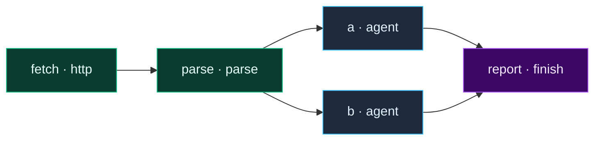
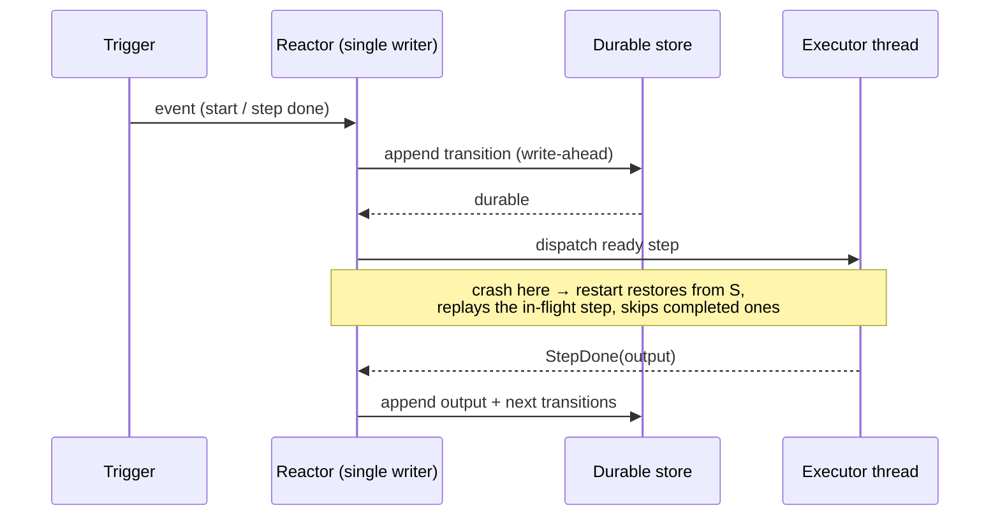

# Workflows

A **workflow** is a durable, declarative graph of steps that agentd drives to
completion — with branches, loops, fan-out, waits, and calls to tools, HTTP
endpoints, subagents, and other workflows. It is the 2.0 way to express work that
is more than a single ReAct turn: a pipeline, a scheduled job, an event reactor, a
long-running integration.

Workflows are **RFC 0027 (dialect 3)**. This page is the guide — how they work,
every node kind, the data model, durability, and worked examples. For the formal
grammar and validation rules, see [RFC 0027](../rfcs/0027-workflow-dialect-3.md).

> **The one-paragraph mental model.** A workflow is a set of named `steps`. Each
> step declares what it `depends_on`; a step runs once all its dependencies have
> completed. Steps that don't depend on each other run concurrently. Every state
> transition is written to a **durable store** by a **single-writer reactor** loop
> before it takes effect — so if the process is killed mid-run, it restarts and
> resumes *exactly* where it left off. There is no separate workflow daemon: the
> same reactor that runs the agent runs the graph.

---

## A first workflow

A workflow lives inside a `config_version: "2"` document, under `workflows:`. The
smallest useful one is a start node, a unit of work, and a finish:

```yaml
config_version: "2"
agent:
  name: hello
  instruction: You summarize text.
intelligence:
  endpoints: [https://api.openai.com/v1]
  model: gpt-5.1
  token: "{{secret:OPENAI_KEY}}"
store:
  kind: memory            # dev/test; use an mcp/http store to survive restarts
workflows:
  - name: greet
    steps:
      start:  { kind: once }
      say:    { kind: agent,  depends_on: [start], instruction: "Say hello in one line." }
      done:   { kind: finish, depends_on: [say],   output: "{{steps.say.output}}" }
lifecycle:
  run_until: idle          # run the graph, then exit (a job)
```

Run it:

```console
$ agentd --config greet.yaml
```

`once` fires a single run at startup; `agent` takes a turn against the model;
`finish` ends the run with an output. Because `run_until: idle`, the process exits
0 once the run drains. Swap in `run_until: drained` and a start node like
`schedule` or `webhook`, and the same binary becomes a long-lived daemon.

> **Validate before you run.** `agentd --validate-config --config greet.yaml`
> loads, substitutes, types, and validates the whole document (including every
> workflow) and prints a verdict — exit `0` valid, exit `2` with the first error.
> `agentd --workflow-schema` prints the machine-readable node registry (the same
> catalogue this page documents) as JSON Schema.

---

## The graph model

### Steps and `depends_on`

A workflow is `steps: { <id>: <step> }`. Every step has a `kind` and may declare
`depends_on: [<id>, …]`. The dependencies form a DAG:

```yaml
steps:
  fetch:  { kind: http,   url: "https://api.example/data" }
  parse:  { kind: parse,  depends_on: [fetch], text: "{{steps.fetch.output.body}}", format: json }
  a:      { kind: agent,  depends_on: [parse], instruction: "Analyze A." }
  b:      { kind: agent,  depends_on: [parse], instruction: "Analyze B." }
  report: { kind: finish, depends_on: [a, b], output: "{{steps.a.output}} / {{steps.b.output}}" }
```

`a` and `b` both depend only on `parse`, so they run **concurrently** the moment
`parse` finishes. `report` waits for **both**. There is no explicit "edge" list —
the edges are inferred from `depends_on`. A step with no `depends_on` (other than a
start node) is a root and runs as soon as the run begins.



`a` and `b` sit at the same rank — the engine runs them at once; `report`'s two
inbound edges make it a fan-in barrier.

### The three string mini-languages

This is the single most important thing to internalize. A string value in a
workflow can be interpreted three different ways, and they compose:

| Syntax | Resolved… | By | Example |
|---|---|---|---|
| `{{ … }}` templating | at step execution | the run's live data | `"{{steps.fetch.output.body}}"` |
| `CEL: …` expression | at step execution | CEL over the run's data | `"CEL: item * 2 > threshold"` |
| `${VAR}` / `${VAR:-def}` | at **config load**, before parsing | the process environment | `"https://api.${REGION:-us}.example"` |

And a fourth, for credentials only:

| `{{secret:NAME}}` / `{{secret-file:PATH}}` | at step execution, **redacted** | the secret resolver | `"Bearer {{secret:API_TOKEN}}"` |

They are deliberately distinct. `${VAR}` is for **loggable** per-environment values
(hosts, ports, paths) and is expanded into the document before it is even typed.
`{{secret:…}}` is for **credentials** — it is never expanded by the templater (it
passes through verbatim) and is resolved only by the node that needs it, through a
resolver that keeps it out of logs and step outputs. Never put a secret in a
`${VAR}`.

#### `{{ … }}` templating

Placeholders read the run's data by dotted path:

- `{{vars.NAME}}` — a blackboard variable (see below).
- `{{steps.ID.output}}` — the output of a completed step. Navigate into it:
  `{{steps.fetch.output.json.total}}`.
- `{{item}}`, `{{index}}`, `{{batch}}` — the current element inside a `foreach`/`map`.
- `{{env.NAME}}` — a value from `agent.env` / the environment (distinct from
  `${VAR}`: `{{env.…}}` is read at execution, `${VAR}` is substituted at load).
- `{{ path | default }}` — a fallback when the path is unset (`default` is parsed
  as JSON if it can be, else a literal string).

A string that is **exactly one** placeholder yields the *typed* value (an object,
array, or number), not its string form:

```yaml
output: "{{steps.fetch.output}}"          # the whole {status,ok,headers,body,json} object
count:  "{{steps.tally.output.json.n}}"    # the number 42, not "42"
```

A string with surrounding text stringifies each placeholder and concatenates.

#### `CEL:` expressions

Prefix a string with `CEL:` to evaluate a [CEL](https://cel.dev) expression
(requires a build with `--features cel`). CEL is used wherever a workflow needs a
computed value or predicate — element transforms, conditions, reducers:

```yaml
double: { kind: assign, value: "CEL: item * 2" }
big:    { kind: filter, over: "{{vars.items}}", expr: "CEL: item > 3" }
sum:    { kind: reduce, over: "{{steps.big.output}}", expr: "CEL: acc + item", initial: 0 }
when:   "CEL: status.runs_active == 0 && has(vars.ready)"
```

The variables in scope depend on the node: `item`/`index` in element expressions,
`acc` in `reduce`, `result`/`last` in loops, `payload` in event filters,
`status`/`state` in conditions and goal checks.

#### `${VAR}` environment substitution

Any string in the config **or a workflow** may contain `${VAR}` or
`${VAR:-default}`. Substitution happens once, at config load, over the merged
document before it is typed and validated:

```yaml
intelligence:
  endpoints: ["https://intel.${REGION:-us-east}.example/v1"]
steps:
  fetch: { kind: http, url: "https://api.${REGION:-us-east}.example/builds/${BUILD_ID}" }
```

Rules:

- **Braces are required.** A bare `$VAR` and a lone `$` pass through unchanged, so
  shell snippets and prices (`$5`) survive.
- `${VAR:-default}` uses `default` when `VAR` is unset or empty.
- An **unset** variable with **no** default is a hard error — the process refuses to
  start (`exit 2`) rather than run with a hole. This is fail-closed by design.
- Write `$${` for a literal `${`.
- Because substitution runs on the *parsed* document, a value containing `:` (like
  `${VAR:-x}`) must be **quoted** in YAML, and `${VAR}` can only fill **string**
  fields (a bare numeric/enum field is typed before substitution would apply — put
  the reference inside a string, e.g. a URL, or use a `{{env.…}}` template at
  execution instead).

### The blackboard (`vars`)

Beyond per-step outputs, a run has a shared key–value **blackboard**. A step writes
to it with `writes: <name>`, and any later step reads it with `{{vars.<name>}}` or
in CEL as `vars.<name>`:

```yaml
items: { kind: assign, depends_on: [start], value: [1,2,3,4,5,6], writes: items }
each:  { kind: foreach, depends_on: [items], over: "{{vars.items}}", body: { … } }
```

When two concurrent branches write the same variable, `writes_mode` decides how
they combine (last-write, append, merge, numeric add) — see RFC 0027 §5. Blackboard
state is part of the durable snapshot, so it survives a restart.

### Per-step controls

Every step, regardless of kind, accepts a common envelope:

| Field | Meaning |
|---|---|
| `depends_on` | prerequisites (the DAG edges) |
| `when` | a `CEL:`/`{{…}}` guard; if falsy the step is skipped (its dependents still run) |
| `retry` | `{ max, backoff }` — re-run the step on failure with backoff |
| `timeout` | wall-clock budget for the step (e.g. `30s`) |
| `on_error` | `fail` (default) \| `continue` — whether a failure fails the run |
| `idempotent` / `on_replay` | how the step behaves when replayed after a crash (`retry`\|`skip`\|`fail`) |
| `cache` | `{ key }` — memoize the step's output by an input key |
| `output_schema` | JSON Schema the output is validated against |
| `budget` | token budget for an intelligence step |

---

## Start nodes — how runs begin

A **start node** is a step whose `kind` is a trigger. It doesn't "run" like a
normal step; it produces runs of the workflow in response to time, events, or
messages. A workflow has one or more start nodes; every other step is reachable
from them via `depends_on`.

| Kind | Fires a run… | Key fields |
|---|---|---|
| `once` | once, at startup | — |
| `manual` | when explicitly invoked (A2A / operator) | `inputs` |
| `schedule` | on a clock | `cron`, `every`, `at` |
| `loop` | repeatedly, self-paced | `interval`, `until`, `max_iterations`, `backoff` |
| `subscribe` | on an MCP resource notification | `server`, `uri`, `debounce`, `filter` |
| `signal` | on an in-process signal | `signal` |
| `event` | on a lifecycle event | `on` (`workflow.finished`/`failed`), `filter` |
| `webhook` | on an inbound HTTP request | `path`, `methods`, `auth`, … (see below) |
| `a2a` | on an inbound A2A message *(planned)* | — |

```yaml
# A daemon that runs every 5 minutes:
steps:
  every:  { kind: schedule, every: "5m" }
  work:   { kind: agent, depends_on: [every], instruction: "Reconcile open deploys." }
lifecycle:
  run_until: drained        # stay alive; schedule keeps firing
```

`run_until` ties the process lifetime to the start nodes: `idle` runs the graph
once and exits (a **job**); `drained` keeps the process alive to serve long-lived
starts (a **daemon**); `auto` picks by whether any long-lived start or listener is
present. See [Lifecycle & triggers](modes-and-triggers.md).

---

## The node registry

Below is the full catalogue — 58 step kinds and 9 start kinds. Generate the
authoritative, always-current version for your build with `agentd
--workflow-schema` (each entry lists `fields`, `required`, and `implemented`).

### Intelligence

| Kind | Purpose | Key fields |
|---|---|---|
| `agent` | take an agent turn (ReAct over granted tools) | `instruction`, `input`, `tools`, `budget` |
| `think` | a preset intelligence call | `preset`, `input` |
| `classify` | label an input into one of `classes` | `input`, `classes` |
| `extract` | pull structured data against a schema | `input`, `schema` |
| `summarize` | condense text | `input`, `max_tokens` |
| `judge` | score/verify a claim | `input`, `criteria` |
| `route` | choose a branch by semantic match | `input`, `routes` |

### Control flow

| Kind | Purpose | Key fields |
|---|---|---|
| `switch` | route to one dependent by value | `on`, `cases`, `default` |
| `parallel` | run named branches concurrently, fan-in | `branches`, `min_success`, `on_error` |
| `race` | first branch to finish wins; cancel the rest | `branches`, `timeout` |
| `foreach` | fan out over an array (nested body) | `over`, `batch`, `body`, `collect`, `rate` |
| `iterate` | loop a body while/until a condition | `body`, `while`/`until`, `max_iterations` |
| `subgraph` | run an inline sub-DAG | `steps` |
| `assert` / `fail` / `noop` | guard / force-fail / do-nothing | `expr` / `message` / — |
| `sleep` | pause for a duration | `duration` |

### Data

| Kind | Purpose | Key fields |
|---|---|---|
| `assign` | compute and store a value | `value`, `writes` |
| `template` | render a string | `text` |
| `map` | transform each element | `over`, `expr` |
| `filter` | keep elements matching a predicate | `over`, `expr` |
| `reduce` | fold to a single value | `over`, `expr`, `initial` |
| `sort` | order an array | `over`, `order`, `by` |
| `dedupe` | remove duplicates | `over` |
| `chunk` | split into batches | `value`, `by`, `size` |
| `parse` | parse CSV/JSON/YAML/lines | `text`, `format` |
| `transform` | shape an object | `input`, `expr` |
| `validate` | check against a schema | `input`, `schema` |

### I/O & integration

| Kind | Purpose | Key fields |
|---|---|---|
| `http` | outbound REST call / webhook emit | `method`, `url`, `headers`, `query`, `json`/`body`, `sign`, … |
| `webhook` | **inbound** HTTP trigger (start node) | `path`, `methods`, `auth`, `respond`, … |
| `emit` | publish an event/notification | `event`, `payload` |
| `mcp.tool` | call an MCP tool | `name`, `args` |
| `mcp.resource` | read/list an MCP resource | `op`, `server`, `uri` |
| `search.query` / `search.fetch` | web search / fetch | `query` / `url` |
| `knowledge.search` / `knowledge.get` | RAG over the knowledge store | `query` / `id` |
| `artifact.create` / `.get` / `.delete` | large-object store | `content` / `id` |
| `memory.set` / `.get` / `.list` / `.delete` | durable KV memory | `key`, `value` |

### Orchestration

| Kind | Purpose | Key fields |
|---|---|---|
| `wait` | suspend until a condition/signal/event | `on`, `signal`, `condition`, `run`, `webhook`, `timeout` |
| `join` | barrier over multiple runs/branches | `of`, `min_success` |
| `workflow` | run a child workflow | `name`, `mode` (`sync`/`async`/`detached`), `inputs`, `cascade` |
| `workflow.signal` / `.wait` / `.cancel` | coordinate with other runs | `signal`/`run` |
| `subagent` | spawn a scoped subagent | `role`, `instruction`, `tools` |
| `human` | request human input (A2A `input-required`) | `prompt`, `schema` |
| `a2a.delegate` | delegate to a remote A2A agent | `to`, `parts` |
| `checkpoint` | force a durable snapshot | — |
| `cache` | memoize a sub-computation | `key` |

### Terminal

| Kind | Purpose | Key fields |
|---|---|---|
| `finish` | end the run successfully | `status`, `output`, `reason` |
| `fail` | end the run as failed | `message` |

> **`implemented: false`.** A few kinds are reserved in the schema but not yet
> wired by the executor (currently the direct `a2a` / `a2a.send` / `a2a.wait`
> send-primitives — use `a2a.delegate` today). `--workflow-schema` is the source of
> truth for what your build actually runs.

---

## Node deep-dives

### `agent` — an intelligence turn

The workhorse. Runs a full ReAct loop against the model over the tools granted to
the run, then returns its final text (or a structured object if `output_schema` is
set). Inputs come from `instruction` (the task) and `input` (data), both templated:

```yaml
triage:
  kind: agent
  depends_on: [fetch]
  instruction: "Classify this issue and draft a one-line reply."
  input: "{{steps.fetch.output.json}}"
  output_schema: { type: object, properties: { label: {type: string}, reply: {type: string} } }
```

### `http` — outbound REST (and webhook emit)

Make a `GET`/`POST`/`PUT`/`PATCH`/`DELETE` call over the one SSRF-guarded HTTP
client. The response is a structured object — `{status, ok, headers, body, json}` —
that flows into dependent steps:

```yaml
fetch:
  kind: http
  method: GET
  url: "https://api.example/builds/latest"
  query: { project: "{{vars.service}}" }
  headers: { Authorization: "Bearer {{secret:API_TOKEN}}" }   # resolved, never logged
  expect: [200]              # acceptable statuses (default: any 2xx/3xx is ok)
  timeout: 20s
notify:
  kind: http
  depends_on: [fetch]
  method: POST
  url: "https://hooks.example/deploy"
  json: { service: "{{vars.service}}", state: "{{steps.fetch.output.json.state}}" }
  sign: { secret: "{{secret:EMIT_SECRET}}" }                  # HMAC-sign the body
```

- **Body:** `json` serializes an object and sets `Content-Type: application/json`;
  `body` sends a raw string. `json` wins if both are present.
- **Secrets:** `{{secret:…}}` in any header value (e.g. `Authorization`) is resolved
  through the redacting resolver — the credential never passes through the templater
  or a log line.
- **`sign`:** `{ secret, header?, prefix? }` HMAC-SHA256-signs the exact request
  body and adds `X-Signature: sha256=<hex>` (configurable header/prefix). This makes
  the node a **verifiable webhook emitter**, symmetric with the inbound `webhook`
  node's `hmac` verify.
- **SSRF:** the resolved host is classified; private/loopback/link-local targets are
  **refused** unless the node sets `allow_private: true` (for a declared internal
  API). `https://` verifies the server certificate.

### `webhook` — inbound HTTP trigger

A `webhook` **start node** turns an inbound HTTP request into a workflow run. It is
served by a dedicated listener bound at `webhooks.listen`:

```yaml
webhooks:
  listen: http://127.0.0.1:8088        # loopback (front with a TLS proxy); a public
                                       # bind must be https:// + webhooks.tls
workflows:
  - name: on-ci
    steps:
      hook:
        kind: webhook
        path: /hooks/ci
        methods: [POST]
        auth:
          hmac: { secret: "{{secret:HOOK_SECRET}}" }   # verify X-Signature: sha256=…
        idempotency: header             # dedupe on Idempotency-Key
        parallelism: 4                  # max concurrent runs from this hook
        on_overflow: queue              # queue | drop | replace when saturated
      build: { kind: agent, depends_on: [hook], instruction: "Handle the CI event." }
      done:  { kind: finish, depends_on: [build] }
lifecycle:
  run_until: drained
```

- **Auth** is per-node and configurable: `hmac` (verify an `X-Signature` HMAC over
  the body — the best practice), `header` (require a header equals a secret),
  `bearer` (a bearer token), or `none`. A bad signature is rejected `401` before any
  run starts. A default can be set once at `webhooks.default_auth`.
- **Idempotency:** with `idempotency: header`, a repeated `Idempotency-Key` is
  deduplicated — the replay returns `200 duplicate` and fires **no** second run. The
  dedupe set is durable.
- **Backpressure:** `parallelism` caps concurrent runs; `on_overflow` chooses what
  happens when saturated.
- **Response mode:** `respond: ack` (default) returns `202 Accepted` immediately;
  `respond: sync` holds the HTTP response open until the run reaches a terminal
  state and returns its status + output inline.

You can also **await** a webhook *inside* a run, rather than start one — see `wait`.

### `wait` — suspend until something happens

`wait` pauses a run (durably — it costs nothing while suspended) until its condition
is met, then resumes. The `on` field selects what it waits for:

```yaml
# wait for an in-process signal
hold:  { kind: wait, on: signal, signal: child-done, timeout: 5m }

# wait for a CEL condition over live state
ready: { kind: wait, on: condition, condition: "CEL: status.runs_active == 0" }

# wait for an inbound callback to a dynamic URL (webhook await)
cb:
  kind: wait
  on: webhook
  webhook: { path: /hooks/cb/{{run.id}} }
  emit_url_to: callback_url        # writes the public callback URL to vars.callback_url
  timeout: 30m
```

`on:` accepts `signal`, `condition`, `run` (another run finishing), `subagent`,
`conversation`, `webhook`, or a `deadline`. The webhook-await variant registers a
one-shot callback path and (optionally) publishes the resolved public URL into a
blackboard variable via `emit_url_to`, so a preceding `http` step can hand that URL
to an external system that will call back.

### `foreach` / `batch` — durable fan-out

`foreach` runs a nested `body` sub-DAG once per element of `over`, with bounded
parallelism and **per-batch durable progress** (a crash mid-fan-out resumes at the
next unfinished batch, never re-running completed ones):

```yaml
each:
  kind: foreach
  over: "{{vars.items}}"
  batch: { size: 2, parallel: 2 }      # 2 items per batch, 2 batches in flight
  rate: "10/s"                          # optional pacing
  on_error: continue                    # a failed element doesn't fail the run
  body:
    steps:
      double: { kind: assign, value: "CEL: item * 2" }
      tag:    { kind: template, depends_on: [double], text: "{{index}}={{steps.double.output}}" }
  collect: "{{steps.tag.output}}"       # gather each iteration's result into the output array
```

Inside the body, `{{item}}`, `{{index}}`, and `{{batch}}` refer to the current
element.

### `parallel` / `race` / `switch`

```yaml
par:
  kind: parallel
  on_error: continue
  branches:
    a: { steps: { x: { kind: agent, instruction: "Path A" } } }
    b: { steps: { y: { kind: http,  url: "https://b.example" } } }
  min_success: 1                        # succeed if at least one branch does

route:
  kind: switch
  depends_on: [par]
  on: "{{steps.par.output.winner}}"
  cases: { fast: took_fast, slow: took_slow }
  default: took_default
```

`parallel` is a fan-in barrier (all branches, subject to `min_success`); `race`
returns the first to finish and cancels the rest; `switch` enables exactly one
dependent by matching `on` against `cases`.

### `workflow` — child runs

Call another workflow as a step, synchronously (block for its result), async (start
it and get a handle), or detached (fire-and-forget). `cascade` propagates cancel:

```yaml
spawn: { kind: workflow, name: enrich, mode: sync, inputs: { id: "{{vars.id}}" } }
use:   { kind: agent, depends_on: [spawn], input: "{{steps.spawn.output}}", instruction: "Use the enrichment." }
```

---

## The goal watchdog

Separately from any single workflow, a daemon can carry a **goal** — a standing
objective it periodically checks and self-corrects toward. This is a top-level
`goal:` block, not a workflow node:

```yaml
goal:
  statement: All open deploys are reconciled.
  check:
    every: 30s
    condition: "CEL: status.runs_active == 0"   # cheap deterministic gate first…
    via: llm                                     # …then an LLM judge confirms
  stuck_after: 5            # checks with no progress before it's "stuck"
  on_achieved: finish       # finish | idle | { workflow: <name> }
  on_stuck: replan          # replan | escalate | idle | { workflow: <name> }
```

On each tick the reactor evaluates the CEL `condition`; if it passes (and `via:
llm`/`both`), it asks the model to **judge** whether the goal is truly met. If met,
it takes `on_achieved` (finish the process, idle, or trigger a workflow). If checks
keep failing with no progress, after `stuck_after` it takes `on_stuck` — by default
`replan`, which re-plans and retries. The judge runs asynchronously off the reactor
so the loop never blocks. See [RFC 0026](../rfcs/0026-agent-loop-and-lifecycle.md).

---

## Durability & resume

Every workflow run is durable. The reactor is a **single writer**: it appends each
state transition (a step starting, a step's output, a blackboard write, a batch
completing) to the durable store *before* the effect is observable. On restart it
restores the run set and **replays** any step that was mid-flight.



What this buys you:

- **Crash recovery.** SIGKILL the process at any point; on restart every run
  continues from its last durable point. Completed steps are not re-run; an
  in-flight `foreach` resumes at the next unfinished batch.
- **Idempotency knobs.** For steps with external side effects, `idempotent: true`
  plus `on_replay: skip` avoids re-issuing an effect that may have already landed
  before the crash.
- **Exactly-once triggers.** Webhook idempotency keys and schedule deadlines are
  durable, so a restart doesn't double-fire.

The store is configured once under `store:` (`kind: mcp` or `http` for a real
durable backend; `memory` for dev/test, which does **not** survive the process).
Long-lived features (daemons, webhooks, goals, schedules) require a store.

---

## Worked examples

### 1. Webhook → enrich → signed callback

A CI system posts a signed webhook; the workflow fetches build details, asks the
model to summarize, and posts a signed result back:

```yaml
config_version: "2"
agent: { name: ci, instruction: You summarize builds. }
intelligence: { endpoints: ["https://api.openai.com/v1"], model: gpt-5.1, token: "{{secret:OPENAI_KEY}}" }
mcp:
  servers:
    - name: state
      endpoint: "${STATE_MCP_URL}"          # the durable store backend
store:
  kind: mcp
  mcp: { server: state }
webhooks:
  listen: "https://0.0.0.0:${HOOK_PORT:-8443}"   # public bind → TLS required
  tls:
    cert: "{{secret-file:/etc/agentd/webhook.crt}}"
    key: "{{secret-file:/etc/agentd/webhook.key}}"
workflows:
  - name: ci-summary
    steps:
      hook:
        kind: webhook
        path: /hooks/ci
        methods: [POST]
        auth: { hmac: { secret: "{{secret:HOOK_SECRET}}" } }
        idempotency: header
      fetch:
        kind: http
        depends_on: [hook]
        url: "https://api.example/builds/{{steps.hook.output.json.build_id}}"
        headers: { Authorization: "Bearer {{secret:API_TOKEN}}" }
      brief:
        kind: summarize
        depends_on: [fetch]
        input: "{{steps.fetch.output.json}}"
      post:
        kind: http
        depends_on: [brief]
        method: POST
        url: "https://chat.example/notify"
        json: { text: "Build summary: {{steps.brief.output}}" }
        sign: { secret: "{{secret:NOTIFY_SECRET}}" }
      done: { kind: finish, depends_on: [post] }
lifecycle: { run_until: drained }
```

### 2. Scheduled durable fan-out

Every hour, pull a work list and process it in bounded, resumable batches:

```yaml
workflows:
  - name: nightly
    steps:
      tick:  { kind: schedule, every: "1h" }
      list:  { kind: http, depends_on: [tick], url: "https://api.example/queue" }
      each:
        kind: foreach
        depends_on: [list]
        over: "{{steps.list.output.json.items}}"
        batch: { size: 10, parallel: 3 }
        on_error: continue
        body:
          steps:
            handle: { kind: agent, instruction: "Process {{item.id}}." }
      done: { kind: finish, depends_on: [each] }
lifecycle: { run_until: drained }
```

### 3. Triage with a review loop

Classify, draft, and iterate until a judge is satisfied:

```yaml
steps:
  start: { kind: once }
  cls:   { kind: classify, depends_on: [start], input: "{{env.ticket}}", classes: [bug, question, chore] }
  draft: { kind: agent, depends_on: [cls], instruction: "Draft a reply for a {{steps.cls.output}}." }
  review:
    kind: iterate
    depends_on: [draft]
    max_iterations: 3
    until: "CEL: result.approved"
    body:
      steps:
        judge: { kind: judge, input: "{{vars.reply | steps.draft.output}}", criteria: "clear, correct, kind" }
        fix:   { kind: agent, depends_on: [judge], when: "CEL: !steps.judge.output.approved",
                 instruction: "Revise: {{steps.judge.output.reason}}", writes: reply }
  done:  { kind: finish, depends_on: [review], output: "{{vars.reply}}" }
```

---

## Nuances & gotchas

- **Quote `${VAR:-x}` in YAML.** The `:` makes an unquoted scalar ambiguous;
  substitution runs on the parsed document, so the YAML must be valid first.
- **`${VAR}` fills strings, `{{env.…}}` fills at runtime.** For a numeric or enum
  field driven by the environment, template it at execution (`{{env.N}}`) rather
  than substituting at load.
- **`{{secret:…}}` ≠ `${VAR}`.** Secrets are redacted and resolved per-node; env
  vars are loggable and substituted globally. Don't cross them.
- **`allow_private` is off by default.** An `http` node to a loopback/private host
  is refused unless you opt in — this is the SSRF guard, not a bug.
- **A public `webhooks.listen` needs TLS.** Plaintext `http://` binds are allowed
  for **loopback only**; a `0.0.0.0`/public bind must be `https://` with
  `webhooks.tls: { cert, key }` — or bind loopback and terminate TLS in a proxy.
- **`memory` store is not durable.** It warns at startup and loses all runs on exit.
  Use an `mcp`/`http` store for anything long-lived.
- **A skipped `when` doesn't skip dependents.** `when: false` skips *that* step; its
  dependents still run (reading an empty output). Gate a whole branch with `switch`.
- **Concurrency is implicit.** Independent steps run at once. If you need ordering,
  add a `depends_on`; if you need mutual exclusion, serialize through a shared
  dependency or the blackboard.

---

## See also

- [RFC 0027 — Workflow dialect 3](../rfcs/0027-workflow-dialect-3.md) — the formal spec.
- [RFC 0025 — Durable state & store adapters](../rfcs/0025-durable-state-and-store-adapters.md).
- [RFC 0026 — Agent loop & lifecycle](../rfcs/0026-agent-loop-and-lifecycle.md) — turns, the goal watchdog.
- [Lifecycle & triggers](modes-and-triggers.md) — job vs daemon, start nodes.
- [Configuration](configuration.md) — every key, precedence, secrets, `--validate-config`.
- [Security](security.md) — no local execution, SSRF, the Rule-of-Two, secret handling.
- `agentd --workflow-schema` — the authoritative node registry for your build.
