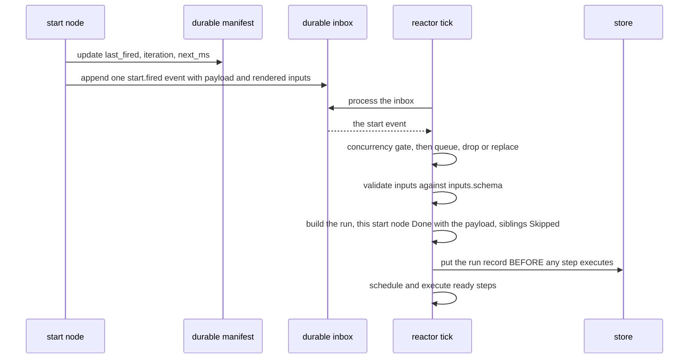
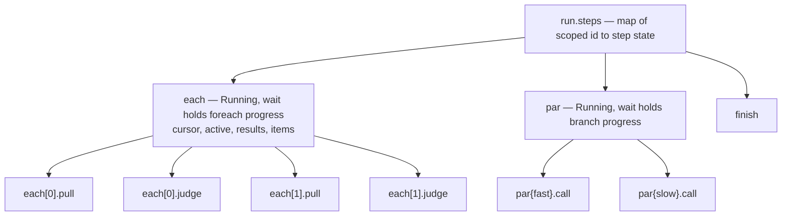
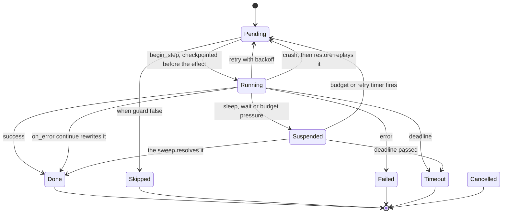
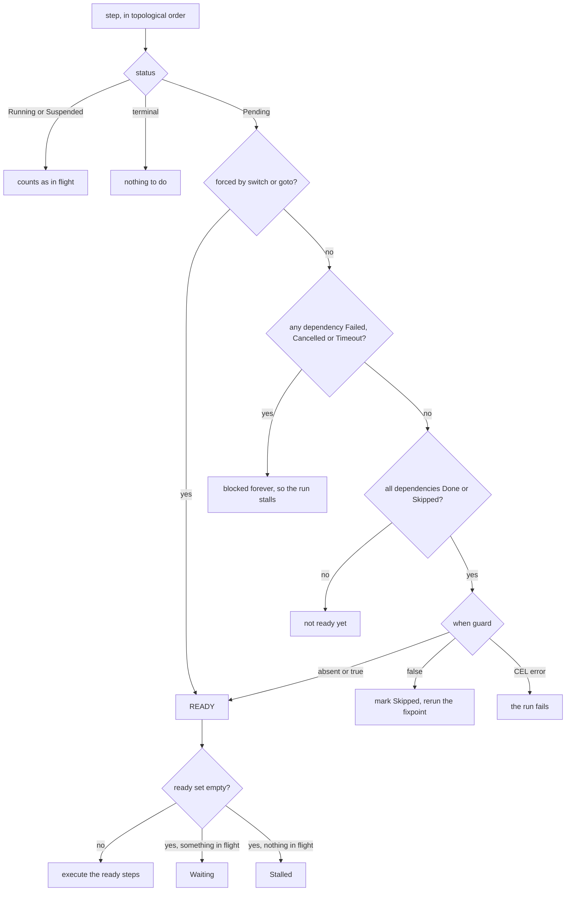

# Workflows: durable graphs of work

An agent turn is a conversation — one context, one thread of reasoning, nothing
on disk between tool calls. That is the right shape for a bounded task and the
wrong shape when the work runs for hours, fans out over four hundred records,
has to survive a restart, or must stop and wait for a person. A **workflow** is
the alternative: a named, strictly validated graph of steps whose entire
execution state lives in one durable record that agentd writes *before* each
step's side effect. Kill the process mid-run and it resumes from that record.

This page is the working guide — how a document is put together, how runs begin,
what each node kind accepts, how data moves, and what durability does and does
not promise. [RFC 0027](../rfcs/0027-workflow-dialect-3.md) is the formal
grammar; `agentd --workflow-schema` prints the node catalogue your build
compiled, as JSON Schema.

## When a graph beats a conversation

Reach for a workflow when at least one of these is true:

- **The work must survive a crash.** A run's state is checkpointed before every
  effect. A conversation is not.
- **Steps are independent.** Two steps that do not `depends_on` each other run
  concurrently, with no orchestration code from you.
- **The shape repeats.** Fan out over a list with bounded parallelism, loop
  until a judge approves, race two sources — declared, and resumable.
- **Something must wait.** A run can suspend on a signal, a child run, an
  inbound webhook or a human answer, and costs nothing while suspended.
- **You need boundaries.** Timeouts, retries, budgets, caches and output schemas
  apply per step, not to one opaque turn.

Stay with a plain agent turn when the task is open-ended and the model should
choose the sequence. A workflow fixes that sequence at authoring time: a step
that turns out to need an unanticipated decision cannot invent one. The trade-off
is rigidity in exchange for resumability.

## The anatomy of a workflow document

A workflow is an object under `workflows:` in a `config_version: "2"` settings
file. The top-level keys are a closed set — anything else is a parse error.

| Key | Meaning |
|---|---|
| `name` | required; must match `[a-zA-Z_][a-zA-Z0-9_-]{0,63}` |
| `version` | the dialect; defaults to `3` and must be `3` if written |
| `description` | free text |
| `armed` | default `true`; `false` loads the definition without arming its triggers |
| `inputs` | `{schema: <JSON Schema>}` — enforced when a run is created |
| `outputs` | `{schema: …}` — checked for well-formedness only (see below) |
| `concurrency` | `{max_runs, on_overflow}` — default 4 runs, `queue` |
| `limits` | `{steps, tokens, deadline, budget}` for the whole run |
| `priority` | `low\|normal\|high` (default `normal`) — contention weight: `low` admissions shed one pressure level early (at *warn*), and each tick schedules ready steps of higher-priority runs first. A tiebreak under scarcity, not a reservation. |
| `steps` | the graph: an object of step id to step |
| `file` / `uri` | load the document from a path or an MCP resource instead of inline (a config entry can also use `url:` with headers, or a `dir:`+`glob:` scan — see the configuration doc §6.1) |

A complete, runnable example:

```yaml
config_version: "2"
intelligence:
  endpoints: https://api.openai.com/v1
  model: gpt-5.1
  token: "{{secret:OPENAI_KEY}}"
store: { kind: mcp, mcp: { server: state } }
mcp:
  servers:
    - { name: state, endpoint: https://mcp-state.internal/mcp }
workflows:
  - name: digest
    limits: { deadline: 10m }
    steps:
      start: { kind: once }
      fetch:
        kind: http
        depends_on: [start]
        url: https://api.example/incidents?window=24h
        headers: { Authorization: "Bearer {{secret:API_TOKEN}}" }
        expect: [200]
      brief:
        kind: agent
        depends_on: [fetch]
        instruction: |
          Summarise these incidents in five bullets.
          {{steps.fetch.output.json}}
      done:
        kind: finish
        depends_on: [brief]
        output: "{{steps.brief.output}}"
lifecycle: { run_until: idle }
```

```console
$ agentd --validate-config -c digest.yaml
$ agentd -c digest.yaml
```

`run_until: idle` gives a job: the process exits once nothing is in flight, with
an exit code derived from the `once` run's terminal status. `drained` keeps the
process alive for long-lived triggers. `auto` (the default) picks the job shape
when there is no A2A listener and no `loop`, `schedule`, `subscribe`, `signal`
or `event` start node — re-checked against workflows the agent creates at
runtime, so an instance never idles out from under work it was asked to set up.

## How a run starts

A **start node** is a step whose kind is a trigger. It never creates a run
directly. It renders its optional `inputs` mapping, updates its durable trigger
state, and appends one event to the durable inbox. The reactor turns that event
into a run on a later pass. Everything in between is a gate you can reason about.



Two consequences. The firing start node's own output *is* the trigger payload, so
`{{steps.hook.output.body}}` reads the request body. And when a workflow has
several start nodes, a run fires exactly one and marks the rest `Skipped` — which
counts as satisfied, so a step depending on any of them still runs.

| Start kind | Fields (**required** in bold) |
|---|---|
| `once` | `policy`, `inputs` |
| `manual` | `inputs` |
| `loop` | `interval`, `delay`, `until`, `max_iterations`, `backoff`, `inputs` |
| `schedule` | `cron`, `every`, `tz`, `jitter`, `catch_up`, `at`, `inputs` |
| `subscribe` | **`server`**, **`uri`**, `debounce_ms`, `coalesce`, `filter`, `deliver`, `on_no_listener`, `window`, `inputs` |
| `signal` | **`name`**, `filter`, `deliver`, `inputs` |
| `event` | **`on`**, `filter`, `inputs` |
| `webhook` | **`path`**, `methods`, `auth`, `parallelism`, `on_overflow`, `rate`, `idempotency`, `respond`, `filter`, `inputs` |

Behaviour the field names do not give away:

- `once` with the default `policy: ensure` will not fire if a run is live, if a
  run ever started at that node, or if its start event is still queued.
  `policy: always` fires unconditionally.
- `loop` fires the moment it is armed (unless a run is live or `delay` is set)
  and re-arms only when the run finishes. `until` is CEL over
  `{outcome: {ok, output}, last}`; a failed run waits `backoff.initial` instead
  of `interval`.
- `schedule` computes the next occurrence from *now*, so missed occurrences are
  skipped, never replayed. `at` is a delay, not a wall-clock time. `cron` needs
  the `cron` build feature. `tz`, `jitter` and `catch_up` parse but nothing
  reads them.
- `subscribe` is notify-then-read: an MCP resource update makes it re-read the
  resource and apply the CEL `filter` over `content`. `debounce_ms` keeps the
  newest payload and fires when the window closes. `window: {samples: N}`
  (N ≤ 256) additionally keeps a durable ring of the last N read values and
  delivers it as `output.window`, oldest→newest — for streams where the signal
  is a trend, not a reading. The ring accrues on every filter-passing update,
  including ones a debounce coalesces away: debouncing drops *firings*, the
  window keeps the *samples*.
- `event` fires on lifecycle events. A terminal run raises `workflow.finished`
  when it completed, `workflow.failed` when it failed, stalled, was cancelled or
  was refused.
- `webhook` deduplicates on the `Idempotency-Key` header by default — a replay
  answers `200 duplicate` and fires no second run. `respond: sync` holds the
  response open until the run reaches a terminal state. `rate: "<burst>/<per>s"`
  (e.g. `"20/1s"`, the same spelling as A2A quotas) bounds how fast requests are
  *admitted* — past the burst the route answers `429` with a `Retry-After`,
  before anything is written to the durable inbox. `parallelism` bounds how many
  run at once; `rate` bounds how fast they arrive. Under resource pressure
  (see the operations doc) every route sheds with `429` regardless of `rate` —
  authentication is still checked first, so an unauthenticated probe learns
  nothing about load.

A trigger's `inputs` is a mapping rendered against `{payload, env}` and lands in
the run as the `inputs` namespace, validated against the workflow's
`inputs.schema`. Two exceptions: `once` passes its mapping through unrendered,
and `manual` ignores it in favour of the `inputs` its caller supplies.

```yaml
# A `webhook` node needs a listener to arrive on, or validation refuses the
# config. A loopback `http://` bind is allowed; a public bind must be `https://`
# with `webhooks.tls: {cert, key}`.
webhooks:
  listen: http://127.0.0.1:8088

workflows:
  - name: on-ci
    concurrency: { max_runs: 8, on_overflow: queue }
    inputs:
      schema:
        type: object
        required: [build]
        properties: { build: { type: string } }
    steps:
      hook:
        kind: webhook
        path: /hooks/ci
        methods: [POST]
        auth: { hmac: { secret: "{{secret:HOOK_SECRET}}" } }
        inputs: { build: "{{payload.body.build_id}}" }
      look:
        kind: http
        depends_on: [hook]
        url: "https://ci.example/builds/{{inputs.build}}"
      note:
        kind: summarize
        depends_on: [look]
        input: "{{steps.look.output.json}}"
      done: { kind: finish, depends_on: [note], output: "{{steps.note.output}}" }
```

Invalid inputs are not an error you can catch: the event is logged as
`run.inputs.invalid`, consumed, and no run is created.

## The node catalogue

There are 67 kinds, and all of them are wired. The four A2A ones split by
direction and by whether they block: `a2a` is a START node (an inbound message
whose command matches begins a run), `a2a.send` notifies a peer without waiting,
`a2a.wait` suspends until a message lands on a conversation, and `a2a.delegate`
is the request/response pairing of the two — send an objective, block, take the
result.

Every step also accepts the cross-cutting fields, on any kind:
`kind`, `depends_on`, `when`, `retry`, `timeout`, `on_error`, `idempotent`,
`on_replay`, `output_schema`, `cache`, `budget`, `skills`, `otel`, `description`.
`idempotent`, `on_replay` and `otel` parse but no runtime code reads them.

### Ask the model something

| Kind | Fields (**required** in bold) |
|---|---|
| `agent` | **`instruction`**, `output_contract`, `output_schema`, `tools`, `servers`, `limits`, `context`, `skills`, `system` |
| `think` | **`prompt`**, `output_schema`, `reads`, `check`, `retries`, `skills`, `system` |
| `subagent` | **`instruction`**, `mode`, `workflow`, `tools`, `servers`, `limits`, `priority`, `context`, `output_contract`, `output_schema`, `skills` |
| `classify` | **`input`**, **`classes`**, `prompt`, `skills` |
| `extract` | **`input`**, **`output_schema`**, `prompt`, `skills` |
| `summarize` | **`input`**, `length`, `prompt`, `skills` |
| `judge` | **`input`**, **`rubric`**, `prompt`, `skills` |
| `route` | **`input`**, **`choices`**, `prompt`, `skills` |

`agent` takes a full tool-using turn against the workflow caller's tool plan,
with rounds bounded only by the step's budget and limits. `think` is the
tool-free variant, capped at three rounds. The five presets are sugar: each
synthesises a fixed prompt frame and output schema and runs through the same
`think` machinery. `think` takes `prompt`; `agent` and `subagent` take
`instruction` — the fields are not interchangeable, and using the wrong one is a
validation error.

### Reach outside the process

| Kind | Fields (**required** in bold) |
|---|---|
| `http` | **`url`**, `method`, `headers`, `query`, `body`, `json`, `timeout`, `expect`, `allow_private`, `sign`, `idempotency` |
| `mcp.tool` | **`server`**, **`tool`**, `args`, `idempotency` |
| `mcp.resource` | **`server`**, **`op`**, `uri`, `name`, `arguments`, `reference`, `argument` |
| `tool` | **`name`**, `args` |
| `a2a.delegate` | **`peer`**, **`objective`**, `output_contract`, `timeout`, `idempotency` |
| `memory.get` / `.set` / `.list` / `.delete` | `key`, `value`, `ttl`, `prefix`, `limit` |
| `artifact.create` / `.get` / `.delete` | `name`, `mime`, `content`, `from_step`, `sensitive`, `id` |
| `knowledge.search` / `.get`, `search.query` / `.fetch` | `query`, `top_k`, `filters`, `id`, `uri`, `url`, `kind`, `limit`, `freshness`, `max_bytes` |

`http` runs on its own thread through the SSRF-guarded client and outputs
`{status, ok, headers, body, json}`. Success is any status in 200..400 unless
`expect` lists codes; the default timeout is 30 s; private, loopback and
link-local targets are refused unless the step sets `allow_private: true`.
Steps that reach a remote can declare **idempotency** — the retry-safety
handshake with APIs that deduplicate:

```yaml
charge:
  kind: http
  method: POST
  url: https://api.example/charges
  idempotency: { header: Idempotency-Key }   # or {query: idem}, or value: "{{inputs.order_id}}"
  retry: { max: 2, backoff: 2s }
```

The default key is **derived**: `sha256(run_id.step_id)`, 32 hex chars. Stable
across attempts by arithmetic — every retry of this step, including a replay
after a crash, presents the same key — unique per run because run ids are, and
opaque on the wire (a raw `run.step` key would leak ULID timestamps and internal
step names to every API that logs its idempotency keys). `value:` substitutes an
application key (an order id), which is *stronger* when one exists: it also
collides two different runs attempting the same real-world operation. `mcp.tool`
always attaches the key as `agent/idempotency_key` in the call's `_meta`
(`agent/attempt` rides separately, for servers that want to observe retries
without keying on them); `a2a.send`/`a2a.delegate` opt in with
`idempotency: true`, which pins the A2A `messageId` across retries. The attempt
counter is never part of the key — that would defeat the field's own name. The
same derived key is also in every subagent step's environment as
`env.idempotency_key` (with `env.step` and `env.attempt`); anything a template
derives from those is retry-stable, where `env.ts` is deliberately not.

### Shape data

| Kind | Fields (**required** in bold) |
|---|---|
| `assign` / `transform` | **`value`**, `writes`, `mode` |
| `map` / `filter` | **`over`**, **`expr`**, `as` |
| `reduce` | **`over`**, **`expr`**, `initial`, `as`, `acc` |
| `sort` | **`over`**, `by`, `order` |
| `dedupe` | **`over`**, `by` |
| `chunk` | **`value`**, **`size`**, `by`, `overlap` |
| `template` | `text`, `value` |
| `parse` | **`text`**, `format` |
| `validate` | **`value`**, **`schema`** |

`assign` writes its value to the blackboard variable named by `writes`, or to a
variable named after the step id when `writes` is absent. `mode` is
`overwrite` (default), `append`, `merge` or `union`.

### Branch, fan out and repeat

| Kind | Fields (**required** in bold) |
|---|---|
| `switch` | **`on`**, **`cases`**, `default` |
| `foreach` | **`over`**, **`body`**, `batch`, `collect`, `on_error`, `as` |
| `batch` | **`over`**, **`body`**, `by`, `size`, `parallel`, `rate`, `collect`, `on_error` |
| `iterate` | **`body`**, `while`, `until`, `max_iterations`, `collect` |
| `parallel` | **`branches`**, `on_error` |
| `race` | **`branches`**, `timeout`, `min_success` |
| `subgraph` | **`body`** |

### Wait, coordinate and end

| Kind | Fields (**required** in bold) |
|---|---|
| `wait` | **`on`**, `server`, `uri`, `condition`, `signal`, `run`, `subagent`, `conversation`, `webhook`, `timeout` |
| `sleep` | **`duration`** |
| `join` | **`handles`**, `timeout`, `min`, `partials` |
| `human` | **`question`**, `schema`, `to`, `timeout`, `reply_uri` |
| `workflow` | **`name`**, `inputs`, `mode`, `start`, `version`, `cascade` |
| `workflow.signal` | **`name`**, `payload`, `run` |
| `workflow.wait` / `.cancel` | **`run`**, `timeout`, `reason` |
| `finish` | `status`, `output`, `reason` |
| `fail` | `message`, `code` |
| `assert` | **`condition`**, `message` |
| `emit` | `note`, `audit`, `metric`, `value` |
| `noop` (no fields) / `checkpoint` | `name` |

`finish` closes the run: it maps `status` to `completed`, `refused` or
`cancelled` (anything else fails the run), records its own `output` as the run's
output, and force-cancels every step still in flight. `emit.metric` parses but
nothing reads it. Where a row covers a family (`memory.*`, `artifact.*`,
`knowledge.*`, `search.*`), it lists the union of the family's fields;
`--workflow-schema` gives the exact required set for each kind.

## Data flow and templating

Every kind-specific field is rendered against the run's data before the step
executes. The namespaces are:

| Namespace | Contents |
|---|---|
| `inputs` | the validated trigger inputs |
| `run` | `id`, `workflow`, `start`, `principal`, `task`, `attempt`, `status` |
| `steps.<id>` | `status`, `output`, `error`, `attempt` |
| `vars` | the run blackboard |
| `env` | `instance`, `run`, `ts`, `instruction`, `prompt` |
| `memory.<key>` | read through to the durable store |
| inside a body | `item`, `index`, `batch`, `iteration`, `branch`, plus the `as` alias |

Three rules govern the syntax:

1. A string that is **exactly one** `{{path}}` yields the *typed* value — object,
   array, number. Any other string interpolates: strings raw, non-strings as JSON.
2. `{{path | fallback}}` supplies a fallback, parsed as JSON if it parses and as
   a literal string otherwise. A missing path with **no** fallback is a hard
   render error that fails the step — after the attempt counter has already
   incremented, so it consumes a retry.
3. `{{secret:NAME}}` and `{{secret-file:PATH}}` are deliberately *not* expanded.
   They pass through verbatim for the consuming node to resolve through the
   redacting secret resolver, so a credential never lands in step data or logs.

A string beginning with `CEL:` is evaluated as a CEL expression over the same
namespaces (`--features cel`; without it CEL fails closed). Some fields are never
templated, because the step evaluates them itself or they are nested definitions:
`assert.condition`, `map`/`filter`/`reduce.expr`, `iterate.while`/`until`, every
`body` and `branches`, the `filter` on `subscribe`/`signal`/`event`,
`wait.condition`, `think.check` and `switch.cases`.

Outputs larger than `limits.inline_max_bytes` (default 65 536) spill into an
artifact and are replaced by `{"$artifact": id, "size": n}`; templates
dereference those transparently, so you read them the same way either way.

## Nested bodies

`foreach`, `batch`, `iterate` and `subgraph` take `body: {steps: {…}}`;
`parallel` and `race` take `branches: {<name>: {steps: {…}}}`. A body is not a
separate engine. Its step instances are ordinary entries in the same flat run
record, under scoped ids that encode the scope.



Inside a body: no start node, no `finish`, `depends_on` and `on_error: goto`
targets must name siblings, and the body is cycle-checked on its own. A body's
result is its **sinks** — the steps nothing else depends on. One sink yields that
step's output directly; several yield an object keyed by sink id. Nesting is
capped at 4 levels.

```yaml
      fan:
        kind: foreach
        depends_on: [list]
        over: "{{steps.list.output.json.items}}"
        as: repo
        batch: { size: 5, parallel: 3 }
        on_error: continue
        collect: { into: reviews, mode: append }
        body:
          steps:
            pull:
              kind: http
              url: "https://api.example/repos/{{repo.name}}"
            check:
              kind: judge
              depends_on: [pull]
              input: "{{steps.pull.output.json}}"
              rubric: "Are the pinned dependencies current?"
```

- `foreach` and `batch` collect results **positionally** into an array as long as
  the input; holes are `null`, and an element that failed under
  `on_error: continue` fills its slot with `{index, error}`. `collect: {into,
  mode}` also writes the aggregate to a blackboard variable.
- Element batching defaults to size 1 for `foreach` and 10 for `batch`;
  `parallel` defaults to 1 and is clamped to 8.
- `batch.by` groups elements by a dotted key, in first-appearance order, and
  each **group** becomes one element — so `item` inside the body is that group's
  whole array, not a record. A body written for `foreach` breaks when moved to a
  grouped `batch`.
- `iterate` evaluates `while` before each iteration and `until` after it. Its
  output is the last iteration's result — unless you add `collect`, which
  silently changes it to the array of every result. `max_iterations` defaults to
  and is capped at 10 000.
- `parallel` fans in an object keyed by branch name and appends `_errors` when a
  branch failed. A branch failure aborts the step only when the parent's
  `on_error` is `fail`. There is no `min_success` on `parallel` — the parser
  allows that field only on `race`, where nothing reads it.
- `race` outputs `{winner, output}` for the first branch to finish and cancels
  the rest. If every branch fails the step fails; if `timeout` elapses first the
  step ends `Timeout`.

## Waits, signals and human gates

A step that cannot complete now writes a durable
`{kind, since_ms, deadline_ms?, …}` record into its state, goes `Suspended` and
is checkpointed; a per-tick sweep resolves it. Nothing about a wait lives only in
memory. `wait.on` accepts `resource`, `condition`, `signal`, `run`, `subagent`,
`message`, `webhook` and `deadline` — `webhook` needs the `a2a` build feature, as
does `a2a.delegate`.

```yaml
      approve:
        kind: human
        depends_on: [draft]
        question: "Ship this release note?"
        schema: { type: object, properties: { approved: { type: boolean } } }
        timeout: 12h
      window:
        kind: wait
        depends_on: [approve]
        on: signal
        signal: deploy-window-open
        timeout: 6h
```

Two sharp edges. `wait on: condition` evaluates its CEL against a much smaller
namespace than the rest of the workflow — only `runs`, `subagents`, `now_ms` and
`signals`. `vars.ready == true` there compiles at parse time and then fails at
evaluation, failing the step. And `join` treats a handle naming no live run or
subagent as already complete, with `{"error": "unknown handle"}` — a typo
satisfies the join instantly instead of blocking it. `join.min` defaults to all
handles; `partials: true` turns a timeout into a `Done` with whatever finished.

A named signal does two things at once: it resolves matching `wait on: signal`
steps in every live run (or only a targeted `run`), then fires matching `signal`
start nodes. The `workflow.signal` *step* delivers immediately; the
`workflow.signal` *tool* only enqueues a durable inbox event and returns
`{"delivered": 0, …}` — stale text, not a failure. Retrying on that zero
double-delivers.

## Durability, checkpointing and resume

The run record is written to the store before any of its steps executes. From
then on, every step transitions to a durable `Running` and is checkpointed
*before* its side effect runs.



That ordering is the whole guarantee, and it is honest about its cost. A crash
between the durable `Running` write and the effect completing means restore finds
the step `Running`, resets it to `Pending` and re-executes it. Semantics are
**at-least-once**, not exactly-once: the effect can land and the crash eat the
acknowledgement, in which case the replay re-sends. What makes that safe is the
idempotency key above — stable across the replay, so a deduplicating callee
treats the re-send as the retry it is. A callee that does not deduplicate sees
the operation at least once, `idempotency` field or not.
`on_replay: retry|skip|fail` looks like an escape hatch, but no runtime code
consults it — the replay policy is hardwired. Suspended steps keep their wait
record and are swept again; pending inbox events are re-queued, so an
unconsumed start event still fires after the crash.

A run is **pinned** to the definition hash it started with, so editing a live
workflow is a resume hazard: if neither the live definition's hash nor a pinned
copy matches, the run is terminated as `Refused` rather than continued against
changed logic. The hash is SHA-256 over the canonical document, so any semantic
edit — one prompt string included — is a new identity.

| Run status | Terminal | Reached by |
|---|---|---|
| `running` | no | the normal state, even when every step is suspended |
| `paused` | no | an operator hold |
| `completed` | yes | a `finish` with the default status |
| `failed` | yes | an unhandled step failure, or a `finish` with another status |
| `refused` | yes | pinning refused the resume, or an explicit `finish` |
| `cancelled` | yes | an operator, or a cascading parent |
| `stalled` | yes | no ready step and no `finish` reached |

`pending` and `suspended` exist in the enum but are never assigned to a run. Step
statuses are `pending`, `running`, `done`, `failed`, `skipped`, `cancelled`,
`timeout` and `suspended`; the first two and `suspended` are non-terminal.

## Validation, and the errors you will actually hit

Validation is aggressive on purpose: it happens before any effect, and a bad
definition is fatal at boot rather than when the step would have run.

The parser enforces a per-kind field whitelist, so an unknown key produces
`unknown field "prompt" for kind "agent" (allowed: instruction, output_contract, …)`.
Then the graph rules: at least one start node; at least one `finish`; no cycles;
every `depends_on` and `on_error: goto` target exists and is not the step itself;
every step reachable from a start node; and any non-start step with an empty
`depends_on` rejected as an *unreachable root*. Load also cross-checks the live
registry — a `tool` step naming a tool not granted to workflows, or an `mcp.tool`
naming a disconnected server, exits the process with the usage code.

| Cap | Value |
|---|---|
| top-level steps per workflow | 512 (body steps are not counted) |
| body nesting depth | 4 |
| `parallel` on `foreach`/`batch` | clamped to 8 |
| `iterate.max_iterations` | 10 000 |
| step id length and shape | 64, `[a-zA-Z_][a-zA-Z0-9_-]{0,63}` |
| `retry.max` | clamped to 20 at parse; backoff doubles, shift capped at 10 |
| step timeout when unset | 600 s |
| concurrent runs | 4 per workflow (clamped 1..1024), 8 globally |

The scheduler explains most surprising runtime behaviour. It is a pure function
over the workflow, the run and the data, iterated to a fixpoint so a step skipped
by a false `when` unblocks its dependents in the same pass.



The failure modes that cost the most debugging time:

- **A stalled run points at the wrong step.** A failed dependency is never
  propagated; the dependent stops becoming ready at all. With nothing else in
  flight the run ends `stalled`, with the error text `no ready step and no
  finish reached`. Look for the failed upstream step, not the stalled one.
- **`on_error: continue` rewrites the step to `Done`** with `error` set and an
  `{"error": …}` output, so `steps.<id>.status == "done"` is not proof of
  success. Guards must test `steps.<id>.error`.
- **`switch` and `on_error: goto` force their target** to run even with its
  `depends_on` unsatisfied — the only backward edge in an otherwise acyclic
  graph. `switch` also marks every other case target and the `default` `Skipped`.
- **`outputs.schema` gives false assurance.** It is checked for well-formedness
  at parse time and never validated against a run's actual output. Only per-step
  `output_schema` is enforced.
- **`cache` stops memoising for any step that suspends or nests**, because the
  pending cache key is parked in the same state field that wait and nested
  progress records overwrite. Cache *hits* still work; cache *writes* never
  happen for `foreach`, `batch`, `iterate`, `parallel`, `race`, `subgraph`,
  `sleep`, `wait`, `human` or `subagent`.
- **A `finish` step is mandatory** even for a `loop` or `schedule` workflow that
  conceptually never ends: each iteration is a separate run, and each must reach
  it.
- **Memory read-through is not free.** Populating `memory.<key>` re-scans every
  step spec and re-fetches every referenced key on every tick, for every live run.

## See also

- [RFC 0027 — Workflow dialect 3](../rfcs/0027-workflow-dialect-3.md) — the formal spec.
- [RFC 0025 — Durable state and store adapters](../rfcs/0025-durable-state-and-store-adapters.md) and [RFC 0026 — Agent loop and lifecycle](../rfcs/0026-agent-loop-and-lifecycle.md).
- [Lifecycle and triggers](modes-and-triggers.md), [Configuration](configuration.md), [Security](security.md).
- `agentd --workflow-schema` — the node registry your build actually compiled.

## Declared state

A workflow may declare what its run variables are:

```yaml
state:
  score: {schema: {type: integer, minimum: 0, maximum: 100}}
  log:   {reducer: append}
```

A declared **schema** gates the write: an `assign` producing a value that breaks
it fails at the step that produced it, not three steps later where a template
reads a shape nobody expected. A declared **reducer** states how concurrent
writes combine, which turns the concurrent-write check from a heuristic into a
policy — a step writing that key with a contradicting `mode` is a config error,
and a key with a declared reducer is exempt from the race check entirely.

Both are optional; a workflow that declares nothing behaves exactly as before.
