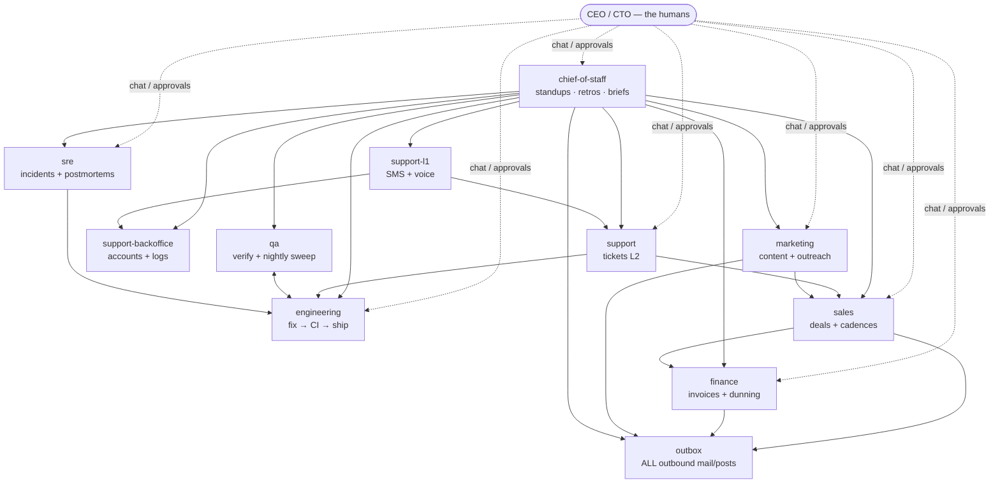

# Beacon: a software startup with two employees

Beacon sells uptime monitoring to small SaaS teams. It has a CEO, a CTO, and
**eleven agentd instances doing every other job in the company**. This directory
is the complete configuration: one YAML file per role, wired together over
A2A, driven by third-party webhooks, paced by schedules and signals, audited
by durable event streams — and every instance is also a colleague you can
open a chat with.

This is an EXAMPLE, not an endorsement of firing anyone: its purpose is to
show every major agentd mechanism doing a real job in one coherent system.
The MCP endpoints (`mcp.helpdesk.example`, …) are illustrative — point them
at your real servers.

## The org chart



## Where each mechanism earns its keep

| Mechanism | Where to look |
|---|---|
| **Third-party webhooks** | helpdesk tickets (`support`), GitHub Actions verdicts (`engineering`), monitoring alerts firing AND resolving (`sre`), website leads + email replies (`sales`), Stripe payments (`finance`), outreach replies (`marketing`), Twilio SMS + call transcripts (`support-l1`). Every route is HMAC-authenticated. |
| **Signals** | the incident run parks on `resolved/<alert_id>` until the all-clear webhook fires it (`sre`); each sales deal parks on `reply/<lead_id>` between cadence touches; marketing threads park on `mkt-reply/<person_id>`. A `wait {on: signal}` is durable — restarts don't lose a 10-day wait — and a deadline is an expected branch: `on_timeout: <step>` routes escalation (`sre` pages the CTO, `marketing` closes the file). The webhook→signal relays are ONE FIELD on the webhook start (`signal: "resolved/{{ body.alert_id }}"`). |
| **Workflows** | everywhere; the richest DAGs are `engineering/fix-bug` (agent → CI signal → switch → QA delegate), `finance/dunning` (delegate → durable sleep → check → switch → human gate), `sales/deal` (a month-long run per deal). |
| **Event streams** | `support/escalations` decouples triage from follow-through; `sre/incidents` replays every incident through the postmortem desk exactly once; `finance/ledger` is the journal the monthly close reads; `outbox/sent` is the audit ledger of everything the company ever said. |
| **MCP servers** | one per integration, tagged for trust: helpdesk, GitHub, staging, infra (with an `allow:` list of safe verbs only), status page, CRM, billing, email, social (LinkedIn/X/Instagram), web search, Twilio, the voice bridge, accounts, logs. |
| **Typed A2A commands** | every cross-desk call a schema can hold uses `command:` + `args:` — the wire DataPart the receiving `a2a` start matches on, checked against its declared `schema:` at the listener (a malformed bug report is refused synchronously, naming the field). Judgment asks (the chief of staff standup questions) stay prose on purpose. |
| **Durable queues** | the content calendar is a `memory.push`/`memory.shift` array — the daily slot pops one item as a data step, no model call; `human.asked` events turn every waiting approval into an email through the outbox (`finance/gate-notifier`). |
| **Conversational experience** | every instance sets `interface.enabled` — `agentd-tui --endpoint http://127.0.0.1:<port>` opens a chat with that colleague. The chief-of-staff's `cos.brief` command answers "what's happening?" with live answers from every desk. |
| **Human-in-the-loop** | refunds (`support`), production ships (`engineering`), stuck incidents page the CTO (`sre`), >20% discounts (`sales`), write-offs (`finance`), the weekly content calendar (`marketing`). `ask_human_fallback: wait` means an unanswered gate parks durably instead of guessing. |

## Voice, concretely

agentd does not process audio. `support-l1` pairs with a small bridge
service that terminates Twilio Media Streams and holds the OpenAI realtime
voice session; agentd is the brain behind it. Mid-call, the bridge fires the
`l1.lookup` A2A command whenever the voice model needs a fact ("what plan am
I on?"), and `support-l1` delegates to the back office and returns one
speakable sentence. After hangup the bridge posts the transcript webhook and
the wrap-up workflow resolves or escalates to the ticket desk.

## The trifecta discipline (why the org is shaped like this)

agentd refuses to boot an instance whose servers hold all three of
`untrusted_input` + `sensitive` + `egress` — that combination is the
prompt-injection kill chain. The org chart IS the mitigation:

| Instance | untrusted | sensitive | egress |
|---|---|---|---|
| support (tickets) | ✔ | — | ✔ |
| support-l1 (SMS/voice) | ✔ | — | ✔ |
| **support-backoffice** | — | ✔ | — |
| engineering / qa / sre¹ | — | ✔ | ¹ |
| sales / marketing | ✔ | ✔ | — |
| finance | — | ✔ | — |
| **outbox** | — | — | ✔ |
| chief-of-staff | — | — | — |

¹ sre's only egress is the public status page.

Two instances exist *because* of the gate: the **back office** (the desks
that read customer text cannot also hold accounts and logs) and the
**outbox** (the desks that read outside-authored text cannot also hold the
mail server). The residual risk is honest and documented in both files:
what the back office returns does flow onward to customers, so its contract
is minimal structured facts, never raw records — and everything the company
sends leaves one auditable choke point that can be rate-limited, held, or
unplugged.

## Ports

| Instance | A2A (chat + peers) | Webhooks |
|---|---|---|
| support | 8441 | 9441 |
| engineering | 8442 | 9442 |
| qa | 8443 | — |
| sre | 8444 | 9444 |
| sales | 8445 | 9445 |
| finance | 8446 | 9446 |
| outbox | 8447 | — |
| chief-of-staff | 8448 | — |
| marketing | 8449 | 9449 |
| support-l1 | 8450 | 9450 |
| support-backoffice | 8451 | — |

## Secrets, services, and what each must be able to do

Every `{{secret:NAME}}` in the configs is an env var, resolved at startup and
redacted everywhere agentd logs. The full inventory — each file's header
carries the per-desk detail (scopes, provider quirks, MCP tool contracts):

| Secret | Desk | Service | Scope that matters |
|---|---|---|---|
| `OPENAI_API_KEY` | all | any OpenAI-compatible endpoint | per-desk daily token budgets are the payroll |
| `HELPDESK_TOKEN` · `HELPDESK_WEBHOOK_SECRET` | support | Intercom/Zendesk/Plain… | ticket read+reply ONLY; webhook signs raw-body sha256 |
| `GITHUB_TOKEN` · `GITHUB_WEBHOOK_SECRET` | engineering | GitHub + Actions | fine-grained PAT, this repo, contents+PRs; the webhook scheme is native |
| `STAGING_TOKEN` | qa | a staging driver (Playwright-MCP…) | staging env only — never production |
| `INFRA_TOKEN` · `STATUSPAGE_TOKEN` · `ALERT_WEBHOOK_SECRET` | sre | k8s/PaaS + status page + Alertmanager | the most dangerous token in the company — scope to the safe verbs |
| `CRM_TOKEN` · `LEAD_WEBHOOK_SECRET` | sales, marketing | Attio/HubSpot/Twenty… | contacts+deals rw; your site signs its own lead POSTs |
| `LEDGER_TOKEN` · `STRIPE_WEBHOOK_SECRET` | finance | Stripe + accounting | records money, never moves it; see the signature-relay note |
| `SEARCH_TOKEN` · `MKT_REPLY_WEBHOOK_SECRET` | marketing | Brave/Tavily… + inbound email parse | search results are untrusted text |
| `EMAIL_TOKEN` · `SOCIAL_TOKEN` | outbox | Postmark/Resend + Buffer/Typefully… | SPF+DKIM, inbound parse for reply loops; idempotent send is THE property to test |
| `TWILIO_TOKEN` · `TWILIO_WEBHOOK_SECRET` · `VOICEBRIDGE_TOKEN` | support-l1 | Twilio + your voice bridge | messages on one number; the voice model's key lives in the bridge |
| `ACCOUNTS_TOKEN` · `LOGS_TOKEN` | support-backoffice | account store + log platform | both READ-ONLY; log queries customer-scoped by construction |

**The webhook-signature caveat, once:** agentd verifies a generic HMAC of the
raw body against a named header. GitHub's `X-Hub-Signature-256` matches that
scheme natively. Stripe (`t=…,v1=HMAC(ts.body)`) and Twilio (HMAC-SHA1 over
URL+params) do not — front those two routes with a thin relay that verifies
the provider's scheme and re-signs the raw body (or use your gateway's
transform). Each file's header says which side of that line it is on. And
never expose an UNSIGNED route: fake alerts aimed at an agent that can
restart services, or fake leads aimed at one that emails people, are attacks,
not noise.

## Running it

Each file is one instance. Export the secrets each file names
(`OPENAI_API_KEY` plus the per-integration tokens), then:

```console
$ for f in examples/startup/*.yaml; do agentd --config "$f" & done
```

Everything listens on loopback: third-party webhooks reach it through
whatever tunnel or ingress you already use, and in production you would put
the A2A mesh on `https://` with mTLS principals (see `examples/hiring/` for
that pattern) or on `unix:///` sockets for co-located instances. State is
durable under `/var/lib/agentd/startup/<name>` — kill any process mid-run
and restart it; sleeps, waits, gates, and stream offsets resume.

Talk to a colleague:

```console
$ agentd-tui --endpoint http://127.0.0.1:8448     # the chief of staff
> what's happening today?
```

**Dry-run the whole company offline** — debug builds carry a mock LLM:

```console
$ cargo build --features a2a,workflow
$ AGENT_INTELLIGENCE=mock:final ./target/debug/agentd --config examples/startup/sre.yaml
$ curl -X POST 127.0.0.1:9444/alerts/firing -d '{"alert_id":"a1","service":"probes","severity":"critical"}'
```

No key, no network: `mock:<script>` spawns the intelligence in-process, and
webhooks are plain HTTP you can curl.

Every config validates against the binary:

```console
$ for f in examples/startup/*.yaml; do agentd --validate-config --config "$f" || echo "$f"; done
```

## What is deliberately simplified

- The cadences are two touches; real sequences are longer but the same
  wait-signal-switch shape.
- `engineering` re-runs CI once on a red build; a real loop would use
  `iterate` with a bound.
- Instruction documents (RFC 0034) could fold each of these files into one
  markdown file per role (`:::config` + `:::workflow` + prose); the YAML
  form is used here because eleven files of it are easier to diff.
- One human answers every gate. At this company, that is rather the point.
