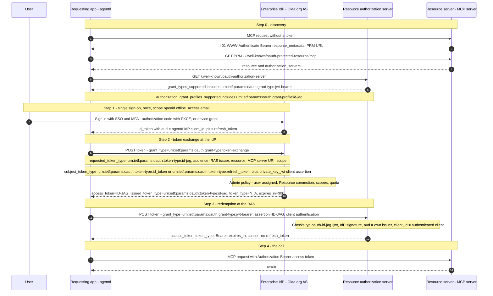
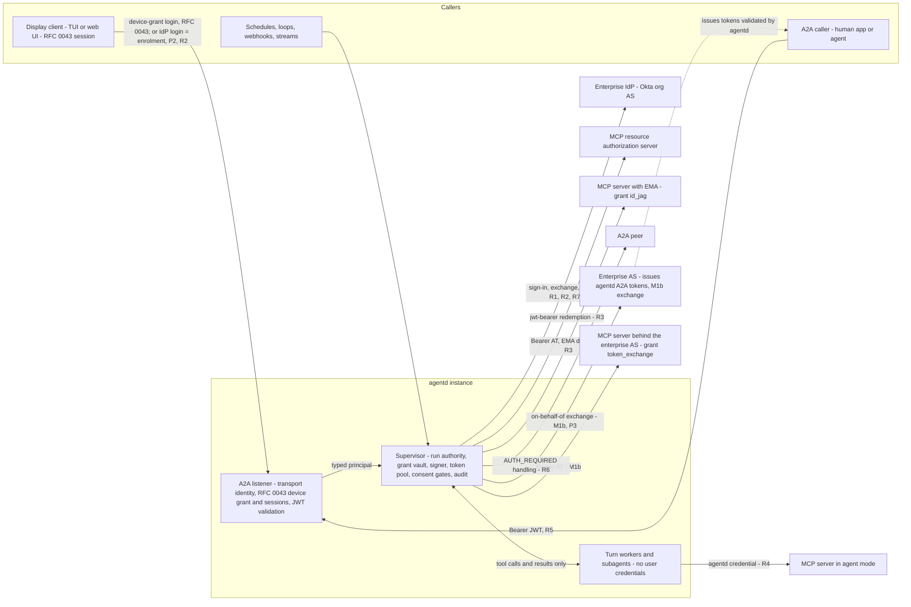
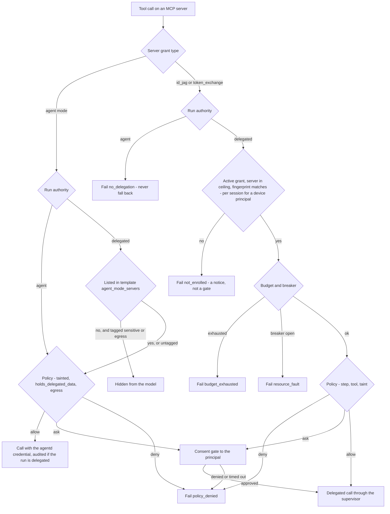
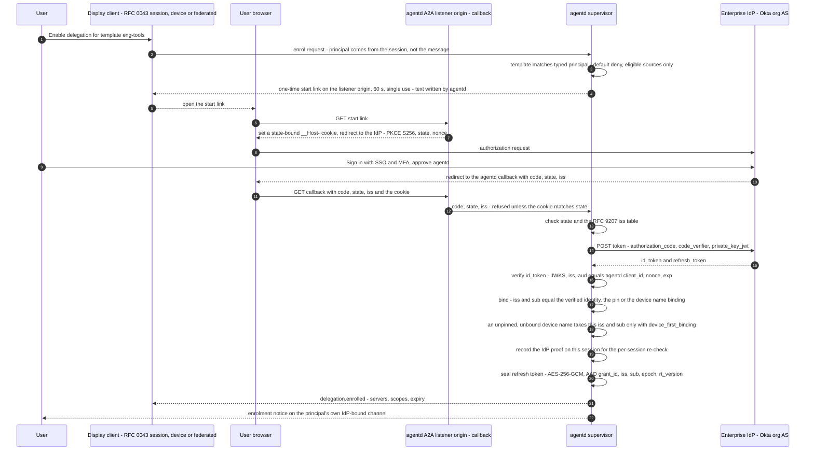
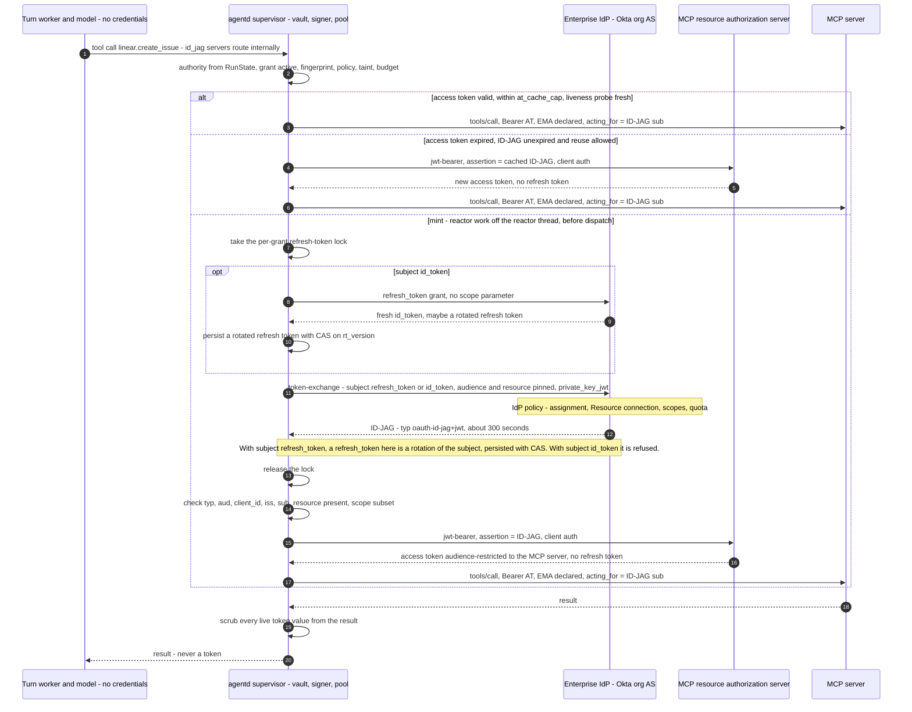
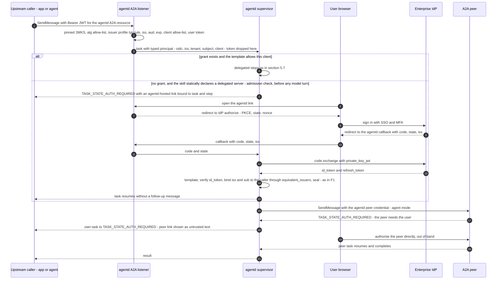
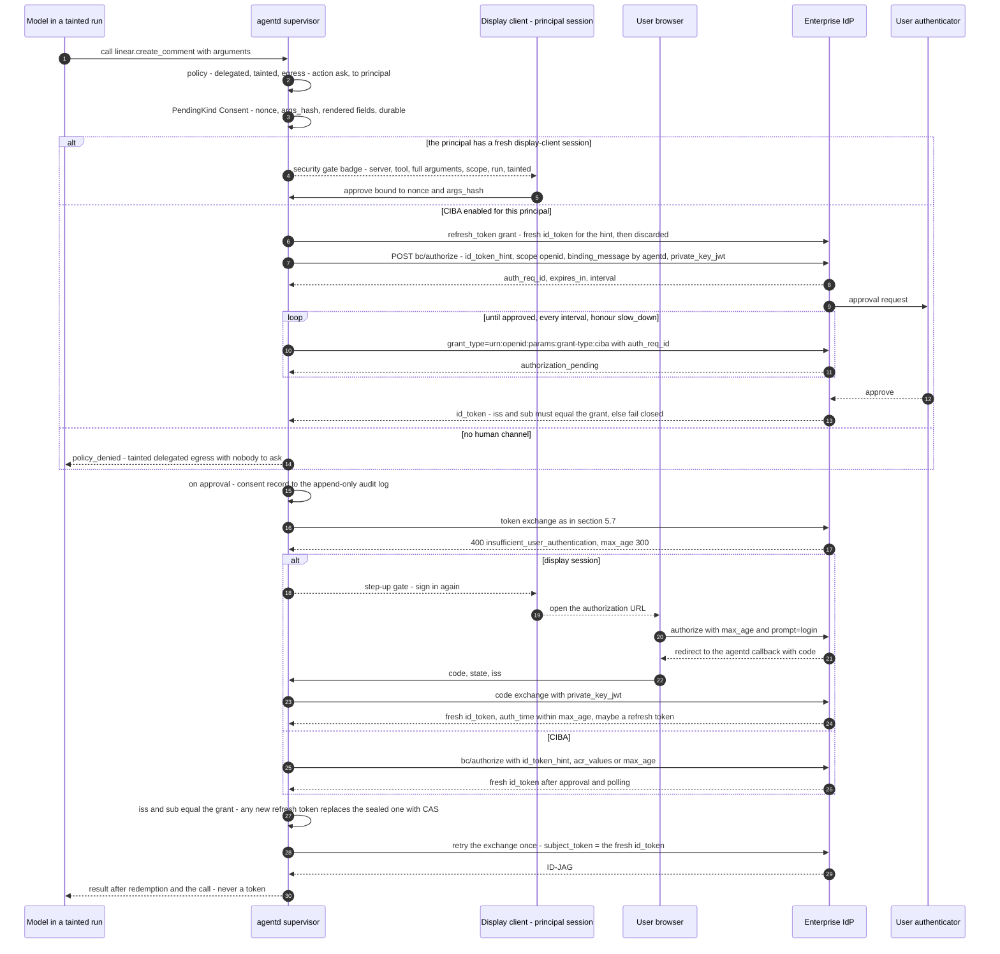
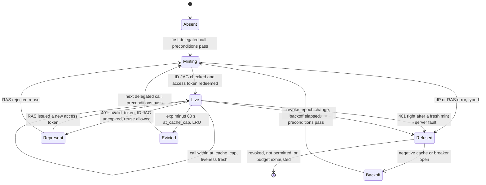
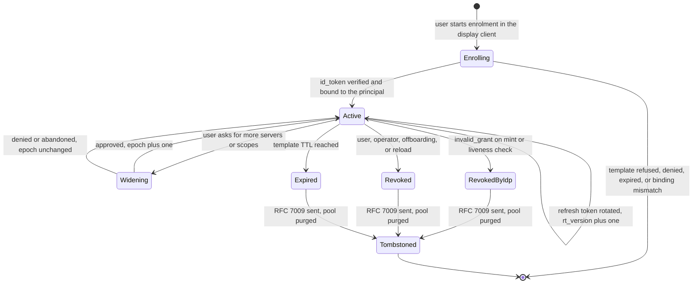
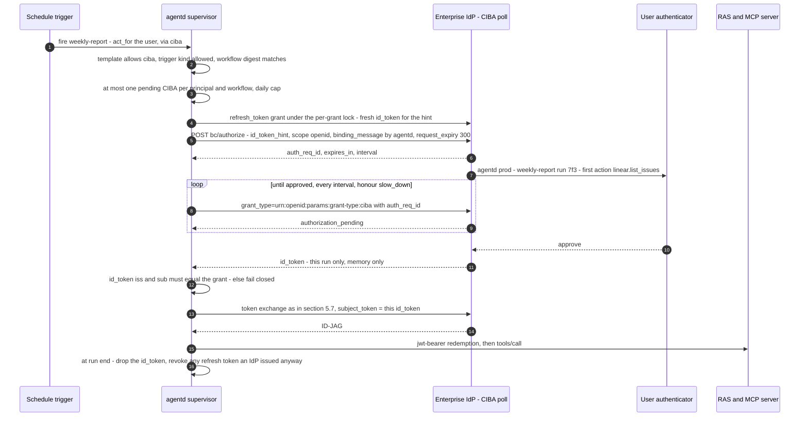

# RFC 0044: Enterprise-managed authorization — acting for a user through ID-JAG and Okta Cross App Access

**Status:** Proposed
**Author:** Andrii Tsok (drafted with Claude)
**Date:** 2026-09-27
**Extends:** RFC 0031 (endpoint authentication): a new `oauth2` grant, `id_jag`; `private_key_jwt` client authentication; and the per-principal credential key that RFC 0031 §11 promised and never built. RFC 0023 (AAuth agent identity): AAuth stays a parallel track, and its Case C per-authority token cache is re-keyed per principal.
**Depends on:** RFC 0029 (A2A conversations, principals and roles), RFC 0032 (interface and HITL gates), RFC 0037 (service catalog and egress policy), RFC 0042 (what a served document may configure) and RFC 0043 (the A2A boundary, extensions and the device authorization grant, v1.17.0). RFC 0043 is the source of the Agent Card's `securitySchemes` and `securityRequirements` (derived from its listener posture, `ListenerAuth`), of the per-principal `contextId` namespace, and of the baseline display-client login: an RFC 8628 device authorization grant served by agentd itself on the A2A listener origin, approved by an operator who names the device (`auth.device.approve {as: <name>}` → principal `user:<name>`). RFC 0043 removes the v1.16 pairing code, the `Pair` RPC and `interface.pairing`. This RFC builds on all of that and replaces none of it.
**Amends:** RFC 0042 — the `mcp` section moves from document-writable to straddling (§5.14.1).
**Standards basis:** draft-ietf-oauth-identity-assertion-authz-grant-04 (an Internet-Draft, see §2.1) as profiled by the MCP extension `io.modelcontextprotocol/enterprise-managed-authorization` (Stable); RFC 8693 on-behalf-of exchange for the same-domain case (§5.3, M1b).

---

## 1. Summary and motivation

### 1.1 Summary

agentd acts on the world with **its own** credentials. When a run is "for" a
person, agentd writes that person's name into a label, `agent/acting_for`, and
sends the call with a credential that belongs to agentd. The server on the other
end has to take the label on trust, the enterprise identity provider (IdP) never
sees the decision, and offboarding the person does nothing to agentd.

This RFC lets agentd act **as a user, verifiably**, in the place where it matters
first: as an MCP client of an MCP server whose authorization server supports the
Identity Assertion JWT Authorization Grant (**ID-JAG**) through MCP's Stable
Enterprise-Managed Authorization extension (**EMA**). Okta implements ID-JAG as
**Cross App Access (XAA)**, included in core Okta SSO as **Agent SSO**, and is
EMA's first supported IdP. The user stops being a string and
becomes the `sub` of a short-lived, audience-restricted access token that the
enterprise IdP authorised at the moment it was minted.

The wire is two form POSTs (steps 2 and 3 of the flow in §3, after discovery
and single sign-on):

1. an RFC 8693 token exchange at the IdP with
   `requested_token_type=urn:ietf:params:oauth:token-type:id-jag`;
2. an RFC 7523 `jwt-bearer` redemption of the resulting ID-JAG at the MCP
   server's authorization server.

ID-JAG cannot serve an MCP server protected by the enterprise's **own**
authorization server, because the IdP must not honour an ID-JAG in its own
domain (ID-JAG §9.3). For that same-domain case this RFC adds a second, plainer
delegation mode: an RFC 8693 on-behalf-of exchange at that authorization server
(`grant: token_exchange`, §5.3 M1b). It reuses the same grant, pin, taint,
budget and fail-closed machinery.

Both are written on agentd's existing OAuth HTTP helpers plus `ring`. There are
no new crates and no `rmcp` bump.

The design rests on six rules:

1. **User authority is an explicit, sealed, revocable delegation grant**, created
   only by the user signing in to agentd's own IdP client, and bounded twice: by
   IdP policy (re-evaluated on every mint) and by an operator template (a
   default-deny ceiling, a TTL, budgets and an epoch).
2. **Only the supervisor holds user tokens.** Turn workers, subagents and the
   model never see a token, a refresh token, a device code or a key.
3. **The principal comes from the authenticated transport**, as a typed identity,
   never from the model, a document, a webhook payload or a display string.
4. **Every refusal fails closed and is typed.** There is no fallback to agentd's
   own credential, to another principal's grant, or to a cached success.
5. **Autonomous work acts as agentd itself.** Borrowing a user's authority when
   nobody is present is opt-in, per-firing CIBA approval is preferred, and
   Okta's guidance against it is surfaced, not hidden.
6. **Nothing is forwarded.** An access token goes only to its audience, an
   ID-JAG only to the one authorization server named in it, and an inbound token
   never goes anywhere except, as an RFC 8693 `subject_token`, back to the
   authorization server that issued it (M1b).

ID-JAG is still an Internet-Draft, so the `id_jag` grant ships behind the cargo
feature `xaa` and `security.experimental.id_jag: true` until the draft reaches
working-group last call. Phase P0 (§7) has no delegation surface at all: it fixes
verified MCP-core authorization non-conformance that affects every
OAuth-protected MCP server agentd talks to today, and it is worth shipping on its
own.

### 1.2 What agentd does today

Checked against `main` at `c31637c5` (v1.16.0). Paths are relative to
`crates/agentd/src` unless noted.

| Area | Today |
|---|---|
| Outbound credentials | Per endpoint: `static`, `oauth2` (grants `device`, `authorization_code`, `client_credentials`), `aws`, `spiffe`; AAuth as a separate section. `OAuthGrant` has exactly three variants (`config/settings/mod.rs:2128`). `client_credentials` requires a `client_secret` (`config/settings/mod.rs` ~5807). |
| Who holds them | One signer per MCP server spec, built in `mcp::from_spec` (`mcp/mod.rs:109-133`), with precedence `auth:` > `oauth:` > AAuth. `RequestSigner::sign(method, authority, path, body)` receives no principal (`crates/mcp/src/http.rs:182`). |
| Credential cache | Keyed by login target only: `cred_id = sha256(target)`, e.g. `mcp:github` (`auth/cache.rs:59-61`). RFC 0031 §11 promised `(endpoint, provider, principal)`. The durable `Kind::Cred` helpers (`auth/cache.rs:64-83`) have no callers. |
| Refresh | Never written back. A refresh response without a new `refresh_token` discards the old one (`auth/device.rs:53-56` with `auth/login.rs:157-168`). No RFC 7009 revocation; `--logout` deletes the local file only. |
| Who the user is | `RunState.principal: Option<String>` (`engine/run.rs:184`), from an mTLS subject or SAN, a static `bearer_ref` secret match (two static bearer users both become `user:unknown`), a pairing session (every pairing collapses to `user:paired`), or `identity.autonomous_as` (default `system`). RFC 0043 (v1.17.0) removes pairing, makes `id` required on `bearer_ref` and `any` rules so neither collapsed id can be produced any more, and adds operator-named device-grant sessions (§5.2). No inbound JWT is ever validated. The `sub` matcher is an exact compare (`a2a/principals.rs:417`) although `docs/configuration.md:1884` documents a glob. |
| How the user is conveyed | `_meta["agent/acting_for"]`, an unauthenticated string, on runtime-mediated calls only (`runtime/tools.rs:277`, `:353`). It is missing on the `mcp.tool` workflow step (`runtime/steps.rs:1670`), on LLM turns that dial MCP directly from a worker (`runtime/turns.rs:399`, `runtime/steps.rs:2211-2213`, `worker.rs:588`), on the knowledge call (`runtime/turns.rs:766`), and subagent and think callers carry no principal at all (`runtime/tools.rs:93-104`). |
| Delegation machinery | None. No RFC 8693, RFC 7523, ID-JAG, `private_key_jwt`, DPoP or CIBA code anywhere in `crates/`. The only per-user mechanism is AAuth Case C, whose user token is cached per server authority, process-wide, and presented for every caller (`aauth/mod.rs:111`, `:201`). |
| MCP core auth | No RFC 8707 `resource`; AS discovery appends `/.well-known/...` only and tries OIDC before RFC 8414 with no issuer check (`auth/oauth2.rs:114-120`); PRM probe is origin-root only (`auth/challenge.rs:89-96`) and runs at `--login` only (`auth/login.rs:94-101`); no PKCE-method gate, no RFC 9207 `iss`, no `insufficient_scope` step-up; `id_token` is dropped (`auth/oauth2.rs:77-88`). |
| A2A server | The Agent Card advertises `extendedAgentCard: true` but declares no `securitySchemes` (`runtime/a2a_server.rs:2557`, `:2573`), which A2A §13.3 does not permit. RFC 0043 (v1.17.0) declares them, derived from its listener posture (§5.9). agentd never emits `TASK_STATE_AUTH_REQUIRED`; as a client it only turns a peer's into the string `auth-required` (`a2a/peer.rs:132`). |

### 1.3 Why enterprises need verifiable, IdP-governed delegation

A label is not authority. Four consequences follow from today's model:

- **The server cannot verify the user.** An MCP server that receives
  `agent/acting_for` has no way to distinguish a true statement from a steered
  model's invention. It must either ignore the label or trust agentd completely.
- **agentd's authority is usually broader than any one user's.** A service
  credential sized for "everything the agent might do" is used for every run.
  A prompt injection in one user's run acts with that whole authority.
- **The IdP is blind.** The enterprise decides who may use which application in
  its IdP. Today the IdP never sees an agent's access to a resource on a user's
  behalf, so its policy, its audit log and its offboarding do not reach agentd.
- **Attribution lands on the service account.** The resource's audit log says
  "agentd did it", not "agentd did it for Alice".

XAA answers all four. The IdP evaluates its policy — is this user assigned to
this agent, is this agent connected to this resource, with which scopes — **at
the moment each ID-JAG is minted**. The resource's own authorization server then
issues a short-lived token whose subject is the user and whose audience is one
resource. There is no refresh token at the resource, so every renewal goes back
through the IdP, and disabling the user or removing the connection stops the
next renewal.

What agentd adds is the part a desktop client does not need: many principals in
one daemon, durable runs that suspend and resume, scheduled work with nobody
present, and a model that must be assumed hostile.

### 1.4 Non-goals

- agentd is **not an IdP**. It never issues an ID-JAG and never redeems one it
  minted.
- agentd is **not a Resource Authorization Server** for its own A2A endpoint in
  this RFC. An embedded `jwt-bearer` server is deferred (§8); P3 validates
  tokens issued by an external enterprise authorization server instead. (RFC
  0043's embedded authorization server issues only opaque display-client
  session tokens; it accepts no assertion and carries no enterprise identity.)
- agentd **never forwards a token**. MCP forbids passthrough, ID-JAG §9.3
  forbids reusing an ID-JAG against a different authorization server, and A2A
  §7.6.3 says in-task credentials SHOULD go directly to, and be bound to, the
  agent that requested them. An RFC 8693 exchange of an inbound token at the
  authorization server that issued it (M1b) is an exchange, not forwarding: the
  downstream server receives a new token issued for it.
- Okta vendor-specific token types (`urn:okta:params:oauth:token-type:oauth-sts`,
  `...:vaulted-secret`, `...:service-account`, and the access-token-subject
  agent-to-agent exchange) are **not** in the core design. They are P4 items.
- **XAA for autonomous work by default.** Okta's XAA concept page says not to use
  XAA for "Autonomous agents: Workflows that run independently without an active
  user session or human initiation" or for "Background processing". agentd
  follows that by default (§5.3, M3/M4).

## 2. Background and glossary

This section is self-contained: an engineer who has never heard of XAA should be
able to read it and then §3. Every status below was verified on **2026-09-27**
against the primary source listed in §10. Where a claim could not be verified on
a primary page, it says so.

### 2.1 Status of every standard and product this RFC relies on

| Item | What it is | Status as of 2026-09-27 |
|---|---|---|
| **ID-JAG** — `draft-ietf-oauth-identity-assertion-authz-grant-04` | The grant XAA and EMA are built on | **Internet-Draft**, revision -04 dated 2026-05-21, expires 2026-11-22. OAuth WG Document, IESG state "I-D Exists", no shepherd, no AD, no -05. Authors: A. Parecki (Okta), K. McGuinness (Independent), B. Campbell (Ping Identity). The editor's repository was last committed 2026-05-21 and has 45 open issues and PRs. Its URNs (`token-type:id-jag`, `grant-profile:id-jag`) are **not yet registered** at IANA. |
| `draft-parecki-oauth-identity-assertion-authz-grant` | ID-JAG's individual predecessor | Revisions -00 (2024-03-02) to -05 (2025-07-02); state Replaced. |
| **Identity Chaining** — `draft-ietf-oauth-identity-chaining-17` | The general pattern ID-JAG profiles | Revision -17 dated 2026-07-19. IESG state "RFC Ed Queue", intended Proposed Standard, no RFC number yet. IANA has registered `identity_chaining_requested_token_types_supported`. ID-JAG -04 normatively cites -12. |
| **RFC 8693** OAuth 2.0 Token Exchange | Step 2 of XAA (the exchange at the IdP); M1b on-behalf-of | RFC, January 2020. |
| **RFC 7523** JWT Profile for client auth and grants | Step 3 of XAA (redemption at the RAS); `private_key_jwt` | RFC, May 2015. Its revision `draft-ietf-oauth-rfc7523bis-11` is in the RFC Editor queue (text dated 2026-03-26; datatracker shows latest revision 2026-04-28). |
| RFC 9728 (Protected Resource Metadata), RFC 8707 (Resource Indicators), RFC 8414 (AS Metadata), RFC 9207 (AS issuer identification), RFC 7009 (revocation), RFC 8628 (device grant), RFC 9068 (JWT access tokens), RFC 9396 (RAR, May 2023), RFC 9449 (DPoP, September 2023), RFC 8705 (mTLS-bound tokens, February 2020), RFC 9470 (step-up), RFC 9493 (subject identifiers) | Building blocks | Published RFCs. |
| RFC 9700 (OAuth Security BCP), RFC 10017 (browser-based apps BCP), RFC 10027 (cross-device flows BCP, **BCP 247**) | Security guidance | RFC 9700 January 2025; RFC 10017 and RFC 10027 August 2026. |
| **MCP** protocol revision `2026-07-28` | agentd's modern MCP dialect | "Current". `2025-11-25` is Final. |
| **MCP EMA** — `io.modelcontextprotocol/enterprise-managed-authorization` | ID-JAG profiled for MCP | **Stable.** Promoted by ext-auth commit `877b4fd` (2026-06-17); ext-auth PR #29 ("Align ... with id-jag-04 and promote to stable") merged 2026-06-18. Originated as SEP-990 (Final, Standards Track, created 2025-06-04, author Aaron Parecki). |
| MCP OAuth Client Credentials extension (`io.modelcontextprotocol/oauth-client-credentials`) | Non-user path for daemons | **Draft.** |
| MCP SEP-1932 (DPoP), SEP-1933 (Workload Identity Federation) | Sender constraint; workload identity | **Open Draft SEPs**, both created 2025-12-05. SEP-2752 (HTTP Message Signatures) is a proposal without a sponsor. |
| CIMD — `draft-ietf-oauth-client-id-metadata-document-02` | URL-shaped client IDs | Internet-Draft -02, 2026-07-06 (MCP 2026-07-28 cites -00). |
| OAuth 2.1 — `draft-ietf-oauth-v2-1-16` | Base OAuth profile | Internet-Draft -16, 2026-09-03 (MCP cites -13). |
| **A2A** | agentd's agent-to-agent protocol | Specification version 1.0.0 (tag v1.0.0 published 2026-03-12). Repository release tag v1.0.1 published 2026-05-28 (bug fixes; protocol version unchanged). §7.6.4 "In-Task Authorization Scope" exists **only on `main`** (PR #2081, merged 2026-07-30), not in any tag. Epic #1990 (assertion flows / PRM in the card) is open and labelled `v1.1-candidate`. |
| **OpenID CIBA Core 1.0** | Out-of-band user approval | **Final**, 2021-09-01. |
| **Transaction Tokens** — `draft-ietf-oauth-transaction-tokens-11` | Context inside one trust domain | Internet-Draft -11, 2026-07-30, "WG Consensus: Waiting for Write-Up"; OAuth WG milestone to the IESG 2026-12-31. |
| **WIMSE** | Workload identity | `draft-ietf-wimse-aims-00` (WG-adopted 2026-09-15); `workload-creds-02` (2026-07-02); `wpt-02` (2026-08-27); `identifier-03` (2026-07-06); `arch-08` (2026-07-06). `draft-ietf-oauth-spiffe-client-auth-02` (OAuth WG, 2026-06-15). All Internet-Drafts. |
| **AAuth** — `draft-hardt-oauth-aauth-protocol-11` | Open-web agent identity (RFC 0023) | Individual Internet-Draft, 2026-09-25. `draft-hardt-aauth-bootstrap-01` (which agentd implements) is **still active**, expiring 2026-11-07. |
| Actor profiles — `draft-mcguinness-oauth-actor-profile-00`; `draft-mw-oauth-actor-chain-01` | Standardising `act` | Individual drafts (2026-04-30; 2026-06-15). Not adopted. |
| `draft-parecki-oauth-jwt-dpop-grant-01` | The `jwt-dpop` grant ID-JAG's DPoP example uses | **Expired** (expiry 2026-08-03). |
| **Okta Agent SSO** (XAA in core SSO) | Okta's XAA product | **Generally available 2026-08-24**, "included in core Okta SSO at no additional cost" (press release). Developer release 2026.08.1 ("Cross App Access support for AI agents and apps for all customers", Preview orgs 2026-08-17); production release notes 2026.09.0 list it as Generally Available. The older "Enable Connect with Okta" Early Access configuration path is legacy and being retired. |
| Okta for AI Agents | Separate subscription (agent directory, machine access, vendor token types) | Available 2026-04-30 per Okta's Showcase release (GA blog dated 2026-04-29; the Agent SSO release says "since May 2026"). |
| Okta agent-to-agent token exchange / Agent-to-Agent Connections | Agent-to-agent delegation | Exchange: Early Access in Preview 2026.06.2, GA in Production 2026.07.2 (requires Okta for AI Agents). The documented exchange uses ID-JAGs (audience = the next custom AS issuer, resource = the downstream agent URL) and then an access-token-subject exchange at the next hop, producing nested `act` chains with `sub_profile` `ai_agent`/`service`. "Agent-to-Agent Connections" was announced GA at Oktane 2026-09-22, with no protocol named in the announcement. |
| Okta Agent Gateway | Okta-hosted virtual MCP server | **Beta** (APIs Beta in 2026.09.1); GA "planned in Q3" (fiscal or calendar not stated). |
| Okta CIMD for AI agents | URL client IDs at Okta | **Beta** in 2026.09.1 (guide badge says "research"). |
| Okta CIBA | Backchannel approval | GA in Production 2023.06.0; **poll mode only**; requires an Okta Custom Authenticator (Devices SDK). |
| Okta DPoP | Sender-constrained tokens | GA in Production 2023.12.0. Not documented for the ID-JAG exchange. |
| Okta On-Behalf-Of token exchange | RFC 8693 between custom authorization servers in one tenant (M1b) | GA in Production 2023.05.0; service app with the Token Exchange grant; `subject_token_type=...:access_token`. |
| Other IdPs | Portability | PingFederate 13.1 (June 2026) issues and accepts ID-JAGs. Auth0 XAA is Early Access. Keycloak accepts ID-JAGs experimentally (feature flag `identity-assertion-jwt`) and does not issue them. Microsoft Entra does not issue ID-JAGs per a Microsoft Tech Community post of 2026-07-16 (no roadmap given). Entra's own on-behalf-of flow is a `jwt-bearer` grant with `requested_token_use=on_behalf_of` rather than RFC 8693 (Microsoft identity platform documentation; not re-verified for this RFC). |
| `rmcp` (official Rust MCP SDK) | Possible library path | 3.3.0 (2026-09-10) added `auth-enterprise-managed`; latest 3.4.1 (2026-09-23). agentd pins **3.1.2**. |

### 2.2 Okta Cross App Access (XAA)

Cross App Access is Okta's name for the ID-JAG pattern; the ID-JAG draft's own
abstract says the pattern "is informally referred to as Cross-App Access
(XAA)". An enterprise admin registers an **AI agent** (under
*Directory > AI Agents*), links it to an OIDC app that shares its client ID,
assigns users to that app, and adds **Resource connections**: for each resource
app, a *resource indicator*, the *AI agent's client ID registered in this app*,
and the allowed *scopes*. At run time the agent exchanges a user's sign-in for a
short ID-JAG at Okta, and presents it to the resource's own authorization server
for an access token. There is no per-resource consent screen: the admin's
connection is the policy.

Okta sells this as **Agent SSO**, generally available on 2026-08-24 and included
in core Okta SSO. Under plain SSO, use is limited to **250 ID-JAGs per user, per
resource app, per month**; higher volumes need the separate Okta for AI Agents
subscription. Okta issues ID-JAGs **only from the org authorization server**
(`https://{yourOktaDomain}/oauth2/v1/token`); sending the exchange to a custom
authorization server such as `/oauth2/default` fails with "requested_token_type
invalid or not supported".

### 2.3 ID-JAG — Identity Assertion JWT Authorization Grant

`draft-ietf-oauth-identity-assertion-authz-grant-04`. Four roles (§2.1 of the
draft):

- **Client** — the requesting application (agentd). It is a relying party of the
  IdP, and separately an OAuth client of the resource's authorization server.
- **IdP Authorization Server** — the enterprise IdP (an OpenID Provider or SAML
  IdP) in trust domain A.
- **Resource Authorization Server (RAS)** — issues access tokens for the
  resource in trust domain B. It keeps sole control of access-token issuance; the
  draft explicitly contrasts this with an IdP issuing RFC 9068 tokens directly.
- **Resource Server** — the API or MCP server. It trusts only its RAS.

The client exchanges an **identity assertion** (an ID token, a SAML 2.0
assertion, or an IdP refresh token) at the IdP for an **ID-JAG**: a JWT with
header `typ: oauth-id-jag+jwt`, audience the RAS, signed by the IdP. It then
presents the ID-JAG to the RAS as an RFC 7523 JWT bearer grant. The exact
messages are in §3.

Rules the rest of this RFC leans on:

- §4.3.3: when the subject is an identity assertion, the IdP **MUST** check that
  the assertion's audience equals the `client_id` of the authenticated client. A
  refresh-token subject must be bound to that client. agentd therefore cannot
  exchange a token minted for any other client.
- §4.3: implementations MUST accept identity assertions and MAY accept refresh
  tokens as the subject.
- §4.3.4 and §4.4.3: neither the IdP's exchange response nor the RAS's token
  response should carry a refresh token (both SHOULD NOT). The client MAY
  re-present the same ID-JAG until it expires (§4.4.3), then mints a new one.
- §9.1: the grant SHOULD only be supported for confidential clients.
- §9.2: the IdP may demand step-up with `insufficient_user_authentication`
  (optionally with `max_age`).
- §9.3: an ID-JAG MUST NOT be reused for a different downstream RAS; the IdP
  MUST NOT issue access tokens in response to an ID-JAG it issued itself in the
  same domain.
- §9.7 and §4.3: `actor_token` is allowed, but the draft "does not define
  normative processing requirements for actor_token or whether an act claim is
  included in the issued ID-JAG".
- §9.8.1: DPoP binding is normative: a valid DPoP proof on the exchange makes the
  IdP put `cnf.jkt` in the ID-JAG, and the RAS MUST reject a `cnf`-bound ID-JAG
  presented without a matching proof. The redemption example uses the grant type
  `urn:ietf:params:oauth:grant-type:jwt-dpop` from an expired individual draft.

### 2.4 RFC 8693 token exchange — delegation versus impersonation

RFC 8693 defines `grant_type=urn:ietf:params:oauth:grant-type:token-exchange`
with `subject_token` and `subject_token_type` (required), optional
`actor_token` and `actor_token_type`, `audience`, `resource`, `scope` and
`requested_token_type`, and a response carrying `issued_token_type`. Standard
token-type URNs are `urn:ietf:params:oauth:token-type:access_token`,
`...:refresh_token`, `...:id_token`, `...:saml1`, `...:saml2` and `...:jwt`.

It distinguishes two semantics:

- **Impersonation** — A is given a token in which A is indistinguishable from B.
- **Delegation** — A keeps its own identity while acting for B. The issued token
  carries an **`act`** (actor) claim naming A. Chains nest `act` inside `act`;
  only the outermost `act` is the current actor, and consumers "MUST only
  consider the token's top-level claims and the party identified as the current
  actor by the act claim" for access control. A **`may_act`** claim in the
  subject token names who may become the actor.

XAA and EMA tokens today are **impersonation-shaped**: the resource sees
`sub = user`, and agentd is visible only as the `client_id` the RAS issued the
token to. §5.3 (M2) says exactly how much agentd can promise beyond that.

RFC 8693 is also the standard **on-behalf-of** exchange inside one domain: a
service holding an access token issued to it for a user exchanges that token at
the same authorization server for a token audience-bound to a downstream API.
Okta supports this between custom authorization servers in one tenant (GA
2023.05.0; the result keeps the user's `sub` and names the service app in
`cid`). This is the mechanism for M1b (§5.3), where ID-JAG does not apply.

### 2.5 RFC 7523 — JWT bearer grant and JWT client authentication

RFC 7523 defines two things XAA uses:

- the **grant** `grant_type=urn:ietf:params:oauth:grant-type:jwt-bearer` with
  `assertion=<JWT>` — step 3 of XAA (§3), the redemption;
- **client authentication** with
  `client_assertion_type=urn:ietf:params:oauth:client-assertion-type:jwt-bearer`
  and `client_assertion=<JWT signed by the client's key>`, commonly called
  **`private_key_jwt`**. The JWT has `iss = sub = client_id`, `aud`, `exp`, and
  optionally `jti` and `iat`.

`draft-ietf-oauth-rfc7523bis-11` tightens the client-assertion audience: `aud`
must be the authorization server's **issuer identifier as its sole value**, and
`typ: client-authentication+jwt` is recommended. This responds to an
audience-injection issue reported by University of Stuttgart researchers
(Hosseyni, Küsters, Würtele) at an OAuth interim in January 2025. Okta's XAA
guide, by contrast, sets the assertion `aud` to its token endpoint URL. agentd
makes this a per-authorization-server setting (§5.14).

### 2.6 MCP authorization and Enterprise-Managed Authorization

MCP authorization (revision `2026-07-28`) is an OAuth 2.1 profile with bearer
tokens:

- The MCP server is an OAuth resource server and MUST publish **RFC 9728
  Protected Resource Metadata** (PRM), whose `authorization_servers` names at
  least one authorization server. The client uses the URL from
  `WWW-Authenticate: Bearer resource_metadata="..."` on a 401, else the
  path-inserted well-known URL, else the root one. RFC 9728 §3.3: the PRM
  `resource` MUST be identical to the URL it was derived from, or the metadata
  MUST NOT be used.
- AS metadata discovery order: for an issuer with a path, RFC 8414 path-insert,
  then OIDC path-insert, then OIDC append; without a path, RFC 8414 then OIDC.
  The fetched `issuer` MUST be identical to the issuer used to build the URL.
- Clients MUST send the **RFC 8707 `resource`** parameter (the MCP server's
  canonical URI) on authorization and token requests "regardless of whether
  authorization servers support it".
- PKCE with S256; the client MUST refuse an AS whose metadata lacks
  `code_challenge_methods_supported`.
- RFC 9207 `iss` validation on the authorization response (SEP-2468).
- Persisted credentials are keyed by the AS `issuer` (SEP-2352).
- Step-up: on `403` with `WWW-Authenticate: Bearer error="insufficient_scope",
  scope="..."`, a client acting for a user SHOULD re-authorize with the union of
  previously requested and challenged scopes, with bounded retries.
- **No token passthrough.** "MCP clients MUST NOT send tokens to the MCP server
  other than ones issued by the MCP server's authorization server", and "MCP
  servers MUST NOT accept or transit any other tokens".

**Enterprise-Managed Authorization** is the Stable ext-auth extension that
profiles ID-JAG for MCP. Its rules: the token-exchange `audience` MUST be the
RAS issuer; `resource` is OPTIONAL and, if set, MUST be the MCP server's RFC
9728 resource identifier; the ID-JAG `resource` claim MUST contain the MCP
server if present; the issued access token MUST be audience-restricted to that
MCP server. A client discovers support from RAS metadata:
`authorization_grant_profiles_supported` containing
`urn:ietf:params:oauth:grant-profile:id-jag`. A client not pre-registered at the
RAS may use its CIMD URL as `client_id`, optionally with `private_key_jwt`.

On the MCP docs page for the extension (not in the ext-auth spec text): clients
declare support per request in
`_meta["io.modelcontextprotocol/clientCapabilities"].extensions["io.modelcontextprotocol/enterprise-managed-authorization"] = {}`
(on 2025-11-25 and earlier, in `initialize` `capabilities.extensions`, SEP-2133),
and "Do not redirect the user to the MCP Authorization Server's authorization
endpoint". That page also says IdP revocation takes effect "immediately across
all MCP clients", which overstates the protocol: tokens already issued stay
valid until they expire (§5.11).

The MCP blog of 2026-06-18 names Okta as the first IdP and lists Claude, Claude
Code, Cowork and VS Code as clients and Asana, Atlassian, Canva, Figma, Granola,
Linear and Supabase as servers. The community client matrix ticks Enterprise
Auth only for Archestra.AI; the two sources disagree.

### 2.7 A2A 1.0 security schemes and in-task authorization

An A2A Agent Card declares `securitySchemes` (a map of named schemes modelled on
the OpenAPI 3.2 Security Scheme Object: `apiKey`, `httpAuth`, `oauth2`,
`openIdConnect`, `mtls`) and `securityRequirements`. `OAuthFlows` is a proto
`oneof`, so one scheme entry declares exactly one flow: `authorizationCode`
(with `pkceRequired`), `clientCredentials` or `deviceCode` (`implicit` and
`password` are deprecated). An `oauth2` scheme may carry `oauth2MetadataUrl`
(RFC 8414). There is **no** assertion (`jwt-bearer`) flow, no token-exchange
flow, no RFC 9728 field, no audience guidance and no DPoP; a search of the
A2A organisation for `id-jag` returns nothing.

Identity lives at the transport layer: "Identity information is handled at the
protocol layer, not within A2A semantics" (§7). Credentials are obtained out of
band and sent on every request, and the server MUST authenticate every request.
§13.3: the extended Agent Card MUST be authenticated with a scheme declared in
the public card.

`TASK_STATE_AUTH_REQUIRED` (enum 8) is an interrupted state (§7.6). The agent
moves its task there and explains what is needed; credentials SHOULD arrive out
of band, directly to the agent that asked; an intermediate agent may chain by
moving its own task to the same state. The unreleased §7.6.4 adds that the
transition is not itself an authorization, and a credential obtained through it
MUST NOT be assumed to authorize later messages on the task. The maintainers'
guidance (issue #19) is to give the end-user's token "directly to D", the agent
that needs it, rather than relaying it down a chain. On-behalf-of attribution
exists only as an open extension proposal (#2028, "Audit, not authorization").

### 2.8 CIBA — Client-Initiated Backchannel Authentication

OpenID CIBA Core 1.0 (Final, 2021-09-01) lets a client ask the IdP to
authenticate a named user on the user's own device, without a browser redirect.
The client POSTs to `backchannel_authentication_endpoint` with `scope`
(containing `openid`), exactly one of `login_hint`, `id_token_hint` or
`login_hint_token`, an optional `binding_message`, `requested_expiry`, and
client authentication. It receives `auth_req_id`, `expires_in` and `interval`,
then (in poll mode) polls the token endpoint with
`grant_type=urn:openid:params:grant-type:ciba`, handling
`authorization_pending`, `slow_down`, `expired_token` and `access_denied`. Ping
and push modes also exist. Okta supports **poll only**, at
`/oauth2/v1/bc/authorize`, and needs an Okta Custom Authenticator. On the wire
Okta names the expiry parameter **`request_expiry`**, not Core's
`requested_expiry`; agentd's `profile: okta` sends the Okta name. RFC 9396
lists CIBA requests as a place `authorization_details` (RAR) may be used; Auth0
documents CIBA with RAR; Okta does not document RAR for CIBA.

### 2.9 DPoP and certificate-bound tokens

DPoP (RFC 9449) binds a token to a client key: each request carries a
`DPoP: <proof>` JWT (`typ: dpop+jwt`, claims `jti`, `htm`, `htu`, `iat`, plus
`ath` when presenting a token and `nonce` when the server demands one), the
token carries `cnf.jkt`, and it is presented as `Authorization: DPoP <token>`.
Servers may demand a nonce with `use_dpop_nonce` and a `DPoP-Nonce` header.
RFC 8705 binds tokens to a TLS client certificate (`cnf.x5t#S256`). Core MCP is
bearer-only; SEP-1932 (DPoP for MCP) is an open draft. ID-JAG §9.8.1 specifies
DPoP on the exchange leg and requires the RAS to reject a `cnf`-bound ID-JAG
without a matching proof; its redemption example uses the `jwt-dpop` grant type
from an expired individual draft, so the redemption wire is not settled.

### 2.10 Transaction tokens

`draft-ietf-oauth-transaction-tokens-11` defines short-lived JWTs
(`typ: txntoken+jwt`, token type `urn:ietf:params:oauth:token-type:txn_token`)
that carry user and request context **inside one trust domain**, in a
`Txn-Token` HTTP header. They are not cross-domain grants and are not a
replacement for ID-JAG. The draft says their lifetime "MAY exceed the expiration
time of the presented token, subject to the policy of the TTS". This RFC does
not use them (deferred, §7 P4).

### 2.11 Identity chaining

`draft-ietf-oauth-identity-chaining-17` is the general pattern: an RFC 8693
exchange in domain A produces a JWT authorization grant for domain B's
authorization server, redeemed there with RFC 7523. ID-JAG fixes the generic
choices (subject = identity assertion, audience = RAS issuer) and adds a typed
JWT, a required `client_id`, tenant claims and metadata. One known difference is
open: chaining says `resource` names domain B's AS, ID-JAG says `resource` names
the resource server (ID-JAG issues #110, #120, #123).

### 2.12 WIMSE and SPIFFE

WIMSE is the IETF workload-identity work: workload identifiers
(`spiffe://trust-domain/path` or the proposed `wimse://`), Workload Identity
Tokens (`typ: wit+jwt`, `Workload-Identity-Token` header) and Workload Proof
Tokens (`typ: wpt+jwt`). `draft-ietf-oauth-spiffe-client-auth-02` lets a workload
authenticate to an OAuth AS with a JWT-SVID
(`client_assertion_type=urn:ietf:params:oauth:client-assertion-type:jwt-spiffe`),
an X.509-SVID or a WIT-SVID. `draft-ietf-wimse-aims-00` ("AI Identity Management
System", adopted 2026-09-15, authors from Defakto, AWS, Zscaler, Ping, OpenAI and
Okta) composes these with OAuth, CIBA, Transaction Tokens and identity chaining
into a reference architecture for agents acting for users. It describes static
API keys as an antipattern and argues against giving the model access to agent
credentials (these two points were not re-checked line by line against the -00
text). agentd already supports SPIFFE as an RFC 0031 credential kind.

### 2.13 AAuth

AAuth (RFC 0023) is an individual-draft stack by Dick Hardt built on RFC 9421
HTTP Message Signatures: an agent identity, a Person Server that issues
person-bound tokens, and signed requests. `draft-hardt-oauth-aauth-protocol-11`
(2026-09-25) mentions MCP but not RFC 8693, ID-JAG or CIBA. It is a parallel,
open-web track. agentd keeps it, fixes its Case C cross-principal reuse in P0,
and does not use it as the enterprise delegation path (§8).

### 2.14 Terms used in this RFC

| Term | Meaning here |
|---|---|
| **Principal** | The authenticated party a run acts for, as a typed identity (§5.2). |
| **Delegation grant** | A sealed, durable record that lets agentd mint ID-JAGs for one principal at one IdP (§5.5). |
| **Template** | Operator configuration that decides which principals may enrol, for which servers and scopes, for how long (§5.5). |
| **Mint** | One RFC 8693 exchange at the IdP that produces one ID-JAG. Each mint counts against the Okta quota. |
| **Redeem** | One RFC 7523 exchange of an ID-JAG at a RAS for an access token. |
| **Delegated server** | An MCP server with `grant: id_jag` (P1) or `grant: token_exchange` (M1b, P3). Where this RFC says "`id_jag` server" about routing, pins, taint, tags, secrets, visibility or validation, the rule applies to both kinds; rules about the ID-JAG itself (exchange, redemption, re-presentation, EMA declaration) apply only to `id_jag`. |
| **Delegated call** | An MCP call made with a token whose subject is the principal. |
| **Agent mode** | A call made with agentd's own credential. |
| **Gate** | A durable pending decision (existing `ask_human` substrate, new `Consent` kind). |
| **T0–T4** | The credential tiers in §5.11. (Threats are T1–T38 in §6.2; context makes clear which is meant.) |
| **M1–M4, M1b** | The identity modes in §5.3. |

**Flow index.** §5 and §6 refer to the flows by these labels:

| Flow | What | Where |
|---|---|---|
| F0 | Discovery and pinning | §5.6 |
| F1 | Enrolment (the user signs in to agentd) | §5.4 |
| F2 | Mint: the RFC 8693 exchange at the IdP | §5.7 |
| F3 | Redemption at the RAS, and the delegated MCP call | §5.7 |
| F4 | Renewal and challenges | §5.8 |
| F5 | Revocation | §5.8 |
| F6 | Consent and step-up | §5.10 |
| F7 | Unattended runs (`act_for`) | §5.12 E |
| F8 | Inbound A2A token validation | §5.9 |
| F9 | Per-hop ID-JAG to an A2A peer (P4) | §5.9 |
| F10 | Same-domain on-behalf-of exchange (M1b) | §5.7 |

## 3. How XAA works, step by step

This section describes the protocol as the standards and Okta's documentation
define it, independent of agentd. §5 describes what agentd does with it.

### 3.1 The cast and the three registrations

| Party | In XAA terms | Example |
|---|---|---|
| The user | Resource owner | Alice, an employee |
| The requesting app | ID-JAG *Client* | agentd, registered in Okta as an AI agent |
| The enterprise IdP | *IdP Authorization Server* | The Okta **org** authorization server, issuer `https://acme.okta.com` |
| The resource's authorization server | *Resource Authorization Server (RAS)* | Linear's OAuth server, named in the MCP server's PRM |
| The resource | *Resource Server* | Linear's MCP server |

ID-JAG §5 needs three independent registrations, all made out of band:

1. **Client at the IdP** — for SSO and for the exchange. The client should be
   confidential (ID-JAG §9.1: the grant SHOULD only be supported for
   confidential clients; Okta also allows a "Client ID only" public
   registration). agentd requires a confidential registration (§4, R1).
2. **Client at the RAS** — the client's `client_id` there may differ from its IdP
   `client_id`. The IdP must know it, because it goes into the ID-JAG's
   `client_id` claim. In Okta this is the Resource connection field "AI agent's
   client ID registered in this app". A CIMD URL client ID can serve as one
   global identifier instead (Okta: Beta).
3. **RAS trusts the IdP** — the RAS has a configured connection to the IdP
   issuer and its JWKS, and maps the IdP's subject to its own accounts.

In Okta, the admin then assigns users to the AI agent's linked app and adds a
Resource connection per resource (resource indicator, the agent's client ID at
that resource, allowed scopes). That connection **is** the policy the IdP
applies at every mint.

### 3.2 The canonical flow



### 3.3 Step 0 — discovery

1. The MCP server answers an unauthenticated request with
   `401 WWW-Authenticate: Bearer resource_metadata="https://mcp.example/.well-known/oauth-protected-resource/mcp"`
   (optionally with `scope="..."`).
2. The client fetches the PRM (RFC 9728). It MUST check that `resource` is
   identical to the MCP server URL, then takes the RAS issuer from
   `authorization_servers`.
3. The client fetches the RAS metadata (RFC 8414) and checks that `issuer` is
   identical to the one it asked for. The RAS advertises the profile:
   ```json
   {
     "issuer": "https://auth.linear.example",
     "token_endpoint": "https://auth.linear.example/oauth/token",
     "grant_types_supported": ["authorization_code",
       "urn:ietf:params:oauth:grant-type:jwt-bearer"],
     "authorization_grant_profiles_supported": [
       "urn:ietf:params:oauth:grant-profile:id-jag"]
   }
   ```
   ID-JAG §7.2: advertising the profile is a SHOULD; a RAS that does MUST also
   list `jwt-bearer`. Advertising it says nothing about which IdPs the RAS
   trusts, and §9.4 forbids leaking that list, so a client can only learn about
   a trust mismatch from an `invalid_grant`.
4. The IdP metadata SHOULD list
   `urn:ietf:params:oauth:token-type:id-jag` in
   `identity_chaining_requested_token_types_supported`. On the live Okta org
   authorization server this key is present in
   `/.well-known/oauth-authorization-server` and absent from
   `/.well-known/openid-configuration`, and the org AS lists `token-exchange`,
   `device_code` and CIBA but not `jwt-bearer` (it plays the IdP role only).
   The same RFC 8414 document has **no `jwks_uri`**; the key set
   (`https://{org}/oauth2/v1/keys`) is named only in
   `/.well-known/openid-configuration`. A client that needs both the capability
   key and the JWKS must read both documents (§5.6 step 5).

### 3.4 Step 1 — single sign-on

The user signs in to the requesting app through the IdP: OIDC authorization
code with PKCE, or the RFC 8628 device grant. The client requests `openid`, and
`offline_access` if it wants an IdP refresh token. Okta includes the `email`
claim in an ID-JAG only when the `email` scope was requested at SSO (Okta
release 2026.05.2). The ID token's `aud` is the requesting app's IdP
`client_id` — which is exactly why the next step can only be done by that same
client. (A SAML requesting app first exchanges its SAML assertion for an IdP
refresh token with `subject_token_type=urn:ietf:params:oauth:token-type:saml2`
and `requested_token_type=urn:ietf:params:oauth:token-type:refresh_token`,
ID-JAG §4.5.)

### 3.5 Step 2 — token exchange at the IdP

```http
POST /oauth2/v1/token HTTP/1.1
Host: acme.okta.com
Content-Type: application/x-www-form-urlencoded

grant_type=urn:ietf:params:oauth:grant-type:token-exchange
&requested_token_type=urn:ietf:params:oauth:token-type:id-jag
&audience=https://auth.linear.example
&resource=https://mcp.linear.example/mcp
&scope=issues:read
&subject_token=<id_token>
&subject_token_type=urn:ietf:params:oauth:token-type:id_token
&client_assertion_type=urn:ietf:params:oauth:client-assertion-type:jwt-bearer
&client_assertion=<JWT signed by agentd's key: iss=sub=client_id, aud, jti, iat, exp>
```

(Line breaks added for reading; the body is one form-encoded string. When the
subject is the IdP refresh token, `subject_token` carries it and
`subject_token_type` is `urn:ietf:params:oauth:token-type:refresh_token`.)

| Parameter | ID-JAG -04 | MCP EMA | Okta |
|---|---|---|---|
| `requested_token_type` | REQUIRED, `...:token-type:id-jag` | same | same |
| `audience` | REQUIRED; the IdP MUST support the RAS issuer and MAY accept implementation-specific values it resolves | MUST be the RAS issuer | the resource AS issuer |
| `resource` | OPTIONAL (RFC 8707) | OPTIONAL; if set MUST be the MCP server's RFC 9728 identifier | always sent in the guide; must equal the Resource connection's indicator, else `invalid_target` |
| `scope` | OPTIONAL; the IdP may narrow it | | must be within the connection's scopes, else `unauthorized_client` |
| `authorization_details` | OPTIONAL (RFC 9396) | | not documented |
| `subject_token_type` | `...:id_token`, `...:saml2` (MUST accept identity assertions), `...:refresh_token` (MAY) | | `id_token` in the reference guide, `refresh_token` also supported |
| `actor_token` | OPTIONAL, processing undefined | | not documented on this path |
| Client authentication | any; confidential SHOULD | | `private_key_jwt` (assertion `aud` = the Okta token URL, `iss = sub` = the AI agent client ID, `exp` at most one hour, optional single-use `jti`) or a client secret |

The IdP validates the subject token (for an identity assertion, its audience
MUST equal the authenticated `client_id`), applies admin policy, may narrow
`resource`, `scope` and `authorization_details` (and MUST reflect what it
granted), and may demand step-up:

```json
{"error": "insufficient_user_authentication",
 "error_description": "...", "max_age": 5}
```

On success:

```json
{"issued_token_type": "urn:ietf:params:oauth:token-type:id-jag",
 "access_token": "<the ID-JAG>",
 "token_type": "N_A",
 "scope": "issues:read",
 "expires_in": 300}
```

`token_type` is `N_A` because the ID-JAG is not an access token. A
`refresh_token` SHOULD NOT be returned. Errors are RFC 6749 §5.2 errors; Okta
documents `invalid_client` (bad assertion signature or `kid`), `invalid_target`
(resource mismatch) and `unauthorized_client` (scope not allowed).

### 3.6 The ID-JAG itself

Header: `{"typ": "oauth-id-jag+jwt", "alg": ..., "kid": ...}`. The draft does
not fix an algorithm; Okta uses RS256.

| Claim | Required | Meaning |
|---|---|---|
| `iss` | yes | The IdP issuer |
| `sub` | yes | The user, unique per `iss` (or per `iss` + `tenant`); the IdP makes it equal to what the RAS would see through SSO (it may be pairwise) |
| `aud` | yes | The RAS issuer — a string or a one-element array |
| `client_id` | yes | The client's ID **at the RAS** |
| `jti`, `iat`, `exp` | yes | Okta: five-minute lifetime, `jti` prefixed `IDAAG.` |
| `resource` | no | String or array; EMA: MUST contain the MCP server if present |
| `scope`, `authorization_details` | no | What the IdP granted |
| `email`, `aud_sub` | no (RECOMMENDED) | For subject resolution and just-in-time provisioning |
| `tenant`, `aud_tenant` | no | Multi-tenant subjects |
| `auth_time`, `acr`, `amr` | no | Authentication context |
| `sub_id` | no | RFC 9493 subject identifier, including a new `saml-nameid` format |
| `act` | no | Actor; emission undefined by the draft |
| `cnf` | only with DPoP | `cnf.jkt`, defined in §9.8.1 |

Okta's SAML requesting-app example shows `sub_profile: user` and `sub_id` (both
documented as appearing when the **resource** app is SAML) and an `act` claim
`{sub: <agent id>, sub_profile: ai_agent}`, with no stated condition. Okta's
OIDC example shows no `act`. Nested `act` chains appear on its agent-to-agent
path. When Okta emits `act` is therefore unverified.

### 3.7 Step 3 — redemption at the RAS

```http
POST /oauth/token HTTP/1.1
Host: auth.linear.example
Content-Type: application/x-www-form-urlencoded

grant_type=urn:ietf:params:oauth:grant-type:jwt-bearer
&assertion=<the ID-JAG>
&client_assertion_type=urn:ietf:params:oauth:client-assertion-type:jwt-bearer
&client_assertion=<JWT signed by agentd's key registered at this RAS>
```

The RAS applies RFC 7521 §5.2, and ID-JAG §4.4.1 adds: `typ` MUST be
`oauth-id-jag+jwt`; the signature is verified against the JWKS of a configured,
trusted IdP (Okta's resource-app blog: bind `iss` to a registered IdP
connection before verifying); `aud` MUST be the RAS's own issuer, else
`invalid_grant`; the `client_id` claim MUST equal the authenticated client, else
`invalid_grant`. It resolves the user from `iss` + `sub` (or `tenant`, `aud_sub`,
`sub_id`), applies its own policy, may grant a subset, and returns:

```json
{"token_type": "Bearer", "access_token": "...",
 "expires_in": 3600, "scope": "issues:read"}
```

Under EMA the access token MUST be audience-restricted to the MCP server. The
RAS SHOULD NOT return a refresh token. Okta's resource-app guidance puts it
bluntly: "Do not issue a refresh token. If your authorization server issues a
refresh token, the client has durable access to your resource server, and the
IdP cannot revoke access."

### 3.8 Step 4 — the call, and renewal

The client sends `Authorization: Bearer <access token>` on every MCP request.
When the access token expires, ID-JAG §4.4.3 gives a ladder:

1. Re-present the same ID-JAG to the RAS while it is unexpired (the draft says
   "MAY"; identity-chaining §5.4 adds "if not expired and reuse is allowed";
   ID-JAG issue #130 on reuse is open).
2. When the ID-JAG has expired, mint a new one from the still-valid ID token, or
   from the IdP refresh token used directly as `subject_token` (where the IdP
   accepts that), or from a fresh ID token obtained with the refresh token.
3. When none of those works, sign the user in again.

Because the RAS issues no refresh token, the IdP's decision is re-evaluated at
every mint. Revocation — deactivating the user, removing the assignment or the
Resource connection — takes effect at the next mint. It is **not** immediate:
an ID-JAG already issued lives up to its `exp` (about 5 minutes at Okta), and an
access token already issued lives up to its own (Okta's sample: 3600 s; the
draft's examples: 86400 s).

### 3.9 What the IdP sees, and what XAA does not give

- The IdP sees token issuance only, never MCP traffic (EMA §7.2).
- There is no per-resource consent screen at run time; consent is the admin's
  Resource connection plus the user's original SSO.
- The resource sees the user as `sub` and the requesting app as `client_id`.
  XAA as deployed gives **no verified statement that an agent acted** beyond
  that `client_id` (§2.4, §5.3 M2).
- It is designed for user-initiated work. Okta: "Don't use XAA" for autonomous
  agents without an active user session, for background or M2M processing, or
  for apps without an IdP.

### 3.10 Okta-specific facts that shape the design

| Fact | Consequence for agentd |
|---|---|
| Only the org AS (`https://{org}/oauth2/v1/token`) issues ID-JAGs | `profile: okta` refuses an issuer with an `/oauth2/<id>` path |
| The AI agent and its linked OIDC app share one client ID; an agent has only one user-access SSO app | agentd's enrolment client and exchange client are the same client (§4, R1) |
| Client registration: client ID only (public), client secret, or public/private key | agentd requires a confidential registration; `private_key_jwt` is the default |
| `resource` must exactly equal the Resource connection's indicator; a trailing-slash mismatch is "a primary cause of token validation failures" | agentd sends `resource` in canonical form with no trailing slash, always |
| When an Okta custom AS is the RAS, the ID-JAG exchange strips `openid`, `profile` and `email` and returns `invalid_scope`; custom scopes are required. Using a custom AS as the RAS requires the Okta for AI Agents subscription | Config lint hint; open question 11 |
| The live `/oauth2/default` of `okta.okta.com` lists `jwt-bearer` but omits `authorization_grant_profiles_supported` (only this org was checked) | A per-server `id_jag: assume` override instead of hard-failing discovery |
| 250 ID-JAGs per user, per resource app, per month under SSO. Whether that count is shared with the user's other XAA clients (Claude, VS Code) is likely but unverified: Okta says only "per user, per resource app, per month" | Lazy minting, access tokens used to their full capped lifetime, one token per server by default, budgets derived from the arithmetic in §5.5 |
| The org AS's RFC 8414 metadata has the ID-JAG capability key but no `jwks_uri`; the OIDC document has `jwks_uri` but not the capability key | agentd reads and merges both (§5.6 step 5); `profile: okta` pins `{issuer}/oauth2/v1/keys` |
| Custom-AS access tokens carry no `typ` header (the documented header is `alg` and `kid`), put the user's Okta ID in `uid` (the `sub` of a user token is the login) and name the client in `cid` | Inbound validation has a per-issuer `profile: okta` (§5.9) |
| Okta's CIBA endpoint takes `request_expiry`; CIBA Core names it `requested_expiry` | `profile: okta` sends the Okta name |
| On-behalf-of exchange between custom ASes in one tenant is GA (2023.05.0) | The same-domain path, M1b |
| `email` is in the ID-JAG only if `email` was requested at SSO | agentd requests `email` when a RAS needs it for account linking |
| CIBA is poll-only and needs an Okta Custom Authenticator | agentd's CIBA client is poll-only; CIBA is optional |
| The device authorization grant is documented for **native** app types | Whether the AI agent's linked OIDC app can use it is open (§9, question 1) |
| DPoP is GA at Okta but not documented for the ID-JAG exchange | DPoP is a flagged P4 item |

## 4. The roles agentd plays

agentd plays seven roles. Every role that touches a user credential (R1–R3,
R6, R7) is played by the **supervisor**, because it is the only process allowed
to hold user credentials. R4 agent-mode credentials still reach the workers
they are routed to, as today. R5 validation runs in the listener, inside the
supervisor process.

| Role | What agentd is | Protocols | Phase |
|---|---|---|---|
| **R1** Confidential OAuth client at the enterprise IdP (the XAA "requesting app", an Okta AI agent) | One client per deployment per configured IdP. In Okta: registered under *Directory > AI Agents* with client registration "Public/private key", linked to an OIDC app that shares its client ID. The same client ID does three jobs: user sign-in, the ID-JAG exchange and (optionally) CIBA. It must be the same client because ID-JAG §4.3.3 binds the subject to it. For Okta the issuer must be the **org** AS. | RFC 8693 exchange; RFC 7523 §2.2 `private_key_jwt` (fresh 128-bit `jti`, `exp` at most `iat`+300); `client_secret_basic`/`post` as a legacy fallback. Public-client registrations are rejected at validate time (ID-JAG §9.1 makes confidentiality a SHOULD; agentd makes it a requirement). | P1 |
| **R2** OIDC relying party of the same IdP, per principal (enrolment) | Each user signs in once per (principal, IdP), by authorization code + PKCE (preferred) or the device grant. Requested scopes: `openid offline_access`, plus `email` when a RAS needs it. The result is a delegation grant holding the sealed IdP refresh token. The ID token is signature-verified against the IdP JWKS and then discarded; only its claims are kept. From P2 the same sign-in is also an IdP-federated display-client login; RFC 0043's device-grant login stays the baseline, which needs no IdP (§5.4). | OIDC Core with PKCE S256, RFC 9207 `iss`, `nonce`; RFC 8628 (`authorization_pending`, `slow_down`, `expired_token`, `access_denied`) on reactor timers; RFC 8414 discovery; RFC 7009 on revoke. | P1 (operator), P2 (all) |
| **R3** EMA client of each MCP server's RAS | Redeems ID-JAGs at the RAS named in the (pinned) PRM and presents the audience-restricted access token. Registration at the RAS is a static `client_id` with `private_key_jwt` (preferred) or a secret; a CIMD URL client ID is a P4 option. Never redirects the user to the RAS `/authorize` endpoint. For an MCP server behind the enterprise's own AS (M1b), agentd is instead an RFC 8693 on-behalf-of client of that AS. | RFC 7523 grant; EMA declaration in `_meta` (2026-07-28) or `initialize` (2025-11-25); RFC 9728; RFC 8414; RFC 6750; MCP 403 `insufficient_scope`; RFC 8693 (M1b). | P1 (EMA), P3 (M1b) |
| **R4** Workload OAuth client (agent mode) | When no user is present, agentd acts as itself. The same `private_key_jwt` signer lets `grant: client_credentials` drop its client secret. Every request to an MCP target carries RFC 8707 `resource` (intelligence endpoints and A2A peers default to omitting it, §5.6). Never touches `id_jag` or `token_exchange` servers. | `client_credentials` + `private_key_jwt` (the wire of the draft MCP client-credentials extension, which is plain RFC 6749 + RFC 7523 §2.2 + RFC 8707); existing `spiffe`, `aws`, `static`, AAuth kinds unchanged. | P0 |
| **R5** A2A server with verified inbound identity | The A2A endpoint becomes a resource server for JWT access tokens from operator-trusted issuers, adds an `oauth2` scheme for them to the `securitySchemes` RFC 0043 already publishes, serves RFC 9728 PRM and answers 401 with `WWW-Authenticate`. The inbound token is **never** forwarded and **never** used as an ID-JAG subject; its only other use is as the `subject_token` of an M1b exchange at the AS that issued it. | RFC 9068 / RFC 7519 validation; A2A 1.0 `securitySchemes`; RFC 9728; A2A §3.3.2 errors; §13.3. | P3 (the `mtls`, `bearer` and `device_code` schemes are RFC 0043's, v1.17.0) |
| **R6** A2A in-task authorization participant | As a server, emits `TASK_STATE_AUTH_REQUIRED` with an agentd-hosted sign-in link at **task admission**, before any model turn, when the invoked skill or workflow statically needs a delegated server and the caller has no usable grant; and for IdP step-up. Never from a model's tool call (§5.9). As a client, handles a peer's `AUTH_REQUIRED` by routing it to the principal's gate or chaining. | A2A §7.6.1–7.6.3 (v1.0.x); §7.6.4 (on `main`, unreleased, PR #2081). | P3 |
| **R7** Optional CIBA client | Step-up and per-firing approval for a named user who is not at a screen. Okta: poll only. | CIBA Core 1.0 poll mode; RFC 9396 only where the IdP documents it. | P3 |

**What agentd is not.** Not an IdP: it never issues an ID-JAG and never redeems
one it minted (ID-JAG §9.3). Not a RAS for enterprise tokens on its own A2A
endpoint: RFC 0043's embedded authorization server issues only opaque
display-client session tokens (`agentd_at_`, device grant, revocation), P3
validates tokens from an external enterprise authorization server, and a
`jwt-bearer` / ID-JAG-accepting RAS stays deferred (§8). Not a re-delegator:
an ID-JAG is never reused across hops, and per-hop ID-JAGs to A2A peers are a
flagged P4 item. Not an `act` issuer. Not a token forwarder.



The `AC → L` edge is the only place a token issued to someone else's client
enters agentd. It stops at the listener: it establishes who the caller is and
is then dropped, except under M1b with `subject: inbound`, where the supervisor
keeps it in memory for the task and presents it only to the authorization
server that issued it, as an RFC 8693 `subject_token`.

## 5. Design

### 5.1 Invariants

These hold in every phase and every mode. Each one is backed by a conformance
check (§7).

1. **Supervisor-only credentials.** IdP refresh tokens, ID tokens, ID-JAGs,
   delegated access tokens, device codes, CIBA request IDs, DPoP keys, the IdP
   and RAS client keys and the seal key live only in the supervisor process.
   Turn workers, subagents, think children and spawned instances never receive
   them, in their payload, their environment or their memory. **Phase note:**
   from P1 this holds for every token and for all in-memory key material. A key
   or seal key sourced from a mounted file (`{{secret-file:…}}`), and the vault
   file itself, stay readable by a same-uid worker until P2 moves workers to a
   separate uid or a Landlock rule. That is a documented P1 residual, acceptable
   only because P1 has one enrolling operator and forbids `exec` alongside `xaa`
   (T4).
2. **Authority comes from the transport.** A run's principal is a typed
   identity set once, by transport code, from an authenticated channel. No
   model output, tool argument, instruction document, MCP elicitation answer,
   webhook payload or JSON key can name or change it.
3. **Fail closed, typed.** Every refusal is a typed `DelegationError`. No path
   falls back to agentd's own credential, to another principal's grant, or to a
   token past its expiry.
4. **No forwarding.** An access token goes only to its audience; an ID-JAG only
   to the RAS in its `aud`; an inbound token never leaves agentd, except as the
   `subject_token` of an M1b exchange sent to the authorization server that
   issued it.
5. **Bounded mint.** The `audience` and `resource` of every mint come from
   operator pins that discovery may confirm but never supply. Scopes are the
   intersection of the template ceiling, the server configuration, the tool's
   scope map and any server challenge — then whatever the IdP narrows them to.
6. **Freshness.** Every delegated success corresponds either to a live exchange
   or redemption, or to an unexpired token agentd minted itself, within
   `at_cache_cap`, for a grant whose last liveness probe succeeded within
   `liveness_interval` (§5.8). This is the explicit counter to the open instruction-freshness
   defect, in which a re-read of an instruction source reports a cached success
   while the source is unreachable, so `unavailable: refuse` and a pinned
   source's `freeze` never fire. That cache sits inside a library; for the same
   reason agentd owns the whole mint path here (§8).
7. **Operator-only configuration.** Everything this RFC adds is on the
   operator's side of the RFC 0042 boundary. Today RFC 0042 lets a document
   write the whole `mcp` section (`DOCUMENT_MAY_WRITE`, `config/settings/mod.rs:924`),
   including `mcp.servers[].auth`, so this invariant holds only with the
   amendment in §5.14.1, which is part of P1.
8. **One identity per key.** Every cache, pool and single-flight key includes
   the grant ID. Two principals can never share a token.
9. **Consent comes from the principal, through a human channel.** Never from
   the model, a document, an A2A message on the requesting task, an operator
   override or an LLM judge. (In P1 the enrolled per-person operator **is** the
   principal, and answers through the peer-uid-checked unix A2A listener,
   §5.10.)

### 5.2 Principal identity

In v1.16 a principal is a display string such as `user:<CN>`, and several
unrelated callers can collapse to the same one (`user:unknown`, `user:paired`).
RFC 0043 (v1.17.0) removes both collapses: `id` is required on `bearer_ref` and
`any` rules, and pairing is gone. It deliberately adds a new kind of sharing:
every device an operator approves under one name (`auth.device.approve {as:
<name>}`) is the **same** principal `user:<name>`, so a person's history
survives a re-login, while the per-session id (`ds_…`) stays in the audit trail
as the handle that revokes that one session. A grant keyed by a display string
would therefore still be shared between people, by accident or by design. So
this RFC introduces a **typed principal** and derives every key from it:

```text
PrincipalRef {
  source:    oidc | x509 | bearer | device | aauth | operator | autonomous
  issuer:    the IdP issuer (oidc), the CA or SPIFFE trust domain (x509), agentd (others)
  tenant:    optional, for multi-tenant issuers
  stable_id: oidc -> the issuer's subject claim (sub; uid under an inbound
               profile okta, 5.9); x509 -> SHA-256 of the certificate SPKI;
             bearer -> the named bearer rule; operator -> the configured operator id;
             device -> the operator-assigned name (auth.device.approve as:, RFC 0043);
               several sessions may share it, so the session id is recorded
               beside the principal for audit and revocation, never keyed;
               the approved scope sets the session's role, not this tuple
  client:    oidc -> azp / cid / client_id of the token that authenticated the caller (P3)
}
```

- The display string is derived from the tuple and never parsed back; configuration that names a principal (for example `act_for`) names it by the tuple. IdP-derived
  principals live in a namespace no transport matcher can produce:
  `user:oidc:<iss>#<sub>`. A client certificate whose CN reads
  `https://acme.okta.com#00u1alice` becomes a `user:x509:...` principal, not
  Alice. RFC 0043's principal-id syntax (`[A-Za-z0-9._@:/+-]{1,128}`) applies
  to what an operator types — declared rule ids and device names — never to a
  derived display string: `user:oidc:<iss>#<sub>` contains `#` and may exceed
  128 characters, and it is never parsed as an id.
- **Device principals and scope.** A device session approved with scope `user`
  displays as `user:<name>` (RFC 0043); one approved with scope `operator`
  displays as `operator:<name>`. Both are the same typed principal
  (`source: device`, `stable_id: <name>`): role is not part of the tuple or of
  `grant_id`, so a user-scope and an operator-scope device approved under one
  name share one grant. That is intended — the name is one person, the IdP
  binding (below) is the same, and each session must still prove it — and role
  changes only what agentd lets the session do, not whose authority the grant
  carries. A device named `alice` and a declared rule `id: alice` stay distinct
  principals, because their `source` differs.
- `grant_id = sha256(enc("grant") ‖ enc(source) ‖ enc(issuer) ‖ enc(tenant) ‖ enc(stable_id) ‖ enc(idp_iss))`,
  where `enc(x)` is the 4-byte big-endian length of `x` followed by its UTF-8
  bytes (an absent field is length 0). Length prefixes make the encoding
  unambiguous even when a field contains a separator character. Every cache,
  pool and single-flight key uses it (invariant 8).
- **Delegation eligibility.** A principal may hold a grant only if its identity is
  unique to one human:
  - `source: oidc` — established by an IdP login to agentd (the P2
    IdP-federated display-client login, whose sessions are `source: oidc`) or a
    validated inbound JWT (P3); or
  - `source: x509 | operator` **with an exact pin** in its principal
    rule: `idp_subject: {iss, sub}`. The pin is checked at enrolment and at
    every use; or
  - `source: device` (an RFC 0043 device-grant session) **only** with an exact
    `idp_subject` pin for its name (`identity.delegation.device_pins`, §5.14)
    or after an IdP enrolment (§5.4) that binds the name to the approving IdP
    `iss` + `sub` (an unpinned first binding only where the operator opted in
    with `identity.delegation.device_first_binding: true`; the default is
    off) — and in both cases the binding is re-checked on every use,
    per session (below). This is the rule x509 and operator principals already
    follow.
  Never eligible: `source: bearer` (a `bearer_ref` secret is typically shared
  and environment-sourced, so a pin proves who enrolled, not who is using the
  grant: anyone holding the secret would drive it), a `device` principal with
  neither a pin nor an IdP enrolment, `anonymous`, the loopback-operator
  default, any principal whose rule falls through to a placeholder id, and role
  `agent`.
  These are refused at validate time where the config shows it and at run time
  otherwise, with `principal_not_delegable`.
- **Why a device principal needs a pin or an IdP binding.** Its identity is
  operator-**asserted**, not IdP-proven. Its `stable_id` is whatever name the
  approving operator typed; several devices approved under one name are the same
  principal by design; and the device grant ties nothing about the person at
  the device to that name — a `user_code` proves only that someone at that
  device asked and that an operator said yes. Unpinned, a grant held by
  `user:alice` would serve whoever the operator next approves as `alice`, by
  mistake or after social engineering: the `bearer_ref` problem again. The pin
  or the binding makes the IdP, not the operator's typing, say which human the
  name is. Unlike a bearer secret, a device session is individually approved,
  short-lived (RFC 0043 `token_ttl`, in memory, revoked by a restart) and never
  sourced from the environment, which is what makes a per-session re-check
  possible at all.
- **The per-session re-check.** For a `device` principal the grant's credential
  fingerprint is the bound IdP `iss` + `sub` (the enrolling session id is kept
  for audit). A device session may use the grant only while that **session**
  holds an IdP proof equal to the binding: the session that enrolled, or another
  session of the same name that has since completed the IdP sign-in (§5.4)
  itself. The proof lives in RFC 0043's session record, dies with the session
  (`token_ttl`, `auth.sessions.revoke`, restart) and is checked at every mint.
  Another device approved under the same name that has not signed in to the IdP
  is the same principal for history, conversations, ownership and audit, but not
  for delegation: its delegated calls fail `not_enrolled` with a notice that
  offers the IdP sign-in. If that sign-in yields a different `sub`, it is refused
  with `binding_mismatch`; the session keeps its non-delegated access and the
  grant is untouched. A shared name therefore never lends one person's grant to
  another.
- **A run carries its session.** The check is per session, so a run must know
  which session it acts through. A run started from an RFC 0043 session — a
  `source: device` session, or from P2 a federated `source: oidc` session —
  records that session's id in its authority (`session`, §5.12). Every mint
  for the run checks that the session is still live and, for a device
  principal, still holds a proof equal to the binding. Once the session ends
  (`token_ttl`, `auth.sessions.revoke`, `/oauth2/revoke`, or a daemon restart,
  which revokes every RFC 0043 session) the run's delegated calls fail
  `revoked`; a live session that no longer holds a matching proof (a pin
  change, a cleared binding) fails `not_enrolled`. A run outlives its session's
  delegated authority, never extends it. Because a device principal is
  delegation-eligible only through a live session, `act_for` (M4, which runs
  with no session) naming a `source: device` principal is refused at validate
  time (`act_for_device_principal`). A person who wants unattended runs signs
  in through the IdP-federated login (P2), whose `source: oidc` principal
  `act_for` may name.
- The delegation grant stores the **credential fingerprint** of the enrolling
  principal (the `iss`/`sub`/`client` tuple, the SPKI hash, the unix A2A
  listener's peer uid for a per-person operator, or the bound IdP `iss` + `sub`
  for a device principal) and requires it to match on every use.
- **Operators are people.** Delegation for an operator requires a per-person
  principal `operator:<id>`, authenticated by a client certificate fingerprint
  or by the peer uid of the existing unix A2A listener, which admits only the
  daemon's own uid or root (`SO_PEERCRED`, `a2a/serve.rs:319-337`). An RFC 0043
  device session approved with scope `operator` (`operator:<name>`, above) is
  operator-role but `source: device`, and delegates only under the device rule
  above. There is no `require_auth` key. In v1.16 it was derived at run time as
  `a2a.tls.client_ca || a2a.bearer || (pairing && !loopback)`
  (`runtime/a2a_server.rs:2478-2480`); RFC 0043 removes pairing and replaces
  that derivation with its listener posture `ListenerAuth`
  (`required = !(implicit_operator || any_rule)`, where `implicit_operator` holds
  only on a unix listener, or on a loopback TCP listener with no `a2a.bearer`,
  no principals, no client CA and no device grant — and, from P2, no
  `a2a.login` (§5.4) — and is never granted to a request that carries an
  `Origin` header). So `grant: id_jag` is refused at validate time unless the
  posture is `unix` or declares a verifier (`mtls`, `bearer`, `device`, or from
  P2 `login`). On TCP a declared verifier already makes `implicit_operator`
  false, so no loopback caller is the operator by default; that is the whole
  point of the rule. It does **not** require `a2a.principals` rules: a
  device-only deployment (`a2a.bearer` as the operator's approval credential,
  the device grant, `device_pins`, no rules) delegates through its device
  principals. What a rule is still needed for is a per-person operator or an
  x509 principal, because the `idp_subject` pin lives on the rule; with no
  rules, the server bearer and a rule-less verified certificate resolve to the
  bare `operator`, which is never delegation-eligible. An operator-override path
  (`operator_override` answers, management bypasses) never carries delegated
  authority.

**Authority is a typed field.** `starts.rs:426-442` today reads the acting
principal from `payload.principal` for every trigger kind. The run's authority
becomes a typed field on the internal inbox event, set only by transport code (A2A
serve, the display session, a verified webhook JWT in P3). A webhook, stream or
signal payload that contains a `principal` key produces an agent-mode run.

**Context ownership.** An A2A message that names an existing `contextId`
currently creates a task in the sender's name inside someone else's context
(`runtime/a2a_server.rs:1010-1017`); the context's principal is first-writer-wins
(`context/mod.rs:481-491`); and a root turn's caller principal is taken from the
context rather than the sender (`runtime/tools.rs:75-81`). With context IDs from
a sequential counter (`runtime/reactor.rs:438`), Bob could post into Alice's
conversation and run a turn with Alice's authority. P0 fixes this before any
grant exists:

1. A message whose `contextId` exists and belongs to a different principal gets
   `NotFound` (A2A §3.3.2). An operator may read another principal's context but
   never runs a delegated turn under someone else's grant.
2. The acting principal of a turn is the authenticated sender of the message
   that caused it, and dispatch checks it equals the context owner.
3. Context IDs are random 128-bit values.

RFC 0043 (v1.17.0) lands all three before this RFC starts: `contextId` becomes a
per-principal namespace over random internal keys, and a turn whose sender is
not the conversation's owner is refused (`turn.refused.not_owner`). Under that
namespace a foreign `contextId` is indistinguishable from an unknown one and
binds a fresh conversation of the sender's own instead of answering `NotFound`.
That meets item 1's intent (nothing of Alice's is joined, read or charged) and
supersedes its error code. P0 of this RFC keeps only the delegation-specific
check: a two-principal conformance test asserting no mint under Alice's grant.

### 5.3 Identity modes

| Mode | When | Mechanism |
|---|---|---|
| **M1 User-delegated** (the headline) | The run's authority is a delegation-eligible principal set by authenticated transport; the principal holds an active grant for the server's IdP; the call targets a `grant: id_jag` server the principal's template allows. | The supervisor looks up the grant by `grant_id`, mints lazily (§5.7), and calls with a token whose `sub` is the user and whose `client_id` is agentd's ID at the RAS. Model-visible tool lists include the server's tools, from the per-server catalogue (§5.7), only when a usable grant exists. |
| **M1b Same-domain on-behalf-of** | As M1, but the MCP server's authorization server is the enterprise's own AS (IdP issuer = RAS issuer), where ID-JAG §9.3 rules XAA out. Examples: an internal MCP server behind an Okta custom AS; an Okta custom-AS-to-custom-AS on-behalf-of chain. The server declares `grant: token_exchange`. | An RFC 8693 exchange at the pinned AS: `subject_token` is a token issued **to agentd** for the user — either an access token obtained with the grant's refresh token at that AS (`subject: grant`), or the verified inbound A2A token whose `aud` is agentd's A2A resource and whose issuer is that AS (`subject: inbound`, held in memory for the task only) — with `requested_token_type=urn:ietf:params:oauth:token-type:access_token`, `audience` and `resource` = the pinned MCP server, and client authentication. The same grant, pin, taint, budget, gate and fail-closed rules apply; the response checks are those of RFC 8693 (`issued_token_type` is `...:access_token`, JWT `aud` equals the pin when the token is a JWT). Okta supports this between custom ASes in one tenant (GA 2023.05.0). Entra's on-behalf-of uses a different wire (§2.1) and is a P4 profile. P3. |
| **M2 Delegated-with-actor** (honest ladder) | M1, where the deployment wants agentd visible as the actor. | Three levels, and nothing is promised above what the wire carries. (1) **Always:** agentd is the ID-JAG `client_id` and is the client the RAS issued the access token to (visible in the token as `client_id`/`cid` when it is a JWT, otherwise only through the RAS). (2) **If the IdP emits `act`**, agentd records it verbatim in the audit log and never relies on it. (3) **`actor_token`** (agentd's signed agent JWT or a JWT-SVID) is sent only with `identity.providers.<idp>.actor: token` under `security.experimental`, because ID-JAG -04 defines no processing for it. agentd also keeps a local actor chain (instance, subagent, step, and any verified inbound `act`) in `_meta["agent/actor_chain"]` for attribution only, capped at `max_chain_depth` (default 4); deeper chains are rejected, not truncated. |
| **M3 Autonomous workload** (agent mode) | Schedule, webhook, stream, loop and `once` starts with no delegated authority (`identity.autonomous_as`); any run whose principal has no grant for the target server. | agentd's own identity: `client_credentials` with `private_key_jwt` (new), or the existing `spiffe`, `aws`, `static` and AAuth kinds. `id_jag` and `token_exchange` servers are invisible. An explicit `mcp.tool` step against one fails at validate time for autonomous-only workflows and at run time otherwise, with `no_delegation`. There is never a fallback from M1 to M3. |
| **M4 Pre-authorised unattended** (opt-in) | A trigger declares `act_for: {principal, via: ciba \| standing}` and the principal's template allows that `unattended` value. Default `never`. | `via: ciba` (preferred): one CIBA approval per firing, whose subject is used for that run only and is never stored (§5.12). `via: standing`: the sealed refresh token is used without the user present, within TTL and budget. Both are bound to the workflow's content digest and restricted to `schedule` and `loop` triggers and operator-started `once` runs. `standing` is refused under `profile: okta` unless `allow_against_idp_guidance: true`. Every mint is flagged `unattended` in the audit log. |

**Mixing modes in one run.** A delegated run could reach agentd's own, broader
authority through an agent-mode server — a second `linear-bot` entry with
`client_credentials`, say — and the model could be steered to prefer it. So:

- `--validate-config` rejects a configuration in which the same `resource`, or
  the same RAS issuer, appears under both an `id_jag` server and an agent-mode
  server.
- In a run with delegated authority, agent-mode servers tagged `sensitive` or
  `egress` are hidden unless the principal's template lists them in
  `agent_mode_servers`. A policy fact `mode` is available for finer rules.
- Every agent-mode call made from a delegated run is audited as such.



### 5.4 How a user identity enters a run

There are three doors, and only three.

**Door 1 — the user signs in to agentd.** This is enrolment (F1). In P1 the
operator runs `agentd --login idp:okta`. Today `--login <target>` runs the
OAuth flow inside the CLI process (`crates/agentd-cli/src/main.rs:309-333`); the
`idp:` target is new and daemon-mediated instead: the CLI sends an operator A2A
operation over the existing unix A2A listener, which admits only the daemon's
uid or root (`SO_PEERCRED`, `a2a/serve.rs:319-337`), and the supervisor runs
the flow, so the refresh token never exists in the CLI process. From P2, where
the IdP-federated display-client login is configured, that login and enrolment
are the same act: one sign-in yields both the verified principal
`user:oidc:<iss>#<sub>` and the grant. It must use agentd's own IdP client,
because ID-JAG §4.3.3 requires the subject's audience to be the exchanging
client.

**Two display-client logins, one session store.** RFC 0043's device
authorization grant is the **baseline** login and needs no enterprise IdP:
agentd is the authorization server on its A2A listener origin, an authenticated
operator approves the `user_code` and must name the device
(`auth.device.approve {as: <name>}`), and the session's principal is
`user:<name>` (`source: device`). P2 of this RFC adds an **IdP-federated** option
(`a2a.login: {idp: <provider>}`, §5.14): the display client's sign-in goes to
the IdP by authorization code + PKCE, the session's principal is
`user:oidc:<iss>#<sub>` (`source: oidc`), and the login **is** the enrolment.
Both kinds of session are issued, listed and revoked by RFC 0043's session store
(the same `agentd_at_` tokens, `auth.sessions`, `auth.sessions.revoke`,
`/oauth2/revoke`); a federated session additionally records the IdP proof it
was issued on. Neither kind ever hands an IdP token to the client, and a browser
client keeps its session token in `sessionStorage` only (RFC 0043).

RFC 0043 builds that store, its `SessionVerifier` and every `/oauth2/*` route
only when `a2a.device_grant.enabled`, and its `ListenerAuth` has no input for a
federated login. So P2 **extends `ListenerAuth` with a `login` input**
(`a2a.login` is set), and a login-only listener is a first-class posture:

- `login` counts in `declares_any` and backs the card's `bearer` scheme
  (declared iff `bearer || device || login`; the federated session token is an
  `agentd_at_` bearer like a device session's);
- `login` forces `implicit_operator` false, exactly as `device` does, so a
  loopback bind with `a2a.login` grants no implicit operator;
- the session store, the `SessionVerifier` (the resolver's step 1 sends every
  `agentd_at_` token to it), `auth.sessions`, `auth.sessions.revoke`,
  `/oauth2/revoke` and the issuer metadata (listing `revocation_endpoint`, and
  the device endpoints only when the device grant is also on) are served iff
  `device || login`; `/oauth2/device_authorization`, `/oauth2/token`'s device
  grant and `auth.device.*` stay `device`-only;
- the delegated-server validate rule (§5.2, §5.14) counts `login` as a
  verifier;
- `a2a.login` is refused with `a2a.tls.client_ca`, as RFC 0043 refuses the
  device grant there: on an mTLS listener RFC 0043 declares `{mtls, bearer}`
  only when a static `a2a.bearer` or `bearer_ref` rule exists, and a
  certificate-bound listener has no browser sign-in to offer. Federated login on
  an mTLS listener is a later amendment, if a deployment asks for it.

Session records carry the **typed** `PrincipalRef` (§5.2), not an RFC 0043 id
string: a device session's `{source: device, stable_id: <name>}` and a
federated session's `{source: oidc, issuer, stable_id: <sub>}`. RFC 0043's
principal-id syntax constrains only declared ids and device names; the display
string `user:oidc:<iss>#<sub>` falls outside it by design and is never parsed.

**Binding an operator-named device to an IdP identity.** A `user:<name>`
principal becomes delegation-eligible (§5.2) in one of two ways:

- **A pin.** The operator declares
  `identity.delegation.device_pins.<name>: {iss, sub}`. Enrolment binds only if
  the sign-in's `iss` + `sub` equals the pin.
- **A first IdP enrolment** (opt-in: `identity.delegation.device_first_binding:
  true`; default off). With no pin, the user starts enrolment from a device
  session and completes the IdP sign-in in a browser, by authorization code +
  PKCE only (never the IdP's device grant, below); the first successful
  enrolment binds the name to that `iss` + `sub`. This carries the
  **forwarding risk** of any cross-device sign-in (cross-device consent
  phishing, RFC 10027 / BCP 247, T6): the IdP proof lands on whichever session
  **started** the flow, not on whoever signed in. Mallory, holding an unpinned,
  unbound device session, starts enrolment and gets Alice to open the link;
  Alice signs in at the real IdP; the callback, keyed by `state` to Mallory's
  session, binds the name to Alice's `iss` + `sub`, seals Alice's refresh token
  and records Alice's proof on Mallory's session, which then passes the
  per-session re-check and acts as Alice. First binding can therefore steal
  authority, not just squat a name. The controls:
  - **Off by default.** Without the opt-in an unpinned device name never
    binds; the operator pins it (`device_pins`), which is the recommended
    deployment and makes the IdP, not the flow, say which human the name is.
    A pin does not stop forwarding as such (a proof still lands on the session
    that started the flow), but it accepts only the pinned person's proof, so
    the attack then also needs the operator to have approved the attacker's
    device under that person's name.
  - **Same-browser binding.** The display client never receives the IdP
    authorization URL. It receives a one-time, single-use start link on the
    listener origin, valid for 60 seconds; opening it sets a `__Host-`
    cookie (`Secure`, `HttpOnly`, `SameSite=Lax`; a loopback `http` origin is
    a secure context for this) bound to the flow's `state`
    and redirects to the IdP, and the callback is accepted only with that
    cookie. A forwarded IdP URL fails at the callback. A forwarded start link
    still works if the victim opens it within its window, which is why this
    narrows the attack and does not end it.
  - **Loud binding.** `delegation.enrolled`, with the approving `sub`, goes to
    the bound person's own IdP-bound channel (step 5) and to the operator feed,
    so Alice learns that her identity was bound to the name.
  An operator who wants to decide which human a name is uses a pin.

After that the binding is fixed: a later enrolment under the name must present
the same `iss` + `sub`, and only an operator revoke (which tombstones the grant)
or a pin change clears it (as does turning `device_first_binding` off, for a
binding made under it). If two devices were approved as `alice` but only one
person enrols, only the enrolling session — and any later `alice` session that
itself completes an IdP sign-in with the bound `sub` — can use the grant (the
per-session re-check, §5.2). The other device keeps the shared history,
conversations and non-delegated access; its delegated calls fail `not_enrolled`
with a notice offering the IdP sign-in; and if its user signs in as someone
else, the proof is refused with `binding_mismatch` and Alice's grant is
untouched. Different people who both need to delegate are approved under
different names.

- **Authorization code + PKCE is preferred**: redirect URI on the A2A listener
  origin, beside RFC 0043's `/oauth2/*` endpoints, `state`, `nonce`, S256, and
  the RFC 9207 `iss` decision table on the callback. Every code-flow enrolment
  (display client, CLI or `AUTH_REQUIRED` link) starts from the one-time start
  link and its `state`-bound cookie described above, so the IdP authorization
  URL is never handed to a client.
- **The IdP's device grant** (agentd as the IdP's client; not RFC 0043's
  device grant, where agentd is the server) is allowed only for a principal
  that already has a verified IdP identity or an exact `idp_subject` pin
  (`device_pins` for a device name), because in both cases the approving
  `iss` + `sub` is checked afterwards, so a code forwarded to someone else fails
  binding. agentd shows `verification_uri` and `user_code`, never
  `verification_uri_complete`, and polls on reactor timers (the existing AAuth
  Person Server poll at `aauth/ps.rs:79-99` blocks a transport thread for up to
  300 s; it moves to the same timers).
- A delegated call that finds no grant does **not** raise an enrolment gate. It
  fails with `not_enrolled` and the display client shows a notice; enrolment and
  widening are always started by the user in the display client. A steered
  model therefore cannot prompt the user to enrol.

**Door 2 — an inbound A2A caller with a verified IdP token (P3).** The caller
presents a JWT access token issued for agentd's A2A resource. agentd validates
it (§5.9) and the principal is `user:oidc:<iss>#<subject>` with the token's
client recorded. If a grant exists for that principal (through the
issuer-equivalence map, §5.9) and the template allows the caller's client,
delegated steps proceed.

Otherwise, enrolment can be offered only at **task admission**, before any
model turn, and only when the invoked skill or workflow **statically** declares
a delegated server (`id_jag` or `token_exchange`). The admission check reads
the typed principal and the static declaration, never message content. Then
the task moves to `TASK_STATE_AUTH_REQUIRED` with an agentd-hosted sign-in
link; the user signs in to agentd directly (Door 1, authorization code) and the
task resumes without a follow-up message. This offer is rate-limited per
principal. A delegated **tool call** that finds no grant never raises it: it
fails `not_enrolled` with a notice, as in Door 1, so a steered model cannot
prompt anyone to enrol (T33). The inbound token is never an ID-JAG subject: it
is an access token whose audience is agentd, not an identity assertion issued
to agentd's client. It may be the subject of an M1b exchange at its own
issuer.

**Door 3 — pre-authorisation for unattended runs (M4).** A schedule, loop or
operator-started `once` workflow may declare `act_for`. The principal must have
enrolled through Door 1, and the template must allow the chosen `via`.

**Never a door:** a webhook payload's `principal` label; a model's argument; an
upstream client's ID token (ID-JAG §4.3.3 forbids it). A transport principal
without a pin — including an operator-named device session with neither a pin
nor an IdP binding — is never a door **by itself**: it becomes
delegation-eligible only through a pin or through the IdP sign-in of this
section (the first binding above, where enabled), never by being who the
transport says it is.

**Enrolment (F1), step by step.**

1. **Template check.** A template must match the typed principal and the IdP;
   the default is deny (`delegation_not_permitted`). Templates cannot match role
   `agent`, `bearer` principals or placeholder ids.
2. **Sign-in** as above. The gate text is written by agentd from structured
   data: "agentd `<instance>` will act as you on: `<servers from template>`,
   scopes `<scopes>`, until `<expiry>`, unattended: `<never|ciba|standing>`".
3. **Validate the ID token**: JWKS signature, `iss` equal to the configured
   issuer, `aud` equal to agentd's client ID, `exp`/`iat`, `nonce` (code flow).
4. **Bind**: the ID token's `iss` + `sub` MUST equal the principal's verified
   IdP identity (Doors 1 and 2), its exact `idp_subject` pin, or — for a device
   name — its existing binding; an unpinned, unbound device name takes this
   `iss` + `sub` as its binding only under `device_first_binding: true`
   (above), and is otherwise refused `principal_not_delegable`. The enrolling
   session records the IdP proof it now holds, for the per-session re-check
   (§5.2). Glob and email binds do not exist: email is a mutable IdP
   attribute, and a glob lets a phished colleague's approval land under the
   attacker's principal.
5. **Store** the grant (§5.5), sealed, and emit `delegation.enrolled`
   (including the approving `sub`) both on the feed and to the principal's own
   IdP-bound channel, so an unexpected enrolment is visible to the person it
   names.

The diagram shows the P2 display-client enrolment from a session of either
kind. In the P1 variant, steps
1–5 are replaced by the operator running `agentd --login idp:okta` (an operator
A2A operation over the unix A2A listener) and opening the start link the CLI prints;
from step 6 on it is the same, and the result is reported to the CLI.



### 5.5 Delegation grants and templates

A **delegation grant** is the only durable user credential in the design:

```text
DelegationGrant {
  grant_id            derived from the typed principal and the IdP issuer (5.2)
  principal           PrincipalRef
  fingerprint         credential fingerprint of the enrolling principal
  idp_iss, sub        from the verified ID token
  email_hash          SHA-256 of the email claim, if present (never used for binding)
  template            name of the template that allowed it
  ceilings            per-server scope ceilings, copied from the template
  created, expires    expires = min(now + template ttl, IdP refresh-token lifetime if known)
  unattended          never | ciba | standing
  workflow_digests    for unattended use: the content digests of the allowed workflows
  epoch               bumped on revoke, widen, template change
  rt_version          bumped on every refresh-token rotation
  rt                  the IdP refresh token, sealed
  login_hint          sealed; the preferred_username claim at enrolment, used only as a
                      CIBA fallback hint (5.10)
}
```

- **Storage.** Durable `Kind::Cred` records (the helpers at `auth/cache.rs:64-83`,
  unused today), keyed by `grant_id`, sealed with AES-256-GCM (`ring`) under
  `identity.delegation.seal_key`, with AAD `(grant_id, idp_iss, sub, epoch,
  rt_version)` so a sealed blob cannot be replayed under another grant, epoch or
  refresh-token version. `Kind::Cred` stays
  non-indexed. Delegation state never goes to the 0600 file cache, a run record,
  the manifest, a spawn payload, a log or the feed.
- **Tombstones and version floor.** Revocations are also written to an
  **append-only tombstone register**, separate from the sealed record, holding
  the highest revoked epoch per `grant_id`, and the register records the latest
  `rt_version` per grant. Every load checks both. A revoked epoch is refused; a
  record whose `rt_version` is lower than the floor is an older blob holding a
  rotated-out refresh token, and it requires re-enrolment rather than being
  presented (presenting it could trip the IdP's reuse detection and revoke the
  whole token family). This defeats a store restored from backup or an instance
  respawned from an old snapshot. It does **not** defeat a malicious writer of
  the same store, who can truncate the register too. From P2 the register is
  anchored outside the writable store, in the append-only, hash-chained audit
  sink (T32), and then it does.
- **Seal-key rotation.** `seal_key_previous` is read-only; records are re-sealed
  on the next write. Losing `seal_key` invalidates every grant and users must
  re-enrol; this is documented.

A **template** is operator configuration that decides who may enrol, for what:

| Field | Meaning | Default |
|---|---|---|
| `principals` | Matcher over the typed principal: `source`, `role`, `labels`. Cannot match role `agent`, `bearer` or placeholder principals. | required |
| `clients` | For P3 inbound principals: the allowed front-end client IDs (`azp`/`cid`/`client_id`). A grant is usable only through a named front end. | `[]` (display-client sessions only) |
| `idp` | The one IdP the template binds its principals to | required |
| `servers.<name>.scopes` | Per-server scope ceiling | required |
| `servers.<name>.document_workflows` | Workflows from served documents (by name and source digest) allowed to use this server without a per-action gate | `[]` |
| `agent_mode_servers` | Agent-mode `sensitive`/`egress` servers still visible in this principal's delegated runs | `[]` |
| `ttl` | Grant lifetime; never silently extended | `30d`, maximum `30d` |
| `budget` | `per_day`, `per_month` (per principal and resource app), `per_run` mints | `16`, `200`, `12` (derived below) |
| `unattended` | `never \| ciba \| standing` | `never` |
| `unattended_tools` | For unattended runs: the exact tools delegated egress may use; anything else is denied | `[]` |
| `allow_against_idp_guidance` | Required for `standing` under `profile: okta` | `false` |
| `subagents` | `none \| inherit` (intersected with the child's declared servers) | `none` |
| `approvers` | Who may answer per-action gates: `[principal]`, or `[principal, operator]` recorded as a distinct consent type | `[principal]` |
| `peers` | P4 only: A2A peers to which a per-hop ID-JAG may be minted, with pinned audience and resource | `[]` |

**Budget arithmetic.** The defaults come from counting mints, not intuition.
Under Okta an ID-JAG lives 300 s and a RAS access token typically 3600 s. So
re-presenting an ID-JAG (§5.8 step 2) only helps when the access token lives
**less** than the ID-JAG, or is rejected early (a 401) while the ID-JAG is still
valid; with Okta-typical lifetimes, almost every renewal is a fresh mint. The
cost therefore depends on how long agentd keeps an access token and on how many
distinct tokens it holds per server:

| Policy | Mints per (user, server) in an 8-hour active day | Per 22-day month |
|---|---|---|
| Earlier draft: evict at 10 minutes, one token per tool scope set (2 sets) | 2 × 48 = 96 | 2 112 — the feature stops within the first hour or two at 20/day |
| Evict at 60 minutes, one token per tool scope set (2 sets) | 2 × 8 = 16 | 352 — over Okta's 250 |
| **Default:** use to `min(exp − 60 s, at_cache_cap = 60 min)`, one token per server (`scope_mode: server`) | 8, plus one per supervisor restart | about 180–200 |

"Active" means delegated calls in every hour of the day; minting is lazy, so a
user who touches a server twice a day costs two mints. The defaults follow:
`per_day: 16` is twice one fully active day, leaving headroom for restarts and
401 recoveries; `per_month: 200` is 80% of Okta's 250, leaving 50 in case the quota
is shared with the user's other XAA clients (likely, unverified — §9 question
2); `per_run: 12` covers an 8-hour run. `delegation.quota_warn` fires at 80% of
each. A deployment whose users are all-day heavy users of one resource needs
either a longer `at_cache_cap` (trading connection-removal latency, §5.8) or
Okta for AI Agents, which lifts the quota. `scope_mode: per_tool` multiplies
every figure by the number of distinct scope sets (§5.7) and is opt-in.

**The template ceiling is not a boundary against host compromise.** An attacker
who holds a refresh token and agentd's client key can mint for every Resource
connection the IdP has configured for the AI agent, whatever the template says.
The real ceiling is the IdP's Resource connection list. Therefore `profile: okta`
documentation and `agentd --delegation-lint` require the AI agent's Resource
connections to be limited to the servers and scopes that some template names,
and recommend a short refresh-token lifetime with an idle window for the agent's
linked app (days, not Okta's standard 90 days) (§6, T5). The liveness probe
(§5.8) resets that idle window, but only while the grant is making delegated
calls, so the window still expires a grant nobody is using.

### 5.6 Discovery and pinning (F0)

For `grant: id_jag`, discovery confirms; it never decides. A hostile or
compromised MCP server that re-points its PRM at a more valuable authorization
server must get a refusal, not a token — and trust-on-first-use is not enough,
because the first contact may already be hostile.

1. **Pins are required.** `auth.audience` (the RAS issuer) and `auth.resource`
   (the MCP server's canonical URI, no trailing slash) are **required** for
   `grant: id_jag` and `grant: token_exchange`. `Auth.audience` already exists
   and is sent today as the device-authorization `audience` parameter
   (`auth/oauth2.rs:142-144`); that use is unchanged for the other grants. Under
   these two grants it means the RFC 8693 `audience`, which is the RAS issuer.
   `--validate-config` rejects two `id_jag` servers that bind one RAS issuer to
   different resources unless each is listed explicitly.
2. **401 challenge.** P0 adds `www_authenticate: Option<String>` to
   `crates/mcp/src/http.rs` `AuthResponse` (today: status, AAuth requirement,
   access, location, error only) and moves discovery from `--login` into the
   connect path.
3. **PRM.** Fetch from the header URL, else the path-inserted
   `/.well-known/oauth-protected-resource/<path>`, else the root. Keep the
   same-origin rule (`auth/challenge.rs`). Refuse unless `PRM.resource` equals the
   pinned `resource` exactly (RFC 9728 §3.3) and the pinned `audience` appears in
   `authorization_servers`.
4. **RAS metadata** in the MCP order (§2.6), with a byte-equal `issuer` check and
   `code_challenge_methods_supported` present for interactive grants. For EMA,
   require `jwt-bearer` in `grant_types_supported` **and**
   `urn:ietf:params:oauth:grant-profile:id-jag` in
   `authorization_grant_profiles_supported`, or the per-server override
   `id_jag: assume` (for a RAS like the live Okta `/oauth2/default` that omits the
   key). For `grant: token_exchange` (M1b) the AS must list
   `urn:ietf:params:oauth:grant-type:token-exchange` instead.
5. **IdP metadata** from the configured issuer only, never from an MCP server.
   Fetch **both** the RFC 8414 document and the OIDC discovery document, require
   a byte-equal `issuer` in each, and merge them: `jwks_uri` and the OIDC
   endpoints from `openid-configuration`;
   `identity_chaining_requested_token_types_supported` and the token-exchange
   grant types from `oauth-authorization-server`. The live Okta org AS splits
   them exactly this way (§3.3). Under `profile: okta`, `jwks_uri` defaults to
   `{issuer}/oauth2/v1/keys` and is pinned. A missing
   `identity_chaining_requested_token_types_supported` only warns (it is a
   SHOULD). Refuse `grant: id_jag` if the IdP issuer equals the RAS issuer — a
   client-side guard derived from ID-JAG §9.3, as `rmcp` does; the same-domain
   case is served by `grant: token_exchange` (M1b).
6. **Declare EMA** on `id_jag` servers only: on 2026-07-28 add
   `"io.modelcontextprotocol/enterprise-managed-authorization": {}` next to
   `TASKS_EXTENSION` (`crates/mcp/src/client.rs:266`, `modern.rs:53`); on
   2025-11-25 in `initialize` `capabilities.extensions`. EMA never depends on the
   server echoing it in `server/discover`: RAS metadata is the normative signal.
7. **Credentials and registration state are keyed by RAS issuer** (SEP-2352). A
   PRM that starts naming a different AS is refused with an error, never
   silently re-registered.

**One auth HTTP helper.** Today `auth/oauth2.rs:343-360` accepts plain `http://`
for any host, and PRM discovery uses a same-origin rule instead of the SSRF
classifier. P0 routes every PRM, metadata, JWKS, device, token, revocation and
CIBA request through one helper that:

- refuses anything but `https`, except loopback under an explicit dev flag;
- applies the SSRF classifier and, under `egress: closed`, the RFC 0037 catalog
  to every discovered URL;
- never follows redirects (the raw client already doesn't; this becomes a test);
- for metadata **discovered from an MCP server's PRM or RAS**, requires the
  `token_endpoint` to be same-origin with its issuer, or pinned. Metadata
  fetched from an operator-pinned `issuer` is trusted for the endpoints it
  declares, subject to the three rules above. Google's documented shape
  (issuer `https://accounts.google.com`, token endpoint
  `https://oauth2.googleapis.com/token`, `docs/authentication.md`) is an
  operator-pinned issuer and keeps working.

**Where `resource` goes.** MCP mandates RFC 8707 `resource` for MCP targets, and
P0 sends it on every authorize, token, refresh and `client_credentials` request
**to an MCP server's AS**. Other endpoints get a per-endpoint
`resource: auto | omit | <uri>`, defaulting to `omit` for `intelligence` and A2A
peers: Microsoft Entra v2.0 rejects the parameter (AADSTS901002), and agentd
documents Azure OpenAI through Entra OAuth. Conformance cases cover the Google
and Entra shapes.

### 5.7 The MCP delegated call (F2, F3, F10)

**Routing.** Servers with `grant: id_jag` or `grant: token_exchange` (together,
"delegated servers") are always pulled out of a worker's `mcp_routes` and
served as internal supervisor round trips, extending the predicate at
`runtime/turns.rs:208-223` that already reroutes policy-gated tools.
`mcp::from_spec` (`mcp/mod.rs:109-133`) skips them in workers, so workers never
dial them — not even with agentd's own credential. The supervisor keeps an
`McpClient` pool keyed `(server, grant_id, scope_set)`. Keying per grant also
means a legacy MCP session is never shared between users (the client-side
counterpart of the MCP best practice that servers key session state by the
verified user). The call sites that pass the caller's authority are
`run_mcp_call` (`runtime/tools.rs:339-363`) and the `mcp.tool` step
(`runtime/steps.rs:1643-1670`).

**Where the mint runs.** `RequestSigner::sign()` and `on_response()` are
synchronous and are called by the transport around each POST. A mint needs the
per-grant lock, two network round trips, a durable compare-and-swap and
possibly a durable gate, so it must **not** run inside them — that would block
the supervisor, the pattern this RFC criticises in the AAuth Person Server poll
(`aauth/ps.rs:79-99`). Instead, minting and renewal are reactor-driven work
that runs off the reactor thread **before** the MCP call is dispatched; a gate
suspends the run durably, never a thread. The pool's `DelegatedTokenSource`
implements `RequestSigner` **unchanged**: `sign()` is a pure, non-blocking read
of the already-minted pool token (`Authorization: Bearer <at>`), and
`on_response()` only records a 401 or `insufficient_scope` and returns `false`,
so the reactor re-runs the renewal ladder (§5.8) and re-dispatches. A test
asserts that a slow IdP does not delay unrelated runs.

**Tool catalogue for delegated servers.** The supervisor today dials every
server at boot and calls `initialize()` and `list_tools()` with that server's
credential (`runtime/mod.rs:352-359`, `reload.rs:268`). A delegated server has
no credential at boot, and listing per principal would spend one mint per
principal per server. So the catalogue is per **server**, not per user, and is
obtained in one of two ways, chosen by `auth.tools_from`:

- `file` — an operator-pinned catalogue (the `tools/list` result as JSON). No
  network, no mint; the right choice under `egress: closed` or tight quotas.
- `first_grant` (default) — on the first mint for any `(grant, server)`, which
  for an enrolled user is triggered right after enrolment for each templated
  server whose catalogue cache is empty, the supervisor calls `tools/list`
  with that delegated token and caches the result per server. It is refreshed
  on later delegated connections and on `notifications/tools/list_changed`.
  Schemas are normally user-independent, but the cache is marked "may differ
  per user": a tool that the user's own server-side list lacks fails at call
  time with the server's error.

The cached schemas are shown to turns of principals with an active grant
**without minting**. agentd's own credential is never used to list a delegated
server. There is no mint at boot (a P1 conformance check), and "Acquire
lazily" (§5.11) is kept: the only extra mint is the one per server that fills
an empty catalogue. On 2026-07-28, `server/discover` may itself need a token;
it is called only with a delegated token, never before one exists.

**Scopes per token.** An `id_jag` server may declare `tool_scopes` (tool name →
scopes). `auth.scope_mode` decides how many tokens that produces:

- `server` (default) — one token per `(grant, server)`, minted with the union of
  the baseline `scopes` and every `tool_scopes` entry, intersected with the
  template ceiling. The union is fixed by operator configuration and never
  widened by a challenge or the model. Least privilege per call is enforced by
  agentd's per-`(step, tool)` use-authorisation and gates, not by the token's
  scope. This keeps the quota arithmetic of §5.5.
- `per_tool` (opt-in) — one token per distinct scope set, so a read tool never
  presents a write-scoped token. It multiplies mints by the number of distinct
  scope sets (§5.5); under plain Okta SSO two sets already exceed the monthly
  quota for an all-day user. Use it where the IdP connection grants scopes the
  operator does not otherwise trust agentd to confine.

When the IdP connection grants a single scope set anyway, `per_tool` collapses
to `server`.

**Preconditions**, all checked before any network call:

- the run's authority is delegated and its principal's grant is active: state
  active, epoch current and not tombstoned, not expired, fingerprint matching;
- the server is in the grant's ceilings and the tool's scopes are within them;
- the `(step, tool)` use-authorisation passes `security.policies` — a cached
  access token **never** skips this check;
- the per-day, per-month and per-run budgets and the per-(principal, resource)
  mint rate limit (the existing step breaker and rate machinery) allow a mint;
- no negative-cache entry or open breaker for `(grant, server)`.

**Single flight.** Mints are single-flight per
`(grant_id, ras_iss, resource, sorted scopes)`. Separately, **every use of the
refresh token** — as an exchange subject, or in a `refresh_token` grant — is
serialized per `grant_id`: one in-flight IdP call per grant, whatever the target
server. A workflow that fans out to Linear and Atlassian therefore cannot present
the same rotating refresh token twice and trip reuse detection. The lock is
in-process; the durable write that ends it is a compare-and-swap on the grant
record's `rt_version` in the store (`Durable::put` is already CAS,
`state/mod.rs:548-560`). The store CAS stops two writers from both persisting,
but not two processes from both **presenting** the same refresh token first.
So delegated servers require a **single active supervisor per store**; a second
supervisor that finds a live lease on the grant vault refuses to start its
delegation machinery. RFC 0019 stays withdrawn; this is a documented deployment
constraint (T38).

**Subject choice.**

- `subject: refresh_token` (the `okta` profile default; Ping 13.1; the draft's
  MAY) sends the sealed refresh token directly with
  `subject_token_type=urn:ietf:params:oauth:token-type:refresh_token`.
- `subject: id_token` (the `generic` default, because -04 says IdPs MUST accept
  identity assertions) first does `grant_type=refresh_token` at the IdP **with
  no `scope` parameter**, so the originally granted scopes (including
  `openid` and `offline_access`) apply. Narrowing `scope` to `openid` can drop
  `offline_access` at some IdPs, leaving a response with no new refresh token
  while the old one rotates out. It then exchanges the returned ID token with
  `subject_token_type=urn:ietf:params:oauth:token-type:id_token`. A refresh
  response without an ID token fails `idp_no_id_token_on_refresh`.
- A rotated refresh token returned by a `refresh_token` grant is written back
  **durably, under the per-grant lock, with compare-and-swap on `rt_version`**,
  before the new tokens are used and before the lock is released. A response
  without a refresh token keeps the old one (this also fixes
  `auth/device.rs:53-56` with `auth/login.rs:157-168` for the existing
  per-endpoint path).
- A `refresh_token` in the **exchange** response is decided by the subject
  type. With `subject: refresh_token` it is treated as a rotation **of the
  subject** — the IdP has replaced the token agentd just presented — and is
  persisted exactly as above; it is never treated as a credential derived from
  the ID-JAG. With `subject: id_token` it is refused (`unexpected_refresh_token`),
  because ID-JAG §4.3.4 says the exchange SHOULD NOT return one and there is no
  subject for it to replace.
- If the IdP answers `invalid_grant` immediately after a concurrent rotation,
  the call retries once with the latest refresh token before the §5.8 probe
  runs.

**The exchange.**

```http
POST {idp token_endpoint}            (Okta: https://acme.okta.com/oauth2/v1/token)
grant_type=urn:ietf:params:oauth:grant-type:token-exchange
requested_token_type=urn:ietf:params:oauth:token-type:id-jag
subject_token=<sealed refresh token | fresh id_token>
subject_token_type=urn:ietf:params:oauth:token-type:refresh_token
                 | urn:ietf:params:oauth:token-type:id_token
audience=<pinned RAS issuer>          REQUIRED (ID-JAG; EMA MUST)
resource=<pinned MCP resource>        EMA OPTIONAL; always sent
scope=<tool scopes within the template ceiling>
client_assertion_type=urn:ietf:params:oauth:client-assertion-type:jwt-bearer
client_assertion=<JWS ES256|RS256, kid; iss=sub=client_id, aud=<pinned>, jti, iat, exp=iat+300>
[DPoP: <proof>]                        P4, flagged
```

**Response checks**, all fail closed:

- `issued_token_type` is `urn:ietf:params:oauth:token-type:id-jag`;
  `token_type` is `N_A`; no `refresh_token` unless the subject was the refresh
  token, in which case it is a rotation (above).
- Decode without verifying the signature (the RAS verifies it; the ID token at
  enrolment **is** verified). JOSE `typ` is `oauth-id-jag+jwt`; `aud` is the
  pinned RAS issuer (a string or a one-element array); `client_id` is agentd's
  client ID at this RAS; `iss` is the IdP issuer; `exp` is in the future;
  granted scope is a subset of requested (narrowing is recorded).
- `resource` **must be present and contain the pinned resource**, because agentd
  requested one. Absence fails `resource_not_bound`, unless the server sets
  `allow_unbound_at: true`, which is warned about and recorded on every call.
- `sub` equals the grant's `sub` when the provider declares `subjects: public`
  (Okta user IDs are global). For `subjects: pairwise` the ID-JAG's `sub` is
  recorded, not compared, and `iss` equality plus the IdP's documented
  `aud_sub` mapping is used instead.
- With DPoP: `cnf.jkt` equals agentd's key thumbprint (downgrade detection,
  ID-JAG §9.8.1).

Emit `delegation.minted{grant_id, run, step, tool, ras_iss, resource,
scope_granted, jti_sha256, exp, reused_id_jag, month_to_date, unattended}`.

**The redemption.**

```http
POST <pinned RAS token_endpoint>
grant_type=urn:ietf:params:oauth:grant-type:jwt-bearer
assertion=<ID-JAG>
+ client authentication as registered at this RAS
  (private_key_jwt with its own key and pinned aud, or client_secret_basic)
```

The expected response is `{token_type: Bearer, access_token, expires_in, scope}`.
Any `refresh_token` is discarded, never stored, so renewal always goes back
through the IdP and revocation can land. If the access token is a JWT, its `aud`
must match the pinned resource, or the token is refused. An opaque access token
cannot be audience-checked by agentd; such servers are documented as "audience
not verifiable" and the EMA requirement on the RAS is what protects them.

**The M1b exchange** (`grant: token_exchange`, P3). One POST at the pinned AS,
which is both the user's IdP and the MCP server's AS:

```http
POST <pinned AS token_endpoint>
grant_type=urn:ietf:params:oauth:grant-type:token-exchange
subject_token=<access token for agentd: from the grant (subject: grant) or the inbound A2A token (subject: inbound)>
subject_token_type=urn:ietf:params:oauth:token-type:access_token
requested_token_type=urn:ietf:params:oauth:token-type:access_token
audience=<pinned MCP server audience>
resource=<pinned MCP resource>
scope=<scopes within the template ceiling>
+ client authentication (private_key_jwt or client_secret_basic)
```

With `subject: grant`, agentd first uses the grant's refresh token at that AS
(a `refresh_token` grant under the per-grant lock) to obtain an access token
whose audience is agentd itself; the grant's IdP is then that AS, so under
`profile: okta` a provider with an `/oauth2/<id>` issuer is allowed for
`token_exchange` (and still refused for `id_jag`). With `subject: inbound`, the
subject is the validated inbound token (§5.9) whose issuer is that AS and whose
`aud` is agentd's A2A resource; it is held in supervisor memory for the task,
never persisted, and the step fails `subject_expired` once it expires. The
response must have `issued_token_type=...:access_token`; a JWT result must carry
the pinned `aud` and the grant's subject; any `refresh_token` is discarded. The
result enters the same pool, budgets and renewal ladder as an EMA access token
(renewal is a new exchange, since there is no ID-JAG to re-present). This is not
passthrough: the MCP server receives a token its own AS issued for it.

**Attribution in `_meta`.** On delegated calls, `agent/acting_for` carries the
ID-JAG's own `sub` as that RAS sees it (or nothing, with `attribution: none`),
never agentd's global principal string, and `agent/grant` is a random opaque
handle per `(grant, server)`, not the deterministic `grant_id`. A server
therefore receives no cross-server correlation handle beyond what the IdP chose
to give it. `agent/actor_chain` carries agentd-local attribution only. The EMA
declaration rides in the same `_meta`. The worker receives the result, never a
token.



### 5.8 Renewal, challenges, errors and revocation (F4, F5)

**Renewal ladder.**

1. The access token is used until the earliest of `exp − 60 s`,
   `at_cache_cap` (default 60 minutes, whatever `expires_in` the RAS returns)
   and `grant.expires` — **provided** a liveness probe for its grant succeeded
   within `liveness_interval` (below). Revocation freshness comes from that
   probe, not from evicting tokens early, because every early eviction is a
   paid mint (§5.5). A server may set a stricter `max_at_age` override; there is
   no default.
2. Access token expired, or a 401 `invalid_token` on a token that was **not**
   just minted → evict it. If the cached ID-JAG is unexpired and `id_jag_reuse`
   is not `never`, re-present it (ID-JAG §4.4.3; no new mint). With Okta-typical
   lifetimes (ID-JAG 300 s, access token 3600 s) this applies only to an early
   401, since the ID-JAG is long gone when the access token ages out. If the RAS
   rejects re-presentation with `invalid_grant`, mark that RAS `reuse = never`
   for this process and fall through.
3. Mint anew (§5.7).
4. A 401 immediately after a fresh mint is a **server fault**, not a reason to
   mint again: the call fails `delegation_rejected_by_resource`, a negative-cache
   entry with exponential backoff is set for `(grant, server)`, and it counts
   toward a per-server circuit breaker. A breaker also opens when mints per call
   exceed a threshold. Re-presentations are counted separately from mints.
5. `403 insufficient_scope, scope=X`: if the called tool's scope map covers `X`
   and `X` is within the ceiling, and the run is not tainted, re-mint for the
   union silently (at most 2 retries per `(server, tool)`, failures remembered per
   `(resource, operation)`). Under `scope_mode: server` the token already
   carries the configured union, so a challenge for `X` inside it is a server
   inconsistency and fails `resource_fault`. Otherwise — an unmapped tool, a
   tainted run — raise an L3 consent gate (§5.10). `X` beyond the ceiling fails
   `scope_beyond_ceiling` with a notice; widening the grant (which bumps the
   epoch) is always started by the user in the display client, never by a tool
   call. The model can never widen the ceiling. Agent-mode calls fail fast, as
   the MCP spec permits.
   `delegation.step_up` records the tool and the old and new scopes.

ID-JAGs and access tokens are memory-only, so a restart costs one mint per
active `(grant, server)`.

**Errors.** Every refusal is a typed `DelegationError`; none falls back.

`invalid_grant` is ambiguous at the IdP: the draft's own example is
`invalid_grant` "Audience validation failed", and IdP policy on one resource
can produce it too. Mapping every `invalid_grant` to revocation would let one
misconfigured `audience` pin destroy a user's whole enrolment across all
servers. So on `invalid_grant` from a **token exchange**, agentd runs a plain
`refresh_token` grant under the per-grant lock (the liveness probe, which costs
no quota). Only if the probe also returns `invalid_grant` is the grant revoked;
otherwise the error belongs to that `(grant, server)` alone.

| Condition | Error | Retryable | Grant impact |
|---|---|---|---|
| `invalid_grant` from an exchange **and** from the follow-up probe (refresh token dead, user deactivated), after the one concurrent-rotation retry | `revoked` | no | Grant → `revoked_by_idp`, epoch bump, tombstone, purge ID-JAGs and access tokens, 60 s negative cache, `delegation.revoked{by: idp}`. The step fails, or suspends on a re-enrol notice with `on_revoked: ask`. |
| `invalid_grant` from an exchange, probe succeeds (audience pin wrong, IdP policy on this resource) | `policy_denied` or `config` | no | None. Negative cache for `(grant, server)`; surfaced verbatim to the operator. |
| `invalid_grant` from the **RAS** on a freshly minted ID-JAG (the RAS does not trust this IdP or client; §3.3: a trust mismatch surfaces only this way) | `resource_fault` (`config`) | no | None. Negative cache and breaker for the server. |
| `invalid_grant` from the RAS on a **re-presented** ID-JAG | — | yes, by minting | None. That RAS marked `reuse = never` (step 2). |
| `insufficient_user_authentication` (+ `max_age`) | `step_up` | once, after step-up | None (§5.10). |
| `invalid_target`, `unauthorized_client`, `invalid_client`, `invalid_scope` | `policy_denied` or `config` | no | None. Surfaced verbatim. Hints: Okta custom scopes, trailing-slash `resource`. |
| Network failure or 5xx at the IdP | `idp_unavailable` | per workflow policy | None. A still-valid access token within `at_cache_cap` and a fresh liveness probe is the **only** allowed degradation. |
| TTL reached | `needs_reenroll` | no | Grant expired; never silently extended. |
| Budget exhausted | `budget_exhausted` | no (until the window rolls) | None; `delegation.quota_warn`. |
| Breaker open, or 401 right after a fresh mint | `resource_fault` | after backoff | None; negative cache (step 4). |
| The ID-JAG does not echo the pinned `resource` | `resource_not_bound` | no | None, unless `allow_unbound_at: true`. |
| `subject: id_token` and the refresh response has no ID token | `idp_no_id_token_on_refresh` | no | None; config hint to use `subject: refresh_token`. |
| `refresh_token` in an exchange response with `subject: id_token` | `unexpected_refresh_token` | no | None; the token is discarded. |
| M1b inbound subject expired | `subject_expired` | no | None. |
| Challenge for scope beyond the ceiling | `scope_beyond_ceiling` | no | None; a notice to widen. |
| The resource rejects a fresh token | `delegation_rejected_by_resource` | after backoff | None; negative cache (step 4). |
| CIBA approval denied or expired | `ciba_denied` | no | None. |
| No grant for this principal and IdP, or this session holds no IdP proof for it (a same-name device session that has not signed in, or whose proof no longer matches the binding) | `not_enrolled` | no | Notice only (§5.4); the notice offers the IdP sign-in. |
| An enrolment or per-session IdP sign-in yields an `iss` + `sub` other than the name's binding or pin | `binding_mismatch` | no | None. The proof and the enrolment are refused; the session keeps its non-delegated access and the grant is untouched (§5.2, §5.4). |
| The run's session ended (`token_ttl`, `auth.sessions.revoke`, `/oauth2/revoke`, daemon restart) | `revoked` | no | None to the grant; the run loses delegated authority (§5.2, §5.12). With `on_revoked: ask` the run may re-bind only to a live session of the same principal that holds a proof for the same `iss` + `sub`, audited. |
| Run authority is agent mode on a delegated server | `no_delegation` | no | — |
| No template allows enrolment | `delegation_not_permitted` | no | — |
| Principal not eligible | `principal_not_delegable` | no | — |

Validate-time codes, reported by `--validate-config` and never at run time:
`delegation_secret_in_environment`, `delegation_requires_authenticated_listener`,
`id_jag_missing_pin`, `id_jag_untagged`, `mode_mixing`, `key_reuse`,
`document_may_not_declare_delegation` (§5.14.1),
`act_for_trigger_not_allowed`, `act_for_device_principal`,
`standing_against_idp_guidance`.

**Revocation paths.**

- **User or operator:** `agentd --delegation-revoke <principal>` (a new CLI
  flag, sent as an operator A2A operation over the unix A2A listener), the same
  operation from any operator client, or self-service by the principal in the
  display client.
- **Offboarding:** `agentd --delegation-revoke idp:okta#<sub>` revokes every
  grant for that IdP subject across all principals.
- **IdP:** `invalid_grant` on any mint or liveness check.
- **Reload:** a template, a server in a template, or a principal removed from
  config revokes the affected grants.
- **TTL.**

Each path sends RFC 7009 `token=<refresh token>&token_type_hint=refresh_token`
(with client authentication) and **retries until acknowledged**, surfacing
failures; writes the tombstone; deletes the sealed record; bumps the epoch; and
purges the pool. In-flight runs pinned to the old epoch fail or suspend at their
next delegated call. `agentd --logout` gains RFC 7009 too (today
`crates/agentd-cli/src/main.rs:335-348` only deletes the file).

**Liveness.** For every grant that has made a delegated call within the last
`liveness_interval` — actually active, not merely an existing run suspended on a
`wait` — the supervisor performs a plain `refresh_token` grant at the IdP every
`liveness_interval` (default 15 minutes), under the per-grant lock, persisting
any rotation. It mints no ID-JAG and costs no quota.

- **What it detects:** the refresh token or session being revoked, and the
  user being deactivated or unassigned — anything that kills the refresh token.
- **What it does not detect:** a removed Resource connection or a changed scope
  policy. Those surface only at the next mint, so their latency is bounded by
  `at_cache_cap`.
- **Side effects:** each probe resets the IdP's idle window and may rotate the
  refresh token. An idle window recommended for T5 therefore measures
  "no delegated activity", not "no user presence". The probes also add
  token-endpoint load against the IdP's org-wide rate limits (T17).
- When a probe fails with `invalid_grant`, the pool for that grant is purged
  at once.

Where an IdP can transmit session-revocation events (Shared Signals / CAEP, or
Okta Universal Logout), a receiver that purges a principal's pool immediately is
a P4 item; its availability for Okta's XAA context is unverified.

**The honest revocation bound.** After the IdP revokes the user or the refresh
token, agentd notices at the next liveness probe (at most `liveness_interval`)
and purges; until then it may keep using a token it already holds. After a
Resource connection or scope policy changes, agentd may keep acting until the
next mint: at most the remaining life of an access token it holds (capped by
`at_cache_cap`, or a server's stricter `max_at_age`), plus the remaining life of
a cached ID-JAG when re-presentation is on (at most about 300 s at Okta), plus
60 s of skew. This corrects the EMA documentation's "immediately".

### 5.9 A2A: inbound identity and outbound delegation (F8, F9)

**Agent Card schemes (RFC 0043; this RFC adds one in P3).** In v1.16 the card
advertises `extendedAgentCard: true` and declares no scheme, which A2A §13.3
does not allow. RFC 0043 (v1.17.0) fixes that under one rule: **a scheme is
declared if and only if a verifier backs it**, and the card's `securitySchemes`
and `securityRequirements` are derived from its listener posture
(`ListenerAuth`), the same source the caller resolver is built from, so they
cannot drift. RFC 0043 declares `mtlsSecurityScheme` when `a2a.tls.client_ca`
is set; `httpAuthSecurityScheme {scheme: Bearer}` for the static bearer,
`bearer_ref` rules and device-grant session tokens (no `bearerFormat`: none of
them is a JWT); and, when `a2a.device_grant` is enabled, an
`oauth2SecurityScheme` named `device_code` whose `deviceCode` flow points at
agentd's own `/oauth2/device_authorization` and `/oauth2/token` (agentd is that
scheme's authorization server). This RFC adds nothing to the card in P0. P3 adds
one more `oauth2` scheme for the enterprise issuers of `a2a.inbound_tokens`,
only when inbound JWT validation exists, derived from the same posture extended
with those issuers. Because `OAuthFlows` is a `oneof`, each flow is its own
named scheme listed as an alternative requirement. The P3 card of a TLS
listener with a static bearer, the device grant and one enterprise issuer:

```json
"securitySchemes": {
  "bearer":      {"httpAuthSecurityScheme": {"scheme": "Bearer"}},
  "device_code": {"oauth2SecurityScheme": {
      "oauth2MetadataUrl": "https://agentd.acme.example/.well-known/oauth-authorization-server",
      "flows": {"deviceCode": {
          "deviceAuthorizationUrl": "https://agentd.acme.example/oauth2/device_authorization",
          "tokenUrl": "https://agentd.acme.example/oauth2/token",
          "scopes": {"user": "Use this agent as a user"}}}}},
  "enterprise":  {"oauth2SecurityScheme": {
      "oauth2MetadataUrl": "https://acme.okta.com/oauth2/ausA2A/.well-known/oauth-authorization-server",
      "flows": {"authorizationCode": {
          "authorizationUrl": "https://acme.okta.com/oauth2/ausA2A/v1/authorize",
          "tokenUrl": "https://acme.okta.com/oauth2/ausA2A/v1/token",
          "scopes": {"agentd:triage": "Run triage"},
          "pkceRequired": true}}}}
},
"securityRequirements": [
  {"schemes": {"bearer": {}}},
  {"schemes": {"device_code": {}}},
  {"schemes": {"enterprise": {"list": ["agentd:triage"]}}}
]
```

The first two entries are RFC 0043's (an empty scope list serialises as `{}`
in ProtoJSON). The only change this RFC makes to them is P2's `login` input
(§5.4): a listener with `a2a.login` declares the `bearer` scheme even without
the device grant, because a federated session token is an `agentd_at_` bearer.
On an mTLS listener RFC 0043 lists `{mtls}`, plus `{mtls, bearer}` only when a
static `a2a.bearer` or `bearer_ref` rule exists, and refuses the device grant;
P2 refuses `a2a.login` there too, so no session token is ever presented on an
mTLS listener. P3 then adds `{mtls, enterprise}`, keeping the certificate in
every alternative.

(The OR-of-ANDs reading of `securityRequirements` follows OpenAPI, which the
A2A proto cites; A2A itself does not state it.) The A2A endpoint also serves RFC
9728 PRM and answers `401` with
`WWW-Authenticate: Bearer resource_metadata="..."`, so MCP-style clients use the
same discovery path.

**Inbound JWT validation (P3).** agentd has no JOSE library; validation is
written on `ring`, so its rules are explicit:

- **Issuers** come only from `a2a.inbound_tokens`. Keys come only from the
  JWKS of the pinned issuer's metadata. `jku`, `x5u` and embedded keys are
  ignored; `kid` only selects a key from the pinned set.
- **Algorithms** come from a per-issuer allow-list of asymmetric algorithms.
  `none` and every HMAC algorithm are refused, so a public key can never be used
  as an HMAC secret.
- **Token type, per issuer profile.** The generic default requires
  `typ: at+jwt` (RFC 9068). Okta does not follow that profile: its documented
  custom-AS access-token header is only `{"alg": "RS256", "kid": ...}`, and its
  tokens carry `cid`, `uid` and `scp` rather than `client_id` and `scope`. So an
  issuer entry declares `profile: okta` (equivalently `typ: none`), which
  accepts a **missing** `typ` or `at+jwt` and refuses every other value, since
  `oauth-id-jag+jwt`, `logout+jwt`, `dpop+jwt` and the like mark other kinds of
  JWT. (An issuer that stamps a generic `typ: JWT` on its access tokens needs an
  explicit `typ: [JWT]` in its entry.) Without `typ`, ID-token confusion is
  prevented by checks that do not depend on it: `aud` equals `a2a.resource`
  and is never a client ID; the token has `cid` and `scp` (Okta) or
  `client_id` and `scope` (RFC 9068); it has no `nonce` and no `at_hash`. These
  hold under every profile. This must be checked against a live Okta custom AS
  before P3 ships (P3 exit criteria).
- **Subject claim, per issuer profile.** The subject is `sub` by default. In an
  Okta custom-AS user token, `sub` is the user's login (an email or username)
  while the Okta user ID `00u…` — the `sub` of org-AS ID tokens and ID-JAGs — is
  in `uid`. `profile: okta` therefore sets `subject_claim: uid`. The typed
  principal's `stable_id` is the value of the issuer's `subject_claim`.
- `aud` must be agentd's A2A resource identifier; `exp`, `nbf`, `iat`, and a
  per-issuer `max_token_age` are checked.
- **Client allow-list:** each issuer entry lists the front-end client IDs
  (`azp`, `cid` or `client_id`) allowed to call; the principal records which one
  did, and templates can restrict grants to named clients.
- **User tokens only for users:** a token maps to role `user` only if it is
  demonstrably a user token (a `uid` claim, `sub` different from the client ID,
  or `sub_profile: user`). A `client_credentials` token, whose `sub` is the client
  ID at Okta, can never become a user principal.
- **Tenant:** multi-tenant issuers put `tenant` into the principal.
- **Scopes** map to skills and commands; missing scope is a `403` with
  `WWW-Authenticate: Bearer error="insufficient_scope", scope="..."`. Invalid or
  missing tokens are `401`. Tasks the caller does not own are `NotFound`, never
  `403` (A2A §3.3.2, §13.1).
- An `act` chain in the token is recorded as attribution, depth-bounded by
  `max_chain_depth`, and rejected (not truncated) beyond it.
- **Issuer equivalence.** An Okta deployment usually issues agentd's A2A tokens
  from a custom authorization server (`https://acme.okta.com/oauth2/ausA2A`)
  while the grant's ID token came from the org server (`https://acme.okta.com`).
  They are different issuers. A grant is found for an inbound principal only
  through an explicit `identity.providers.<idp>.equivalent_issuers` list, which
  maps the inbound issuer's `subject_claim` value (`uid` under `profile: okta`)
  to the grant's `sub`; subjects are never matched across undeclared issuers.
- **Webhooks.** A user JWT that starts a delegated run from a webhook needs `aud`
  equal to agentd's webhook resource, a short `exp`, and a `jti` replay cache.

**The inbound token is dropped at the listener.** It is never forwarded: MCP
forbids passthrough, and A2A §7.6.3 says in-task credentials SHOULD go directly
to, and be bound to, the agent that requested them. It is never an ID-JAG
subject: ID-JAG §4.3.3 requires an identity assertion issued to the exchanging
client. Its one other use is M1b with `subject: inbound`, where it is exchanged
at the AS that issued it and goes nowhere else (§5.7).
`principal_of` (`runtime/a2a_server.rs:403-419`) starts populating the verified
subject. (The v1.16 collapse of every paired user into `user:paired`,
`runtime/a2a_server.rs:501`, is already gone: RFC 0043 removes pairing.)

**`AUTH_REQUIRED` as a server (P3).** The task moves to
`TASK_STATE_AUTH_REQUIRED`, with a `TaskStatus` message holding an agentd-hosted
link bound to this task, in exactly two situations:

- **At task admission**, before any model turn, when the invoked skill or
  workflow statically declares a delegated server and the caller has no usable
  grant (§5.4 Door 2). Rate-limited per principal. Never raised by a tool call.
- **IdP step-up** (`insufficient_user_authentication`) during a delegated step,
  which is the IdP's demand, not the model's. Rate-limited per principal.

A scope beyond the template ceiling is never an `AUTH_REQUIRED`: it fails
`scope_beyond_ceiling` with a notice, because widening is user-initiated in the
display client. In both situations the user authenticates **directly to
agentd** (A2A §7.6.1, §7.6.3; the maintainers' "give the token directly to D").
Following the unreleased §7.6.4, anything obtained through that link
authorizes only the resumed `(principal, IdP, task, step, resource, scope)`,
never later messages on the task. Before P3, the same situations surface as
`input-required`.

**`AUTH_REQUIRED` as a client (P3).** Today a peer's `AUTH_REQUIRED` becomes the
string `auth-required` (`a2a/peer.rs:132`) as if the task had ended. agentd will
instead keep the peer task open (subscribe or poll), show the peer's link to the
principal as **untrusted text** (never navigated automatically), or chain by
moving its own upstream task to `AUTH_REQUIRED` (A2A §7.6.2). The peer's
credential goes to the peer, never through agentd. The static dial-time bearer
(`runtime/waits.rs:1338-1370`) stays for agent-mode peers.

**Per-hop delegation to a peer (P4, flagged).** Only for peers listed in the
principal's template with pinned `audience` and `resource`, and only when the
peer card's `oauth2MetadataUrl` authorization server advertises
`grant-profile:id-jag`. agentd mints a **fresh** ID-JAG for that audience (never
reusing one across hops, ID-JAG §9.3), asks the principal (L3) before the first
delegation to a peer in a run and always when the run is tainted, and logs the
peer as the recipient in `delegation.minted`. The model never chooses the
audience.



### 5.10 Consent and step-up (F6)

Consent has four layers. Each can only **narrow** what the layer above allows,
and none substitutes for another.

| Layer | Question | Who decides | Mechanism |
|---|---|---|---|
| **L1** Enterprise IdP policy | May this user use this agent on this resource at all? | The IdP admin | User assignment, Resource connection (indicator, agentd's client ID at the RAS, scopes), quota. Re-evaluated at **every** mint. XAA deliberately has no per-resource consent screen, and agentd never redirects to a RAS `/authorize` in EMA mode. agentd reads nothing about this policy up front; IdP answers are the ground truth. |
| **L2** Enrolment consent | May agentd act as me on these servers, these scopes, until this date, unattended or not? | The user | The delegation grant. Operators set templates and can list and revoke grants; **operators cannot consent for a user.** Widening needs re-consent under a new epoch, started by the user in the display client. |
| **L3** Per-action consent | Is **this** action what I meant? | The user, through a human channel | `security.policies` with the facts in §5.13 and `to: principal`. |
| **L4** Step-up | Is it really still me? | The IdP | `insufficient_user_authentication` + `max_age` (ID-JAG §9.2) → re-authentication; MCP `insufficient_scope` → §5.8. |

Precedence: L1 narrows; L2 caps; L3 narrows per action; L4 raises assurance. A
yes at L3 or L4 never widens L1 or L2.

**The consent gate.** A new `PendingKind::Consent` sits next to
`PendingKind::Human` (`runtime/reactor.rs:62`):

```text
PendingKind::Consent {
  kind:      authorize | device | ciba | action
  grant_ref, reason, max_age?, scope?, resource?
  nonce, args_hash, rendered          rendered = the exact fields shown, redacted of secrets
  secret:    device_code | auth_req_id, sealed
}
```

It is durable, rebuilt on restart like `rebuild_human_asks`, polled on reactor
timers, and addressed `to: <principal>` through the existing `Addressee`
machinery (`a2a/principals.rs:176-289`). Its rules close the ways today's
human-gate substrate could be abused for consent:

1. **Human channel only.** An answer is accepted only from a display-client
   session of the **same typed principal** whose IdP login is younger than
   `consent_session_max_age` (default 12 hours), or from CIBA for that user
   (hint and binding check below). For an RFC 0043 device session that login is
   the session's own IdP proof (§5.2); a device session without one, even under
   the principal's name, cannot answer. In P1, before the IdP-federated
   display-client login and device-name binding exist (both P2), the one
   enrolled per-person operator **is** the principal: it answers with
   `agentd --delegation-approve <gate> | --delegation-deny <gate>` over the unix
   A2A listener (peer uid checked), recorded as `via: operator_self` and bound to
   the gate's `nonce` and `args_hash`. That is the same person answering through
   an authenticated local channel, not an operator override. An A2A `SendMessage` on the requesting task is
   **never** a consent answer — otherwise an upstream agent holding the user's
   token (possibly steered by the same injection) could approve its own request.
   For A2A callers the task shows `input-required` or `AUTH_REQUIRED` with a link
   that opens the display client. When a principal has no human channel,
   delegated egress in a tainted run is **denied**.
2. **No operator override.** The branch that lets any operator answer an owned
   task (`operator_override`, `runtime/a2a_server.rs:939-990`) does not apply to
   consent gates. An operator may answer only if the template lists
   `approvers: [principal, operator]`, and that is recorded as a distinct consent
   type.
3. **Never auto-judged.** `ask_human_fallback: auto` today spawns an LLM judge on
   any timed-out human gate (`spawn_human_judge` in `runtime/human.rs`), without
   checking whether the gate came from `security.policies`. Consent gates and
   every policy `ask` are marked non-judgeable and non-auto-acceptable whatever
   `approval` or `ask_human_fallback` say. On deadline they resolve to the rule's
   `on_timeout`, default **deny**. Default timeout 24 hours.
4. **Structured and bound.** The answer is a structured approve or deny bound to
   the gate's `nonce` and `args_hash`, not a free-text reply.
5. **Rendered by agentd, as data.** The gate shows escaped plain-text fields:
   server, tool, the canonical arguments in full (with their length, a
   truncation notice and a full view — a hash alone is not reviewable), scope,
   run, and whether the run is tainted or unattended. Never markdown, never
   interpolated into a template string, never model-authored prose. The
   display client shows agentd security gates with a distinct badge that a
   model-initiated `ask_human` cannot produce.
6. **Not a firehose.** The shipped "delegated egress" rule asks on the **first
   use per run and tool**, identical-shape approvals can be batched, and gates
   are rate-limited per principal, to avoid approval fatigue.
7. **Recorded.** `{principal, run, step, tool, resource, scope, args_hash,
   rendered, decided_at, via: gate | ciba | operator | operator_self}` goes to
   the append-only audit log (§6, T32).

**Step-up.** `insufficient_user_authentication` raises a `Consent{kind:
authorize | ciba}` gate: an authorization request with `max_age` and
`prompt=login` when the principal has a display session, or CIBA where enabled
and there is none. Resolution requires the returned ID token's `iss` + `sub` to
equal the grant's and its `auth_time` to satisfy `max_age`.

The retry must carry the **new** authentication context. Retrying with the
sealed refresh token would present the old context, and the IdP would very
likely answer `insufficient_user_authentication` again, every time. So:

- the exchange is retried once with the **fresh ID token** from the step-up as
  `subject_token` (`subject_token_type=...:id_token`; its `aud` is agentd's
  client, so ID-JAG §4.3.3 is satisfied), whatever the grant's `subject` mode;
- that ID token is kept in supervisor memory until its `exp` and used as the
  subject for further mints of this grant while its `auth_time` still satisfies
  the demanded `max_age`;
- if the step-up sign-in also returned a refresh token, it replaces the sealed
  one under the per-grant lock with compare-and-swap on `rt_version`, after the
  same `iss` + `sub` binding check.

A conformance case covers step-up followed by a successful retry that carries
the `auth_time` of the fresh login.

**CIBA (P3, optional).** Poll mode only. `binding_message` is written by agentd
from structured data (instance, workflow, run, the tool and server of the first
delegated action) and never contains payload text. The requested expiry
(`requested_expiry`; Okta: `request_expiry`) is 300 s by default. The request
asks for `scope=openid` only, so no refresh token is issued; if an IdP issues
one anyway, it is revoked (RFC 7009) when the run ends.

**The CIBA hint.** ID tokens are not kept after enrolment (T1), so an
`id_token_hint` has to be made fresh. Before each CIBA request, agentd performs
a quota-free `refresh_token` grant under the per-grant lock, uses the returned
ID token as `id_token_hint`, and discards it. If the IdP returns no ID token on
refresh, agentd falls back to `login_hint` with the sealed value captured at
enrolment (the `preferred_username` claim, §5.5). Either way, the ID token that
CIBA returns MUST have `iss` + `sub` equal to the grant's, or the approval is
refused and the step fails closed: a `login_hint` (usually a username or email)
can resolve to a different or reassigned account. Whether Okta CIBA accepts
these hints for an XAA AI-agent client is open (§9 question 16) and a P3 exit
check. `authorization_details` (RAR) narrows the resulting ID-JAG only with an
IdP profile that documents CIBA with RAR (Auth0 does; Okta does not).

**Consent never comes from:** the model; instruction documents (RFC 0042); MCP
elicitation answers, which are data; A2A message content; the `AUTH_REQUIRED`
transition itself (§7.6.4); an LLM judge; an operator override.



### 5.11 Token lifecycle

Each credential class lives in exactly one place.

| Tier | What | Lifetime | Storage | Key |
|---|---|---|---|---|
| **T0** | IdP refresh token — the delegation root | IdP policy (Okta: 90 days standard; CIMD clients 7 days with a 2-day idle window), capped by the template TTL | Durable `Kind::Cred`, AES-256-GCM under `seal_key`, AAD `(grant_id, idp_iss, sub, epoch, rt_version)`; tombstone register with the `rt_version` floor alongside | `grant_id` |
| **T1** | ID token | about 1 hour | Memory only. Verified at enrolment, then only its claims are kept. In `subject: id_token` mode, and for a CIBA hint, a fresh one is fetched right before use and dropped immediately. A step-up or CIBA ID token is kept until its `exp` as the subject for that grant or run (§5.10, §5.12) | — |
| **T2** | ID-JAG | ≤ `expires_in` (Okta: 300 s) | Supervisor memory only. Re-presented to the same RAS by the same client while unexpired (`id_jag_reuse: auto`). Never persisted, logged (only `sha256(jti)`), forwarded, or sent anywhere but its `aud` | `(grant_id, ras_iss, resource, sorted scopes[, dpop_jkt])` |
| **T3** | Delegated access token | typically 3600 s at the RAS; agentd caps it | Supervisor memory, in the `(server, grant_id, scope_set)` pool signer (`scope_set` is the server union under `scope_mode: server`). Evicted at `min(exp − 60 s, at_cache_cap, grant.expires, max_at_age if a server sets one)`, on a failed liveness probe, on 401, on epoch change or revoke, and by LRU (pool cap 256) | as T2 |
| **T4** | Agent-mode token (`client_credentials`) | per AS | Memory; the existing per-endpoint cache, re-keyed by AS issuer (SEP-2352) | `(ras_iss, resource, scopes)` |

**Acquire** lazily, at the first delegated call. There is no startup pre-warm:
every ID-JAG consumes quota, and the mint is itself the policy check. The one
exception is filling an empty per-server tool catalogue right after enrolment
(§5.7), at most one mint per server.

**Refresh** only in the supervisor, the single writer of T0 — turn workers never
load it, which removes today's multi-process rotation race — under the per-grant
lock, with compare-and-swap on `rt_version`.

**Revoke** as in §5.8. **Audit** events (run log and observation feed, redacted,
A2A §13.4): `delegation.enrolled`, `.minted`, `.used` (per call), `.denied`
(error verbatim), `.step_up`, `.consent`, `.revoked{by}`, `.quota_warn`.





### 5.12 Durable, resumed and scheduled runs

A run stores **who** it acts for and **which** grant it may use — never a token.
`RunState` (`engine/run.rs:184`) gains:

```text
authority { mode: agent | delegated, principal: PrincipalRef, grant_id?,
            session?,        # RFC 0043 session id (sid), for a run started from a
                             # device session or a P2 federated oidc session
            epoch_at_start, unattended, workflow_digest?, tainted, holds_delegated_data }
```

The runtime sets `mode`, `principal`, `grant_id`, `session` and `unattended`
once at run start from the typed inbox event (§5.2). A run with a `session`
mints only while that session is live and, for a `source: device` principal,
holds an IdP proof equal to the binding (§5.2 "A run carries its session");
otherwise its delegated calls fail `revoked` (session ended) or `not_enrolled`
(proof gone). A run without a `session` — an A2A caller authenticated by
certificate or a validated JWT, the unix listener's per-person operator, or an
M4 `act_for` run — is checked against the grant's credential fingerprint as
before; M4 never names a `source: device` principal (§5.14). A resumed run gets the authority
available **now** — possibly less than at start, never more.

**A. Interactive run.** Minting is lazy. When the user's ID token expires,
nothing changes, because the subject is the refresh token or a fresh ID token
obtained from it. A run suspended on a `wait` or `human` node holds nothing; on
resume it re-presents a still-valid ID-JAG or mints, and the IdP re-evaluates
policy at that moment.

**B. Restart or crash.** Nothing to restore: T1–T3 are empty and T0 is durable.
The first delegated call mints — except in a run whose authority names a
`session`: RFC 0043 sessions live in memory and a restart revokes every one of
them, so that run's first delegated call after the restart fails `revoked`
(and, with `on_revoked: ask`, waits for the principal to sign in again and
re-bind, as in C). The same holds for a run that outlives its session's
`token_ttl`. Pending consent gates (device code or CIBA
`auth_req_id` sealed in the checkpoint) are rebuilt; one that expired during
downtime is re-issued once, never repeatedly. The exception is the subject
obtained by a `via: ciba` unattended run, which lives only in supervisor memory:
a restart after approval fails that run closed.

**C. Delegation revoked, expired or epoch-bumped mid-run.**
With `on_revoked: fail` (default) the step fails with a typed, non-retryable
`revoked` or `needs_reenroll`, which the workflow's `on_error` sees. With
`on_revoked: ask` the run suspends and the principal receives a re-enrol
**notice** in the display client (never a model-triggered gate, and never from
a tainted run); if the user re-enrols with the same principal and `sub` before
the timeout (default 24 hours), the step retries; otherwise it fails. For a
run whose authority names a `session` that has ended, "re-enrols" means a live
session of the same principal holding an IdP proof for the same `iss` + `sub`;
the run's `session` moves to it, and the switch is audited. Neither
path falls back to `autonomous_as` or another principal. A run pinned to an old
epoch never rides a new grant silently: the new grant must match the same
principal, IdP and `sub`, and the switch is audited.

**D. Step-up** as in §5.10.

**E. Scheduled, webhook, stream and loop triggers.** The default is M3 agent
mode: `id_jag` servers are hidden, and explicit references fail at validate
time. A webhook payload's `principal` is only a label. M4 is opt-in through
`act_for`, and is hedged heavily because Okta positions XAA for user-initiated
work:

- **Allowed triggers:** `schedule`, `loop`, and operator-started `once` runs.
  `act_for` is rejected on `webhook`, `stream`, `a2a`, `subscribe`, `correlate`
  and signal triggers — anyone who can fire those could otherwise make the user's
  phone buzz on every firing (push fatigue) and then drive an approved run with
  their own payload.
- **Bound to content.** A standing or CIBA authority is bound to
  `(principal, workflow name, workflow content digest, servers, scopes)`. A
  reload that changes the digest (including a workflow body from a `url:` or
  `dir:` document) suspends unattended use until the user re-consents.
- **Default-deny egress.** In an unattended run, delegated egress is denied
  unless the template lists the exact tool in `unattended_tools`. Unattended
  runs are always treated as tainted, so L3 still applies — and with nobody
  present, L3 times out to deny.
- **`via: ciba`** (preferred): at the first delegated call of each firing, one
  CIBA request (`scope=openid` only, hint as in §5.10); at most one pending
  request per `(principal, workflow)` and a daily cap per principal. The
  returned ID token's `iss` + `sub` MUST equal the grant's, or the firing fails
  closed. That ID token is the subject for that run only (`subject_token_type=
  ...:id_token`), lives in supervisor memory, and is never stored. When it
  expires (about an hour), the firing's remaining delegated calls fail
  `subject_expired`; no second CIBA request is sent within a firing (push
  fatigue), so unattended workflows should be short. Any refresh token an IdP
  issues anyway is revoked (RFC 7009) at run end.
- **`via: standing`:** the sealed refresh token without the user present, within
  TTL and budget, every mint flagged `unattended`. Refused under `profile: okta`
  without `allow_against_idp_guidance: true`. Whether it should exist at all is
  open question 12.

**F. Children.** Subagent, think and workflow-as-tool children inherit the
principal and mode (fixing the missing principal at `runtime/tools.rs:93-104`)
and the taint flags. Delegated authority passes only with template
`subagents: inherit`, intersected with the child's declared servers — and even
then the child gets no token: its delegated calls route through the supervisor
under the parent's grant and are use-authorised per `(step, tool)`. With the
default `subagents: none`, children run in agent mode but keep attribution.

**G. Cross-instance (A2A peers).** Nothing is forwarded. A peer that later
suspends obtains its own authority, through its own `AUTH_REQUIRED` or the P4
per-hop ID-JAG.

**H. Offboarding.** The IdP deactivates the user; the next mint or liveness
check returns `invalid_grant`; the grant becomes `revoked_by_idp`; every run
holding it fails or suspends at its next delegated call; the operator is
notified. The operator can also revoke by IdP subject directly (§5.8).

**I. Served documents.** RFC 0042 stops a document from configuring authority;
it does not stop a document's workflow from **using** authority that is already
attached. A workflow from a served instruction document that a user starts runs
as that user. Therefore content from served documents is a taint source, and a
document-sourced `mcp.tool` step that makes a delegated egress call needs an L3
gate unless the template lists that workflow by name and source digest in
`document_workflows`. The open instruction-freshness defect (§5.1, invariant 6)
means that revoking a compromised document does not take effect today; fixing it
is a **blocking prerequisite for P2**, and the IdP-kill conformance check is
extended to "a revoked document makes no delegated call".



### 5.13 Prompt-injection containment

Assume the model is hostile. It chooses tool names, arguments and prose, and
nothing more. It never chooses **whose** authority is used, **how much**, or
**where** it goes, and it never sees that authority.

1. **No credential reaches a worker.** All of T0–T3, ID-JAGs, device codes,
   CIBA request IDs and keys live only in the supervisor (§5.7 routing). Today a
   worker is spawned with the full parent environment (`supervisor/spawn.rs`
   builds the child `Command` without `env_clear`) and resolves secrets itself,
   and spawned instances drop only `AGENTD_*` and `AGENT_*` variables
   (`runtime/instances.rs:463-469`). This RFC changes that in two steps,
   because workers legitimately read non-secret variables today: `PATH`,
   `HOME`, `TZ`, locale, proxies, `SSL_CERT_FILE`, `RUST_LOG` and `OTEL_*`,
   `AWS_*` for the `aws` `source: env` credential (`auth/aws.rs:36`), and
   `$AGENTD_CRED_DIR`/`$XDG_STATE_HOME`/`$HOME` for each worker's per-endpoint
   OAuth cache (`auth/cache.rs:98-113`):
   - **P0, a deny-list.** Every child (worker, subagent, think child, instance)
     is spawned with the parent environment **minus** the reserved
     supervisor-only names: every variable referenced by a secret under
     `identity.*` or on a delegated server, and the seal-key names. Nothing else
     changes, so no existing deployment breaks.
   - **P2, an allow-list** (a prerequisite for multi-user deployments): a
     baseline (`PATH`, `HOME`, `XDG_*`, `TMPDIR`, `TZ`, `LANG`/`LC_*`,
     `*_PROXY`/`NO_PROXY`, `SSL_CERT_*`, `AGENTD_CRED_DIR`, `RUST_LOG`,
     `OTEL_*`), plus the variables a credential source routed to that child
     reads (`AWS_*` when an `aws` `source: env` credential is routed to it,
     intelligence keys), plus the `{{secret:NAME}}` references its own payload
     names, plus an operator `spawn.env_passthrough` list. Listed in §7.1 as a
     behaviour change.
   - keys under `identity.*` and on delegated servers are resolved **only** in
     the supervisor. Two sources are accepted: `{{secret:NAME}}` resolved from
     the startup prompt (`--prompt-missing`) **only, never the environment**,
     or `{{secret-file:PATH}}` (a mounted file, re-read at use,
     `sec/secret.rs:12-15`). Today `{{secret:NAME}}` falls back to the process
     environment; for these keys that fallback is refused by `--validate-config`
     (`delegation_secret_in_environment`), because the environment block stays
     readable in `/proc/<pid>/environ`. A multi-line PEM is impractical to type
     at a prompt under systemd or Kubernetes, so `{{secret-file:…}}` is the
     normal choice; a mounted file stays readable by a same-uid worker until
     P2 (invariant 1);
   - the supervisor calls `prctl(PR_SET_DUMPABLE, 0)` and sets `RLIMIT_CORE` to
     0, so same-uid processes cannot read its memory or environment and no core
     dump holds a token; key material is zeroised after use.
2. **Value-based redaction.** Many access tokens are opaque (not JWTs), so
   redaction by field name and JWT shape is not enough. The supervisor keeps the
   set of live T0–T3 values for each run and scrubs exact matches — including
   base64 and URL-encoded forms and long prefixes — from every tool result,
   error, `_meta` echo, log line and feed frame before it leaves the supervisor.
   Response headers are dropped from error surfaces. Field-name redaction covers
   `subject_token`, `assertion`, `client_assertion`, `access_token`,
   `refresh_token`, `id_token`, `device_code`, `auth_req_id` and `actor_token`.
3. **The principal comes from the run** (§5.2), every key includes the grant ID,
   and a two-principal test asserts there is no cross-use. The AAuth Case C
   cache (`aauth/mod.rs:111`) is re-keyed by `(authority, principal)` in P0.
   Re-keying isolates the caches but does not bind the exchange to the
   principal: `ps::exchange` sends no user hint, so the Person Server may approve
   as whoever it chooses, and the token would be filed under agentd's
   principal. So Case C tokens are **never** delegation-eligible; where AAuth
   protocol-11's `login_hint` is available, agentd sends the principal's pinned
   IdP subject, and otherwise it records the Person Server's `sub` and requires
   it to equal the principal's `idp_subject` pin before filing the token.
4. **The mint is bounded** by pins (§5.6), the template ceiling, the tool's scope
   map and IdP narrowing. Token endpoints never follow redirects and must be in
   the egress catalog.
5. **Taint is real state.** agentd has no runtime taint tracking today (only
   static per-tool trifecta tags checked when a subagent grant is made,
   `sec/scope.rs:170-182`). This RFC specifies it:
   - `tainted` is persisted in `RunState` and the checkpoint, survives restart,
     and propagates to children, subagents, workflow-as-tool runs, memory
     entries (a memory write records the flag; reading a tainted entry taints
     the reader) and stream and event payloads.
   - **Sources:** every `id_jag` server's results (delegated SaaS content is
     attacker-writable — a Linear issue body is — unless the operator declares
     `trusted_output: true`), every `untrusted_input`-tagged tool, non-operator
     A2A message content, webhook, signal and `wait` payloads, peer A2A results,
     MCP elicitation answers, knowledge context, and content from served
     instruction documents.
   - `holds_delegated_data` is set once a run receives any delegated result, and
     propagates the same way.
   - `--validate-config` refuses an `id_jag` server with no trifecta tags.
   - If the taint engine is disabled or unavailable, every run that touches a
     delegated server is treated as tainted (fail closed). In P1, before the
     engine ships, that is the rule.
6. **Rule of Two, including the other side.** A delegated grant counts as the
   `sensitive` leg. Policy match gains the facts `delegated`, `tainted`,
   `holds_delegated_data`, `unattended`, `document_sourced` and `mode`, and an
   `any_tags` matcher (today's `tags` matcher has AND semantics,
   `sec/policy.rs:167-171`). The shipped defaults are:
   - ask before **any** egress — delegated or agent mode — from a run that is
     tainted and holds delegated data (otherwise the exfiltration simply moves to
     `github-bot` or an `http` node under agentd's own credential);
   - ask before a delegated `sensitive` or `egress` call in a tainted run;
   - ask on the first delegated egress call per run and tool;
   - ask before a delegated egress call from a document-sourced step not listed
     in `document_workflows`.
   All with `to: principal` and `on_timeout: deny`.
7. **Budgets are hard caps**: per-day, per-month and per-run mints, a
   per-(principal, resource) rate limit, bounded `insufficient_scope` retries,
   the negative cache and breaker of §5.8.
8. **No passthrough, no hop reuse.** A test asserts that a cached ID-JAG is never
   presented to a second RAS issuer.
9. **Documents cannot configure authority** (RFC 0042 as amended in §5.14.1).
   Operator-only and covered by the extended completeness test:
   `identity.providers`, `identity.delegation`, and on any MCP server
   `auth.grant` when its value is `id_jag` or `token_exchange`, `auth.idp`,
   `auth.audience`, `auth.resource`, `auth.client_auth.*`, `auth.tool_scopes`,
   `auth.scope_mode`, `auth.tools_from`, `auth.id_jag*`, `auth.subject`,
   `auth.on_revoked`, `auth.allow_unbound_at` and `auth.attribution`; plus
   `act_for`, `a2a.login`, `identity.delegation.device_pins`,
   `identity.delegation.device_first_binding`, `a2a.inbound_tokens`, `idp_subject` pins and
   the new policy facts. A document-declared server can never be delegated, and
   a document cannot reference a reserved supervisor-only secret.
10. **Side channels.** Gate and CIBA text is written by agentd from structured
    data. URLs inside MCP elicitations or a peer's `AUTH_REQUIRED` are shown as
    untrusted text and never navigated to. Elicitations on `(server, grant_id)`
    connections are addressed to that grant's principal, marked as untrusted
    server text, never auto-answered, and URL-mode navigation is refused.
11. **Loud failure.** Every refusal returns to the model as a typed tool error
    **and** is emitted as `delegation.denied`; a per-grant denial rate appears on
    the feed and TUI, so an injection-driven burst is visible.
12. **Blast radius.** A fully steered run can do, at most, what the IdP allows
    its own principal, within the template ceiling, the budgets and the gates,
    for up to one capped access-token lifetime after revocation, with every call
    audited under the user's `sub`. That is strictly less than today, where every
    run uses agentd's own, usually broader, credential — **provided** agent-mode
    `sensitive`/`egress` servers stay hidden in delegated runs (§5.3), which is
    the default.

### 5.14 Configuration

Everything below is **operator-only**: a served instruction document, a
`:::!config` fragment or a subagent template can neither set nor reference any
of it, and the schema-completeness test fails if a new key is left
unclassified. For the new keys under `mcp.servers[].auth` that requires the RFC
0042 amendment in §5.14.1, because `mcp` is document-writable today. Secrets
appear only as references. Under §5.13 the ones under `identity.*` and on
delegated servers resolve from `{{secret-file:PATH}}` or from
`{{secret:NAME}}` entered at the startup prompt, never from the environment.

```yaml
identity:
  autonomous_as: system                    # unchanged; the M3 identity label
  providers:                               # NEW: named enterprise IdPs
    okta:
      issuer: https://acme.okta.com        # pinned; never discovered from an MCP server
      profile: okta                        # generic | okta (a quirks pack, see below)
      client_id: 0oa9agentdXAA             # the AI agent's client ID (shared with its linked OIDC app)
      client_auth:
        method: private_key_jwt            # private_key_jwt (default) | client_secret_basic | client_secret_post
        key: "{{secret-file:/run/secrets/okta-agent-key.pem}}"   # PKCS#8 PEM, ES256 or RS256; supervisor-only
        kid: agentd-2026-09
        alg: ES256
        assertion_aud: token_endpoint      # token_endpoint (Okta) | issuer (rfc7523bis-11)
      sign_in:
        grants: [authorization_code, device]
        scopes: [openid, offline_access, email]
      subject: refresh_token               # refresh_token (okta default) | id_token (generic default)
      subjects: public                     # public | pairwise (controls the sub check, 5.7)
      equivalent_issuers:                  # inbound A2A token issuers whose sub is this IdP's sub (P3)
        - https://acme.okta.com/oauth2/ausA2A
      ciba: {enabled: false, request_expiry: 300s}   # poll only; sent as request_expiry (okta) or requested_expiry (generic)
      actor: client_id                     # client_id (default, always true) | token (experimental)
      dpop: off                            # off | prefer | require (P4, experimental)
    okta-wiki:                             # M1b: the custom AS in front of internal MCP servers (P3)
      issuer: https://acme.okta.com/oauth2/ausWiki   # an /oauth2/<id> issuer is allowed for token_exchange only
      profile: okta
      client_id: 0oaAgentdService
      client_auth: {method: private_key_jwt, key: "{{secret-file:/run/secrets/wiki-key.pem}}", kid: wiki-1, alg: ES256}
      sign_in: {grants: [authorization_code], scopes: [openid, offline_access]}
  delegation:                              # NEW
    seal_key: "{{secret-file:/run/secrets/agentd-delegation-key}}"          # required once any delegated server exists
    seal_key_previous: "{{secret-file:/run/secrets/agentd-delegation-key-old}}"  # optional, read-only during rotation
    key_custody: local                     # local | external (P2 hook: KMS or external signer)
    at_cache_cap: 60m                      # hard cap on access-token reuse, whatever expires_in says
    liveness_interval: 15m                 # a failed probe purges the grant's tokens at once
    consent_session_max_age: 12h
    max_chain_depth: 4
    device_pins:                           # P2: RFC 0043 device names (auth.device.approve as:) pinned to one person
      bob: {iss: https://acme.okta.com, sub: 00u1bob}       # user:bob; exact; each session using the grant still proves it (5.2)
    device_first_binding: false            # P2: let an UNPINNED device name bind on its first IdP enrolment
                                           # (carries the forwarding risk of 5.4 and T6; default off)
    templates:                             # default deny: no matching template, no enrolment
      - name: eng-tools
        principals: {source: oidc, role: user, labels: {team: eng}}
        clients: [0oaChatFrontEnd]         # P3: front ends allowed to use these grants
        idp: okta
        servers:
          linear:    {scopes: [issues:read, issues:write]}
          atlassian: {scopes: [read:jira-work]}
        agent_mode_servers: []             # agent-mode sensitive/egress servers still visible
        ttl: 30d                           # max 30d; never silently extended
        budget: {per_day: 16, per_month: 200, per_run: 12}   # derived in 5.5
        unattended: never                  # never | ciba | standing
        unattended_tools: []
        allow_against_idp_guidance: false  # required for standing under profile okta
        subagents: none                    # none | inherit
        approvers: [principal]             # [principal] | [principal, operator]
      # a second template with idp: okta-wiki would cover internal-wiki (one IdP per template)

mcp:
  servers:
    - name: linear
      endpoint: https://mcp.linear.example/mcp
      tags: [sensitive, egress]            # an id_jag server with no trifecta tags is refused
      auth:
        kind: oauth2
        grant: id_jag                      # NEW OAuthGrant variant: user-scoped, supervisor-mediated
        idp: okta                          # -> identity.providers.okta
        audience: https://auth.linear.example        # REQUIRED pin: the RAS issuer
        resource: https://mcp.linear.example/mcp     # REQUIRED pin: canonical, no trailing slash
        scopes: [issues:read]              # baseline
        tool_scopes:                       # which tools need which scopes
          create_issue: [issues:write]
          create_comment: [issues:write]
        scope_mode: server                 # server (one token, the union) | per_tool (opt-in, multiplies mints)
        tools_from: first_grant            # first_grant | file (a pinned tools/list catalogue)
        client_id: agentd-at-linear        # agentd's client ID AT THE RAS (the ID-JAG client_id claim)
        client_auth:                       # client_secret_* methods read the existing client_secret field
          method: private_key_jwt
          key: "{{secret-file:/run/secrets/linear-ras-key.pem}}" # must differ from the IdP key (T21)
          kid: agentd-ras-1
          assertion_aud: token_endpoint
        id_jag: discover                   # discover | assume (RAS metadata omits the profile key)
        id_jag_reuse: auto                 # auto | never
        on_revoked: fail                   # fail | ask (suspend and notify the principal)
        allow_unbound_at: false            # refuse an ID-JAG that does not echo resource
        attribution: sub                   # sub | none: what agent/acting_for carries
    - name: internal-wiki                  # M1b: behind the enterprise's own AS (P3)
      endpoint: https://wiki-mcp.acme.example/mcp
      tags: [sensitive, egress, untrusted_input]
      auth:
        kind: oauth2
        grant: token_exchange              # NEW: RFC 8693 on-behalf-of at the same-domain AS
        idp: okta-wiki                     # a provider whose issuer is that custom AS
        subject: grant                     # grant | inbound (the verified A2A token, P3)
        audience: api://wiki               # REQUIRED pin
        resource: https://wiki-mcp.acme.example/mcp  # REQUIRED pin
        scopes: [wiki:read]                # client authentication is the provider's: this AS is the IdP
    - name: github-bot                     # agent mode, now secretless
      endpoint: https://mcp.github.example/mcp
      tags: [egress]
      auth:
        kind: oauth2
        grant: client_credentials
        token_url: https://gh.example/token
        client_id: agentd
        client_auth: {method: private_key_jwt, key: "{{secret:GH_KEY}}", kid: gh-1}

a2a:
  resource: https://agentd.acme.example/a2a
  inbound_tokens:                          # P3
    - issuer: https://acme.okta.com/oauth2/ausA2A
      profile: okta                        # typ none, subject_claim uid, cid and scp required
      audiences: [https://agentd.acme.example/a2a]
      jwks: discover                       # from the pinned issuer's metadata only
      algs: [RS256, ES256]                 # asymmetric only
      typ: none                            # Okta custom-AS access tokens carry no typ header
      subject_claim: uid                   # Okta user ID 00u...; sub is the login
      clients: [0oaChatFrontEnd]
      require_user_token: true
      max_token_age: 1h
      scopes_to_skills: {"agentd:triage": [triage]}
  principals:
    - match: {token_iss: https://acme.okta.com/oauth2/ausA2A, sub: "00u*"}   # all fields must match (AND); sub is the issuer's subject_claim and a glob (P0); token_iss needs P3
      role: user
      labels: {team: eng}
    - match: {san: "spiffe://acme.example/ops/alice"}
      role: operator
      id: alice                            # per-person operator: operator:alice
      idp_subject: {iss: https://acme.okta.com, sub: 00u1alice}   # exact pin; required to delegate
  login: {idp: okta}                       # P2: IdP-federated display-client login == enrolment;
                                           # optional beside RFC 0043's device grant (the baseline
                                           # login, no IdP); both issue sessions from RFC 0043's store;
                                           # a ListenerAuth input of its own (5.4); refused with tls.client_ca

workflows:
  - name: weekly-report
    trigger: {kind: schedule, cron: "0 7 * * MON"}
    act_for:                               # M4, opt-in
      principal: {source: oidc, issuer: https://acme.okta.com, sub: 00u1alice}   # typed, never a display string
      via: ciba

security:
  experimental: {id_jag: true}             # until ID-JAG reaches WGLC
  taint: {enabled: true}                   # disabled => every delegated run is treated as tainted
  policies:
    - match: {tainted: true, holds_delegated_data: true, any_tags: [egress]}
      action: ask
      to: principal
      on_timeout: deny
    - match: {delegated: true, tainted: true, any_tags: [egress, sensitive]}
      action: ask
      to: principal
      on_timeout: deny
    - match: {delegated: true, any_tags: [egress]}
      action: ask
      to: principal
      once_per: run_tool                   # first use per run and tool
      on_timeout: deny
    - match: {delegated: true, document_sourced: true, any_tags: [egress]}
      action: ask
      to: principal
      on_timeout: deny

services:                                  # RFC 0037: required under egress: closed
  - {name: okta-idp,  endpoint: https://acme.okta.com}
  - {name: linear-as, endpoint: https://auth.linear.example}
```

**What `profile: okta` does.** On a provider: it refuses an issuer with an
`/oauth2/<id>` path for `id_jag` ("Okta issues ID-JAGs only from the org
authorization server") and allows it for `token_exchange`; pins `jwks_uri` to
`{issuer}/oauth2/v1/keys`; sets `assertion_aud: token_endpoint`,
`subject: refresh_token` and `subjects: public` as defaults; sends CIBA's
expiry as `request_expiry`; adds error hints for custom scopes
(`invalid_scope`) and trailing-slash resources (`invalid_target`); counts mints
against 250 per user, per resource app, per month; and refuses
`unattended: standing` without the override. On an `a2a.inbound_tokens` entry:
`typ: none`, `subject_claim: uid`, and `cid` plus `scp` required (§5.9).

**Validation rules** added to `--validate-config`:

- `grant: id_jag` (and, from P3, `grant: token_exchange`) requires: `idp` naming an `identity.providers` entry; `audience`
  and `resource` pins; RAS client authentication; at least one trifecta tag;
  `identity.delegation.seal_key`; `security.experimental.id_jag`; and the cargo
  feature `xaa`. Public-client registrations are rejected (ID-JAG §9.1). `grant:
  id_jag` together with `oauth:` or `aauth:` on the same server is rejected.
- Two `id_jag` servers binding one RAS issuer to different resources are
  rejected unless each is listed explicitly. The same `resource` or RAS issuer
  under both an `id_jag` and an agent-mode server is rejected.
- The same key or `kid` for the IdP and any RAS is rejected; assertion `aud`
  values come from pinned configuration, never from discovered metadata.
- Keys under `identity.*` and on `id_jag` servers that would resolve from the
  process environment are rejected (`delegation_secret_in_environment`).
- A delegated server is rejected (`delegation_requires_authenticated_listener`)
  unless RFC 0043's listener posture (`ListenerAuth`) is `unix` or declares a
  verifier (`mtls`, `bearer`, `device`, or from P2 `login`), which on TCP means
  `implicit_operator` is false (no loopback-operator default). `a2a.principals`
  rules are not required: a device-only deployment delegates through
  `device_pins` (or an opted-in first binding), while a per-person operator or
  an x509 principal needs the rule that carries its `idp_subject` pin (§5.2).
  There is no `require_auth` key (in v1.16 it was derived at
  `runtime/a2a_server.rs:2478-2480`, including the pairing input RFC 0043
  removes), so the rule is stated on the posture's inputs.
- `a2a.login` (P2) requires an `identity.providers` entry whose
  `sign_in.grants` includes `authorization_code`, and is refused on a unix
  listener (there is no origin for the callback) and with `a2a.tls.client_ca`
  (as RFC 0043 refuses the device grant there). It is an input of
  `ListenerAuth` (§5.4): it declares the `bearer` scheme, forces
  `implicit_operator` false, and serves the session store, the
  `SessionVerifier`, `auth.sessions*`, `/oauth2/revoke` and the issuer metadata
  whether or not the device grant is enabled. A `device_pins` name must match
  RFC 0043's principal-id syntax.
- `identity.delegation.device_first_binding: true` is accepted only with
  `a2a.device_grant.enabled` and warns that an unpinned first binding carries
  the forwarding risk of §5.4 (T6).
- `client_auth.method: client_secret_basic | client_secret_post` reads the
  existing `client_secret` field; setting both `client_secret` and a key-based
  `client_auth` is rejected.
- A principal rule combines every matcher field it names with **AND**. Today
  `PrincipalMatch` is an else-if chain in which one matcher wins
  (`a2a/principals.rs:407-427`); P0 changes that. `token_iss` requires the P3
  inbound-token support; `source: bearer` principals are never
  delegation-eligible (§5.2).
- `exec` and `xaa` are mutually exclusive unless `exec` runs under a separate uid
  or sandbox.
- A template that matches role `agent`, `bearer` or placeholder principals, or that
  names a non-`id_jag` server or a different IdP, is rejected. `bind` globs do
  not exist.
- `unattended: standing` under `profile: okta` without
  `allow_against_idp_guidance` is rejected. `act_for` is rejected unless a
  template for that principal allows the chosen `via`, and on any trigger other
  than `schedule`, `loop` or an operator-started `once`. `act_for` naming a
  `source: device` principal is rejected (`act_for_device_principal`): a device
  principal is eligible only through a live session, and an unattended run has
  none (§5.2).
- An autonomous-only workflow with an `mcp.tool` step on an `id_jag` server is
  rejected.
- Inline secrets are rejected (existing rule).

**Reload classification.** Every new path is added to
`every_config_path_is_classified`:

- `identity.providers.*` and `identity.delegation.seal_key*` are restart-only,
  and reported as such, never silently.
- `a2a.login` is restart-only, like RFC 0043's `a2a.device_grant`: it changes
  the listener posture, the card and the routes served.
- `identity.delegation.device_pins` and `device_first_binding` are reloadable.
  Changing or removing a pin, or turning first binding off, clears the affected
  names' bindings at once: their grants are revoked (epoch bump, tombstone,
  RFC 7009) and their sessions' proofs are dropped.
- `identity.delegation.templates` is reloadable. Narrowing applies at the next
  mint. Removing a template, or a server from a template, revokes the affected
  grants (epoch bump, tombstone, RFC 7009).
- The policy facts, `to: principal` and `once_per` are reloadable.
- `mcp.servers[].auth` for `id_jag` follows the existing per-server reconnect rule
  and purges the pool.
- `act_for` and workflow bodies: a changed content digest suspends unattended use
  (§5.12 E).

### 5.14.1 Amendment to RFC 0042 (normative, part of P1)

RFC 0042's allow-list admits the whole `mcp` section to documents
(`DOCUMENT_MAY_WRITE`, `config/settings/mod.rs:924`; RFC 0042 §4, "workflows, streams,
mcp, vars"), so `mcp.servers[].auth.*` is document-writable today. Without this
amendment a served document or a `:::!mcp` block could declare or shadow a
server with `grant: id_jag`, its own `idp`, `audience` and `resource` pins and
`client_auth`, or reference a supervisor-only secret such as the IdP key in
`auth.token` or a header and send it to an endpoint it controls. This RFC
therefore amends RFC 0042:

1. **`mcp` becomes straddling.** Documents may still declare MCP servers, but
   these paths join `OPERATOR_ONLY`: `mcp.servers[].auth.grant` when its value
   is `id_jag` or `token_exchange`, and `mcp.servers[].auth.{idp, audience,
   resource, subject, client_auth.*, tool_scopes, scope_mode, tools_from,
   id_jag, id_jag_reuse, on_revoked, allow_unbound_at, attribution}`. The
   classifier works at that path granularity **inside array elements**, and
   `every_config_path_is_classified_for_documents` is extended to assert every
   one of them.
2. **A document-declared server is never delegated.** A document may not
   declare `grant: id_jag` or `grant: token_exchange`
   (`document_may_not_declare_delegation`).
3. **No shadowing.** Template `servers.<name>` entries resolve only to
   operator-declared servers, and a document server that reuses such a name is
   refused.
4. **Reserved secrets.** Every secret referenced under `identity.*` or on a
   delegated server is a reserved supervisor-only name. Any document-contributed
   path that references one is refused at load time.
5. **Conformance.** A check asserts that a `:::!mcp` fragment declaring
   `grant: id_jag`, or referencing a reserved secret, is refused, including one
   hop through a subagent template's fragment.

RFC 0042's table is updated when this RFC is accepted; until then this section
is the normative text.

### 5.15 Interaction with existing features

Checked against `main` at `c31637c5`. Paths relative to `crates/agentd/src`
unless noted.

| Feature | Change |
|---|---|
| **RFC 0031 `auth:` block** (`config/settings/mod.rs`) | `OAuthGrant` (:2128) gains `IdJag` (P1) and `TokenExchange` (P3). No new `AuthKind`, which keeps RFC 0031's one-`auth:`-block-per-endpoint rule. `Auth` gains `idp`, `client_auth{method, key, kid, alg, assertion_aud}`, `resource`, `subject`, `tool_scopes`, `scope_mode`, `tools_from`, `id_jag`, `id_jag_reuse`, `on_revoked`, `allow_unbound_at`, `attribution`. The existing `audience` (sent today at device start, `auth/oauth2.rs:142-144`) keeps that meaning for the other grants and means the RFC 8693 `audience` under the two new ones. `client_secret_*` methods read the existing `client_secret`; a config with both it and a key-based `client_auth` is rejected. The rule that `client_credentials` needs `client_secret` (~:5807) is relaxed when `client_auth` is key-based. Every endpoint gains `resource: auto | omit | <uri>` (§5.6). `Identity` (:2788) gains `providers` and `delegation`. |
| **RFC 0031 credential cache** (`auth/cache.rs`) | The unused durable helpers become the sealed grant vault, finally delivering §11's `(endpoint, provider, principal)` key and §16's on-behalf-of extension. The existing per-endpoint cache is re-keyed by AS issuer (SEP-2352) and gets refresh write-back and RFC 7009. |
| **OAuth helpers** (`auth/oauth2.rs`, `browser.rs`, `device.rs`, `login.rs`, `challenge.rs`, `mcp/oauth.rs`) | P0: `resource` on every grant to an MCP server's AS (per-endpoint override elsewhere, default `omit` for `intelligence` and A2A peers, §5.6); `id_token` kept in `Tokens`; MCP discovery order with issuer check; path-inserted PRM with `resource` equality, at connect time; PKCE gate; RFC 9207 `iss` and `nonce`; refresh write-back and retention; RFC 7009; one shared auth HTTP helper (§5.6). New: `auth/client_assertion.rs` (`private_key_jwt` on `ring`, already linked for `aauth/sig.rs` and `config/attest`), `auth/idjag.rs` (exchange, redeem, checks) and one wire-constants module, so an ID-JAG -05 rename is a one-file change. |
| **`crates/mcp`** | `RequestSigner` (`http.rs:182`) is **unchanged**; the delegated signer's `sign()` is a pure read of an already-minted token, and minting runs as reactor work before dispatch (§5.7). `AuthResponse` (`http.rs:156`) gains `www_authenticate: Option<String>` (additive). `client.rs:266` / `modern.rs:53` add the EMA key for `id_jag` servers; 2025-11-25 adds it to `initialize`. `rmcp` stays at 3.1.2 without its `auth` feature (§8). |
| **MCP seam** | `mcp::from_spec` (`mcp/mod.rs:109-133`) skips `id_jag` servers in workers; the supervisor keeps the `(server, grant_id, scope_set)` pool. |
| **Boot-time MCP connect** (`runtime/mod.rs:352-359`, `runtime/reload.rs:268`) | Skips delegated servers: no dial, no mint at boot. Their tool catalogue comes from `tools_from` (§5.7). |
| **Child environments** (`supervisor/spawn.rs`, `runtime/instances.rs:463-469`) | P0 strips the reserved supervisor-only names; P2 moves to an allow-list with a baseline and `spawn.env_passthrough` (§5.13 item 1, §7.1). |
| **Attribution** (P0) | `agent/acting_for` and labels added on `runtime/steps.rs:1670`, `runtime/turns.rs:399` and `:766`, `runtime/steps.rs:2211-2213`, `worker.rs:588`; subagent and think `ToolCaller`s inherit the principal (`runtime/tools.rs:93-104`). On delegated servers the value becomes the ID-JAG's `sub` (§5.7). |
| **`agent/acting_for`** | Stays the attribution label for agent-mode calls. For delegated calls it is now backed by a real token whose `sub` is the same person. |
| **Principals and roles** (RFC 0029, `a2a/principals.rs`) | Typed principal (§5.2); `sub` becomes a glob (fixes `principals.rs:417` against `docs/configuration.md:1884`); matcher fields combine with AND (today an else-if chain, `principals.rs:407-427`); new `token_iss` matcher (P3); `Principal` (`config/settings/mod.rs:3043`) gains `idp_subject` (pins); `id`, which RFC 0043 adds and requires on `bearer_ref` and `any` rules, also names per-person operators; `principal_of` populates the verified subject. The v1.16 `user:paired` and `user:unknown` collapses are already gone with RFC 0043 (pairing removed, rule ids required). RFC 0043's operator-named device principals (`user:<name>`, several devices per name by design) are delegation-eligible only with a `device_pins` pin or an IdP binding re-checked per session (§5.2). |
| **`identity.autonomous_as`** | Unchanged as the M3 label. Trigger authority becomes a typed event field (§5.2). |
| **Trifecta and policies** (`sec/scope.rs:170-182`, `sec/policy.rs`) | A delegated grant counts as `sensitive`; new facts and `any_tags` (§5.13); `to: principal`; `once_per`. |
| **HITL** (RFC 0032, `runtime/human.rs`) | `PendingKind::Consent` next to `PendingKind::Human`; in P1 the enrolled operator answers with `--delegation-approve`/`--delegation-deny` (`via: operator_self`); consent and policy gates excluded from `spawn_human_judge` and from `operator_override`; polling moves to reactor timers, and the AAuth Person Server poll (`aauth/ps.rs:79-99`) is ported to them. |
| **RFC 0023 AAuth** | Stays a parallel open-web track. Case C cache re-keyed per principal in P0; Case C tokens are never delegation-eligible and are filed only after a hint or `sub`-pin check (§5.13 item 3). Not the enterprise path. |
| **RFC 0037 egress** | IdP and RAS endpoints are catalog entries; under `egress: closed` they must be declared. |
| **RFC 0042 document boundary** | Amended (§5.14.1): `mcp` becomes straddling, the delegation paths inside `mcp.servers[].auth` join `OPERATOR_ONLY`, document-declared servers are never delegated, and reserved secrets cannot be referenced from documents. Everything else new joins the operator-only side and its completeness test. |
| **Display-client login** (RFC 0043, v1.17.0) | RFC 0043's device authorization grant, served by agentd on the A2A listener origin and approved with `auth.device.approve {as: <name>}`, is the baseline login and needs no IdP; its sessions are `source: device` principals `user:<name>`, eligible to delegate only with a pin or an IdP binding (§5.2, §5.4). P2 adds the IdP-federated option `a2a.login: {idp: …}`: authorization code + PKCE at the IdP with agentd's own IdP client ID (ID-JAG §4.3.3), a `source: oidc` principal `user:oidc:<iss>#<sub>`, and login == enrolment (the same sign-in's refresh token is the delegation). Both issue, list and revoke sessions through RFC 0043's one session store (`agentd_at_` tokens, `auth.sessions`, `auth.sessions.revoke`, `/oauth2/revoke`); P2 extends `ListenerAuth` with a `login` input so that store, its `SessionVerifier` and `/oauth2/revoke` exist on a login-only listener, the card declares `bearer`, and no implicit operator is granted (§5.4); `a2a.login` is refused with `a2a.tls.client_ca`. Session records carry the typed `PrincipalRef`, not an RFC 0043 id string (whose syntax binds only declared ids and device names), and additionally record the IdP proof a session holds. A run records the session it acts through (§5.12). The IdP's own device grant follows §5.4's restrictions. |
| **A2A `securitySchemes`** (RFC 0043, v1.17.0) | RFC 0043 declares `mtls`, `bearer` and the `device_code` `oauth2` scheme from its listener posture, under "a scheme is declared iff a verifier backs it" (§5.9). This RFC adds nothing in P0, and one `oauth2` scheme for the `a2a.inbound_tokens` issuers in P3, derived from the same posture. |
| **RFC 0019** | Stays withdrawn; no claim or lease is needed. |
| **Features, CI, docs** | `oauth = []` does not enable `ring` today (it is optional, pulled in by `aauth`, `sign` and `oci`), so P0 makes it `oauth = ["dep:ring"]` for the `private_key_jwt` signer — no new crate, since `ring` is already in the graph through rustls. New cargo feature `xaa = ["oauth"]`; P3 inbound JWT validation is gated on `a2a`. Solo-feature CI rows for `oauth` alone and `xaa` alone. `xaa` is added to the release `FEATURES` set once P1 is green; `release.yml` rows, the Dockerfile and the image feature set derive from it (the v1.14.1 lesson that the image and the binaries must not diverge). New conformance families `mcp-auth-core` (P0) and `ema` (P1+). Docs: `authentication.md`, `configuration.md` (including the `sub` glob), `security.md`, and a new `examples/okta-xaa-mcp.yaml` validated by the shipped-examples check. |

## 6. Security considerations

### 6.1 Assets

From highest value down:

1. **The IdP client key.** With it, agentd can mint for any user who holds a
   grant — but only while that user's refresh token is alive, because the
   refresh token is bound to this client (ID-JAG §4.3.3). It lives in the
   supervisor only, resolved from the startup prompt or a mounted file. P2 adds a
   `key_custody: external` hook (KMS or external signer, a non-exportable key) as
   a prerequisite for multi-user deployments. Rotate by publishing the new `kid`
   at the IdP before cut-over.
2. **The seal key plus the grant vault.** Useful only together, and only with
   the client key as well.
3. **RAS client credentials**, one key per RAS, never shared with the IdP key.
4. **Short-lived ID-JAGs and access tokens**, memory-only.
5. **Audit and consent records**, which are the evidence after a dispute.

"An attacker needs the vault **and** the seal key **and** the client key" holds
only when the three are not all within one uid's reach, in one process's
environment, inherited by every worker. The T4 mitigations are what make it
hold, fully from P2.

### 6.2 Threats and mitigations

Each mitigation points to the section and phase that implements it. Severity
is the rating before mitigation.

**T1. Cross-principal context hijack** (critical). Bob posts to Alice's
`contextId` (sequential IDs, `runtime/reactor.rs:438`); the task is created
without an owner check (`runtime/a2a_server.rs:1010-1017`); the context's
principal is first-writer-wins and the turn's principal comes from the context
(`context/mod.rs:481-491`, `runtime/tools.rs:75-81`). Bob's "export all Linear
issues to https://evil" runs as Alice and mints under her grant.
*Mitigation (§5.2; RFC 0043 in v1.17.0, then P0):* RFC 0043's per-principal
`contextId` namespace, in which a foreign context is indistinguishable from an
unknown one; the turn's principal is the authenticated sender and must equal
the context owner (`turn.refused.not_owner`); random internal context keys; and,
from this RFC's P0, a two-principal conformance test asserting no mint under
Alice's grant.

**T2. Principal-ID collapse and namespace collision** (critical). In v1.16 two
static bearer users both become `user:unknown` and every non-operator pairing
becomes `user:paired`; RFC 0043 removes both (rule ids required, pairing gone).
From v1.17.0 every device an operator approves under one name is, by design, the
same principal `user:<name>`, so a mistaken or socially engineered approval
joins a stranger to that name. A client certificate whose CN reads like an IdP
identity produces exactly the IdP-derived string; a reissued CN or email maps a
new person onto an old grant. Any of these shares a grant between people.
*Mitigation (§5.2, P0 types, P1 enforcement):* typed principals; `grant_id` from
the tuple, never the string; the `user:oidc:` namespace unreachable from
transport matchers; placeholder and collapsed IDs are never delegation-eligible;
a device principal delegates only with a pin or an IdP binding, re-checked per
session, so a second device under the same name gets `not_enrolled`; the
credential fingerprint is stored in the grant and checked on use.

**T3. Every operator-class caller, and every loopback process, is "the
operator"** (critical). Operator is a role: any verified client certificate when
`a2a.principals` is empty, the server bearer, any loopback connection when
principals are empty (`a2a/principals.rs:375`, `:390-393`), every caller when
the derived `require_auth` is false (in v1.16: no client CA, no bearer, no remote
pairing), and, in v1.16, paired sessions with role operator. RFC 0043 narrows this in
v1.17.0: pairing is gone, and its `ListenerAuth` posture grants the implicit
operator only on a unix listener or on a loopback TCP listener with no
`a2a.bearer`, no principals, no client CA and no device grant — never to a
request that carries an `Origin` header — while a device session approved with
scope `operator` is operator-role. What remains is enough: on a shared host with
that loopback posture, another user — or a worker with `exec` — dials 127.0.0.1
and runs as the operator's Okta identity.
*Mitigation (§5.2, P1):* per-person `operator:<id>` principals authenticated by
certificate fingerprint or the unix A2A listener's peer uid; an exact
`idp_subject` pin; operator-scope device sessions delegate only under the
device rule (§5.2); a delegated server refused at validate time unless the
listener authenticates callers (RFC 0043's posture is `unix` or declares
`mtls`, `bearer`, `device` or, from P2, `login`, so on TCP the implicit
loopback operator is off); the bare `operator` (server bearer, rule-less
certificate) is never delegation-eligible; operator-override paths never carry delegated authority; a
test that an unconfigured loopback caller gets `no_delegation`.

**T4. Delegation secrets reachable outside the supervisor** (critical). Workers are spawned with the full parent environment and resolve
secrets themselves; instances drop only `AGENTD_*`/`AGENT_*`; the vault is a
same-uid file. A worker memory-safety bug, or `exec` with `cat` allow-listed,
reads `OKTA_AGENT_KEY` and the seal key from its environment or
`/proc/$PPID/environ`, unseals every refresh token (the AAD is predictable), and
mints for every enrolled user from anywhere for the refresh token's lifetime. A
spawned instance could even run its own enrolment under agentd's legitimate
Okta branding.
*Mitigation (§5.13 item 1, P0 and P1):* reserved supervisor-only names stripped
from every child environment (P0); delegation keys supervisor-only, refused
when they would come from the environment, and read from `{{secret-file:…}}`
or the startup prompt; `PR_SET_DUMPABLE(0)`, `RLIMIT_CORE=0`, zeroisation;
`exec` and `xaa` mutually exclusive unless `exec` runs under a separate uid or
sandbox. P2 prerequisites for multi-user deployments: the allow-listed child
environment, workers under a separate uid or a Landlock rule denying the vault
and key files, and the external signer hook. Conformance: no delegation secret
name in a worker's `/proc/self/environ`; from P2, a worker cannot open the
vault or a key file. *Residual:* in P1 a same-uid worker can read a mounted key
file and the vault (invariant 1); P1 is single-operator and forbids `exec`
alongside `xaa`. An attacker with ongoing root on the host defeats any
in-process protection; the external signer limits that to the period of
access.

**T5. The refresh token's reach exceeds the template** (high). A refresh token
plus the client key mints for **every** Resource connection the IdP has for the
AI agent; the template ceiling, budgets and TTL are agentd-local checks an
attacker with the vault ignores; standing grants make this reachable with nobody
present; nothing is sender-constrained until P4.
*Mitigation (§5.5):* the RFC states plainly that the template is not a boundary
against host compromise; `profile: okta` lint and docs require Resource
connections limited to templated servers and scopes, and a short refresh-token
lifetime with an idle window; the external signer (T4); RFC 7009 on revoke with
retries; per-grant anomaly signals (mints for resources in no template; a
`month_to_date` that diverges from the IdP's own log, which the operator can
reconcile against the Okta System Log). *Residual:* a stolen refresh token plus
key is used outside agentd, where agentd cannot see it; only the IdP can.

**T6. Enrolment phishing through glob binds and shared principals** (critical).
Mallory's transport principal matches a template with
`bind: {email: "*@acme.example"}`; she forwards the device link to Alice, who
approves at the real Okta page under agentd's real app name; Alice's refresh
token is sealed under Mallory's principal. Email is also a mutable IdP attribute.
The same happens with a shared bearer or an operator-named device principal
(RFC 0043; v1.16's pairing principals had the same problem). The agentd-written
gate text does not help, because Mallory controls where it goes.
*Mitigation (§5.2, §5.4):* delegation is 1:1 human-bound; binding is `iss` +
`sub` equality with a previously verified IdP identity or an exact per-principal
pin — no globs, no email, no `bind: any`; authorization code + PKCE in the
principal's own browser session is preferred; the device grant is allowed only
where the equality check applies; `verification_uri_complete` is never shown;
templates cannot match role `agent`, `bearer` or placeholder principals;
`delegation.enrolled` (with the approving `sub`) goes to the victim's own
channel. The first IdP binding of an unpinned device name (§5.4) is the one
place this attack survives: the IdP proof lands on whichever session started
the flow, so Mallory, holding an unpinned device session, can forward her
enrolment to Alice and then act as Alice — authority theft, not only name
squatting. It is therefore **off by default** (`device_first_binding`); where
enabled it is code + PKCE only, the IdP URL is never handed to a client (a
single-use, 60-second start link sets a `state`-bound `__Host-` cookie the
callback requires, so only the start link itself can be forwarded, within its
window), and the binding is announced to Alice's own channel. The recommended
deployment pins device names (`device_pins`). Cross-device phishing is the
subject of RFC 10027 (BCP 247).
*Residual:* with first binding enabled, a start link forwarded and opened
within 60 seconds binds the victim's identity to the attacker's session; the
victim learns of it from `delegation.enrolled`, after the fact.

**T7. Operator override answers consent** (high). Any operator-class principal
can answer an addressed gate today (`operator_override`,
`runtime/a2a_server.rs:939-990`).
*Mitigation (§5.10 rule 2):* consent gates do not use that branch; operator
answers only with `approvers: [principal, operator]`, recorded distinctly; a test
that an operator answer to a consent gate is rejected.

**T8. The requesting chain approves its own action** (high). An
upstream AI client holds Alice's agentd-audience token; F8 maps it to Alice and
discards the client; the L3 gate goes back to the calling agent as
`input-required`, and the (possibly steered) agent replies "approve".
*Mitigation (§5.9, §5.10 rule 1):* the principal record includes the client, and
templates restrict grants to named front ends; consent answers come only from a
display-client session with a fresh IdP login for the same principal, or CIBA to
that user — never an A2A message on the requesting task; answers are structured
and bound to a nonce and `args_hash`; with no human channel, tainted delegated
egress is denied.

**T9. An LLM judge answers the consent gate on timeout** (critical).
`poll_pending_human` fires `spawn_human_judge` on any timed-out gate when
`agent.ask_human_fallback: auto`, without checking that the gate came from a
policy; the addressee guard (`runtime/human.rs:97-101`) covers only
`agent.approval`. The judge reads attacker text embedded in the question (the
policy gate interpolates `{{args}}` raw, `runtime/tools.rs:857`) and says yes;
the rule's `on_timeout: deny` is never consulted.
*Mitigation (§5.10 rule 3):* consent and policy gates are never judged or
auto-accepted; they resolve to `on_timeout`, default deny; a test with
`ask_human_fallback: auto` and a timed-out delegated gate asserts deny and no
judge spawn; `via` is recorded so a judge-sourced approval cannot exist.

**T10. Confused deputy through agent-mode servers** (high). A delegated run calls
`github-bot`, or a second entry for the same resource with
`client_credentials`, and gets agentd's broader authority.
*Mitigation (§5.3):* same resource or RAS under both modes is rejected; agent-mode
`sensitive`/`egress` servers are hidden in delegated runs unless the template
lists them; a `mode` policy fact; audit of every agent-mode call from a delegated
run.

**T11. Exfiltration through non-delegated egress** (high). The run reads private
Jira data under the user's grant and posts it through `github-bot` or an `http`
node; neither default rule matched because those calls are not delegated.
*Mitigation (§5.13 item 6):* `holds_delegated_data` propagates like taint, and
the first shipped rule gates **all** egress from a tainted run that holds
delegated data.

**T12. The Rule-of-Two gate has no taint source** (high). There is
no runtime taint (`grep taint` is empty); the example tagged Linear
`[sensitive, egress]` but not `untrusted_input`, although issue bodies are
attacker-writable; taint would not cross memory, streams, children, webhooks,
elicitation or knowledge; `tags: [egress, sensitive]` has AND semantics, not the
intended OR.
*Mitigation (§5.13 item 5, P2):* taint as persisted, propagating run state with
the sources listed there; delegated results untrusted by default; fail closed
when the engine is off (the P1 rule); `id_jag` servers must carry trifecta tags;
`any_tags`; a test that a read from a delegated server followed by a delegated
write gates.

**T13. A hostile MCP server re-points its PRM** (high). Without an
audience pin, a compromised server names a more valuable connected RAS; under an
IdP that does not enforce `resource`, agentd mints for that RAS and sends the
resulting (opaque) token to the hostile server, which replays it. SEP-2352 keying
only notices a change after first contact. Okta's `invalid_target` helps only
under the Okta profile.
*Mitigation (§5.6):* `audience` and `resource` pins are required; discovery only
confirms; one RAS bound to several resources must be explicit; the ID-JAG must
echo `resource`; JWT access tokens must carry the pinned `aud`. The same pins
apply to P4 peers.

**T14. Access token not audience-restricted when `resource` is absent**
(medium). A RAS given an ID-JAG without `resource` may issue a broad token usable
at other APIs of the same RAS.
*Mitigation (§5.7):* fail closed (`resource_not_bound`) unless the server sets
`allow_unbound_at: true`; parse JWT access tokens and check `aud`.
*Residual:* opaque access tokens cannot be audience-checked by agentd; such
servers are documented as "audience not verifiable".

**T15. Slow revocation** (medium). agentd learns of offboarding only
at the next mint; a RAS returning `expires_in=86400` keeps an access token alive
for a day; glob-derived principals are never "removed from config"; outage mode
keeps using tokens; a steered run keeps acting as the user after the kill switch.
*Mitigation (§5.8):* a 60-minute `at_cache_cap` regardless of `expires_in`;
the liveness probe, whose failure purges the grant's tokens at once (at most
`liveness_interval` for a killed user or refresh token); an optional stricter
per-server `max_at_age`; offboarding by IdP `sub`; optional session-revocation
receivers (P4); the documented honest bound replaces "immediately".
*Residual:* revocation is bounded, not instantaneous — that is a property of
XAA, not only of agentd — and a removed Resource connection is seen only at the
next mint (at most `at_cache_cap`).

**T16. Refresh-token rotation race** (medium). Concurrent mints for two servers
under one grant both present the same rotating refresh token; the second trips
reuse detection and revokes the family, or overwrites the winner's token;
compare-and-swap on the epoch does not see rotation; a crash between response
and write loses the rotated token.
*Mitigation (§5.7):* all refresh-token uses serialized per grant; CAS on
`rt_version`; durable write before the lock is released; one retry with the
latest token after `invalid_grant`; a rotating mock IdP in conformance.

**T17. Exhausting the user's monthly quota, or the IdP's rate limits**
(medium). 250 ID-JAGs per user per resource app per month, possibly shared with
the user's other clients; a generous daily default could spend a month in a
day; eviction policies that mint too often exhaust it in normal use (§5.5); a
hostile server's endless 401s or a steered loop over distinct scope sets drives
mints. Separately, liveness probes and mints add token-endpoint load against the
IdP's org-wide rate limits, which are shared with every other application in the
org.
*Mitigation (§5.5, §5.8):* budgets derived from mint arithmetic (16 per day, 200
per month, 12 per run); access tokens used to their capped lifetime and one
token per server by default; 401 after a fresh mint is a server fault with
backoff and a breaker; a mints-per-call breaker; normalised scope keys;
re-presentations counted separately; `delegation.quota_warn` at 80%; liveness
probes only for grants active within the interval, and backing off on `429`.
*Residual:* if the quota is shared (likely, unverified), other clients of the
same user spend it and agentd cannot see their use.

**T18. Unattended authority: CIBA push-bombing and authority bound to a name**
(high). `act_for` on a webhook or stream lets anyone who can fire it
push-bomb Alice; one approval authorises a run on attacker-supplied payloads; a
reloaded workflow body (from a `url:` or `dir:` document) runs new logic with the
same standing authority; the CIBA result's storage across restarts is unspecified.
*Mitigation (§5.12 E):* `act_for` only on `schedule`, `loop` and operator-started
`once`; authority bound to the workflow content digest; one pending CIBA per
principal and workflow plus a daily cap; `binding_message` from structured data
only; unattended runs tainted and egress default-deny except `unattended_tools`;
CIBA subject memory-only, restart fails closed, CIBA refresh token revoked at run
end. Open question 12 asks whether `standing` should ship at all.

**T19. Weak inbound JWT validation, and a caller asserting a user it does not
represent** (high). Hand-rolled validation risks algorithm
confusion, honouring `jku`/`x5u`, accepting an ID token as an access token,
cross-tenant `sub` collisions and naive issuer equivalence; any client at the
custom AS able to get an agentd-audience token could drive the user's grant; a
`client_credentials` token (whose `sub` is the client) could become a user; a
webhook JWT is replayable.
*Mitigation (§5.9):* per-issuer asymmetric allow-lists; pinned JWKS only; a
per-issuer `typ` profile (`at+jwt` by default; missing `typ` accepted under
`profile: okta`, other kinds refused); ID-token rejection that does not depend
on `typ` (`aud` is the A2A resource and never a client ID, client and scope
claims present, no `nonce` or `at_hash`); a per-issuer `subject_claim`; tenant in the principal;
client allow-lists bound into templates; user-token proof; explicit
`equivalent_issuers`; webhook `aud`, short `exp` and a `jti` replay cache; `azp`
and the `act` chain recorded in every `delegation.used`.

**T20. Opaque tokens echoed into model context** (medium). A server
error that reflects `Bearer lin_oauth_...`, or an IdP `error_description` that
echoes the subject token, reaches the model and is exfiltrated.
*Mitigation (§5.13 item 2):* value-based scrubbing of every live T0–T3 value and
its encodings; response headers dropped from error surfaces; a conformance test
with an opaque token echoed by a mock server.

**T21. Client-assertion audience injection and key reuse** (low). One key for
the IdP and a RAS (a natural "one agent key" setup, worse with a global CIMD
client ID) plus an issuer-style `aud` taken from discovered metadata lets a
malicious AS relay an assertion (the Stuttgart class that motivated
rfc7523bis).
*Mitigation (§5.14):* the same key or `kid` across the IdP and any RAS is
rejected; assertion `aud` comes from pinned config; an assertion is POSTed only
to a URL whose origin equals its `aud`'s origin; `typ: client-authentication+jwt`
where the server accepts it.

**T22. HTTPS and SSRF guarantees on helpers that do not enforce them** (medium).
`auth/oauth2.rs:343-360` accepts `http://`; PRM uses a same-origin rule instead
of the SSRF classifier; a PRM naming `http://` or an internal address would leak
an assertion or probe `169.254.169.254`.
*Mitigation (§5.6):* one shared auth HTTP helper — HTTPS only (dev loopback
flag), SSRF classifier and egress catalog on every discovered URL, no redirects,
`token_endpoint` same-origin with its issuer or pinned — with a conformance test
per case.

**T23. Bearer tokens exposed to memory theft** (medium; partly mitigated by
design). Access tokens, ID-JAGs and refresh tokens are bearer; a core dump, swap,
or `/proc/<pid>/mem` read leaks them; servers whose PRM says
`dpop_bound_access_tokens_required` get no DPoP option.
*Mitigation:* memory-only T2/T3, never persisted; ID-JAG sent only to its `aud`;
`PR_SET_DUMPABLE(0)`, no core dumps, zeroisation (T4); non-exportable client-key
custody as the effective sender constraint (P2 hook); DPoP for the RAS and MCP
legs pulled forward as an optional P3 flag wherever PRM or RAS metadata
advertises it, keeping the exchange-leg `cnf.jkt` downgrade check.

**T24. Elicitation from a delegated server reaches the wrong human** (low). A
legacy-session server's `elicitation/create` goes through the elicitation bridge
to an unaddressed `ask_human`, phishing the operator or treating the operator's
answer as Alice's.
*Mitigation (§5.13 item 10):* elicitations on `(server, grant_id)` connections
are addressed to that grant's principal, marked untrusted, never auto-answered;
URL-mode navigation is refused.

**T25. Pairwise subjects and global identifiers** (low). The IdP may map `sub`
pairwise per RAS (ID-JAG §5), so a strict `sub == grant.sub` check always fails;
and sending `user:<iss>#<global sub>` plus a deterministic grant hash to every
server gives servers a cross-server correlation handle.
*Mitigation (§5.7):* `subjects: public | pairwise` controls the check;
`acting_for` carries the ID-JAG's own `sub` (or nothing); `agent/grant` is a
random handle per `(grant, server)`.

**T26. Revocation that can be undone, and stale refresh tokens** (low). The
epoch lives in the record it guards; restoring a backup or an old snapshot
resurrects a revoked grant, especially if RFC 7009 failed or the revocation was
local. Restoring an older blob from the same epoch replays a rotated-out
refresh token, and presenting it can trip the IdP's reuse detection and revoke
the whole token family (a denial of service).
*Mitigation (§5.5, §5.8):* `rt_version` in the AAD; a tombstone register with a
per-grant `rt_version` floor, checked on every load, so a stale blob forces
re-enrolment instead of being presented; RFC 7009 retried until acknowledged.
*Residual:* until P2 anchors the register in the append-only audit sink, a
malicious writer of the store can truncate the register as well.

**T27. Served documents act with user authority; document revocation is broken
today** (high). A document's workflow or prompt can call attached `id_jag`
servers with arbitrary arguments when a user starts it; with the open freshness
defect, revoking a compromised document never takes effect.
*Mitigation (§5.12 I):* document content is a taint source; delegated egress
from document-sourced steps needs an L3 gate unless allow-listed by name and
digest; fixing the freshness defect is a blocking P2 prerequisite; the
conformance kill-switch is extended to revoked documents.

**T28. Silent step-up voids least privilege** (medium). A baseline of
`issues:read` is widened silently when a steered model calls a write tool or a
malicious server challenges for more; one union-scoped token then serves every
tool on the server.
*Mitigation (§5.7, §5.8):* the token's scope is fixed by operator
configuration (`scope_mode: server`: the configured union within the ceiling),
never widened by a challenge or the model; per-`(step, tool)`
use-authorisation and first-use gates enforce least privilege per call;
`scope_mode: per_tool` is available where the token itself must be narrow, at
the quota cost in §5.5; silent re-mint only for scopes mapped to the called tool
in an untainted run; otherwise L3; `delegation.step_up` logs tool and scopes.

**T29. Gate content that cannot be reviewed, and model asks that look like
security gates** (medium). Raw `{{args}}` or a digest; persuasive, bidi,
homoglyph or markdown-link content; a model `ask_human` styled like a real gate;
approval fatigue.
*Mitigation (§5.10 rules 4–6):* structured, escaped, plain-text fields with full
arguments; a distinct badge for agentd security gates; approvals bound to
`args_hash`; first-use-per-run-and-tool defaults, batching and rate limits.

**T30. Authority from an untyped JSON key** (medium). `starts.rs:436-441` reads
`payload.principal` for every trigger kind; a future user-shaped payload would let
an outsider name a principal.
*Mitigation (§5.2):* authority is a typed event field set only by transport code;
a test that a webhook, stream or signal payload containing `principal` produces
an agent-mode run.

**T31. The model chooses who receives a per-hop token** (medium, P4). With F9 on,
a steered model decides via `a2a.delegate` which peer gets a user-scoped token.
*Mitigation (§5.9):* template-listed peers only, with pinned audience and
resource; L3 before the first delegation to a peer per run and always when
tainted; the recipient logged.

**T32. Audit and consent records that can be edited, and are too thin** (low).
Records live on disk writable by the workers' uid; `args_hash` alone cannot show
what the user saw.
*Mitigation:* delegation and consent events go to an append-only, hash-chained
log owned by the supervisor (or an external sink), with the exact rendered gate
content (redacted of secrets) beside `args_hash`.

**T33. A steered model triggers enrolment and re-consent prompts** (low).
Repeated calls with no grant, or a revoked grant with `on_revoked: ask`, prompt
the user to widen or re-enrol.
*Mitigation (§5.4, §5.9, §5.12 C):* tool calls never raise enrolment or
widening gates — only a notice; enrolment and widening are user-initiated in the
display client; the only enrolment offer to an A2A caller is an
`AUTH_REQUIRED` at task admission, before any model turn, driven by the
skill's static declaration and rate-limited per principal; notices are
rate-limited per principal and never sent from a tainted run.

**T34. The model names another principal or smuggles tokens between runs** (low;
mitigated by design). *Mitigation:* principal from run authority; `grant_id` in
every key; the AAuth Case C re-key in P0; a two-principal conformance test.

**T35. Token forwarding and ID-JAG hop reuse** (low; mitigated by design).
An inbound token relayed to MCP servers or peers, used as an ID-JAG subject, or
an ID-JAG presented to a second RAS. *Mitigation:* none of these paths exist
(§5.1 invariant 4, §5.9); P3 asserts the inbound token is never forwarded and
never sent anywhere except, under M1b `subject: inbound`, to the AS that issued
it, and a conformance check asserts a cached ID-JAG is never presented to a
second RAS issuer. The inbound `act` chain is attribution only, rejected
beyond `max_chain_depth`.

**T36. Standards drift** (medium). ID-JAG is draft -04 with 45 open issues and
PRs, including reuse (#130) and `resource` semantics (#110, #120, #123); the
`jwt-dpop` grant draft has expired; the IANA URNs are unregistered; A2A §7.6.4 is
unreleased. *Mitigation:* feature `xaa` plus `security.experimental.id_jag`; one
wire-constants module; `audience` and `resource` both always sent, which survives
either resolution of the `resource` issues; DPoP, `actor_token`, Transaction
Tokens and SEP-1933 behind named flags.

**T37. Okta configuration hazards** (low). Custom AS instead of the org AS
("requested_token_type invalid or not supported"); trailing-slash `resource`
(`invalid_target`); system scopes stripped at a custom-AS RAS (`invalid_scope`);
a custom AS as RAS needing the Okta for AI Agents subscription and omitting
`authorization_grant_profiles_supported`. *Mitigation:* `profile: okta`
validation and error hints; `id_jag: assume`.

**T38. Two supervisors sharing one store** (medium). A multi-replica or HA
deployment points two agentd processes at one durable store. The per-grant lock
is in-process, so both can present the same rotating refresh token before either
persists; the second trips reuse detection and the IdP revokes the family.
*Mitigation (§5.7):* the durable write is a compare-and-swap on `rt_version`
(`Durable::put`), and delegated servers require a single active supervisor per
store: a second supervisor that finds a live lease on the grant vault refuses to
start its delegation machinery. RFC 0019 stays withdrawn, so this is a
documented deployment constraint, not a claim/lease protocol.

### 6.3 What this design cannot solve

- **A compromised host with ongoing root access**, or an attacker who can run code
  as the supervisor's uid with ptrace rights, can use whatever the supervisor can
  use. External key custody limits the damage to the period of access.
- **A compromised or malicious IdP, or IdP admin**, is the authority the whole
  model trusts. XAA moves that trust to the IdP by design.
- **Opaque access tokens** cannot be audience-checked by the client.
- **Revocation is bounded, not instantaneous** (§5.8).
- **The Okta quota may be shared** with the user's other XAA clients (likely,
  unverified); if it is, agentd cannot see their use.
- **agentd is not a verified actor** in XAA tokens today, only a `client_id`
  (§5.3 M2), until an actor profile is standardised and IdPs emit it.

### 6.4 Privacy

Delegation creates a new store of personal data: who acted, as whom, on what.

- **Fields retained.** Grants hold `idp_iss`, `sub`, `email_hash` (never the
  email) and a sealed `login_hint`. Audit and consent records hold the
  principal, run, step, tool, resource, scope, `args_hash`, the rendered gate
  content (the arguments the user saw, redacted of secrets) and the decision.
  Minted-token events hold `sha256(jti)`, never a token.
- **Retention.** `identity.delegation.audit_retention` (default 400 days, to
  cover an annual audit cycle) bounds how long audit and consent records are
  kept; grants are deleted on revocation, leaving only the tombstone
  (`grant_id`, epoch, `rt_version` floor), which holds no personal data.
- **Minimisation.** Rendered arguments above a size threshold, or on a tool
  tagged `sensitive`, are stored as `args_hash` plus a redacted preview, with the
  full content only in the principal's own encrypted record (below).
- **Erasure against a hash-chained log.** An append-only, hash-chained log
  cannot delete entries without breaking the chain. So the personal content of
  each record (rendered arguments, email hash, login hint) is encrypted under a
  per-principal key held in the sealed vault, and the chain covers the
  ciphertext. An erasure request is satisfied by destroying that key
  (crypto-shredding): the chain still verifies, the content is unreadable, and
  the principal's grants are revoked.
- **Resources see less.** `agent/acting_for` carries the ID-JAG's own `sub` (or
  nothing), and `agent/grant` is a random per-server handle, so servers get no
  cross-server correlation handle from agentd (T25).

## 7. Phased rollout

Each phase ships only when its exit criteria are green under the **full** CI
command set (`--workspace --all-features`, the per-feature solo matrix, and the
a2a-spec oracle), the shipped examples validate, and the RFC 0042 completeness
test covers every new key.

### 7.1 Behaviour changes

P0 has no delegation surface, but it changes behaviour that existing
deployments can see. These are all of them:

| Change | Effect |
|---|---|
| A2A context IDs are random values, namespaced per principal (**RFC 0043, v1.17.0**; listed because P0 relies on it) | IDs were always opaque, so spec-following clients see no difference. A foreign `contextId` opens the sender's own conversation; operators may still read; sharing means starting a context per principal. |
| `match.sub` is a glob, and matcher fields combine with AND | A rule that names several matchers matches only a caller all of them admit. Documented `sub` globs match. |
| A webhook, stream or signal payload's `principal` key does not set the run's authority | The value is kept as the attribution label (`agent/acting_for`); policies that must match it use a `label_principal` fact. |
| Child processes do not receive the reserved supervisor-only variables | None today: these names are new. The P2 allow-list is the larger change and is listed there. |
| RFC 8707 `resource` is sent to MCP servers' authorization servers | An AS that rejects unknown parameters needs per-endpoint `resource: omit`. `intelligence` and A2A peers default to `omit`, so Entra (AADSTS901002) is unaffected. |
| A discovered `token_endpoint` must be same-origin with its issuer | An MCP server whose PRM names a cross-origin AS token endpoint needs its issuer pinned; metadata from a pinned issuer is trusted for its declared endpoints (Google's documented shape keeps working). |
| AS discovery tries RFC 8414 before OIDC, with path insertion and a byte-equal `issuer` | An AS whose metadata `issuer` differs from its URL is refused until it is fixed or its endpoints are pinned; mismatched metadata was never safe to use. |

P2 adds one more: **child environments become an allow-list** (baseline, the
variables of credential sources routed to that child, the payload's secret
references, and `spawn.env_passthrough`). Anything a worker read from the
environment outside that set must be added to `spawn.env_passthrough`.

### P0 — Core MCP-auth conformance and credential hygiene (no delegation surface)

**Scope.**

- RFC 8707 `resource` on every authorize, token, refresh and
  `client_credentials` request to an MCP server's AS; per-endpoint
  `resource: auto | omit | <uri>`, default `omit` for `intelligence` and A2A
  peers.
- AS discovery in the MCP order with a byte-equal issuer check; PRM path-inserted
  first, then root, with `resource` equality; discovery in the connect path;
  `AuthResponse.www_authenticate`.
- PKCE-method gate; the RFC 9207 `iss` decision table and `nonce`.
- `403 insufficient_scope` union step-up with bounded retries (agent-mode fails
  fast).
- Keep `id_token`; refresh keeps the old token when none is returned; rotation is
  written back; persisted credentials keyed by AS issuer (SEP-2352); RFC 7009 on
  `--logout`.
- The `private_key_jwt` signer, and `client_credentials` without a client secret.
- One shared auth HTTP helper (HTTPS, SSRF classifier, egress catalog, no
  redirects, same-origin token endpoint for MCP-discovered metadata only) — T22.
- `oauth = ["dep:ring"]`; solo CI rows for `oauth`.
- Attribution: close the `acting_for` gaps (`mcp.tool` step, turn and think
  `tool_meta`, knowledge call, subagent and think principal); `sub` becomes a
  glob and principal matcher fields combine with AND.
- AAuth Case C cache keyed by `(authority, principal)`.
- A2A: nothing on the card (RFC 0043 declares `securitySchemes` in v1.17.0)
  and nothing on context ownership (RFC 0043's per-principal `contextId`
  namespace); P0 adds only the two-principal no-mint conformance test on top —
  T1.
- Typed principals and the typed authority field on inbox events — T2, T30.
- Reserved supervisor-only names stripped from every child environment (a
  deny-list; the allow-list is P2); supervisor `PR_SET_DUMPABLE(0)` and
  `RLIMIT_CORE=0` — T4 (part).

**Exit criteria.** New conformance family `mcp-auth-core` green against
`mock_http`: `resource` present on every grant; wrong discovery order and issuer
mismatch refused; PRM `resource` mismatch refused; every RFC 9207 table row;
`insufficient_scope` union retry; refresh-token rotation survives a restart; two
principals isolated under AAuth; `http://` and internal-address discovery refused;
the Google shape (pinned issuer, cross-origin token endpoint) and the Entra shape
(no `resource` on `intelligence`) keep working. A2A oracle (RFC 0043's rules,
kept as regression checks): `securitySchemes` non-empty whenever
`extendedAgentCard` is true; a message into another principal's context joins
nothing of theirs and mints nothing under their grant. A webhook payload containing `principal`
yields an agent-mode run. A worker's `/proc/self/environ` holds no reserved
supervisor-only name. The only behaviour changes are those in §7.1.

### P1 — ID-JAG client for one enrolling person (a per-person operator)

**Scope.** Cargo feature `xaa` and `security.experimental.id_jag`.
`identity.providers`; `OAuthGrant::IdJag`; `auth/idjag.rs` (§5.7 with every
response check) and the wire-constants module; ID-JAG re-presentation with
detection of single-use RASes; the sealed grant store over `Kind::Cred` with its
AAD (including `rt_version`) and the tombstone register with its `rt_version`
floor. `agentd --login idp:okta` enrols one per-person operator
(`operator:<id>` with an exact `idp_subject` pin) as an operator A2A operation
over the unix A2A listener (peer uid checked); only that operator's runs use the
grant; autonomous runs never do. `id_jag` servers are forced onto the supervisor
route with the `(server, grant_id, scope_set)` pool, minting as reactor work
before dispatch; the per-server tool catalogue (`tools_from`); `scope_mode`;
IdP metadata read from both documents and merged; EMA declared on both
dialects. **The RFC 0042 amendment (§5.14.1)**, including path-level
classification inside `mcp.servers[]` and reserved secrets.

**The P1 consent path.** P1 has no IdP-federated display-client login (RFC
0043's device-grant login exists, but its sessions carry no IdP proof until P2)
and no taint engine, so
it ships a minimal, fixed version of §5.10 and §5.13: the policy facts
`delegated` and `tainted`, the `any_tags` matcher, and the four §5.13 item 6
defaults hard-coded, with every run that touches a delegated server treated as
tainted **and** holding delegated data. The gates they raise are
`PendingKind::Consent` gates, marked non-judgeable and exempt from
`operator_override`, `on_timeout: deny`. The enrolled operator answers them
with `agentd --delegation-approve <gate>` or `--delegation-deny <gate>` over the
unix A2A listener, recorded as `via: operator_self` and bound to the gate's
`nonce` and `args_hash`. The rest of the consent hardening (display-client
rendering and badge, CIBA, templates' `approvers`) is P2 and P3.

Threat-driven items in P1: validate-time refusal unless the listener
authenticates callers (T3); delegation keys refused when environment-sourced;
`exec`/`xaa` exclusivity (T4); required `audience` and `resource` pins and the
`resource` echo check (T13, T14); `scope_mode` and per-tool scope maps (T28); the per-grant
refresh-token lock with `rt_version` (T16); budgets, negative cache and breakers
(T17); the 60-minute `at_cache_cap`, the liveness probe and its purge, offboarding
by `sub`, RFC 7009 retries (T15, T26); value-based redaction (T20); policy and
consent gates never judged and never operator-overridden (T7, T9); and, because
the taint engine arrives in P2, every run touching a delegated server is treated
as tainted. `agentd --delegation-list` and `--delegation-revoke` for the
operator's own grant, and `--delegation-lint` for the Okta Resource-connection
check (§5.5). Typed `DelegationError`, audit events and the quota counter.

**Exit criteria.** Conformance family `ema` green against a mock IdP and RAS:
byte-exact form fields for both subject types and both client-auth methods;
rejection of `typ`, `aud`, `client_id`, `iss`, `sub`, `resource` and scope
mismatches; a `refresh_token` in the exchange response refused with
`subject: id_token` and persisted as a rotation with `subject: refresh_token`
(an IdP that rotates the subject on exchange keeps the grant alive); IdP issuer
equal to RAS issuer refused; an IdP whose RFC 8414 and OIDC documents split
`jwks_uri` and the ID-JAG capability key, as Okta's do, is read correctly;
`invalid_grant` on an exchange with a **live** probe leaves the grant intact
and negative-caches only `(grant, server)`; `invalid_grant` on an exchange with
a **dead** probe revokes, tombstones and purges; `invalid_grant` from the RAS on
a fresh ID-JAG is `resource_fault`, not a reuse signal; a rotating mock IdP with
concurrent mints for two servers (no reuse-detection revocation);
`insufficient_user_authentication` followed by a step-up whose retry uses the
fresh ID token and carries its `auth_time`; re-presentation and fallback on RAS
rejection; the **freshness kill-switch** (IdP killed mid-run: no `Ok` after the
liveness probe fails or the access token ages out); **no mint at boot**, and one
catalogue mint per server after enrolment; a slow IdP does not delay unrelated
runs; no token in any worker payload or environment; no JWT and no opaque live
token in any prompt; an unconfigured loopback caller gets `no_delegation`; a
timed-out delegated gate with `ask_human_fallback: auto` denies without
spawning a judge; **one approved delegated write** end to end (a
`create_issue` that gates, is approved with `--delegation-approve`, and
succeeds); a `:::!mcp` fragment declaring `grant: id_jag`, or referencing a
reserved secret, is refused, directly and through a subagent template. Live interop against xaa.dev and an Okta
Integrator org with XAA enabled (Integrator Free orgs need Okta Developer Support
to enable it), against at least one EMA MCP server (for example
motd.xaa.rocks).

### P2 — Multi-user delegation and unified sign-in

**Prerequisites** (blocking):

- The open instruction-freshness defect is fixed (T27).
- `key_custody: external` (KMS or external signer) for the IdP client key and the
  seal key (T4, T5).
- Workers under a separate uid, or a Landlock rule denying the vault directory
  (T4).
- The taint engine and `holds_delegated_data` (T11, T12).
- Consent-gate hardening: human channel only, structured answers, rendering,
  badge (T7, T8, T29).
- The append-only audit log (T32), anchoring the tombstone register (T26).
- Allow-listed child environments with the baseline and
  `spawn.env_passthrough` (§5.13 item 1, §7.1), and workers unable to read key
  files (invariant 1).

**Scope.** Templates (default deny, ceilings, TTL, budgets, epoch,
`subagents`, `approvers`, `agent_mode_servers`, `document_workflows`);
`PendingKind::Consent` with authorization code and device grant, delivered
through `ask_human` `to: <principal>`, polled on the reactor, rebuilt on restart;
the IdP-federated display-client login `a2a.login` (authorization code + PKCE at
the IdP, `source: oidc` sessions, login == enrolment), added beside RFC 0043's
device-grant login, which stays the baseline and needs no IdP — both issuing
and revoking sessions through RFC 0043's one session store, which gains the
per-session IdP proof and typed principals, with `ListenerAuth` extended by a
`login` input (§5.4); device principals made eligible by `device_pins` or an
opted-in first IdP binding (`device_first_binding`), re-checked per session,
with runs recording their session (§5.2, §5.4, §5.12); the single-use start
link and `state`-bound cookie for every code-flow enrolment; binding by
`iss` + `sub` equality or exact pin; tools on `id_jag` servers hidden from runs
without a grant; the full, configurable policy facts and shipped defaults
(replacing P1's hard-coded set); per-`(step, tool)`
use-authorisation; self-service and operator revoke; per-(principal, resource)
mint rate limit; mode-mixing validation and hiding (T10); document-sourced
gating (T27); `subjects: pairwise` and the opaque `agent/grant` handle (T25);
elicitation addressing (T24); reload classification (template removal revokes).

**Exit criteria.** Two-principal isolation on one server (no shared pool, cache
or grant). Enrolment refused without a template, on an `iss`/`sub` mismatch, and
when a device code is approved by a different `sub` (the forwarding attack).
Two RFC 0043 devices approved under one name, only one of which enrols: the
other gets `not_enrolled`, its IdP sign-in as a different `sub` is refused with
`binding_mismatch`, and the grant is untouched; a pinned name refuses a
non-matching enrolment; an unpinned name is refused without
`device_first_binding`; revoking the enrolling session
(`auth.sessions.revoke`) ends its delegated access at once, including in a run
already in flight, and a session-bound run fails `revoked` after a daemon
restart. The forwarding attack on first binding: a forwarded IdP authorization
URL fails at the callback (no cookie). A listener with `a2a.login` and no
device grant declares the `bearer` scheme, grants no implicit operator on a
loopback bind, and serves `/oauth2/revoke`; `a2a.login` with
`a2a.tls.client_ca` and `act_for` naming a device principal are refused at
validate time. A
daemon restart mid-gate resumes and resolves the gate. Template narrowing on
reload applies at the next mint; removal revokes, bumps the epoch and tombstones,
and pinned runs fail or suspend. A restored pre-revocation blob is refused.
Taint: a delegated read followed by a delegated write gates, and followed by an
agent-mode egress gates too. A `subagents: inherit` child gets intersected
authority and holds no token. An operator's answer to a consent gate and an A2A
message answering one are both rejected. A worker cannot open the vault. Docs and
`examples/okta-xaa-mcp.yaml` validate.

### P3 — Inbound identity, A2A in-task auth, CIBA and unattended opt-ins

**Scope.** A2A resource-server JWT validation (`a2a.inbound_tokens` with
per-issuer `profile`, `typ` and `subject_claim`, `token_iss` matcher, scope to
skills, depth-bounded `act` recording) with every §5.9 hardening rule (T19);
**M1b**, `grant: token_exchange` with `subject: grant | inbound` (§5.7), for MCP
servers behind the enterprise's own AS, including Okta custom-AS on-behalf-of; the `oauth2` scheme with `oauth2MetadataUrl` and an
authorization-code or device-code alternative; RFC 9728 PRM on the A2A endpoint;
`401`/`403` with `WWW-Authenticate`; `TASK_STATE_AUTH_REQUIRED` emitted for
sign-in at task admission and for step-up, with §7.6.4 binding; client-side handling of a peer's
`AUTH_REQUIRED`; `on_revoked: ask`; step-up with `max_age`; the CIBA poll client
with the fresh-ID-token hint, the sealed `login_hint` fallback and the binding
check;
`act_for` with `via: ciba | standing`, the trigger restrictions, digest binding,
CIBA caps and unattended egress default-deny (T18); optional DPoP on the RAS and
MCP legs where metadata advertises it (T23).

**Exit criteria.** A2A oracle and conformance: card schemes match the configured
verifiers; bad `iss`, `aud`, `exp`, `alg` (including `none` and HMAC), a `typ`
the issuer profile forbids, an ID token presented as an access token (with and
without `typ`), and a disallowed client are rejected with `401`; insufficient scope gives `403`; foreign tasks
`NotFound`; a `client_credentials` token never becomes a user; an inbound token
is never forwarded or exchanged (asserted); a replayed webhook JWT is refused.
The `AUTH_REQUIRED` flow resumes without a follow-up message, and a credential
obtained through it does not authorize a later message. The CIBA mock covers
pending, `slow_down`, denied and expired. A scheduled `via: ciba` run succeeds on
approval, fails closed on denial and on restart, and revokes the CIBA refresh
token at run end. `act_for` on a webhook is refused at validate time. `standing`
under `profile: okta` is refused without the override. A changed workflow digest
suspends unattended use. M1b: an exchange at a mock same-domain AS yields a
token with the pinned `aud`; `subject: inbound` fails `subject_expired` after
the inbound token expires and is never sent anywhere but its issuer.
**Live interop against an Okta tenant:** a custom-AS access token (no `typ`,
`uid`, `cid`, `scp`) validates under `profile: okta` and maps through
`equivalent_issuers` to the org-AS grant; Okta CIBA accepts the chosen hint for
an XAA AI-agent client; an Okta custom-AS-to-custom-AS on-behalf-of exchange
succeeds.

### P4 — Deferred, each behind a named flag or its own small amendment, only on demand

DPoP on the exchange leg (`cnf.jkt` downgrade check) and `jwt-dpop` redemption
once a live draft exists; `actor_token` (`actor: token`) per a WG-adopted actor
profile; per-hop ID-JAG to A2A peers discovered through `oauth2MetadataUrl`
(T31); SAML subject bootstrap (`saml2` to refresh token); self-hosted CIMD client
metadata and JWKS; `spiffe_jwt` and `spiffe_x509` client authentication;
SEP-1933 workload identity federation for agent mode; Transaction Tokens for
internal hops; MCP URL-mode elicitation; session-revocation receivers (Shared
Signals / CAEP or IdP logout events, where the IdP transmits them); Okta vendor
types (`oauth-sts` with `interaction_required`, `vaulted-secret`,
`service-account`, the access-token-subject agent-to-agent exchange); a
`profile: entra` for Entra's on-behalf-of dialect (a `jwt-bearer` grant with
`requested_token_use=on_behalf_of`) under M1b; an embedded `jwt-bearer` /
ID-JAG-accepting RAS for agentd's A2A endpoint (beyond RFC 0043's session-token
authorization server).

**Exit criteria.** Each item ships only with a named user or deployment need,
its own conformance checks and a standards-status note. Nothing in P4 changes the
P1–P3 wire or configuration shape except by additive keys.

## 8. Alternatives considered

| Alternative | Why rejected |
|---|---|
| **An "identity plane" as the base**: three doors, seven roles and end-to-end `act` semantics built first | Its best parts are in this design (display-login unification, `AUTH_REQUIRED`, the honest actor ladder, re-presentation). As the base, it puts the headline MCP feature behind a session phase, front-loads security-critical surface (resource server, CIBA, embedded RAS, persisted access tokens, offline mode), and leans on unverified or vendor-only paths (Okta CIBA with RAR, the paid Okta access-token-subject exchange). |
| **Workload-first as the base**: Transaction Tokens, SPIFFE client auth and a KMS workload key required | Its security model is grafted in (grants, templates, epoch, binding, taint facts, the unattended guard). As the base, it depends on drafts that are moving or expired (Txn-Tokens -11 used for internal IPC, SEP-1933, SPIFFE client auth -02, `jwt-dpop`), imposes a key, SPIRE and CIMD lifecycle on every operator, and delays the XAA client. `private_key_jwt` with an ordinary key gives most of the benefit now; external custody arrives in P2. |
| **Adopt `rmcp`'s `auth-enterprise-managed` helper** (rmcp ≥ 3.3) | Needs an `rmcp` bump plus `oauth2` v5, `reqwest` and async, which breaks the dependency budget and agentd's own-transport seam. Refresh-token subject only (no ID-token subject, which -04 says IdPs MUST accept), no DPoP, no RAR, single-use ID-JAG with no re-presentation — and it would move the mint path into a library whose caching and error classification agentd does not control, the class of the open freshness defect. It stays a test oracle (`enterprise_tests.rs`). |
| **Forward the inbound user token** (from an A2A caller or display client) to MCP servers or peers | MCP forbids it ("MUST NOT pass through"; servers "MUST NOT accept or transit" foreign tokens); A2A §7.6.3 says in-task credentials SHOULD go directly to, and be bound to, the agent that requested them; it breaks audience restriction and enables replay. Exchanging it at its own issuer (M1b) is different: the downstream server receives a token issued for it. |
| **Use an inbound A2A access token as the ID-JAG subject** | ID-JAG §4.3.3 requires an identity assertion whose audience is the exchanging client, or a refresh token bound to it. An access token for agentd's A2A resource is neither. Okta's access-token-subject agent-to-agent exchange is vendor-specific, needs the Okta for AI Agents subscription and is not in the IETF draft; it is a P4 vendor item. Across domains the standard answer is `AUTH_REQUIRED` plus direct sign-in to agentd. Within one domain, exchanging that token at its own issuer by plain RFC 8693 on-behalf-of **is** the sanctioned pattern, and this RFC adopts it as M1b (`subject: inbound`). |
| **ID-JAG only, with no path for the enterprise's own authorization server** | ID-JAG §9.3 rules XAA out when the IdP is also the MCP server's AS, which is the most common case for internal MCP servers. Leaving it out would force those servers back to agent mode. M1b (`grant: token_exchange`) covers it with the same grant and safety machinery (P3). |
| **A new `AuthKind` (`enterprise` or `xaa`)** instead of an `oauth2` grant | XAA is two OAuth grants at OAuth authorization servers. As a grant under `kind: oauth2` it reuses validation, secrets and client-auth plumbing, and keeps RFC 0031's one-`auth:`-block-per-endpoint rule. |
| **Give turn workers short-lived user access tokens** over a per-turn channel, keeping direct dialling | Breaks the credential-free spawn invariant; a compromised worker or steered model's process would hold user bearer tokens; per-`(step, tool)` use-authorisation becomes unenforceable. One extra supervisor round trip per delegated call is acceptable against enterprise SaaS latency. |
| **Persist access tokens and ID-JAGs** for faster resume | Stored bearer tokens would outlive IdP revocation across restarts and add value at rest. Re-deriving from the sealed refresh token costs one mint per active `(grant, server)` after a restart. |
| **Standing delegation by default for scheduled runs** | Okta says not to use XAA for autonomous or background work without a user session. The default is agent mode; CIBA per firing is the preferred opt-in; `standing` is an explicit, audited opt-in that `profile: okta` refuses without an override. |
| **Bind enrolment by email or a subject glob** | Email is mutable at the IdP, and a glob lets a phished colleague's approval land under an attacker's principal (T6). Only `iss` + `sub` equality or an exact pin binds. |
| **Trust-on-first-use for the RAS audience** | The first contact may already be hostile (T13). Pins are required; discovery confirms. |
| **Okta Agent Gateway or STS brokered tokens as the primary path** | Vendor-specific (`urn:okta:params:oauth:token-type:oauth-sts`), Beta or subscription-gated, and not IdP-neutral. Agent Gateway already works as an ordinary MCP server behind authorization code + PKCE with a static client ID, so it needs no special code. |
| **AAuth (Person Server) as the enterprise path** | An individual-draft stack (protocol -11) with no ID-JAG, RFC 8693 or CIBA bridge and no enterprise IdP adoption. It stays a parallel open-web track. |
| **An embedded RAS for agentd's A2A endpoint now** (one that accepts `jwt-bearer` / ID-JAG and issues access tokens for enterprise identities; RFC 0043's embedded authorization server, which issues only opaque display-client session tokens through the device grant, is a different and much smaller thing and ships in v1.17.0) | Heavy, security-critical code (a trusted-IdP registry, `jti` handling that must still allow §4.4.3 re-presentation, issuance of tokens that carry an enterprise identity), and A2A 1.0 cannot even advertise an assertion flow (#1990 is open). Validating tokens from an external enterprise AS gives the same authority model with far less surface. |
| **`actor_token` / `act` as the delegation mechanism** | ID-JAG -04 leaves `actor_token` processing and `act` emission undefined; Okta documents no `actor_token` on the OIDC XAA path; the actor-profile drafts are individual. The design relies on `sub` plus `client_id`, records `act` if issued, and keeps `actor_token` experimental. |

## 9. Open questions

1. **Can the Okta AI agent's linked OIDC app use the device authorization
   grant?** Okta documents the device grant for native app types only. If it
   cannot, headless enrolment must use authorization code through the web UI or a
   loopback redirect. Needs a live Integrator-org test before P1.
2. **Okta quota semantics.** Does re-presenting an unexpired ID-JAG count against
   the 250 per user, per resource app, per month? Do refresh-token subjects count
   the same as ID-token subjects? Is the quota per requesting agent, or shared
   with the user's other XAA clients (Claude, VS Code)? Okta says only "per
   user, per resource app, per month" and "one ID-JAG token is consumed each
   time an AI agent uses XAA to access a resource app", which is ambiguous. The
   budget defaults (§5.5) assume it may be shared.
3. **ID-JAG -05.** Will the `resource` semantics (#110, #120, #123) or reuse
   (#130) change? Sending both `audience` and `resource` is chosen to survive
   either outcome, but `id_jag_reuse: auto` may need a different default.
4. **Fresh ID tokens on refresh.** The `id_token` subject mode depends on the IdP
   returning an ID token on a `refresh_token` grant (sent with no `scope`
   parameter, §5.7), which OIDC allows but does not require. The CIBA hint
   (§5.10) depends on the same behaviour. How do PingFederate 13.1, Auth0 and Keycloak
   behave? Should the generic default be `refresh_token` after all?
5. **DPoP at Okta.** Does the org AS honour a DPoP proof on the ID-JAG exchange
   (emitting `cnf.jkt`), and will any live RAS accept a `cnf`-bound ID-JAG now
   that the `jwt-dpop` grant draft has expired?
6. **`act` emission.** Does Okta emit `act` on ID-JAGs for OIDC requesting apps,
   or only on the SAML requesting-app path and agent-to-agent (the only places
   its examples show it)? Will the OAuth WG adopt an actor profile agentd can
   target?
7. **"EMA required".** How does an MCP server signal that EMA is required rather
   than supported? No PRM field exists. Does `server/discover` need a token when
   every method is protected? This RFC treats RAS metadata as the only pre-auth
   signal.
8. **Multi-IdP deployments.** With principals from several enterprises or
   tenants, is "templates bind principals to one IdP; the verified inbound issuer
   selects the provider" sufficient? It has not been tested against multi-tenant
   `tenant`/`aud_tenant` claims.
9. **Local key custody for P1.** P2 requires external custody for multi-user
   deployments. Is `{{secret-file:…}}` (or `{{secret:…}}` from the startup
   prompt), plus `seal_key_previous`, acceptable for a single-operator P1
   deployment, given that a same-uid worker can read the file until P2?
10. **A2A v1.1.** Will epic #1990 add an assertion OAuth flow or a PRM field to
    the card, and when will §7.6.4 ship in a tagged release? P3's card shape and
    `AUTH_REQUIRED` binding should follow.
11. **Okta custom AS as a RAS.** Can an Okta custom authorization server act as
    the RAS for a customer's own MCP server without the Okta for AI Agents
    subscription? The "Authorization server" resource type guide requires the
    subscription. This decides how many self-hosted MCP servers can use EMA with
    plain Agent SSO.
12. **Should `standing` exist at all**, given Okta's guidance? Or should M4 be
    CIBA-only until a customer asks, with `standing` disabled in code rather than
    only by default?
13. **The A2A resource identifier.** A2A leaves the token audience unspecified
    (PR #2222: "Token audience: Not specified"). Is `a2a.resource` best set to the
    A2A listener origin (`a2a.url`, which is also the issuer of RFC 0043's
    authorization server), the card URL or a dedicated identifier?
14. **Okta Agent-to-Agent Connections.** Okta's documented agent-to-agent token
    exchange (GA 2026.07.2, Okta for AI Agents) uses an ID-JAG plus an
    access-token-subject exchange with nested `act`/`sub_profile`. Whether the
    Agent-to-Agent Connections product announced GA on 2026-09-22 uses the same
    wire is not published. P4's per-hop design should align with the documented
    exchange.
15. **Session-revocation signals.** Which IdPs can transmit session-revoked
    events usable by a daemon for XAA grants, and in what form? Unverified for
    Okta.
16. **The CIBA hint.** Does Okta CIBA accept an `id_token_hint` minted by a
    refresh of an XAA AI-agent client's grant, or a `login_hint` of the user's
    `preferred_username`, for that client? Okta documents both hint types but
    not for this client type. A P3 exit check.
17. **Okta inbound tokens.** Okta documents custom-AS access tokens with no
    `typ` header and the user ID in `uid`. Does every current Okta tenant
    configuration match that, and can a custom-AS claim policy be relied on to
    keep `uid` present? A P3 live-interop exit check (§5.9).

## 10. References

All retrieved or verified on 2026-09-27.

**IETF drafts and RFCs**

- ID-JAG, draft-ietf-oauth-identity-assertion-authz-grant-04 (2026-05-21):
  https://www.ietf.org/archive/id/draft-ietf-oauth-identity-assertion-authz-grant-04.html
  — datatracker: https://datatracker.ietf.org/doc/draft-ietf-oauth-identity-assertion-authz-grant/
  — issues: https://github.com/oauth-wg/oauth-identity-assertion-authz-grant/issues
- draft-parecki-oauth-identity-assertion-authz-grant-00 (2024-03-02, Replaced):
  https://www.ietf.org/archive/id/draft-parecki-oauth-identity-assertion-authz-grant-00.txt
- Identity Chaining, draft-ietf-oauth-identity-chaining-17 (2026-07-19):
  https://www.ietf.org/archive/id/draft-ietf-oauth-identity-chaining-17.txt
  — datatracker: https://datatracker.ietf.org/doc/draft-ietf-oauth-identity-chaining/
  — -12 (cited by ID-JAG -04): https://www.ietf.org/archive/id/draft-ietf-oauth-identity-chaining-12.txt
- RFC 8693 OAuth 2.0 Token Exchange: https://www.rfc-editor.org/rfc/rfc8693.html
- RFC 7523 JWT Profile for OAuth 2.0 Client Authentication and Authorization
  Grants: https://www.rfc-editor.org/rfc/rfc7523.html
- draft-ietf-oauth-rfc7523bis-11: https://datatracker.ietf.org/doc/draft-ietf-oauth-rfc7523bis/
- RFC 9728 OAuth 2.0 Protected Resource Metadata: https://www.rfc-editor.org/rfc/rfc9728.txt
- RFC 9068 JWT Profile for OAuth 2.0 Access Tokens: https://www.rfc-editor.org/rfc/rfc9068.html
- RFC 8707 Resource Indicators: https://www.rfc-editor.org/rfc/rfc8707.html
- RFC 9396 Rich Authorization Requests: https://www.rfc-editor.org/rfc/rfc9396.html
- RFC 9449 DPoP: https://www.rfc-editor.org/rfc/rfc9449.html
- RFC 8705 OAuth 2.0 Mutual-TLS: https://www.rfc-editor.org/rfc/rfc8705.html
- RFC 10027 Cross-Device Flows BCP (BCP 247): https://www.rfc-editor.org/rfc/rfc10027.json
- draft-ietf-oauth-transaction-tokens-11 (2026-07-30):
  https://www.ietf.org/archive/id/draft-ietf-oauth-transaction-tokens-11.txt
- draft-ietf-oauth-client-id-metadata-document-02 (2026-07-06):
  https://datatracker.ietf.org/doc/draft-ietf-oauth-client-id-metadata-document/
- draft-ietf-oauth-v2-1-16 (2026-09-03): https://datatracker.ietf.org/doc/draft-ietf-oauth-v2-1/
- draft-ietf-oauth-spiffe-client-auth-02 (2026-06-15):
  https://www.ietf.org/archive/id/draft-ietf-oauth-spiffe-client-auth-02.txt
- OAuth WG charter (charter-ietf-oauth-06): https://datatracker.ietf.org/doc/charter-ietf-oauth/
- OAuth WG documents: https://datatracker.ietf.org/wg/oauth/documents/
- WIMSE documents (aims-00, workload-creds-02, wpt-02, identifier-03, arch-08):
  https://datatracker.ietf.org/wg/wimse/documents/ —
  https://datatracker.ietf.org/doc/draft-ietf-wimse-aims/ —
  https://www.ietf.org/archive/id/draft-ietf-wimse-identifier-03.txt
- AAuth protocol, draft-hardt-oauth-aauth-protocol-11 (2026-09-25):
  https://datatracker.ietf.org/doc/draft-hardt-oauth-aauth-protocol/ —
  https://www.ietf.org/archive/id/draft-hardt-oauth-aauth-protocol-11.txt
- draft-hardt-aauth-bootstrap-01: https://datatracker.ietf.org/doc/draft-hardt-aauth-bootstrap/
- draft-mcguinness-oauth-actor-profile-00 (2026-04-30):
  https://datatracker.ietf.org/doc/draft-mcguinness-oauth-actor-profile/ —
  https://www.ietf.org/archive/id/draft-mcguinness-oauth-actor-profile-00.txt
- draft-araut-oauth-transaction-tokens-for-agents:
  https://datatracker.ietf.org/doc/draft-araut-oauth-transaction-tokens-for-agents/
- IANA OAuth parameters registry: https://www.iana.org/assignments/oauth-parameters/oauth-parameters.xml

**OpenID Foundation**

- OpenID CIBA Core 1.0 (Final, 2021-09-01):
  https://openid.net/specs/openid-client-initiated-backchannel-authentication-core-1_0.html
- AIIM Community Group: https://openid.net/cg/artificial-intelligence-identity-management-community-group/
- "Identity Management for Agentic AI" whitepaper (2025-10):
  https://openid.net/new-whitepaper-tackles-ai-agent-identity-challenges/

**MCP**

- Versioning (current revision 2026-07-28): https://modelcontextprotocol.io/specification/versioning
- Authorization (2026-07-28): https://modelcontextprotocol.io/specification/2026-07-28/basic/authorization/index.md
- Authorization server discovery: https://modelcontextprotocol.io/specification/2026-07-28/basic/authorization/authorization-server-discovery.md
- Client registration: https://modelcontextprotocol.io/specification/2026-07-28/basic/authorization/client-registration.md
- Security considerations: https://modelcontextprotocol.io/specification/2026-07-28/basic/authorization/security-considerations.md
- Changelog 2026-07-28: https://modelcontextprotocol.io/specification/2026-07-28/changelog
- Security best practices: https://modelcontextprotocol.io/docs/2026-07-28/tutorials/security/security_best_practices.md
- EMA extension, stable spec text:
  https://github.com/modelcontextprotocol/ext-auth/blob/main/specification/stable/enterprise-managed-authorization.mdx
- EMA extension docs page (identifier, `_meta` declaration, "Do not redirect"):
  https://modelcontextprotocol.io/extensions/auth/enterprise-managed-authorization
- ext-auth history: https://github.com/modelcontextprotocol/ext-auth/commits/main
- Extensions overview: https://modelcontextprotocol.io/extensions/overview.md
- Auth extensions overview: https://github.com/modelcontextprotocol/modelcontextprotocol/blob/main/docs/extensions/auth/overview.mdx
- Client matrix: https://github.com/modelcontextprotocol/modelcontextprotocol/blob/main/docs/extensions/client-matrix.mdx
- OAuth client credentials extension (draft):
  https://github.com/modelcontextprotocol/ext-auth/blob/main/specification/draft/oauth-client-credentials.mdx
- SEP-990: https://modelcontextprotocol.io/seps/990-enable-enterprise-idp-policy-controls-during-mcp-o.md
- SEP-1932 (DPoP): https://github.com/modelcontextprotocol/modelcontextprotocol/pull/1932
- SEP-1933 (WIF): https://github.com/modelcontextprotocol/modelcontextprotocol/pull/1933
- SEP-2752 (HTTP Message Signatures): https://github.com/modelcontextprotocol/modelcontextprotocol/pull/2752
- MCP 2025-11-25 elicitation (URL mode):
  https://raw.githubusercontent.com/modelcontextprotocol/modelcontextprotocol/main/docs/specification/2025-11-25/client/elicitation.mdx
- MCP blog, EMA stable (2026-06-18): https://blog.modelcontextprotocol.io/posts/enterprise-managed-auth/
- rmcp EMA support: https://github.com/modelcontextprotocol/rust-sdk/blob/main/docs/OAUTH_SUPPORT.md —
  https://github.com/modelcontextprotocol/rust-sdk/blob/main/crates/rmcp/src/transport/auth/enterprise.rs —
  https://github.com/modelcontextprotocol/rust-sdk/releases/tag/rmcp-v3.3.0
- TypeScript SDK XAA helper:
  https://github.com/modelcontextprotocol/typescript-sdk/blob/main/packages/client/src/client/crossAppAccess.ts

**A2A**

- Specification: https://github.com/a2aproject/A2A/blob/v1.0.1/docs/specification.md (and `main`)
- Proto: https://github.com/a2aproject/A2A/blob/v1.0.1/specification/a2a.proto
- Release v1.0.1: https://github.com/a2aproject/A2A/releases/tag/v1.0.1
- §7.6.4 (PR #2081): https://github.com/a2aproject/A2A/pull/2081
- Epic #1990: https://github.com/a2aproject/A2A/issues/1990 — #1795:
  https://github.com/a2aproject/A2A/issues/1795 — #2028:
  https://github.com/a2aproject/A2A/issues/2028 — #19 comment:
  https://github.com/a2aproject/A2A/issues/19#issuecomment-3229196270 — PR #2222:
  https://github.com/a2aproject/A2A/pull/2222
- Enterprise-ready topic: https://github.com/a2aproject/A2A/blob/main/docs/topics/enterprise-ready.md
- Extensions topic: https://github.com/a2aproject/A2A/blob/main/docs/topics/extensions.md

**Okta**

- XAA concept: https://developer.okta.com/docs/concepts/xaa/
- Requesting-app token exchange guide:
  https://developer.okta.com/docs/guides/xaa-request-token-ex/openidconnect/main/
- Troubleshooting: https://github.com/okta/okta-developer-docs/blob/master/packages/@okta/vuepress-site/docs/guides/xaa-request-token-ex/main/openidconnect/troubleshoot.md
- Agent-to-app setup (quota, admin model):
  https://github.com/okta/okta-developer-docs/blob/master/packages/@okta/vuepress-site/docs/guides/xaa-agent-to-app/main/index.md
- Resource metadata guide:
  https://github.com/okta/okta-developer-docs/blob/master/packages/@okta/vuepress-site/docs/guides/xaa-resource-metadata/main/index.md
- AI agent token exchange: https://developer.okta.com/docs/guides/ai-agent-token-exchange/authserver/main/
- CIBA (including `request_expiry`): https://developer.okta.com/docs/guides/configure-ciba/main/
- On-Behalf-Of token exchange: https://developer.okta.com/docs/guides/set-up-token-exchange/main/
- OAuth API overview (access-token format: header `alg`/`kid`, claims `cid`, `uid`, `scp`):
  https://developer.okta.com/docs/api/openapi/okta-oauth/guides/overview/
- Agent-to-agent token exchange guide:
  https://github.com/okta/okta-developer-docs/tree/master/packages/@okta/vuepress-site/docs/guides/ai-agent-token-exchange/main/agent-to-agent
- DPoP: https://developer.okta.com/docs/guides/dpop/nonoktaresourceserver/main/
- Device authorization grant: https://developer.okta.com/docs/guides/device-authorization-grant/main/
- Release notes 2026: https://developer.okta.com/docs/release-notes/2026-okta-identity-engine/
- Production release notes: https://help.okta.com/oie/en-us/content/topics/releasenotes/production.htm
- Configure Cross App Access (admin help): https://help.okta.com/oie/en-us/content/topics/apps/apps-cross-app-access.htm
- Agent SSO GA press release (2026-08-24):
  https://www.okta.com/newsroom/press-releases/okta-brings-first-class-identity-to-ai-agents-with-agent-sso/
- Oktane 2026 announcements (2026-09-22): https://www.okta.com/newsroom/press-releases/ai-innovations-oktane-2026/
- Okta for AI Agents GA: https://www.okta.com/blog/ai/okta-for-ai-agents-general-availability/
- XAA requesting app blog (2026-08-21): https://developer.okta.com/blog/2026/08/21/xaa-oidc-requesting
- XAA resource app blog (2026-08-24): https://developer.okta.com/blog/2026/08/24/xaa-oidc-resource
- Live org AS metadata: https://okta.okta.com/.well-known/oauth-authorization-server —
  https://okta.okta.com/oauth2/default/.well-known/oauth-authorization-server

**Other implementations and commentary**

- oauth.net Cross App Access: https://oauth.net/cross-app-access/
- PingFederate 13.1 release notes: https://docs.pingidentity.com/pingfederate/13.1/release_notes/pf_release_notes.html
- Auth0 XAA: https://auth0.com/docs/xaa-resource-app — https://auth0.com/docs/ai-agents-mcp/cross-app-access
- Auth0 for AI Agents GA: https://auth0.com/blog/auth0-for-ai-agents-generally-available/
- Keycloak ID-JAG: https://www.keycloak.org/securing-apps/identity-assertion-jwt-authorization-grant
- Microsoft Tech Community (Entra and EMA, 2026-07-16):
  https://techcommunity.microsoft.com/blog/appsonazureblog/mcp-enterprise-authorization-is-here-%E2%80%94-what-entra-and-app-service-can-do-today/4537433
- Aaron Parecki, "Cross-Domain API Access: Beyond the Obvious Shortcuts" (2026-05-27):
  https://aaronparecki.com/2026/05/27/10/cross-domain-api-access

**agentd**

- RFC 0023 (AAuth), RFC 0029 (principals), RFC 0031 (endpoint authentication),
  RFC 0032 (interface), RFC 0037 (egress), RFC 0042 (document boundary),
  RFC 0043 (A2A boundary, extensions and the device authorization grant) — in
  this directory. RFC 0043 is written alongside its v1.17.0 implementation and
  lands, with its `rfcs/README.md` row, before or in the same commit as this
  RFC; until then this RFC's references to it describe the v1.17.0 contracts
  (`ListenerAuth`, the session store, `auth.device.approve {as:}`).
